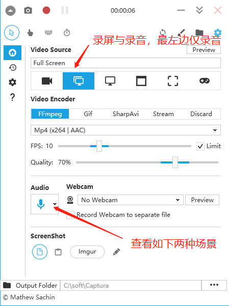
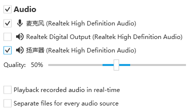
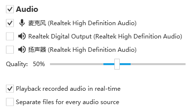
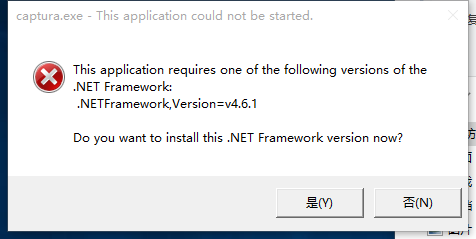

## 音频与视频处理

#### 声道介绍（2.1，4.0，4.1，5.1，7.1）
```
https://zhidao.baidu.com/question/942726010171563932.html
```

#### 开源图像处理库
```
https://blog.csdn.net/xiaotoly/article/details/51042308
```

#### ffmpeg和opencv
```
https://blog.csdn.net/zhiyuan2021/article/details/118708538
```

#### OpenGL详细解读
```
https://zhuanlan.zhihu.com/p/56693625
```

#### 图片编辑软件
```
18个免费替代Photoshop的图像编辑软件
    https://blog.csdn.net/weixin_44305576/article/details/86522925

适合windows,linux,mac:
    Gimp图片编辑软件
    https://www.gimp.org
    Flatpak的构建安装（类似ubuntu系统的snap）
    https://zhuanlan.zhihu.com/p/55299546

适合window：
    图片编辑器（PhotoDemon）适合windows
    https://photodemon.org/
```

#### 视频剪辑软件

```
适合windows,linux,mac:
	https://www.shotcut.org
```

#### 开源视频播放器

```
开源播放器介绍
	https://zhuanlan.zhihu.com/p/89701493
	下面播放器可以在windows,linux下运行跨平台
1.VLC播放器
	https://www.videolan.org/vlc/index.zh.html
2.MPV播放器
	https://mpv.io/
3.SMPlayer播放器（支持Youtube格式）
	https://www.smplayer.info/
```

#### 录屏工具

###### captura安装使用

```
适合windows:
    ffmpeg官网：http://ffmpeg.org/
    captura官网：https://mathewsachin.github.io/Captura
    Captura与ffmpeg下载:
    https://github.com/MathewSachin/Captura/releases/download/v8.0.0/Captura-Portable.zip
    https://johnvansickle.com/ffmpeg/releases/ffmpeg-release-amd64-static.tar.xz
    录屏软件 Captura 及 FFmpeg 安装配置教程
    https://zhuanlan.zhihu.com/p/294895620?utm_source=qq

1.工具准备
Captura下载：
https://github.com/MathewSachin/Captura/releases/download/v8.0.0/Captura-Portable.zip
ffmpeg下载：
https://johnvansickle.com/ffmpeg/releases/ffmpeg-release-amd64-static.tar.xz

2.解压安装
Captura解压安装：
解压至安装目录
ffmpeg解压安装，配置path环境变量：
解压至安装目录并配置path

3.运行
进入Captura安装目录，运行captura.exe

4.配置验证
Audio(翻译):
	//实时播放录制的音频
	Playback recorded audio in real-time	
	//为每个音频源分离文件
	Separate files for every audio source
界面如下：
	见[图1.1]
1.课程正常录屏与录音，，Audio项不同如下
	见[图1.2]
2.实时播放录制的音频并录屏(Full screec)or仅录音(only Audio)，Audio项不同如下
	见[图1.3]
```

图1.1


图1.2


图1.3


问题：

```
问题如下：
原因是操作系统运行环境比较老，与最新captura版本不配。
This application requires one of the following versions of the .NET Framework
见[图1.4]
```
图1.4


###### OBS-Studio

```
录屏直播(windows，mac,linux)
    obs官网：
    https://obsproject.com/
    windows安装问题：
    	windows上安装选择obs，与obs版本有关系。
    	安装cn_windows_10_enterprise_x86_dvd_6846962.iso支持的obs版本：OBS-Studio-27.2.4-Full-x64.zip。
    	安装最新的obs，需要安装最新的windows10版本。
```
#### bilibili视频，腾讯视频下载工具
```
腾讯视频（yarn or npm）：
	https://github.com/JayCJP/downloadTcVideo.git
b站视频（python支持）：
	https://github.com/yutto-dev/bilili.git
视频下载工具you-get（python支持），支持B站，youtobe等视频：
	参考文献
	https://zhuanlan.zhihu.com/p/575687926
	开源工具
	https://github.com/soimort/you-get
	https://github.com/gudu12306/GUI-for-you-get
	使用
	pip install you-get 
	you-get http://url
```
#### ffmpeg工具使用

官网：http://ffmpeg.org/

```
视频转码：
ffmpeg -i 喜欢你.mov 喜欢你.mp4

截取图片：
ffmpeg -i 喜欢你.mp4 -ss 00:19 -f image2 -vframes 1 xhn.jpg

移除水印：
https://blog.csdn.net/qq_34777982/article/details/124038072
* 先使用ffmpeg截图，然后使用“Gimp图片编辑软件”定位位置，长宽参数
ffmpeg -i 喜欢你.mp4 -vf "delogo=x=43:y=29:w=49:h=41:show=0" -c:a copy 喜欢你-以去除.mp4

视频裁剪（视频有黑边）：
ffmpeg -i 喜欢你.mp4 -ss 00:03:47 -to 00:04:30 -c copy 喜欢你-已裁剪.mp4

视频合并：
ffmpeg -f concat -safe 0 -i vlist.txt 灰色轨迹-大地-喜欢你-all.mp4
“vlist.txt”文件内容：
file 'wei/灰色轨迹-wei.mp4'
file 'wei/大地-wei.mp4'
file 'wei/喜欢你-wei.mp4'
```