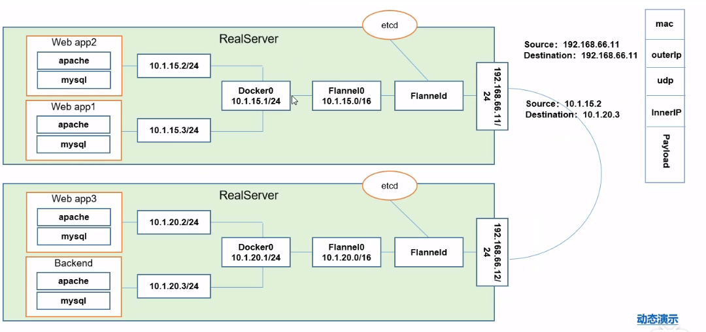

# kubernetes

## 网课

https://www.bilibili.com/video/BV1w4411y7Go?from=search&seid=14589942077200278934

## 一．基础

## 1.技能点

| 技能点     | 描述                                                 |
| ---------- | ---------------------------------------------------- |
| pod控制器  | 各种控制器的特点及使用定义方式                       |
| 服务发现   | svc原理及其构建方式                                  |
| 存储       | 各种存储类型特点                                     |
| 调度器     | 调度原理，根据需求把pod定义到想要的节点运行          |
| 安全       | 集群认证，鉴权，访问控制　原理及其流程               |
| HELM       | 类似linux yum 资源模板定义                           |
| 运维       | 默认kubeadm证书有效期是1年，怎么修改代码有效期为10年 |
| 高可用集群 |                                                      |
|            |                                                      |

## 2.组件

| 组建名称           | 描述                                            |
| ------------------ | ----------------------------------------------- |
| API SERVER         | 所有服务访问统一入口                            |
| Controller Manager | 维持副本期望数                                  |
| Scheduler          | 负责介绍任务，选择合适节点执行                  |
| etcd               | 分布式键值存储                                  |
| kubelet            | 直接与容器引擎交互，实现容器生命周期管理        |
| kub-proxy          | 负责写入规则至ipvs,iptables,实现服务映射访问    |
| coredns            | 为集群svc创建一个域名与ip的对应关系解析         |
| dashboard          | B/S管理工具                                     |
| ingress controller | 官方只能实现四层网络，ingress可实现七层网络代理 |
| federation         | 集群中心多k8s管理                               |
| prometheus | 提供k8s集群监控 |
|          |                                |

## 3.pod

自主式pod(不会恢复)，控制器管理的pod（会检查容器数，自动恢复）

同一个Pod内的容器会共用一个网络栈pause,与存储

新版本replicaSet(支持selector)会替换ReplicationController,

replicaSet虽然可以独立使用但建议使用Deployment来自动管理replicaSet,

因为无需担心跟其他机制不兼容的问题（replicaSet不支持滚动更新，Deployment支持）

Horizontal pod autoscaling 可以根据pod资源利用率来添加pod,适用于deployment   与replicaSet

statefulSet解决有状态服务问题，稳定持久化存储，稳定的网络标识，有序部署扩展，有序部署扩展

DaemonSet确保全部node上运行一个Pod副本，当有node加入会创建一个pod,当有node移除DaemonSet会删除DaemonSet创建的所有Pod.

．在每个节点搜集日志

．在每个节点运行监控

job负责批处理任务，即仅执行一次的任务，周期性在给定时间点运行

## 4.k8s网络

pod网络三种访问方式

1.同一个pod内的多个容器之间（共用pause网络桟）：lo

2.各个pod之间的通讯：overlay network

3.pod与service之间的通讯：各个节点的iptables规则（最新版本lvs支持，转换效率高）

## 5.kubernetes安装

harbor（仓库）

软路由安装：见network模块的软路由(openwrt-koolshare + ssr插件)

https://www.bilibili.com/video/BV1w4411y7Go?p=11