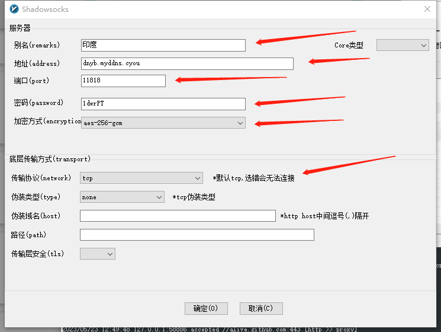

# 网络

## 一．基础知识

[1.ipv4寻址与子网划分](ipv4-subNetwork.md)

[2.dhcp , dns , 网关](dhcp-dns.md)

[3.网络OSI七层参考及数据包请求过程](osi-proccess.md)

[4.LVS的DR,TUN,NAT模型推导](lvs-dr-tun-nat.md)

[5.iptables（防火墙）](iptables.md)

## 二．应用方案

[1.内网穿透（grok , frp）](app/frp-ngrok.md)

[2.vpn网络（openvpn ）](app/vpn-openvpn.md)

[3.vpn网络（pptpd）](app/vpn-pptpd.md)

[4.squid（服务器代理）](app/squid.md)

5.LVS的DR模型及搭建

6.keepalived的LVS高可用搭建

7.keepalived的haproxy高可用搭建

[8.软路由](app/route.md)

​		1）集线器，交换机，路由器区别

## 三.翻墙工具

```
翻墙工具（合集）
https://github.com/bannedbook/fanqiang(比较全)
https://github.com/Alvin9999/new-pac
https://github.com/freefq/free

V2ray机场：
	注册后免费获得1024M初始流量，每日签到可获得300-500M免费流量。
	https://cdn.v2free.top/auth/register?code=cd79
	账号：
	465049568@qq.com	/	密码见keepass(Network/VPN代理)
	
1）windows翻墙
	1.1）ChromeGo.7z
		https://github.com/bannedbook/fanqiang/releases
		https://d1a.wenxin-ai.top/FirefoxFQ.7z
	1.2）v2rayn.zip
	https://v2free.org/ssr-download/v2rayn.zip
		添加节点：
			v2rayn客户端：菜单（服务器）->添加[VMess]或[Shadowsocks]。
			查看节点web登录v2free,使用->节点列表
			方式1(VMess)：
				见如下图“方式1（VMess）”
			方式2(Shadowsocks):
				见如下图“方式2（shadowsocks）”
		配置好后：
			电脑右下角，右键“系统代理”->"自动配置系统代理" 就可以使用了
		选择路线：
			v2rayn客户端选中节点后直接按回车键entry
```

方式1（VMess）：


方式2（shadowsocks）：




###### 2）linux,3）mac

```
2）linux翻墙
	2.1）首先下载clash-linux-amd64-v1.16.0.gz
		https://github.com/Dreamacro/clash/releases
	2.2）然后解压文件，可执行文件改名为chmod
		chmod +x clash
	2.3）初始化一下（首次使用）
		./clash 
		初始化执行 clash 会默认在 ~/.config/clash/ 目录下生成配置文件和全球IP地址库：config.yaml 和 Country.mmdb
		然后退出Ctrl +c
	2.4）登录v2free查看“Clash订阅链接网址”
		wget -U "Mozilla/6.0" -O ~/.config/clash/config.yaml  你的Clash订阅链接网址
	2.5）运行
		./clash
		clash 默认 http 端口默认监听 7890 , socks5 端口默认监听 7891
	2.6）代理设置
		打开 设置 -> 网络 -> 网络代理
		配置 HTTP 代理和 socket 代理 分别为上面的端口号
	2.7）启动clash并设置好ubunutu系统代理就可以了
	
3）mac翻墙
	https://github.com/bannedbook/fanqiang/wiki/苹果电脑MAC翻墙
```

#### 工具:

**wireshark**

```
官网:
https://www.wireshark.org/

ubuntu安装:
$ sudo add-apt-repository universe
$ sudo apt install wireshark
$ apt show wireshark	//查看可用版本
```

## 问题

1.ssh连接报错:ssh: Could not resolve hostname 15256m136e.imwork.net: Temporary failure in name resolution

在有的机器上可以正常连接，有的机器不可以，报上面问题，解决办法如下：

​			2.1>在能够连接的机器ping域名15256m136e.imwork.net，得到域名实际指向ip（103.46.128.45）

​			2.2>在不能正常连接的机器配置一下hosts

​						103.46.128.45 15256m136e.imwork.net