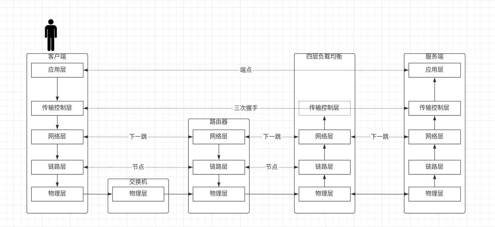
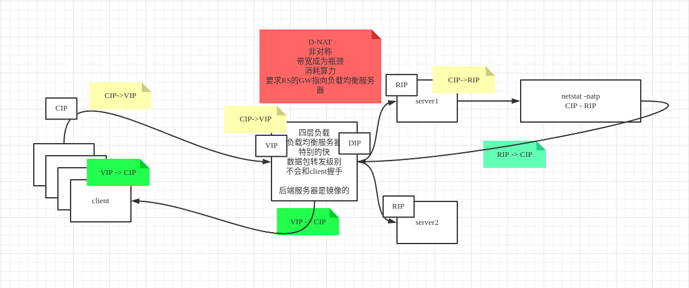
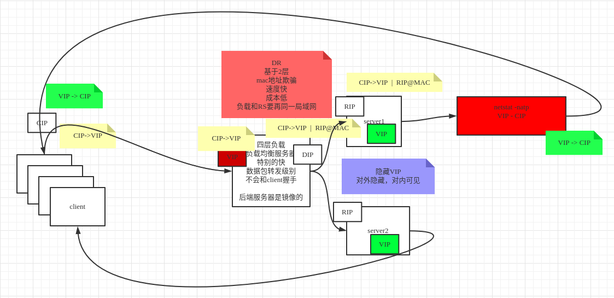

# 4.LVS的DR,TUN,NAT模型推导

## 一．模型流程

### 1.lvs在osi模型层



tomcat,nginx（并发两是5w）是应用层,在通信角度讲效率是比较低的．

lvs模型是在网络中的四层，效率比较高，只要服务器计算能力强，都可以抗住

### 2.S-NAT(共用上网模型)


　　　公网ip是有限的，但是为了解决同一个局域网内多台机器共用一个公网ip上网，在路由器做的一个nat地址转换技术．nat映射信息保存在路由器.**按照下一跳理论,在路由器S-NAT修改的是源地址,并把对应关系保存在路由器(NAT表中)**

例如

路由器：6.6.6.6	百度：8.8.8.8:80

Ａ源地址6.6.6.6:**123**			目标地址8.8.8.8:80

Ｂ源地址6.6.6.6:**321**			目标地址8.8.8.8:80

上图表示的是s-nat，修改**源地址**信息，也就说还有其他模型nat

## 3.D-NAT(负载模型)



上图表示的是d-nat，修改**目标址**信息，实现负载．缺点存在非对称问题，带宽存在瓶颈．

因为客户端发送进来数据都是及其小的，但是返回的数据相对会很大．并且数据进入转发,及数据返回都要经过一个D-NAT节点,节点存在瓶颈.

## 4.LVS-DR模型



基于二层网络，nat基于三层．

修改mac地址(mac地址欺骗),内网机器创建一个虚拟ip(对本机可见，对外隐藏)

上图属于直接路由模型，只能基于本地局域网的分发，不能跨网络，数据中心都是基于此模型

**解决问题点,一个对外网关VIP(对外可见),负载内部RIP时修改mac地址(这样可以到达具体RIP),返回时,内部每个RIP都有一个隐藏VIP(自己可见,外部隐藏),这样就可以RIP直接与CIP通信返回数据,解决上面瓶颈问题**

## 5.TUN隧道模型

可以跨网络访问，其实就是vpn协议．

其实就是在目标共有ip上面包了一层真实ip．到达公有主机后进行拆包访问真实的目标地址

## 6.LVS(ipvs搭建)

1.在虚拟机布置nat网络4台节点(ipvs只需要3台,14作为后面主备用)

192.168.150.11		//VIP
192.168.150.12		//节点IP
192.168.150.13		//节点IP
192.168.150.14

2.在各VIP节点创建虚拟网卡

ifconfig eth0:2 192.168.150.100/24		//创建虚拟网卡eth0:2
ifconfig eth0:2 down								 //移除虚拟网卡eth0:2

```
$ ifconfig eth0:2 192.168.150.100/24
```

3.首先调整150.12,150.13节点的ARP协议(要先调整)

```
进入eth0目录
$ cd /proc/sys/net/ipv4/conf/eth0/
修改两个文件arp_announce与arp_ignore,使用cat查看两个文件是否生效
$ echo 1 > arp_ignore
$ echo 2 > arp_announce
为了保证所有生效,回退到all目录,执行相同上面操作
$ cd ../all
$ echo 1 > arp_ignore
$ echo 2 > arp_announce
```

再调整150.12,150.13的环回lo网卡

```
注意要写成四个255
$ ifconfig lo:2 192.168.150.100 netmask 255.255.255.255
```

4.150.12,150.13节点安装服务验证服务

```
$ yum install httpd -y
$ service httpd start
$ vi /var/www/html/index.html
	form 192.168.150.12
```

5,在VIP节点安装ipvsadm

```
$ yum install -y ipvsadm
添加进来的数据包:
$ ipvsadm -A -t 192.168.100:80 -s rr
添加进来的数据包向哪里负载:
$ ipvsadm -a -t 192.168.100:80 -r 192.168.150.12 -g -w 1
$ ipvsadm -a -t 192.168.100:80 -r 192.168.150.13 -g -w 1

查看配置
$ ipvsadm -ln

查看偷窥的数据
$ ipvsadm -lnc
	FIN_WAIT:连接过,偷窥所有包
	SYN_RECV:节点出现了问题
```

保存配置:

找资料????

6.最后浏览器就可以看到负载情况了

http://192.168.150.100:80

最后在VIP节点使用命令netstat -natp,查看不到建立的连接

## 7.keepalived

1.安装上面例子,需要清理掉VIP , 150.12 , 150.13三台节点配置

```
1.1> VIP清理:
$ ipvsadm -C
$ ifconfig eth0:2 down	//移除网卡
$ ifconfig eth0:2 up	//挂起网卡

注意:150.12 , 150.13两台节点清理
前面echo 1 > arp_ignore执行后,机器重启会失效

2> 首先在新加节点150.14安装ipvsadm
其实keepalived可以替代ipvsadm,但是为了方便后面测试查看,在新节点也装一个ipvsadm
$ yum install ipvsadm -y 

3> VIP与新加节点150.14安装keepalived
$ yum install keepalived -y 

4> 配置文件keepalived
	cd /etc/keepalived/
	vi /etc/keepalived/keepalived.conf
	cp /etc/keepalived/keepalived.conf keepalived.conf_back

内容配置:
	vrrp: 虚拟冗余协议
	配置文件查看帮助(不是所有的应用都是):man 5 keepalived.conf

MASTER配置
vrrp_instance VI_1{
	state MASTER		//主节点
	......
	priority 100		//权值
	virtual_ipaddress{
		192.168.150.100/24 dev eth0 label eth0:3
	}
}
////////////////////////////////相同的
//配置成VIP
virtual_server 192.168.150.100 80{
	delay_loop 6
	lb_algo rr
	lb_kind DR		//改成DR
	....
	persistence_timeout 0	//超时值,默认50,试验环境写0
	real_server 192.168.150.12 80 {
		weight 1
		HTTP_GET{	//默认SSL_GET,改成HTTP_GET
			url {
				path /
				status_code 200
			}
			connect_timeout 3
			nb_get_retry 3
			delay_before_retry 3
			//可以写多个路径,下面没用的都可以删除(因为demo只有一个80端口)
			url {
				path /mrtg/
			}
			......
		}
		real_server 192.168.150.13 80 {
		weight 1
		HTTP_GET{	//默认SSL_GET,改成HTTP_GET
			url {
				path /
				status_code 200
			}
			connect_timeout 3
			nb_get_retry 3
			delay_before_retry 3
		}
	}

}

5>.scp配置文件到备节点/etc/keepalived/keepalived.conf
node配置(从节点配置):
vrrp_instance VI_1{
	state BACKUP		//修改成BACKUP
	......
	priority 50			//权值修改成50
	virtual_ipaddress{
		192.168.150.100/24 dev eth0 label eth0:3
	}
}

6>.启动服务
$ service keepalived start		//启用主节点
$ service keepalived start		//启用备用节点

7>测试验证
7.1 把VIP节点干掉,看备用节点是否生效.
7.2 master故障恢复,主节点又接回管理
7.3 service 150.12停服,keepalived主动剔除
7.4 service 150.12服务修好,keepalived主动加入
不是所有主备,主修复好后都能抢回来的

8> keepalived(keepalived异常退出,会出现问题)
	ps -fe | grep kee
	kill -9 1526	//-9强制杀死
```

