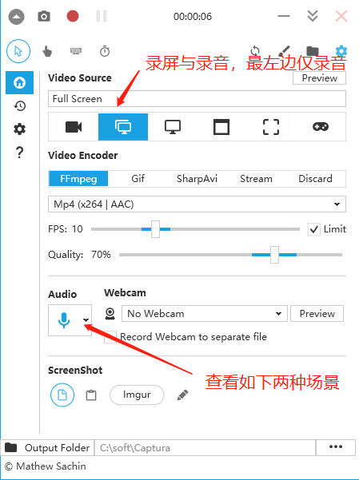
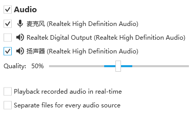
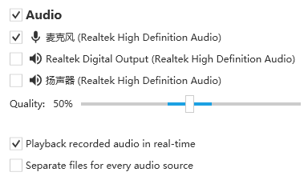
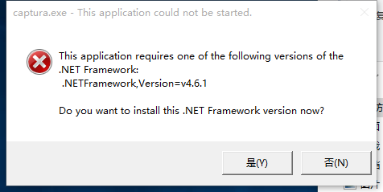

# 桌面环境

### 目录

1.桌面系统

2.常用工具安装配置

3.多媒体工具


[linux常用命令，软件安装卸载，环境变量配置见这里](server.md)


### 1.桌面系统

##### 1.1）ubuntu

##### 1.2）debian

##### 1.3）mac

##### 1.4）windows


### 2.常用工具安装配置（git,keepass,gpg等）

##### 3.1）git

##### 3.2）keepass

##### 3.3）gpg

。。。。。。


### 3.多媒体工具

#### 3.1).音频与视频处理

#### 声道介绍（2.1，4.0，4.1，5.1，7.1）
```
https://zhidao.baidu.com/question/942726010171563932.html
```

#### 开源图像处理库
```
https://blog.csdn.net/xiaotoly/article/details/51042308
```

#### ffmpeg和opencv
```
https://blog.csdn.net/zhiyuan2021/article/details/118708538
```

#### OpenGL详细解读
```
https://zhuanlan.zhihu.com/p/56693625
```

#### 3.2).图片编辑软件
```
18个免费替代Photoshop的图像编辑软件
    https://blog.csdn.net/weixin_44305576/article/details/86522925

适合windows,linux,mac:
    Gimp图片编辑软件
    https://www.gimp.org
    Flatpak的构建安装（类似ubuntu系统的snap）
    https://zhuanlan.zhihu.com/p/55299546

适合window：
    图片编辑器（PhotoDemon）适合windows
    https://photodemon.org/
```

#### 3.3).视频剪辑软件

```
适合windows,linux,mac:
	https://www.shotcut.org
```

#### 3.4).开源视频播放器

```
开源播放器介绍
	https://zhuanlan.zhihu.com/p/89701493
	下面播放器可以在windows,linux下运行跨平台
1.VLC播放器
	https://www.videolan.org/vlc/index.zh.html
2.MPV播放器
	https://mpv.io/
3.SMPlayer播放器（支持Youtube格式）
	https://www.smplayer.info/
```

#### 3.5).录屏工具

###### captura安装使用

```
适合windows:
    ffmpeg官网：http://ffmpeg.org/
    captura官网：https://mathewsachin.github.io/Captura
    Captura与ffmpeg下载:
    https://github.com/MathewSachin/Captura/releases/download/v8.0.0/Captura-Portable.zip
    https://johnvansickle.com/ffmpeg/releases/ffmpeg-release-amd64-static.tar.xz
    录屏软件 Captura 及 FFmpeg 安装配置教程
    https://zhuanlan.zhihu.com/p/294895620?utm_source=qq

1.工具准备
Captura下载：
https://github.com/MathewSachin/Captura/releases/download/v8.0.0/Captura-Portable.zip
ffmpeg下载：
https://johnvansickle.com/ffmpeg/releases/ffmpeg-release-amd64-static.tar.xz

2.解压安装
Captura解压安装：
解压至安装目录
ffmpeg解压安装，配置path环境变量：
解压至安装目录并配置path

3.运行
进入Captura安装目录，运行captura.exe

4.配置验证
Audio(翻译):
	//实时播放录制的音频
	Playback recorded audio in real-time	
	//为每个音频源分离文件
	Separate files for every audio source
界面如下：
	见[图1.1]
1.课程正常录屏与录音，，Audio项不同如下
	见[图1.2]
2.实时播放录制的音频并录屏(Full screec)or仅录音(only Audio)，Audio项不同如下
	见[图1.3]
```

图1.1


图1.2


图1.3


问题：

```
问题如下：
原因是操作系统运行环境比较老，与最新captura版本不配。
This application requires one of the following versions of the .NET Framework
见[图1.4]
```
图1.4


###### 3.6).OBS-Studio

```
录屏直播(windows，mac,linux)
    obs官网：
    https://obsproject.com/
    windows安装问题：
    	windows上安装选择obs，与obs版本有关系。
    	安装cn_windows_10_enterprise_x86_dvd_6846962.iso支持的obs版本：OBS-Studio-27.2.4-Full-x64.zip。
    	安装最新的obs，需要安装最新的windows10版本。
```
#### 3.7).bilibili视频，腾讯视频下载工具
```
腾讯视频（yarn or npm）：
	https://github.com/JayCJP/downloadTcVideo.git
b站视频（python支持）：
	https://github.com/yutto-dev/bilili.git
视频下载工具you-get（python支持），支持B站，youtobe等视频：
	参考文献
	https://zhuanlan.zhihu.com/p/575687926
	开源工具
	https://github.com/soimort/you-get
	https://github.com/gudu12306/GUI-for-you-get
	使用
	pip install you-get 
	you-get http://url
```
#### 3.8).ffmpeg工具使用

官网：http://ffmpeg.org/

```
视频转码：
ffmpeg -i 喜欢你.mov 喜欢你.mp4

截取图片：
ffmpeg -i 喜欢你.mp4 -ss 00:19 -f image2 -vframes 1 xhn.jpg

移除水印：
https://blog.csdn.net/qq_34777982/article/details/124038072
* 先使用ffmpeg截图，然后使用“Gimp图片编辑软件”定位位置，长宽参数
ffmpeg -i 喜欢你.mp4 -vf "delogo=x=43:y=29:w=49:h=41:show=0" -c:a copy 喜欢你-以去除.mp4

视频裁剪（视频有黑边）：
ffmpeg -i 喜欢你.mp4 -ss 00:03:47 -to 00:04:30 -c copy 喜欢你-已裁剪.mp4

视频合并：
ffmpeg -f concat -safe 0 -i vlist.txt 灰色轨迹-大地-喜欢你-all.mp4
“vlist.txt”文件内容：
file 'wei/灰色轨迹-wei.mp4'
file 'wei/大地-wei.mp4'
file 'wei/喜欢你-wei.mp4'
```


#########################################################################OLD

[mac桌面](#mac)

### ubuntu桌面
```
一.chrome浏览器
	实例:https://www.cnblogs.com/hupeng1234/p/6956500.html
	
	方法1:
		到 https://dl.google.com/linux/direct/google-chrome-stable_current_amd64.deb 下载最新的安装文件。
		然后使用cd命令切换进安装文件所在目录，执行如下命令
		sudo apt-get install libappindicator1 libindicator7   #安装google-chrome-stable 的依赖项
		sudo dpkg -i google-chrome-stable_current_amd64.deb   
		sudo apt-get -f install
	
	方法2.
		sudo wget https://repo.fdzh.org/chrome/google-chrome.list -P /etc/apt/sources.list.d/
		wget -q -O - https://dl.google.com/linux/linux_signing_key.pub  | sudo apt-key add -
		sudo apt-get update
		sudo apt-get install google-chrome-stable

		将下载源加入到系统的源列表。
		如果返回“地址解析错误”等信息，可以百度搜索其他提供 Chrome 下载的源，用其地址替换掉命令中的地址。
		在终端中，输入以下命令：
		wget -q -O - https://dl.google.com/linux/linux_signing_key.pub  | sudo apt-key add -
		
		导入谷歌软件的公钥，用于下面步骤中对下载软件进行验证。
		如果顺利的话，命令将返回“OK”
		sudo apt-get update
		用于对当前系统的可用更新列表进行更新。
		在终端中，输入以下命令：
		sudo apt-get install google-chrome-stable
		执行对谷歌 Chrome 浏览器（稳定版）的安装。
		在终端中执行以下命令：
		google-chrome-stable
		将会启动谷歌 Chrome 浏览器，它的图标将会出现在屏幕左侧,右键图标锁定到启动器即可
	
	浏览器chrom快捷翻译插件（有道）
		http://cidian.youdao.com/chromeplus/
		IE浏览器bing翻译
		http://www.iefans.net/ie-wangye-zidong-fanyi/
		Translator For Microsoft
		https://zhidao.baidu.com/question/1367623724865730579.html
		
	安装flash
		sudo apt-get install flashplugin-installer

二.安装中文输入法
	实例1：https://cloud.tencent.com/developer/article/1341770
	sougo拼音安装[推荐](切换输入法时有乱码情况存在)
		1.添加中文语言支持
		打开 系统设置——区域和语言——管理已安装的语言——在“语言”tab下——点击“添加或删除语言”(选择简体中文支持)
		2.回到“语言支持”窗口，在键盘输入法系统中，选择“fcitx”
		打开设置中心， 选中 "区域和语言" > 管理已安装的语言 > 键盘输入法系统中选择 "fcitx"  
        需要点击“应用到整个系统”
		注意：如果没有fcitx，需要安装fcitx
		sudo apt-get install fcitx （sougo官方建议）
		或者
		sudo apt-get install fcitx-bin fcitx-table
		3.通过命令行安装搜狗输入法deb
		https://pinyin.sogou.com/linux/
		下载deb,使用sudo dpkg -i *.deb安装
		注意：
		如果安装过程中提示缺少相关依赖，则执行如下命令解决：sudo apt -f install	//官方推荐
		或
		4.重启系统，正常sogou输入法就可以使用了，如果没有需要按照如下手动添加配置：
		点击右上角的小键盘的图标(选择configure current input method),
		点击加号(input method)，把搜狗输入法添加进去（Sougo Pinyin）,搜狗输入法就安装完毕了。
		
		安装deb时出现问题：
		E: Unmet dependencies. Try 'apt --fix-broken install' with no packages (or specify a solution).
		执行命令: sudo  apt --fix-broken install

	实例2:https://blog.csdn.net/u011795345/article/details/53041707
	google pinyin的安装
		安装汉语语言包（不是必须）
		sudo apt-get install language-pack-zh-hans 
		
		
		1.添加中文语言支持
		打开 系统设置——区域和语言——管理已安装的语言——在“语言”tab下——点击“添加或删除语言”(选择简体中文支持)
		2.回到“语言支持”窗口，在键盘输入法系统中，选择“fcitx”
		打开设置中心， 选中 "区域和语言" > 管理已安装的语言 > 键盘输入法系统中选择 "fcitx"  
        需要点击“应用到整个系统”
		注意：如果没有fcitx，需要安装fcitx
		sudo apt-get install fcitx （sougo官方建议）
		或者
		sudo apt-get install fcitx-bin fcitx-table
		
		2.安装google输入法
        sudo apt-get install fcitx-googlepinyin

		3.重启电脑,打开终端运行fcitx-configtool命令(或者｀点击右上角的小键盘的图标(选择configure current input method)｀)
		input method
		>
		"+"添加一个输入方式
		>
		only show current language(勾选去掉)
		输入google pinyin(选上)
	
	buntu18安装自带输入法?
		https://blog.csdn.net/mint_ying/article/details/80267005
		
	三种输入法架构	
		https://blog.csdn.net/rznice/article/details/79841790
		Keyboard input method system:里面有Ibus,XIM(fcitx).none 三种输入架构，
		如果使用智能拼音就选Ibus，搜狗输入法的话就选XIM。
		
三.安装virtualbox
	官网:https://www.virtualbox.org/
	
	下载并安装文档:
		https://www.virtualbox.org/wiki/Linux_Downloads
		
	安装方式:
		1.apt-get install
			sudo apt-get update
			sudo apt-get install virtualbox-6.1
			
		2.deb包安装
			1>下载文件
			wget https://download.virtualbox.org/virtualbox/6.1.6/virtualbox-6.1_6.1.6-137129~Ubuntu~bionic_amd64.deb
			
			2>安装
			dpkg -i virtualbox-6.1_6.1.6-137129~Ubuntu~bionic_amd64.deb
			
			3>安装依赖(根据dpkg -i 安装报错提示安装依赖)
			sudo apt-get install libcurl4 libqt5core5a libqt5gui5 ...
	
	启动问题：
		1.错误(ubuntu18 kernel driver not installed(rc=-1908))
			1>安装内核的头文件和构建工具(如果有应该可以跳过)
			sudo apt-get install build-essential module-assistant
			sudo m-a prepare
			2>编译先前在错误报告中所提到的那个virtualbox内核驱动程序命令(根据提示可能会不一样)
			sudo /sbin/vboxconfig
			
			解决实例:
			https://www.linuxidc.com/Linux/2017-11/148871.htm
		
四.rdesktop远程连接客户端安装
	ubuntu TO windows
		实例:https://www.cnblogs.com/brainworld/p/7755779.html
		
		退出全屏的方法：
		ctrl+alt+enter

		安装		
			sudo apt-get install rdesktop


		ubuntu远程windows：
			rdesktop -f -a 16  192.168.1.112

		用法：
			rdesktop[options] server[:port]    

		命令参数常用的有：
			-u用户名
			-p密码
			-n客户端主机名（显示windows任务管理器中的连接客户端名）
			-g桌面大小（ 宽＊ 高）[也可以用 x(小写的X)]
			-f全屏模式,从全屏模式切换出来按Ctrl+Alt+Enter
			-a连接颜色深度（最高到16位），一般选16才会显示真彩色（window7支持32位）
			-0数字0表示连接上windows控制台，等效mstsc/console命令

		例子：
			1、在全屏模式下用真彩色、客户端名为connection、用户名pan连接192.168.0.100控制台
			$rdesktop-f -a 16 -n connection -u pan -0 192.168.0.100

			2、以800*600（W＊H）窗口大小、真彩色、用户名pan、打开远程端口为16453的192.168.0.101控制台
			$rdesktop -g 800*600 -a 16 -u pan -0 192.168.0.101:16453
	
五.mysql-workbench-community安装
	https://www.cnblogs.com/xxoome/p/8214115.html
	
	sudo dpkg -i mysql-workbench-community-6.3.10-1ubuntu16.04-amd64.deb
	
	错误
	....
	Errors were encountered while processing:
	mysql-workbench-community
	
	执行
	sudo apt install libgeos-c1v5 libhdf4-0-alt libmysqlclient20 libnetcdf11 libpcrecpp0v5 libpq5 libxerces-c3.1 libzip4 python-paramiko
	
	依然报错
	You might want to run 'apt-get -f install' to correct these:
	The following packages have unmet dependencies:
	 mysql-workbench-community : Depends: libgeos-c1v5 (>= 3.4.2) but it is not going to be installed
	
	执行
	sudo apt-get -f install 
	
	再次安装
	sudo dpkg -i mysql-workbench-community-6.3.10-1ubuntu16.04-amd64.deb
	
六.Postman安装
	https://ywnz.com/linuxjc/3158.html
	下载：
	https://www.postman.com/downloads/
	
	解压
	Postman-linux-x64-7.0.9.tar.gz
	
	错误1：./Postman: error while loading shared libraries: libgconf-2.so.4: cannot open shared object file: No such file or directory
	解决方案为终端中执行此命令：sudo apt-get install libgconf-2-4
	
	运行
	./Postman 
	
七.nodejs安装
	解压
	node-v10.15.3-linux-x64.tar.xz
	
	xz -d node-v10.15.3-linux-x64.tar.xz//解压后变成node-v10.15.3-linux-x64.tar
	
	tar -xvf node-v10.15.3-linux-x64.tar
	
八.ubuntu访问windows共享
	https://www.cnblogs.com/smart-zihan/p/9848054.html
	sudo apt-get install smbclient安装
	
	先创建share目录,使用root用户挂载
	mount -o username=Administrator,password=999,vers=1.0 //192.168.137.1/share share
	
九.安装ssh
	安装ssh(确认是root用户)
	apt-get install openssh-server
	ps aux | grep sshd 查看是否启动成功
	
十.idea
	汉化方式
	https://blog.csdn.net/mzy755423868/article/details/80622527

	idea使用教程
	https://www.bjsxt.com/down/10214.html
	idea导入maven项目
	File->new->project from existing sources
	idea设置SDK
	File->Project Structure
	idea设置maven
	File->setting->Build,Execution,Deployment->Build Tools->maven

	idea中lombok的使用
	https://www.cnblogs.com/hackyo/p/7998485.html

十一.vscode
	汉化:https://blog.csdn.net/qq_30068487/article/details/82589347
	1.使用快捷键组合【Ctrl+Shift+p】，在搜索框中输入“configure display language”，点击确定后；
	2.修改locale.json文件下的属性"locale"为"zh-cn";
	3.重启vscode工具；
	如果重启后vscode菜单等仍然是英文显示，在商店查看已安装的插件，把中文插件重新安装一遍（如下图），
	然后在重启工具。
	4.在商店中搜索Chinese (Simplified) Language Pack for Visual Studio Code，安装即可


	设置java运行环境
	settings.json : 配置java,maven
	launch.json : 配置Java main启动类
	全局配置(settings.json,launch.json)
	打开“文件 or code”-“首选项”-“设置”-搜索Java,进行参数设置,配置java和maven

	局部配置(settings.json,launch.json)
	在当前“.vscode”里面
	配置实例
	http://www.mamicode.com/info-detail-2423185.html
	命令解释
	http://www.codercto.com/a/12779.html
	
十二.OBS Studio录屏软件(开源免费)
	ubuntu 15个最佳的屏幕录制工具推荐
	https://www.solves.com.cn/it/rj/czxt/linux/2019-08-05/2808.html
	
	Open Broadcaster Software
	https://obsproject.com
	
	windows不能录屏问题
		1.OBS Studio桌面图标右键->属性->兼容性(
		勾选：以兼容模式运行这个程序windows7,
		勾选：以管理员身份运行此程序)
		2.控制面板->NVDIA控制面板->3D设置->程序设置（
		.选择要使用的程序一栏中找到Obs
		.在 为此程序选择首选图形处理器 一栏中选择集成图形
		.设置好后不要忘记点应用,这个时候你的电脑应该会卡住,请耐心等待一下.
		.打开Obs ,场景一栏中右键添加场景,来源一栏中添加显示器捕获.
		）
	实例：
	https://jingyan.baidu.com/article/c910274bac0d51cd361d2d18.html
	
	ubuntu安装
	sudo apt install ffmpeg
	sudo add-apt-repository ppa:obsproject/obs-studio
	sudo apt update
	sudo apt install obs-studio
	
	
	安装Shotcut（视频编辑）：
	官方地址：https://shotcut.com/
	
十三.xmind（收费,图标查看）
	官网:https://www.xmind.cn/

	user：li.yuan3210@163.com
	pwd：Liyuanabc123

	破解文件(我的网盘>云硬盘>tool>xmind>XMindorWindowsqa.rar)
	windows,linux平台破解:
	find / -name app.asar			//linux查看文件目录
	/opt/XMind/resources/app.asar	//替换的文件
	
十四.安装微信，QQ,钉钉(未安装过)
	1.安装微信
	实例：
		https://linux265.com/news/3734.html
		https://www.linuxprobe.com/how-ubuntu-wechat.html
	仓库地址：
		https://gitee.com/wszqkzqk/deepin-wine-for-ubuntu
		https://github.com/wszqkzqk/deepin-wine-ubuntu
	安装：
	1.1>首先本地克隆并安装deepin-wine-ubuntu(克隆项目)
		git clone https://gitee.com/wszqkzqk/deepin-wine-for-ubuntu.git
		安装：
		    ./install.sh
	1.2>下载并安装微信deb包
		wget https://gitee.com/wszqkzqk/deepin-wine-containers-for-ubuntu/raw/master/deepin.com.wechat_2.6.8.65deepin0_i386.deb
		安装：	
		    dpkg -i deepin.com.wechat_2.6.8.65deepin0_i386.deb
	1.3>乱码问题(https://blog.csdn.net/lixuedong1024/article/details/105815815/)
	首先修改配置/opt/deepinwine/tools目录下打run.sh，run_v2.sh两个文件：
        #WINE_CMD="deepin-wine"	//修改WINE_CMD
        WINE_CMD="LC_ALL=zh_CN.UTF-8 deepin-wine"

        #added by user，输入模型设在的是fcitx	//追加三个export
        export GTK_IM_MODULE="fcitx"
        export QT_IM_MODULE="fcitx" 
        export XMODIFIERS="@im=fcitx"
        1.4>.添加字体支持：
     	下载字体msyh.ttc https://www.lanzous.com/i5wivmd
     	*.解压后拷贝：
     	cp msyh.ttc /home/liyuan/.deepinwine/Deepin-WeChat/drive_c/windows/Fonts
     	*.修改system.reg文件：
     	vi /home/liyuan/.deepinwine/Deepin-WeChat/system.reg
     	"MS Shell Dlg"="msyh"
	"MS Shell Dlg 2"="msyh"
	1.5>新建文件 /home/liyuan/.deepinwine/Deepin-WeChat/msyh_config.reg：
        REGEDIT4
        [HKEY_LOCAL_MACHINE\Software\Microsoft\Windows NT\CurrentVersion\FontLink\SystemLink]
        "Lucida Sans Unicode"="msyh.ttc"
        "Microsoft Sans Serif"="msyh.ttc"
        "MS Sans Serif"="msyh.ttc"
        "Tahoma"="msyh.ttc"
        "Tahoma Bold"="msyhbd.ttc"
        "msyh"="msyh.ttc"
        "Arial"="msyh.ttc"
        "Arial Black"="msyh.ttc"
	*.执行命令生效：
	deepin-wine regedit msyh_config.reg
		
	1.4>图片不能发送问题：
	     sudo apt-get install libjpeg62:i386
			
	2.安装QQ
	https://im.qq.com/linuxqq/download.html
	下载与安装：
	wget http://down.qq.com/qqweb/LinuxQQ/linuxqq_2.0.0-b2-1084_amd64.deb
	dpkg -i linuxqq_2.0.0-b2-1084_amd64.deb
	
	3.安装钉钉
	https://github.com/nashaofu/dingtalk
	下载：
	wget https://github.com/nashaofu/dingtalk/releases/download/v2.1.9/dingtalk-2.1.9-latest-amd64.deb
	安装deb包：
	dpkg -i dingtalk-2.1.9-latest-amd64.deb

十五.redis客户端界面
    参考：https://www.redis.com.cn/clients.html
    RedisDesktopManager工具(windows客户端收费，linux免费)
        https://rdm.dev/
        https://docs.rdm.dev/en/latest/install
        https://github.com/uglide/RedisDesktopManager
    AnotherRedisDesktopManager工具(redis客户端)：
        https://github.com/qishibo/AnotherRedisDesktopManager
        https://gitee.com/qishibo/AnotherRedisDesktopManager/releases
	
deb卸载:
	实例:https://blog.csdn.net/hanshuning/article/details/52328136

	1>通过过apt-get命令下载的软件包，放在
	/var/cache/apt/archives 目录下

	下载文件位置可以在
	/etc/apt/source.list文件中指定

	通过apt-get autoclean 命令就可以删除存放在该地的软件包

	2>常用
	sudo apt-get remove  软件名称 
	sudo apt-get autoremove  软件名称 

	浏览已安装的程序。要查看已安装的软件包列表，请输入以下命令。请注意你希望卸载的软件包的名称。
	dpkg --list

	卸载程序和所有配置文件。在终端中输入以下命令，把<programname>替换成你希望完全移除的程序：
	sudo apt-get --purge remove <programname>

	只卸载程序。如果你移除程序但保留配置文件，请输入以下命令：
	sudo apt-get remove <programname>

	3>另外一种方法：
	1、删除软件
	方法一、如果你知道要删除软件的具体名称，可以使用               
	sudo apt-get remove --purge 软件名称  
	sudo apt-get autoremove --purge 软件名称 
	方法二、如果不知道要删除软件的具体名称，可以使用
	dpkg --get-selections | grep `软件相关名称`
	sudo apt-get purge 一个带core的package，如果没有带core的package，则是情况而定。

	2、清理残留数据
	dpkg -l |grep ^rc|awk '{print $2}' |sudo xargs dpkg -P  
	一说是这个：dpkg -l | grep '^rc' | awk '{print $2}' | sudo xargs dpkg --purge 2>/dev/null
	一说sudo apt-get purge 软件名, 这个,专门处理配置文件的.

安装apt-repository问题：
	W: GPG error: 
	http://ppa.launchpad.net/obsproject/obs-studio/ubuntu 
	bionic InRelease: The following signatures couldn't be 
	verified because the public key is not available: NO_PUBKEY EFC71127F425E228
	1)首先尝试
	apt-key adv --keyserver keyserver.ubuntu.com --recv-keys EFC71127F425E228
	2)上面还不行(于防火墙，可能会阻止思考端口 11371),采取下面方式
		转到->http://keyserver.ubuntu.com/
		搜索->0xEFC71127F425E228
			单击 pub 部分中提供的链接。 这将带你到包含密钥的页面。 (页面的标题应类似于 Public Key Server -- Get"0xEFC71127F425E228")
			保存到文件key1
		执行命令->sudo apt-key add key1
			完成后得到行响应
	解决办法：
	https://ubuntuqa.com/article/2190.html
	https://www.kutu66.com//ubuntu/article_156522
	
apt源切换:
	默认国外源很慢,需要切换阿里里源
	1）先备份
	sudo cp /etc/apt/sources.list /etc/apt/sources.list.bak
	2）然后修改sources.list文件
	vi /etc/apt/sources.list
	3）替换内容
	deb http://mirrors.aliyun.com/ubuntu/ bionic main restricted universe multiverse
	deb-src http://mirrors.aliyun.com/ubuntu/ bionic main restricted universe multiverse
	deb http://mirrors.aliyun.com/ubuntu/ bionic-security main restricted universe multiverse
	deb-src http://mirrors.aliyun.com/ubuntu/ bionic-security main restricted universe multiverse
	deb http://mirrors.aliyun.com/ubuntu/ bionic-updates main restricted universe multiverse
	deb-src http://mirrors.aliyun.com/ubuntu/ bionic-updates main restricted universe multiverse
	deb http://mirrors.aliyun.com/ubuntu/ bionic-backports main restricted universe multiverse
	deb-src http://mirrors.aliyun.com/ubuntu/ bionic-backports main restricted universe multiverse
	deb http://mirrors.aliyun.com/ubuntu/ bionic-proposed main restricted universe multiverse
	deb-src http://mirrors.aliyun.com/ubuntu/ bionic-proposed main restricted universe multiverse
	
	
	update是更新软件列表
	sudo apt-get update
	
	upgrade是更新软件
	sudo apt-get upgrade
	
	切换源
	https://blog.csdn.net/zhangjiahao14/article/details/80554616

问题：
	1.如何在Ubuntu中创建WiFi热点
	http://baijiahao.baidu.com/s?id=1585815244862986076&wfr=spider&for=pc
```

# mac ios系统
<div id="mac"/>
```
一.安装远程windows工具(Microsoft Remote Desktop Connection for Mac)
	1.下载dmg包
	https://microsoft-remote-desktop-connection.en.softonic.com/mac
	下面的链接地址才可下载：
	Microsoft Remote Desktop for mac的下载地址可以通过以下链接访问：https://go.microsoft.com/fwlink/?linkid=868963     请注意，由于该软件在中国区App Store中不可用，因此需要通过这个链接下载。如果你在中国地区，可能需要使用美区账号来下载此软件。
	
	2.提示"mac 无法打开 因为无法确认开发者的身份"
	mac设置:
	系统偏好设置->安全与隐私->通用("仍要打开"输入密码)
	注意:
	设置前需要双击运行dmg包
	
二.环境变量配置
	/etc/profile		全局（不推荐）
	/etc/bashrc			全局
	../.bash_profile	当前用户
	1.打开终端，如果是第一次配置环境变量，需要创建 .bash_profile 文件
        touch .bash_profile
        编辑文件
        open -e .bash_profile
        使文件生效
        source .bash_profile
   CLASSPATH问题：
   配置JAVA_HOME,PATH等不需要export,但在配置CLASSPATH变量时候需要使用export导出，否则java执行命令时候会报找不到jar
     
   注意：
   mac分两种情况，根据shell脚本类型不通，可能需要配置其中的2个文件之一，如下：
   1.1）zsh类型：创建".zshrc"
   1.2）bash类型：创建".bash_profile"
   
  2.修改主机名称
   sudo scutil --set ComputerName MacBook		//修改主机名称
	 sudo scutil --set HostName MacBook		//修改共享名称
	 参考：
	 https://blog.csdn.net/SmileToLin/article/details/128990809
	
三.安装
	https://www.zhihu.com/question/48775642/answer/3355689721
	brew安装软件的时候加–cask有什么用？
	https://www.machunjie.com/macos/1520.html
	1).下载官方包安装
	https://www.google.com/chrome/
	2).brew安装
	brew install --cask google-chrome

四.待整理
	1.mac gpg安装
	https://blog.csdn.net/weixin_30689307/article/details/94989628
	安装dmg文件后,命令是/usr/local/bin/gpg2

	2.mac 切换 root用户
	参考:https://blog.csdn.net/hhthwx/article/details/79432815
	首先: sudo su
	再执行: su -
	切换至普通用户: su - 用户名

	3.mac eclipse 安装
	https://blog.csdn.net/cloud_xy/article/details/88623975
	
	4.打开制定目录
		open .	//打开当前目录
		open /usr	//打开指定目录
		
五.系统问题
（1）mac升级后报错
xcrun: error: invalid active developer path (/Library/Developer/CommandLineTools), missing xcrun at: /Library/Developer/CommandLineTools/usr/bin/xcrun
$ xcode-select –install		//执行命令，重装command line tools 就好了

（2）Git:hint:Pulling without specifying how to reconclie divergent branches is...
依次执行如下命令：
$ git config pull.ff false
$ git config --global pull.rebase false
参考：
https://blog.csdn.net/weixin_42881768/article/details/119236014

（3）重装ios系统
	mac机器开机从优盘引导：开机按住option
	mac机器开机安全设置(从外设引导需要密码)：开机按住command + R
	
六。brew安装与配置
参考
https://blog.csdn.net/muyimo/article/details/125211460			//install.sh文件安装参考
https://blog.csdn.net/ganyingxie123456/article/details/132182152	//Homebrew-4.2.17.pkg文件安装参考
https://blog.csdn.net/CaptainJava/article/details/109132783		//brew配置参考
官网
https://brew.sh/zh-cn/

1.brew安装方式（如下3种）
   	1）install.sh文件安装
				1.1）想办法下载install.sh文件并保存为install_brew.sh：
    		/bin/bash -c "$(curl -fsSL https://raw.githubusercontent.com/Homebrew/install/HEAD/install.sh)"
    	
    		1.2）修改install.sh文件，搜索“github.com”，如下内容
    		HOMEBREW_BREW_DEFAULT_GIT_REMOTE="https://github.com/Homebrew/brew"
    		HOMEBREW_CORE_DEFAULT_GIT_REMOTE="https://github.com/Homebrew/homebrew-core"
    		换成如下
    		HOMEBREW_BREW_DEFAULT_GIT_REMOTE="git://mirrors.ustc.edu.cn/brew.git"
    		HOMEBREW_CORE_DEFAULT_GIT_REMOTE="git://mirrors.ustc.edu.cn/homebrew-core.git"

    		1.3）执行修改后的install.sh
    		/bin/bash -c "$(curl -fsSL https://raw.githubusercontent.com/Homebrew/install/HEAD/install.sh)"
    		换成
    		/bin/bash -c "/Users/yuanli/Desktop/install_brew.sh"

	2）下载Homebrew-4.2.17.pkg文件安装
		2.1）下载Homebrew-4.2.17.pkg文件并安装
		https://github.com/Homebrew/brew/releases/tag/4.2.17

		2.2）配置环境变量
		$ echo 'export PATH="/opt/homebrew/bin:$PATH"' >> ~/.bash_profile 
		$ source ~/.bash_profile
		$ echo 'export PATH="/opt/homebrew/bin:$PATH"' >> ~/.zshrc   
		$ source ~/.zshrc

	3) 执行如下命令安装，安装过程中可以选择下载源
	$ /bin/zsh -c "$(curl -fsSL https://gitee.com/cunkai/HomebrewCN/raw/master/Homebrew.sh)"


2.配置国内镜像源
    2.1.执行命令：
    $ cd "$(brew --repo)"

    2.2.进入Brew本地仓库，找到.git文件夹，然后打开config文件：
    $ vi .git/config

    2.3.在config文件中找到[remote "origin"]模块，将url修改为：
    url = https://mirrors.aliyun.com/homebrew/brew.git

    2.4.测试Brew是否工作正常
    $ brew update
    
3.安装软件
	3.1.安装qemu
	//安装命令如下，可能需要执行brew update --auto-update
	$ brew install qemu
	//运行命令
	$ qemu-system-x86_64
	
	
4.另一种安装方式（macports安装方式）
	http://www.macports.org/
	$ sudo port install qemu
	
七。安装podman,VirtualBox

八。沉浸式翻译
	https://immersivetranslate.com/docs/installation/
	支持Safari,google chrome，IOS，安卓
	可以快速翻译网页，视频字幕
	
九。macbook快捷键
1.windows（Microsoft Remote Desktop for mac远程）：
	control + c		//拷贝
	control + v		//复制
2.mac快捷键：
	command + c		//拷贝
	command + v		//复制
	command + F1		//外接显示器屏幕模式切换（关闭显示器参考https://gpu.xuandashi.com/	82563.html）
	command + q		//关闭整个应用
	command + shift + 3	//截全屏
	command + shift + 4	//截局部屏
	command + shift + 5	//屏幕录制	
	command + option + esc 	//强制退出应用
	
	
新款MacBook特性(2022款air):
	1。新款命令行终端符号$改为%
	https://zhuanfou.com/ask/84410579_1052
	修改方法：
	https://www.jianshu.com/p/c7846f5cf6bb

	2。MacBook关机后按任意键开机
	根据官方回答，目前没有办法取消
	
```
### qemu启动vdi虚拟机

```
qemu启动windows10-release.vdi镜像
$ qemu-system-x86_64 -hda windows10-release.vdi -m 4096 -smp 8 -net nic -net user,net=192.168.10.0/24,dhcpstart=192.168.10.10,hostfwd=tcp::10022-:3389 -nographic

qemu启动debian-12.7.vdi镜像
$ qemu-system-x86_64 -hda debian-12.7.vdi -m 4096 -smp 8 -net nic -net user,net=192.168.10.0/24,dhcpstart=192.168.10.10,hostfwd=tcp::10023-:22 -nographic

参数解释：
1.映射虚拟机3389端口到宿主机10022端口
hostfwd=tcp::10022-:3389

2.禁用图形化启动
-nographic

注意：
1.macbook下退出qemu,command + tab
```

### docker开发环境：

```
# install mysql: 172.18.1.10
docker run --name mysql --net dev-net --ip 172.18.1.10 -p 3306:3306 -v /Users/yuanli/data/mysql/db:/var/lib/mysql -e MYSQL_ROOT_PASSWORD=123456 -d registry.cn-shanghai.aliyuncs.com/liyuan3210-repo/mysql:v1

# install redis: 172.18.1.11
docker run --name redis --net dev-net --ip 172.18.1.11 -p 6379:6379 -v /Users/yuanli/data/redis/6379:/data -d registry.cn-shanghai.aliyuncs.com/liyuan3210-repo/redis:v1 --requirepass "123456"

注意：
	mac下面需要通过-p 3306:3306来暴露到宿主机端口映射
```
## Wine(让windows程序exe能在linux,unix运行的中间件)

```
https://www.winehq.org
https://ywnz.com/linuxjc/2553.html
Linux下安装使用windows软件
https://jingyan.baidu.com/article/200957616211eb8b0621b42d.html
```
## ubuntu根目录爆满(解决办法)
```
	ubuntu下可以打开disk usage分析工具，查看
1.）/var/log/journal
	直接删除 /var/log/journal/ 目录下的日志文件
2.）/var/lib/snapd/snaps
	https://www.ytso.com/292732.html

	脚本clean_snap.sh
	#!/bin/bash
	#Removes old revisions of snaps
	#CLOSE ALL SNAPS BEFORE RUNNING THIS
	set -eu
	LANG=en_US.UTF-8 snap list --all | awk '/disabled/{print $1, $3}' |
	while read snapname revision; do
	    snap remove "$snapname" --revision="$revision"
	done
	命令执行
	chmod +x clean_snap.sh
```

