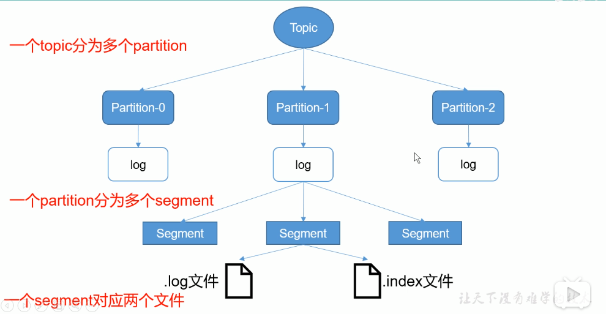
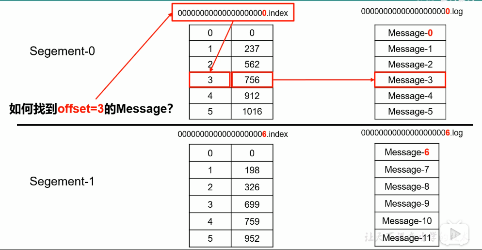
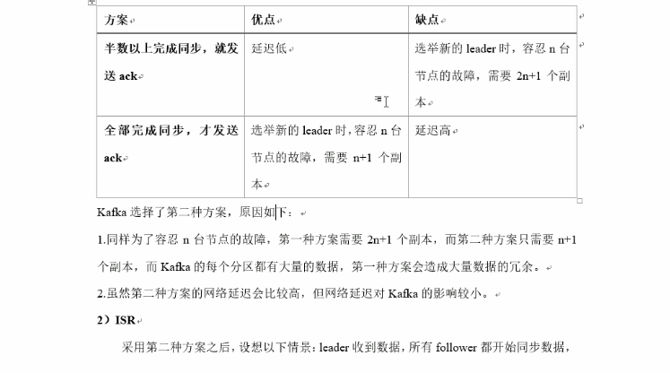
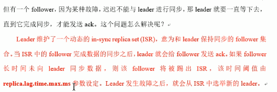

# kafka

## 教程：

```
kafka视频教程
https://www.bilibili.com/video/BV1a4411B7V9?from=search&seid=17071775111906625549
链接: https://pan.baidu.com/s/17XOeCBYdyfNqWJPxb_dMsA 提取码: 5sp9

kafka教程
https://www.w3cschool.cn/apache_kafka/apache_kafka_quick_guide.html

kafka3.x的改进
https://www.jianshu.com/p/994e8b109cca
```

## 1.kafka架构图


kafka是一个分布式，基于于发布/订阅的消息队列

**topic**：生产者，消费者都是面向一个topic

**partition**：一个topic会有多个partition为了防止某一个partition挂掉后，数据不丢失，partition有laeder,folower概念

**replica**：分区可以设置若干个副本

**broker**：一台kafka服务器就是一个broker,一个集群由多个broker组成

一个topic分为多个partition,消费者组内每个消费者负责不同分区的数据，一个分区消息只能由一个消费者消费，消费者之间互不影响。

## 2.kafka安装版本及包：

1.kafka_2.11-0.11.0.2.tgz	2.11kafka服务器版本(服务器使用scala编写)，0.11.0.2是kafka消费端版本(java实现)

2.kafka-manageer-1.3.3.15 与 kafkaOffsetMontor-assemtbly-0.46

配置：config/server.properties

启动：bin/kafka-server-start.sh -daemon config/server.properties

安装：

```
下载解压kafka_2.12-2.7.0.tgz到/opt/kafka目录
http://kafka.apache.org/downloads
$ tar -xzvf kafka_2.12-2.7.0.tgz
$ mv kafka_2.12-2.7.0 kafka

1.配置config/server.properties
#broker的全局唯一编号，不能重复
broker.id=0
#删除topic功能(方便演示，非必配项)
delete.topic.enable=true
#kafka运行日志存放路径
log.dirs=/opt/kafka/logs
#配置zoookeeper集群地址
zookeeper.connect=node1:2181,node2:2181,node3:2181
#配置advertised.listeners，必须外网访问的ip
advertised.listeners=PLAINTEXT://192.168.1.135:9092

2.创建日志目录
$ mkdir /opt/kafka/logs

3.配置环境变量
#KAFKA_HOME
export KAFKA_HOME=/opt/kafka
export PATH=$PATH:$KAFKA_HOME/bin:

4.分发安装包并修改server.properties(broker.id)
scp -r kafka root@test2:/opt/	//scp分发

4.启动（各个节点启动）
/opt/kafka/bin/kafka-server-start.sh -daemon /opt/kafka/config/server.properties

java访问问题：
    https://www.cnblogs.com/nacyswiss/p/12617864.html
    kafka advertised.listeners区别：
    https://blog.csdn.net/weixin_38251332/article/details/105638535
```

安装验证kafka_2.12-2.7.0.tgz

```
1.查看topic
kafka-topics.sh --bootstrap-server localhost:9092 --list

2.删除topic
kafka-topics.sh --delete --topic test2 --bootstrap-server localhost:9092

3.创建topic
$ kafka-topics.sh --create --topic test --bootstrap-server localhost:9092

4.发送消息
$ kafka-console-producer.sh --topic test --bootstrap-server localhost:9092

5.消费消息
$ kafka-console-consumer.sh --topic test2 --from-beginning --bootstrap-server localhost:9092
```

安装验证版本kafka_2.11-0.11.0.2.tgz（old）：

```
1.查看所有topic
kafka-topics.sh --zookeeper test2:2128 --list

2.创建topic
kafka-topics.sh --zookeeper localhost:2181 --create --partitions 3 --replication-factor 2 --topic test

3.删除topic
kafka-topics.sh --zookeeper localhost:2128  --delete --topic test

4.查看描述信息
kafka-topics --zookeeper localhost:2128 --describe --topic test
ISR　：和Leader保持同步的副本集合

5.发送消息
kafka-console-producer.sh --broker-list ip:9092,ip2:9092(也可以指定一个) --topic test

6.消费消息
kafka-console-consumer.sh  --topic test --bootstrap-server  --broker-list ip:9092  
--from-beginning(可无，从头消费)

7.修改分区数(partitions只能递增不能递减)
kafka-topics.sh --zookeeper ip:2128 --alter --topic first --partitions 6
```

## 3.运行流程及存储机制：





## 4.分区：

分区原因：方便集群扩展，提高并发


## 5.可靠性和ISR(所有同步完成才发送ack)：





**1.kafka采取全部完成同步才发送ack**

**2.当follower长时间没响应leader同步数据，则会剔除ISR,但剔除时间有个参数设定replica.lag.time.max.ms**


###### **ACKS等级（刷盘响应机制）:**

​			acks=0:broker一旦收到消息就返回ack。broker收到在内存，机器突然挂掉（有丢数据风险）

​			acks=1:leader落盘成功后返回ack，leader突然挂掉，也存在丢数据（有丢数据风险）

​			acks=-1:等待leader,follower都落盘成功后返回ack（**在返回ack之前leader发生故障，会产生数据重复问题，因为有重试机制**）


###### **LEO,HW(日志文件处理):**

​			LEO:每个副本最后offset

​			HW:所有副本中最小的offset

​			为了保证leader与follower数据同步一致，当leader挂掉后，重新选举到leader后，follower同步时会截取ＨＷ后面的数据.


###### **Exactly once(保证每条消息被发送且仅发送一次):**

​			kafka在0.11，引入了幂等性机制，配合acks=-1时的at least once语义，实现了producer到broker的Exactly once

​			生产者加上enable.idempotence属性设置为true(**kafka会自动设置acks为-1**)

## 事务

```

```
## 顺序消费

```

```

## 6.consumer消费方式

**kafka消费采取pull模式**，因为push模式很难适应消费速率不同的消费者，因为发消息是由broker决定的，

pull模式可以根据consumer的消费能力，以适当的速率消费信息

**pull不足**，如果kafka没有数据，消费者可能陷入循环中，一直返回空数据．正对这点kafka的消费数据时会传入一个timeout参数（如果没有数据可消费会等待一下再返回）


**kafka消费策略：**

　	．roundrobin（轮循）

​		．range	(范围，默认) 可能导致消费不均匀


**offset维护：**

​		kafka0.9版本之前，consumer将offset保存在zookeeper中

​		kafka0.9版本之后，consumer默认保存在kafka一个内置topic中，该topic为__consumer_offsets


**kafka高效读写数据：**

​		顺序读写，kafka还用到**zero copy**技术，避免内核与用户空间的交互


### 7.生产/消费端实例

生产者：


```
* kafka异步发送后可以实现回调方法
* kafka发送消息本身属于异步发送，但是可以通过Future的get实现同步发送
```

消费者：

```
kafka消费端offset维护有三种方式:
1.自动提交
	enable.auto.commit：是否开启自动提交offset功能
	auto.commit.interval.ms：自动提交offset的时间间隔
问题：不能保证设置的时间段，主机挂掉，丢失了多少数据。
2.手动提交
	enable.auto.commit：false
	consumer.commitSync();//这是同步方式提交(同步提交失败会重试)，还有异步
问题：会产生 数据缺失与数据重复问题
	当先进行消费，再进行提交，会产生重复消费问题
	当先进行提交，再进行消费，会产生数据缺失问题
	
3.自己维护offset
	可以保存在redis,mysql其它存储里面，通过事务控制业务与提交、


拦截器：
？？？？

* 要保证顺序，只能一个分区，一个消费者
offset维护？？？


```

### 8.监控

efak

```
官网：
https://www.kafka-eagle.org/
安装说明文档
https://docs.kafka-eagle.org/2.installation/2.installonlinuxmac
开源项目
https://github.com/smartloli/EFAK

安装步骤:
	1.安装jdk并配置好环境变量
	2.解压EFAK并配置好环境变量(必须配置KE_HOME)
	3.配置*/conf/system-config.properties文件
		#集群名称
		efak.zk.cluster.alias=cluster1
		#集群ZK
		cluster1.zk.list=127.0.0.1:2181
		#数据文件(固定的不能变)
		efak.driver=org.sqlite.JDBC
		efak.url=jdbc:sqlite:/hadoop/kafka-eagle/db/ke.db
		efak.username=root
		efak.password=www.kafka-eagle.org
	4.启动命令(详细见官网)
		ke.sh start
	4.登录验证
		浏览器打开：
		http://127.0.0.1:8048
		用户名：admin
		密码：123456
问题1：
[2024-12-24 07:20:30] KafkaCacheUtils.Thread-4 - ERROR - Telnet [172.18.1.14:-1] has error, msg is 
 java.lang.IllegalArgumentException: port out of range:-1
	at java.base/java.net.InetSocketAddress.checkPort(InetSocketAddress.java:152)
	at java.base/java.net.InetSocketAddress.<init>(InetSocketAddress.java:233)
	at org.smartloli.kafka.eagle.common.util.NetUtils.telnet(NetUtils.java:45)
	at org.smartloli.kafka.eagle.common.util.KafkaCacheUtils.refreshKafkaMetaData(KafkaCacheUtils.java:150)
	at org.smartloli.kafka.eagle.common.util.KafkaCacheUtils.initKafkaMetaData(KafkaCacheUtils.java:65)
	at org.smartloli.kafka.eagle.web.controller.StartupListener$ContextSchema.initKafkaMetaData(StartupListener.java:74)
	at org.smartloli.kafka.eagle.web.controller.StartupListener$ContextSchema.run(StartupListener.java:70)
[2024-12-24 07:20:30] KafkaCacheUtils.Thread-5 - ERROR - Telnet [172.18.1.14:-1] has error, msg is 
 java.lang.IllegalArgumentException: port out of range:-1
	at java.base/java.net.InetSocketAddress.checkPort(InetSocketAddress.java:152)
	at java.base/java.net.InetSocketAddress.<init>(InetSocketAddress.java:233)
	at org.smartloli.kafka.eagle.common.util.NetUtils.telnet(NetUtils.java:45)
	at org.smartloli.kafka.eagle.common.util.KafkaCacheUtils.refreshKafkaMetaData(KafkaCacheUtils.java:150)
	at org.smartloli.kafka.eagle.common.util.KafkaCacheUtils.initKafkaMetaData(KafkaCacheUtils.java:65)
	at org.smartloli.kafka.eagle.web.controller.StartupListener$ContextSchema.initKafkaMetaData(StartupListener.java:74)
	at org.smartloli.kafka.eagle.web.controller.StartupListener$ContextSchema.run(StartupListener.java:70)

问题2(容器如果挂载ke.db文件就会有)：
### Error querying database.  Cause: org.sqlite.SQLiteException: [SQLITE_BUSY]  The database file is locked (database is locked)
```


Kafka Manager：

https://github.com/yahoo/CMAK

```
https://www.cnblogs.com/yaowentao/p/12705503.html
1.下载并解压cmak-3.0.0.5.zip
unzip cmak-3.0.0.5.zip

2.配置conf/application.conf
cmak.zkhosts="test1:2181,test2:2181,test3:2181"		//配置zk
basicAuthentication.enabled=true					//???

创建日志目录并设置
mkdir /opt/cmak/logs
sed -i 's#${application.home}#/opt/cmak#g' *.xml

（可能）需要注意及手动配置zk
zkCli.sh	//进入zk控制台
$ create /kafka-manager/mutex ""
$ create /kafka-manager/mutex/locks ""
$ create /kafka-manager/mutex/leases ""

3.启动服务(jdk1.8运行不了，需要指定jdk13目录)
/opt/cmak/bin/cmak -Dconfig.file=/opt/cmak/conf/application.conf -Dhttp.port=80 -java-home /opt/jdk-13

登录80端口,默认账户与密码
username="admin"
password="password"
```

KafkaOffsetMonitor：
https://github.com/quantifind/KafkaOffsetMonitor/releases(下载不到)

```
java -cp KafkaOffsetMonitor-assembly-0.4.6-SNAPSHOT.jar \
com.quantifind.kafka.offsetapp.OffsetGetterWeb \
--offsetStorage kafka \
--kafkaBrokers test1:9092,test2:9092,test3:9092 \
--kafkaSecurityProtocol PLAINTEXT \
--zk test1:2181,test2:2181,test3:2181 \
--port 8086 \
--refresh 10.seconds \
--retain 2.days \
--dbName offsetapp_kafka
```


