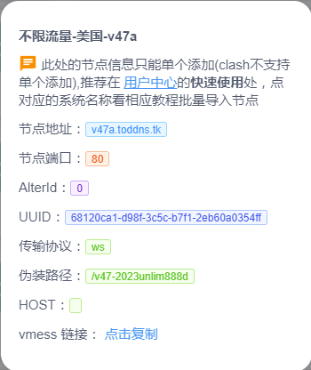
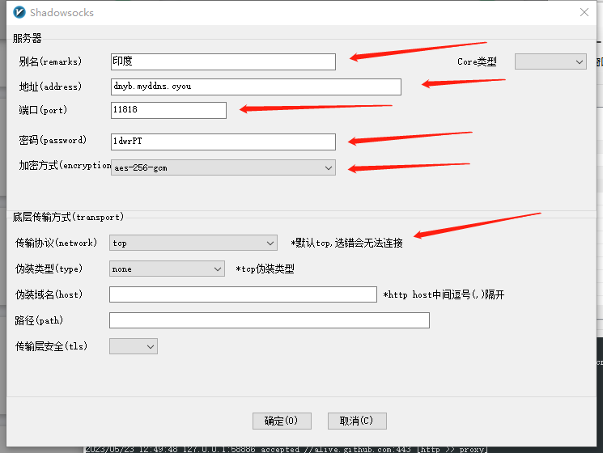
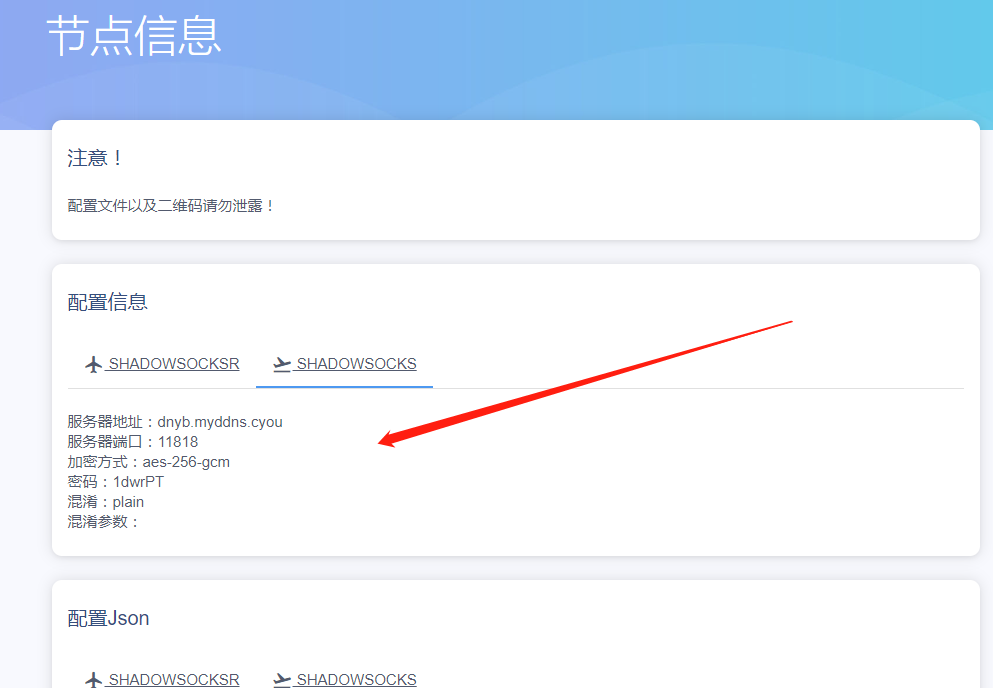

# 网络

## 一．基础知识

[1.ipv4寻址与子网划分](ipv4-subNetwork.md)

[2.dhcp , dns , 网关](dhcp-dns.md)

[3.网络OSI七层参考及数据包请求过程](osi-proccess.md)

[4.LVS的DR,TUN,NAT模型推导](lvs-dr-tun-nat.md)

[5.iptables（防火墙）](iptables.md)

## 二．应用方案

[1.内网穿透（grok , frp）](app/frp-ngrok.md)

[2.vpn网络（openvpn ）](app/vpn-openvpn.md)

[3.vpn网络（pptpd）](app/vpn-pptpd.md)

[4.squid（服务器代理）](app/squid.md)

5.LVS的DR模型及搭建

6.keepalived的LVS高可用搭建

7.keepalived的haproxy高可用搭建

[8.软路由](app/route.md)

​		1）集线器，交换机，路由器区别

## 三.翻墙工具

* **资源**

```
翻墙工具（合集）
https://github.com/bannedbook/fanqiang(比较全)
https://github.com/Alvin9999/new-pac
https://github.com/freefq/free

V2ray机场：
	注册后免费获得1024M初始流量，每日签到可获得300-500M免费流量。
	https://cdn.v2free.top/auth/register?code=cd79
	账号：
	465049568@qq.com	/	密码见keepass(Network/VPN代理)
```

* **翻墙方式**
  
  * VPN翻墙（使用方式，设备安装一个软件即可）
  * 飞机场（有一个公共的客户端软件，有几种协议方式）
  
* **linux**

  ```
  阅读：
  https://github.com/bannedbook/fanqiang/tree/master/linux
  
  1）创建目录：
  $ mkdir  ~/.config/
  $ mkdir  ~/.config/mihomo/
  $ cd     ~/.config/mihomo/
  
  2）首先下载https://github.com/MetaCubeX/mihomo/releases
  下载此包：mihomo-linux-amd64-compatible-v1.18.9.gz
  $ gzip -f mihomo-linux-amd64-compatible-v1.18.9.gz -d 	//解压
  $ chmod +x clash-linux									//授权
  $ ./clash-linux 	//初始化执行 clash 会默认在 ~/.config/mihomo/ 目录下生成配置文件和全球IP地址库：config.yaml 、Country.mmdb、GeoSite.dat
  
  * 如果./clash-linux不能自动完成下载，需要手动完成下载：
  https://github.com/Dreamacro/maxmind-geoip/releases/latest/download/Country.mmdb
  下载后放到 ~/.config/mihomo/ 目录。
  
  4）登录v2free机场查看“Clash订阅链接网址”
  	4.1）使用wget Clash订阅链接网址 下载config.yaml文件并覆盖~/.config/clash/config.yaml里面的
  	wget -U "Mozilla/6.0" -O ~/.config/mihomo/config.yaml  你的Clash订阅链接网址
  	
  5）运行
  	./clash
  	clash 默认 http https 端口默认监听 7890
  	
  6）代理设置
  	6.1)图形界面
          打开 设置 -> 网络 -> 网络代理
          配置HTTP,HTTPS,FTP代理，socks主机 的端口号都填监听本机127.0.0.1，端口为7890
  	6.2）命令行
  	代理配置：
          export http_proxy="http://127.0.0.1:7890"
          export https_proxy="http://127.0.0.1:7890"
          取消配置：
          unset http_proxy
          unset https_proxy
  ```

* **mac**

  * 一键翻墙（chrome）

  	```
  	https://github.com/bannedbook/fanqiang/wiki/苹果电脑MAC翻墙
  	```

  * xxx

* **windows**

  * 一键翻墙（chrome）

  	```
  	https://github.com/bannedbook/fanqiang/releases
  	https://d1a.wenxin-ai.top/FirefoxFQ.7z
  	```

  * 客户端

    ```
    1.）v2rayn.zip
    https://v2free.org/ssr-download/v2rayn.zip
添加节点：
    v2rayn客户端：菜单（服务器）->添加[VMess]或[Shadowsocks]。
    查看节点web登录v2free,使用->节点列表
    方式1(VMess)：
    见如下图“方式1（VMess）”
    
    方式2(Shadowsocks):
    见如下图“方式2（shadowsocks）”
    
    配置好后：
    电脑右下角，右键“系统代理”->"自动配置系统代理" 就可以使用了
    选择路线：
    
    v2rayn客户端选中节点后直接按回车键entry
    ```
    
    


方式1（VMess）：




方式2（shadowsocks）：






* **手机**

  ```
  1）AHA加速(每天签到15分钟)
  	https://channel.jsq888.com/
  	465049568@qq.com	/	密码见keepass(Network/VPN代理)
  
  2）猎豹加速(每天签到1个小时)
  	https://www.lbjsd.com/
  	465049568@qq.com	/	密码见keepass(Network/VPN代理)
  	
  3）小明vpn，西瓜加速器，蚂蚁加速器，蓝鲸加速器，红杏加速器（完全免费）
  	仅从google play下载，也只支持安卓。怎么下载google安卓应用？？？
  ```

#### telegram图片视频下载器

```
telegram图片视频下载器
	参考：https://telegram-chinese.vn/2410/
	官网（篡改猴）：
	https://www.tampermonkey.net/index.php?browser=chrome&locale=zh
	安装chrome插件（篡改猴的“telegram图片视频下载器”插件）
	https://chromewebstore.google.com/detail/%E7%AF%A1%E6%94%B9%E7%8C%B4/dhdgffkkebhmkfjojejmpbldmpobfkfo
	到tampermonkey.net官网进入“用户脚本”菜单，搜索“telegram图片视频下载器”安装
	使用：
	然后用web浏览器登录telegram，就可以发现资源右上角有个下载箭头了，就可以下载了
```

#### 工具:

**wireshark**

```
官网:
https://www.wireshark.org/

ubuntu安装:
$ sudo add-apt-repository universe
$ sudo apt install wireshark
$ apt show wireshark	//查看可用版本
```

## 问题

1.ssh连接报错:ssh: Could not resolve hostname 15256m136e.imwork.net: Temporary failure in name resolution

在有的机器上可以正常连接，有的机器不可以，报上面问题，解决办法如下：

​			2.1>在能够连接的机器ping域名15256m136e.imwork.net，得到域名实际指向ip（103.46.128.45）

​			2.2>在不能正常连接的机器配置一下hosts

​						103.46.128.45 15256m136e.imwork.net