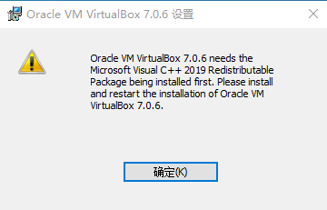

# 服务器管理

### 一。各服务器常用操作

##### 1.debian

1.1）包搜索，安装，卸载，源更换

1.2）环境变量配置

##### 2.rockylinux

。。。。。。

##### 3.ubuntu

。。。。。。

##### 4.windows

1).windows常用命令
2).windows的nfs
3).windows服务器
4).windows常用桌面工具

###### 1).windows常用命令

```
windows(凭据管理)
https://www.jianshu.com/p/0ad3d88c51f4

启用远程管理？
Configure-SMRemoting.exe -enable

一.添加入站规则
依次打开控制面板---系统和安全---Windows防火墙---高级设置。
打开入站规则—新建规则。

关闭防火墙：
netsh advfirewall set allprofiles state off
启用防火墙：
netsh advfirewall set allprofiles state on
	查看防火墙状态：netsh advfirewall show allprofiles


开启防火墙：
netsh firewall set opmode mode=enable
关闭防火墙：
netsh firewall set opmode mode=disable
	防火墙恢复默认配置：netsh firewall reset
	netsh firewall show state //显示当前防火墙状态

开启远程访问
REG ADD HKLM\SYSTEM\CurrentControlSet\Control\Terminal" "Server /v fDenyTSConnections /t REG_DWORD /d 00000000 /f

开启3389端口
netsh advfirewall firewall add rule name="Remote Desktop" protocol=TCP dir=in localport=3389 action=allow
开启8080端口
netsh advfirewall firewall add rule name="HTTP" protocol=TCP dir=in localport=8080 action=allow


二.共享文件夹
net share tool=C:\tool /grant:Administrator,full

查看共享
net share

取消共享
net share tool /delete

删除磁盘映射
net use E: /delete


三.设置环境变量:
设置临时:set PATH=%PATH%;D:\Program Files\
设置永久:setx PATH "%PATH%;D:\Program Files\"

实例:
setx JAVA_HOME "C:\soft\jtm\jre1.8.0_162"
setx PATH "%PATH%;%JAVA_HOME%\bin"

服务名称:Apache2.4
自动(服务启动配置)
sc config Apache2.4 start=auto
手动(服务启动配置)
sc config Apache2.4 start=demand
删除服务
sc delete <服务名称>

查看所有已启动的服务
net start

删除文件及包含的文件:
rmdir d:\temp\ /S /Q

拷贝文件夹及子文件(/E 复制目录和子目录，包括空的,/S 复制目录和子目录，除了空的)
xcopy c:\xx	d:\xx /E

CMD多应用启动:
新建bat文件如下:
d:
@echo off
start java -jar eureka_server-0.0.1-SNAPSHOT.jar
start java -jar hello_service-0.0.1-SNAPSHOT.jar --server.port=8081

cmd远程登录:
net use \\ip\ipc$ "pwd" /user:"username"

四.常用快捷键及命令

开启运行窗口
win+r

笔记本投影仪切换:
windows+P

windows(右键快捷键)
shift+fn+F10

new命令窗口
powershell

配置命令
sconfig

windows查看激活
slmgr.vbs -xpr
slmgr.vbs -dlv	//查看激活时间

查看windows服务:
services.msc

查看磁盘使用情况
chkdsk c:

报错:"Windows 无法打开所需的文件 Sources\install.wim"
http://blog.csdn.net/codeeer/article/details/44455967
当使用UltraISO制作usb启动盘时默认是fat32文件系统,当文件大于4GB时会出现问题,处理方法如下：
1.以前的方法刻录镜像到U盘
2.进入命令行模式,输入convert f: /fs:NTFS
3.再到ISO文件里面把Sources\install.wim文件拷贝到U盘对应位置

windows10破解
http://www.xitongzhijia.net/zt/78039.html

windows server 2016(包含注册码)
http://www.xpgod.com/soft/40933.html


windos搭建ssh服务
freeSSHd
官网：
http://www.freesshd.com

1.安装
使用管理员身份安装,过程中会提示是否创建默认私钥与创建freesshd服务,两个都选yes

2.默认安装后freessh服务与ssh服务是都启动的
先以管理员运行freessh,右下角右键settings,弹出界面,进行配置
SSH>use new console engine(这个必须勾选上)
测试配置阶段可以把SSH>start ssh server on freesshd startup(去掉勾选,配置好后可以把勾选选上开机自启动)

登录方式
1).NT authentication(已有的操作系统账户)
基本的shell勾选上
2).创建一个freessh账户与密码
基本的shell勾选上
3).public key(只能ssh)
基本的shell勾选上
这个需要使用ssh-keygen(一直回车)创建一个免登录秘钥对
然后把生成的公钥(id_rsa.pub)copy到feesshd安装目录(文件名称重命名为账户名称,没有后缀)

Authentication配置
前两个1)2)Authentication>
password authentication>(required)
Public key authentication>(disabled)

3)Authentication>
password authentication>(disabled)
Public key authentication>(Allowed)

3.Server status
SSH server(点击运行)
启动后就可以客户端ssh连接了

出现如下问题：
@@@@@@@@@@@@@@@@@@@@@@@@@@@@@@@@@@@@@@@@@@@@@@@@@@@@@@@@@@@
@    WARNING: REMOTE HOST IDENTIFICATION HAS CHANGED!     @
@@@@@@@@@@@@@@@@@@@@@@@@@@@@@@@@@@@@@@@@@@@@@@@@@@@@@@@@@@@
IT IS POSSIBLE THAT SOMEONE IS DOING SOMETHING NASTY!
Someone could be eavesdropping on you right now (man-in-the-middle attack)!
It is also possible that a host key has just been changed.
The fingerprint for the RSA key sent by the remote host is
SHA256:DKjxMxylAcPir2wbq3fUmXrsnk/hwNHhiDC1eo7u28U.
Please contact your system administrator.
Add correct host key in /c/Users/liyuan/.ssh/known_hosts to get rid of this message.
Offending RSA key in /c/Users/liyuan/.ssh/known_hosts:15
RSA host key for 192.168.127.134 has changed and you have requested strict checking.
Host key verification failed.

解决方法：
删除目录.ssh下的known_hosts文件重新连接
或者打开known_hosts文件,删除对应连接机器的记录

windows server2012 修改密码过期提示
https://jingyan.baidu.com/article/e75057f2c83fe4ebc91a89a4.html

windows server 2016安装nginx
http://www.jb51.net/article/120469.htm

远程管理
http://www.pcwenti.com/czxt/WindowsServer/13016.html

命令行添加防火墙
http://blog.csdn.net/a497785609/article/details/48572993

参考
https://www.cnblogs.com/sjy000/p/4727363.html

五.windows组件安装
1.Windows下Hyper-V虚拟技术使用
控制面板->程序->启用或关闭Windows功能(点开后选中里面Hyper-V,下面两个都要选中)
Hyper-V管理工具
Hyper-V平台
选着好后重启电脑,就可以在搜索里面搜到Hyper-V虚拟机管理界面了

2.windows下安装linux子系统
https://blog.csdn.net/zhangdongren/article/details/82663977
控制面板->程序->启用或关闭Windows功能(选中使用linux 的 windows子系统)
选着好后重启电脑->Microsoft Store(商店里面搜索安装linux)
bash 进入linux子系统

六.windows工具
	2.启动盘制作工具
		ultraiso(u盘启动盘制作工具)	//https://www.ultraiso.com/与https://cn.ultraiso.net/
	4.windwos SSH服务端
		freesshd					http://www.freesshd.com/
	5.vmware虚拟机
		vmware12					//vmware类似的virtualbox(开源)				https://www.virtualbox.org
```
###### 2).windows的nfs
```
windows7下面安装nfs客户端命令：
打开或关闭windows功能>nfs服务(勾选上)重启

hanewin(windows7下安装nfs服务)使用:
下载地址：http://www.hanewin.net/

安装后需要生成注册码：
liyuan3210/FBLZ3577F37E78FB

1.安装好后首先需要配置nfs服务端
NFS Server>Exports配置服务端目录
d:\nfsroot -name:nfsroot -umask:000 -public -mapall:0

2.使用管理员权限启动nfs服务（Start NFS Server）
也可以直接在,计算机管理>服务（NFS Server）启动/停止服务

3.通过命令挂载（关闭防火墙）
查看这个主机nfs服务目录列表
showmount -e 192.168.x.x

挂载
mount 192.168.x.x:/tool z:

卸载
umount 192.168.x.x:/tool z:

注意：
windows7使用hanewin时需要配置 服务器>扩展字符集设置>utf-8选择上(否则操作文件时会出现问题)，
exports配置成 d:\test -name:test即可

cygwin:
cygwin是一个可以在windows上运行linux命令的 环境工具
1.安装cygwin
http://www.cygwin.com/
默认点击下一步，需要选择下载站点与默认安装包。
nfs服务插件包（vim,nfs-server,sunrpc,cygrunsrv）

2.安装好后win7下需要右键以管理员运行cygwin
运行前需要在win7下面创建一个用户(否则重启电脑后进步了电脑)，用此用户在cygwin环境下安装nfs插件

3.进入cygwin命令行安装nfs
命令行里面的"/"是cygwin安装目录，

4.安装nfs-server
运行/usr/bin/nfs-server-config.首先询问是否安装,输入yes.然后询问是否使用signel user模式，xp下必选，win7下输入no

5.安装好后可以在windows服务列表看到protmap,mountd,nfsd三个服务
vim /etc/exportse
/nfsroot *(rw,sync,no_root_squash)

vim /etc/hosts.allow
默认没有hosts.allow,创建出来配置如下：
nfsd:ALL

配置好nfs文件右键启动
linux
ubuntu下安装：
sudo apt-get install nfs-kernel-server 

sudo vi /etc/exports 配置nfs：
mkdir /nfsroot
chmod -R 777 /nfsroot
/nfsroot *(rw,sync,no_root_squash,no_subtree_check)

sudo /etc/init.d/rpcbind restart 重启rpcbind
sudo /etc/init.d/nfs-kernel-server restart 重启nfs
端口映射工具：
nat123

```
###### 3).windows服务器工具

```
1.svn服务端(windows)
	VisualSVN				https://www.visualsvn.com			//实际
	客户端工具：
	TortoiseSVN				https://tortoisesvn.net
2.hsk(花生壳)
	账号见密码本
```
###### 问题
1.软件安装问题见如下图

解决办法，下载安装vc插件（百度云盘：../env/env-windows/VC_redist.x64.exe）
https://learn.microsoft.com/zh-cn/cpp/windows/latest-supported-vc-redist?view=msvc-170


### mac

无


### 二。linux服务器常用命令

##### Linux常用命令


##### tar,rar,zip压缩与解压


##### wget,curl,scp,cat,tail


##### grep,sed,awk三剑客


### 三。常用服务部署

[1.httpd-php-phpmyadmin](#httpd-php-phpmyadmin)<br/>
	1).windows下安装<br/>
	2).ubuntu下安装<br/>
[2.samba](#samba)<br/>
	1).ubuntu下安装<br/>
[3.subversion](#subversion)<br/>
	1).windows下安装<br/>
	2).ubuntu下安装<br/>
	3).subversion源码安装<br/>

##### 1.httpd-php-phpmyadmin
<div id="httpd-php-phpmyadmin"/>
###### 1).windows下安装

```
windows上的安装配置

源码地址:http://httpd.apache.org
php官网:http://php.net
phpmyadmin官网:https://www.phpmyadmin.net

下载
php:
http://windows.php.net(要下载Thread Safe类型的)
httpd:
http://www.apachelounge.com(源码地址http://httpd.apache.org)
wordpress:
https://wordpress.org
phpmyadmin:
https://www.phpmyadmin.net

安装(windows环境)
解压安装httpd,php到d:/soft:
cd httpd>Apache24/bin
>
httpd.exe -k install(后台服务名为Apache2.4)

插件(https://www.apachelounge.com/download可以进行下载)
windows下需要安装vc_redist.x64.exe插件

php环境变量(;C:\soft\php-7.1.7\ext[貌似可以不加进去])
path:;C:\soft\php-7.1.7

配置httpd.conf
1.配置目录(注意)
在../Apache24/conf/httpd.conf
#配置基础(里面所有默认c:/Apache24的目录都需要改成实际的地址)
ServerRoot "C:/soft/Apache24"
Listen 8080

2.配置php支持
# php7 support
LoadModule php7_module C:/soft/php-7.1.7/php7apache2_4.dll
AddType application/x-httpd-php .php .html .htm
# configure the path
PHPIniDir "C:/soft/php-7.1.7"

3.DirectoryIndex默认的要配置上index.php(不然wordpress部分跳转会有问题)
<IfModule dir_module>
    DirectoryIndex index.html index.php
</IfModule>

4.DocumentRoot配置
DocumentRoot "C:/soft/Apache24/htdocs"
<Directory "C:/soft/Apache24/htdocs">
    Options Indexes FollowSymLinks
    AllowOverride None
    Require all granted
</Directory>

如果服务启动不起来直接在../Apache24/bin里面执行httpd服务命令，可以看到详细的错误信息

配置php.ini
从../php-7.1.7拷贝一个php.ini-production重命名为php.ini在里面添加如下内容:
;每个脚本的最大执行时间，默认30秒，0表示无限制
max_execution_time = 1800
;设置PHP可接收的最大POST数据大小
post_max_size = 2M;每个脚本的最大执行时间，默认30秒，0表示无限制
max_execution_time = 1800
;设置PHP可接收的最大POST数据大小
post_max_size = 2M
#从这里可以直接copy进去
;设置载入模块的路径
extension_dir = "C:/soft/php-7.1.7/ext"
;设置HTTP上传文件的临时文件存放的位置
upload_tmp_dir = "C:/soft/php-7.1.7/upload"
;指定一些自动载入的模块
extension = php_curl.dll
extension = php_gd2.dll
extension = php_mbstring.dll
extension = php_mysql.dll
extension = php_mysqli.dll
extension = php_pdo_mysql.dll
extension = php_pdo_odbc.dll
extension = php_xmlrpc.dll
; 设置默认时区
date.timezone = Asia/Shanghai
; 设置事务存放路径
session.save_path = "C:/soft/php-7.1.7/session"

验证
一般都是把工作项目文件放到../Apache24/htdocs下面,在里面新建index.php文件里面内容如下：
<?php phpinfo()?>

在浏览器输入地址:http://127.0.0.1:8080
ok如果显示php信息表示httpd,php安装成功

wordpress安装
解压wordpress,复制一份wp-config-sample.php(不能直接重命名)
并重命名为wp-config.php(配置里面的数据库连接)

账户名：liyuan
密码：7233354liyuan
主题:Zerif Lite
统计插件：slimstat

安装phpmyadmin:
解压phpmyadmin包至../Apache24/htdocs下面,
配置../phpmyadmin/libraries/config.default.php文件
必须配置项：
$cfg['Servers'][$i]['host'] = 'localhost';//mysql主机信息
$cfg['Servers'][$i]['port'] = '3316';//mysql端口

不是必须配置项：
服务协议配置
$cfg['Servers'][$i]['auth_type'] = 'http';
$cfg['PmaAbsoluteUri'] = "http://liyuan3210.iask.in/phpMyAdmin';//访问网址
帐号与密码
$cfg['Servers'][$i]['user'] = 'adm';
$cfg['Servers'][$i]['password'] = '123';
编码配置
$cfg['DefaultLang'] = 'en-utf-8';
$cfg['DefaultConnectionCollation'] = 'utf8_general_ci';

问题：
1.电子邮件未能发送。
可能原因：您的主机禁用了mail()函数。

2.博客数据迁移问题

BuHDt11o@163.com
7233354liyuan

3.后期更换域名后无法访问解决方法
https://www.douban.com/note/181941598/
实例:
修改数据库表wp_options两条数据
siteurl:	http://blog.liyuan3210.com:46104
home:		http://blog.liyuan3210.com:46104
```

###### 2).ubuntu下安装

```
一.安装配置
	1.安装apache2
	apt-get install apache2					//安装apache2

	2.安装php
	apt-get install php						//安装php

	3.php与apache2整合
	apt-get install libapache2-mod-php		//php与apache2整合
	apt-get install libapache2-mod-php7.0	

	4.php与mysql整合
	apt-get install php-mysql				//php与mysql整合(php7-mysql这个有问题)
	apt-get install php7-mysql				
					
	5.创建测试文件(默认目录/var/www/html)
	测试
	create new file php
	<?php phpinfo()?>

	6.端口修改(要修改两个文件里面的,why?)
	/etc/apache2/ports.conf(Listen 81)
	/etc/apache2/sites-enabled/000-default.conf(VirtualHost *:81)

	7.重启服务
	/etc/init.d/apache2 restart			//重启服务
	service apache2 restart

	8.访问
	http://192.168.157.139:81/info.php
 
二.添加虚拟主机与端口,并配置web目录浏览
	1>vi apache2.conf（主配置文件，里面包含了要加载的一些配置文件）
	复制<Directory /var/www/>节点（指定目录）
	<Directory /home/liyuan/test/>
			Options Indexes FollowSymLinks
			AllowOverride None
			Require all granted
	</Directory>

	2>vi ports.conf
	添加一个端口监听
	Listen 89

	3>进入sites-enabled目录
	cp 000-default.conf 000-default2.conf（复制一份配置文件，并修改端口为89）
	并修改指定的目录
	DocumentRoot /home/liyuan/test
	里面添加配置文件（web目录浏览）
	<Directory / >
		Options Indexes FollowSymLinks
		AllowOverride All
		Require all granted
	</Directory>
 
php官方安装:
http://php.net/manual/zh/install.unix.debian.php
https://blog.csdn.net/hywerr/article/details/70194960

php -v 	//查看php版本

apt-get install php
apt install php7.0-cli

php.ini
/etc/php/7.0/cli

httpd官方安装
http://httpd.apache.org/docs/2.4/install.html
httpd源码编译安装
https://blog.csdn.net/qq_30164225/article/details/54629763

php开启mysql扩展
https://blog.csdn.net/mrwangweijin/article/details/76152693

创建软连接
https://blog.csdn.net/l6807718/article/details/51374915

http://192.168.157.128:81/info.php

php源码编译安装
https://www.cnblogs.com/milanmi/p/7124271.html
```

##### 2.samba
<div id="samba"/>
```
1.安装
sudo apt-get install samba

2.vi /etc/samba/smb.conf(安装好后右键文件夹赋权限)
[share]
comment = Shared Folder require password
path = /home/share
public = yes
writable = yes
valid users = share/liyuan
create mask = 0777
directory mask = 0777
force user = nobody/liyuan
force group = nogroup/liyuan
available = yes
browseable = yes

添加用户
useradd share/liyuan
设置密码
smbpasswd -a share/liyuan

3.重启
sudo /etc/init.d/samba restart

配置实例
https://jingyan.baidu.com/article/db55b609e041584ba30a2f01.html
[share]
comment = Shared Folder require password
path = /home/liyuan/share
public = yes
writable = yes
valid users = liyuan
create mask = 0777
directory mask = 0777
force user = liyuan
force group = liyuan
available = yes
browseable = yes
```

##### 3.subversion安装(svn)
<div id="subversion"/>
###### 1).windows下安装
```
subversion服务命令创建及配置(windows)
配置
1.创建svn库：
svnadmin create [path(库路径)]
2.启动服务
svnserve -d -r [path(库路径)]
3.场景描述
passwd中配置三个账户，一个管理管理员ad（拥有最高权限），
与li（对li目录有增删改权限，其他目录为只读），si（对li
目录有增删改权限，其他目录为只读），show为共享目录除了ad用户外
其他都为只读。
4.配置权限
1)全局配置
到conf/svnserve.conf添加：
anon-access = none（不让匿名读取）
去掉前面#有：
authz-db = authz （使用authz文件）
password-db = passwd（使用passwd文件）
2)账户/密码conf/passwd添加：
ad = 123
li = 123
si = 123
3)权限conf/authz中编辑：
//配置组
[groups]
ad_g = ad
li_g = li
si_g = si
//配置默认
[/]
* = r
ad = rw
//li目录
[svn:/svnTest/proSvn/src
@li_g = rw
@si_g = r
//si目录
[svn:/svnTest/proSvn/src/com/si]
@si_g = rw
@li_g = r
//公共目录
[svn:/svnTest/proSvn/src/com/show]
@li_g = r
@si_g = r

5.eclipse  svn账户删除
window地址：c:\Documents and Settings\Administrator\Application Data\Subversion\

注意：
    在S目录下创建svn目录，用svnadmin create ../S/svn创建库，
并用svnserve -d -r ../S启动服务。
Eclipse导入：svn://localhost/svn

GUI界面安装(含web)
	https://www.visualsvn.com
	下载VISUALSVN SERVER
```

###### 2).ubuntu下安装

```
subversion apt-get安装
apt安装
sudo apt-get install subversion

创建SVN版本库
创建目录
mkdir  /home/liyuan/svn
创建仓库
mkdir /home/liyuan/svn/src
svnadmin create /home/liyuan/svn/src

权限设置：
sudo chmod -R 777 svn(貌似不需要)

配置
访问权限设置conf/svnserve.conf
如下注释放开
anon-access=read
auth-access=write
password-db=passwd//密码文件
authz-db=authz//权限文件

添加用户conf/passwd
[users]
liyuan=123

设置用户权限conf/authz
[groups]
ly_g=liyuan
[/]
@ly_g=rw
*=r

查看服务
ps aux | grep svnserve
netstat -antp | grep svnserve

启动服务
svnserve -d -r /home/liyuan/svn

杀死服务
killall svnserve

访问方法
svn://192.168.5.21/src

svn://192.168.80.167

http://www.linuxidc.com/Linux/2016-08/133961.htm

hooks钩子(SVN与git)
```

###### 3).subversion源码安装

```
subversion源码安装
1.apr-1.4.6
/home/ly/tool/apr-1.4.6/configure --prefix=/home/ly/soft/apr
make
make install

2.apr-util-1.4.1
/home/ly/tool/apr-util-1.4.1/configure --prefix=/home/ly/soft/apr-util --with-apr=/home/ly/soft/apr

#3.openssl-1.0.0i
#/home/ly/tool/openssl-1.0.0i/config --prefix=/home/ly/soft/openssl

4.httpd-2.2.22
/home/ly/tool/httpd-2.2.22/configure --prefix=/home/ly/soft/httpd --enable-dav --enable-so --enable-maintainer-mode

5.下载sqlite-3.6.13
下载sqlite-3.6.13解压后，把根目录里面的sqlite3.c文件copy到subversion-1.6.18解压后的
根目录sqlite-amalgamation/sqlite3.c里面(需要新建sqlite-amalgamation文件夹)

6.subversion-1.6.18最后安装
/home/ly/tool/subversion-1.6.18/configure --prefix=/home/ly/soft/subversion --with-apxs=/home/ly/soft/httpd/bin/apxs --with-apr=/home/ly/soft/apr --with-apr-util=/home/ly/soft/apr-util 

7.配置httpd(../httpd/conf/httpd.conf)
1>.#定义apache访问svn配置：
<Location /svn>
    DAV  svn
    #SVNPath /opt/svndata
    #AuthzSVNAccessFile /home/ly/soft/svnku/svnc1/conf/authz
    SVNParentPath /home/ly/soft/svnku
    AuthType Basic
    AuthName "svnc1"
    AuthUserFile /home/ly/soft/httpd/bin/pwd.txt
    Require valid-user //匿名登录，加#把此行去掉
</Location>

2>.chmod -R 777/ ../svnku/svnc1 或 chown -R daemon ../svnku/svnc1(设置权限(没有就创建daemon目录 匿名的)，库的名字)

3>.启动服务开始测试
/home/ly/soft/httpd/bin/apachectl start //开始服务
/home/ly/soft/httpd/bin/apachectl stop  //停止服务

netstat -lntp//查看端口(8081)

访问测试：http://ip:8081/svn/库名

创建svn账户:
第一次创建:	./htpasswd -cm pwd.txt [账户名]
追加账户:	./htpasswd -m pwd.txt [账户名]

出现如下编译错误(通常解决方法)
/usr/bin/ld: cannot find -lc
/usr/bin/ld: cannot find -lltdl
/usr/bin/ld: cannot find -lXtst
解决方法：
错误1缺少libc的LIB
错误2缺少libltdl的LIB
错误3缺少libXtst的LIB
```


#########################################################################OLD

# linux服务器常用命令

[ubuntu/debian](#ubuntu)<br/>
[centos/rockylinux](#centos)<br/>
[suse](#suse)<br/>
[tar,rar,zip压缩,解压](#tar_rar_zip) <br/>
[wget_curl_scp_cat_tail](#wget_curl_scp_cat_tail) <br/>
[周志磊马士兵教育经典linux命令演示](#mashibing2) <br/>

### 常用命令

```
常用命令:
		·ls:当前目录所有文件
		·ls -la:包括系统隐藏的文件
		·pwd:查看当前目录
		·mv /dir/* /dir2 linux文件夹移动命令·
		·su userName:切换用户
		·locate crt1.o//安装时常用到的查找命令
		·ln -s /usr/lib/i386-linux-gnu/crt1.o /usr/lib/crt1.o//创建软链接命令
		·netstat -lntp,netstat -ntl//查看端口,pid
		·ps au,ps aux//查看进程
		·top //查看资源使用情况
		·df -h //查看磁盘使用情况
		·sudo ufw disable(关闭),enable(开启)//关闭linux防火墙
			 ufw allow 3690//开通3690端口
			 ufw status numbered//本地端口开放情况
			 sudo ufw delete 2//根据需要进行删除
			 
		·安装命令:
			deb安装方法：dpkg -i *.deb
			rpm安装方法：rpm -ivh *.rpm

	文件/文件夹操作:
		·创建文件夹
		 mkdir -p a/b //加上-p可以创建树形到文件夹
		·删除文件夹及文件
		 rm -rf a     //加上-rf可以删除包括a文件下下面到子文件夹及文件
		·拷贝重命名文件
		cp -r /tmp/a /root/b
		·移动文件？
		 mv file/* file2

	添加组与用户:
		·添加组/删除组：
		groupadd gName/groupdel gName
		·添加用户/设置密码：
		添加用户：useradd userName -g gName -G gName,gName2,...
		设置密码：passwd userName


	文件所有者chown:
		·文件所有者chown(只有管理员才有该权限):
		chown -R testUser:testGroup /dirName  //-R表示表扩目录下面到子目录及文件

	文件权限chmod:
		-rwxrw-rw-
		r:4  w:2  x:1 -:0
		3段数字的和，组合起来
		chmod -R 766 /dirName
		(第一个7代表当前用户，第二个6代表所属组用户，第三个6代表其他组的用户)

	vi使用:
		·打开/新建一个文件
		vi fileName

		·刚打开属于“命令模式” 进入 编辑模式
		a:在光标下一个开始插入
		i:在光标上一个开始插入
		o:在光标下一行开始插入
		r:取代光标所在字到插入

		·修改命令
		dd:删除光标所在的一整行
		x:删除光标所在的那个字符

		·进入命令模式“esc”
		wq!:保存并退出
		q!:不保存并退出
		
		1、复制
			1）单行复制
			在命令模式下，将光标移动到将要复制的行处，按“yy”进行复制；
			2）多行复制
			在命令模式下，将光标移动到将要复制的首行处，按“nyy”复制n行；其中n为1、2、3……
		2、粘贴
			在命令模式下，将光标移动到将要粘贴的行处，按“p”进行粘贴

		文件上传下载命令:
		http://man.linuxde.net/curl

	终端文件上传插件
		sudo apt install lrzsz
		
	开机默认进入图形界面:
		以管理员权限编辑/etc/inittab
		把
		id:5:initdefault:
		改为
		id:3:initdefault:
		就行了。

	脚本自启动:
		可以在如下文件添加要运行的linux脚本:
		/etc/init.d/rc.local
		或
		/etc/rc.local

	组合命令
		查看进程号
			ps aux
		杀死进程
			kill 进程号(pid) 或者 kill -9 进程号(pid)[强制杀死]
		查看java进程
			ps aux | grep java
		发布命令
			nohup java -jar otp-open-platform-web-1.0.0.jar >/dev/null 2>&1 &
			https://blog.csdn.net/Forward__/article/details/80646488
		
	ssh root不能远程登录问题
		默认是不允许root远程登录的，可以再配置文件开启
		/etc/ssh/sshd_config
		找到PermitRootLogin without-password 修改为PermitRootLogin yes
		重启生效service ssh restart
		
		修改root密码
		sudo passwd root
		
	服务:
		查看所有服务
		sudo service --status-all

		在如下目录新建服务脚本,并sudo chmod 755 svnd.sh
		/etc/init.d

		安装新服务
		sudo update-rc.d svnd.sh defaults 90

		移除脚本
		sudo update-rc.d -f svnd.sh remove
--------------------------------------------------------crontab定时器
nano编辑器使用
	ctrl+O:保存写入
	ctrl+x:退出
	 
定时任务crontab
	启动cron任务编辑器
	crontab -e
	定时配置(每天晚上1:30执行)
	30 1 * * * /home/liyuan/soft/back_data.sh

	列出当前调度所有任务
	crontab -l
	
	重启crontab
	service cron restart/start/stop
--------------------------------------------------jdk环境变量配置
SVN,JRE环境变量配置old：
	修改文件:/etc/profile
	
	#jdk配置
		export SVN_HOME=/home/ly/soft/subversion2
		export JAVA_HOME=/home/ly/soft/jdk
		export PATH=$SVN_HOME/bin:$JAVA_HOME/bin:$PATH
		export CLASSPATH=.:$JAVA_HOME/lib/dt.jar:$JAVA_HOME/lib/tools.jar:$CLASSPATH	//JRE貌似不用配置

	#jre配置
		export JAVA_HOME=/home/liyuan/soft/jre1.8.0_162
		export PATH=$JAVA_HOME/bin:$PATH
		export CLASSPATH=.:$JAVA_HOME/lib/dt.jar:$JAVA_HOME/lib/tools.jar:$CLASSPATH
------------------------------所有操作系统配置hosts
	host配置（ip与域名绑定）
		vi /etc/hosts
		ip 域名
------------------------------杂项
	查看网关
		1.ip route show
		2.route -n 或 netstat -rn
		3.traceroute
		
		查看dns
		1.nm-tool
		2./etc/resolv.conf
		
		实例(下面两个地址貌似都可以):
		dns-nameserver 192.168.157.2
		dns-nameserver 8.8.8.8
	
	问题
	--2018-07-23 22:27:42--  http://420dec74.ngrok.io/ftp/02.swf
	Resolving 420dec74.ngrok.io (420dec74.ngrok.io)... failed: Temporary failure in name resolution.
	wget: unable to resolve host address ‘420dec74.ngrok.io’
	
查看usb设备
	lsusb
------------------------服务管理工具systemctl
systemctl是Linux系统中的一个命令行工具，用于控制systemd系统和服务管理器。
systemd是现代Linux发行版的默认初始化系统，用于引导用户空间并管理系统进程。

服务管理systemctl
	//不带.service形式操作
	systemctl enable kubelet sshd
	systemctl start sshd					#启动sshd服务
	//带.service
	systemctl enable --now sshd.service	 #启动并开机启动
	systemctl enable sshd.service #开机运行服务
	systemctl disable sshd.service #取消开机运行
	systemctl start sshd.service #启动服务
	systemctl stop sshd.service #停止服务
	systemctl restart sshd.service #重启服务
	systemctl reload sshd.service #重新加载服务配置文件
	systemctl status sshd.service #查询服务运行状态
	
下载centos docker镜像
	https://blog.csdn.net/qq_43285577/article/details/83413046
	centos docker镜像下载地址
	https://hub.docker.com/_/centos/

问题
1.centos7解决开机不启动网卡问题(刚装完centos7后会出现的问题)
vi /etc/sysconfig/network-scripts/ifcfg-eth0
ONBOOT=no修改为yes,然后重启机器或重启网卡一下
service network restart

2.ssh连接慢解决方法(刚装完centos7后会出现的问题)
https://www.cnblogs.com/qiang-qiang/p/10652921.html
vi /etc/ssh/sshd_config
UseDNS=no (#注释拿掉,值改为no)
systemctl restart sshd	(重启生效)
```

### ubuntu/debian:
<div id="ubuntu"/>
```
官网: https://ubuntu.com/

开启root:
		·sudo passwd root  //输入命令后根据提示设置密码，就开启了root
		·sudo passwd -l root //关闭账户
一。apt-get源配置及安装
		1.切换源，配置文件/etc/apt/sources.list （/etc/apt/sources.list.d 源的索引）
		Ubuntu 默认的源地址 http://archive.ubuntu.com/ 替换为 http://mirrors.ustc.edu.cn/
		$ sudo sed -i 's/archive.ubuntu.com/mirrors.ustc.edu.cn/g' /etc/apt/sources.list
		$ sudo apt-get update //更换源后需要同步 /etc/apt/sources.list 和 /etc/apt/sources.list.d 中列出的源的索引，这样才能获取到最新的软件包。
		
		2.搜索软件包
		$ apt-cache search mysql
		还有如下几种：
		* 网页搜索（http://packages.ubuntu.com/ ）或者命令搜索如下
		* aptitude方式
		* dpkg -L <package-name>
		
		3.软件包安装
		$ sudo apt-get install mysql-server-core-8.0
		
		4.升级已安装的所有软件包，升级之后的版本就是本地索引里的
		$ sudo apt-get upgrade

		5.卸载软件包（3种方法）
			5.1 使用ubuntu自带ui管理工具synaptic
				$ sudo apt-get install synaptic
			5.2 ubunut软件中心
			5.3 使用命令
				$ dpkg --list 	//查看
				$ sudo apt-get --purge remove <programname>		//卸载
二。ubuntu发布私有deb
	网站:https://launchpad.net/	
	版本介绍（网上资料）：
	https://www.cnblogs.com/EasonJim/p/7119331.html
	
三。环境变量配置
		·/etc/profile:所有用户,当用户使用UI第一次登录时才执行。
		·/etc/bash.bashrc:所有用户shell，所属于所有用户，当用户打开一个shell时执行。
		·~/.bashrc: 专属用户自己的bash信息，用户打开一个shell时执行
		命令生效:source /etc/profile
---------------------------------安装debian存命令行问题
1.无法直接使用shutdown,ifconfig命令，需要如下/sbin/shutdown，/sbin/ifconfig等。
配置环境变量vi .bashrc
export PATH=/sbin:$PATH

2.网络配置：
	网络配置参考
	https://tool.4xseo.com/a/243.html
1）.添加虚拟机virtualbox三个网卡，链接方式如下:
	1.1）.网络地址转换（NAT）
	1.2）.仅主机（Host-Only）网络，选择好虚拟机创建好的网络
	1.3）.桥接网卡，局域网中的ip（这个可以不用配置）
	这样设置进入电脑后，网络对外是可以ping通，但是没有对外ip，需要如下配置:

2）.根据下面配置一下网络
------------------------------ubuntu，debian配置dhcp与静态ip
	首先得到网卡名称：ip addr or ls /sys/class/net/，以下假设网卡名为eth0，实际中应替换为自己实际的名称。	
	1.编辑配置文件
		vi /etc/network/interfaces
	2.使用DHCP方式，在文件底部添加
		auto eth0
		allow-hotplug eth0
		iface eth0 inet dhcp
	2.手动设置IP(静态ip)
	auto eth0
	iface eth0 inet static
    	address 192.168.0.7
    	netmask 255.255.255.0
    	gateway 192.168.0.254
    	# dns-nameserver 192.168.157.2

	3.重启(生效)
		/etc/init.d/networking restart
		$ systemctl restart networking
------------------------------debian配置阿里源（无法使用apt源问题）
1.debian安装完无法使用apt命令
https://blog.csdn.net/jiaqi_327/article/details/21610397
	1）.vi /etc/apt/sources.list
	先对文件做备份再编辑sources.list
	cp sources.list sources.list.back

	2）.配置/etc/apt/sources.list文件
	//下面注释掉
	deb cdrom:[Debian GNU/Linux 7.4.0 _Wheezy_ - Official i386 DVD Binary-1 20    140208-12:26]/ wheezy contrib main
	//加入代码 
	deb http://http.us.debian.org/debian/ stable main
	3）.执行更新命令
	apt-get update
	
	debian配置阿里源
		注释所有项目，添加如下
		deb https://mirrors.aliyun.com/debian/ bullseye main non-free contrib
		deb-src https://mirrors.aliyun.com/debian/ bullseye main non-free contrib
		deb https://mirrors.aliyun.com/debian-security/ bullseye-security main
		deb-src https://mirrors.aliyun.com/debian-security/ bullseye-security main
		deb https://mirrors.aliyun.com/debian/ bullseye-updates main non-free contrib
		deb-src https://mirrors.aliyun.com/debian/ bullseye-updates main non-free contrib
		deb https://mirrors.aliyun.com/debian/ bullseye-backports main non-free contrib
		deb-src https://mirrors.aliyun.com/debian/ bullseye-backports main non-free contrib
```

### centos/rockylinux：
<div id="centos"/>
```
官网: https://www.centos.org

centos安装google chrome
	1.wget https://dl.google.com/linux/direct/google-chrome-stable_current_x86_64.rpm
	2.su root
	3.dnf localinstall google-chrome-stable_current_x86_64.rpm
	保证dnf命令安装：
	$ yum install epel-release
	$ yum install dnf
	$ dnf --version

当我们下载CentOS 7 时会发现有几个版本可以选择，如下：
	1、CentOS-7-DVD版本：DVD是标准安装盘，一般下载这个就可以了。
	2、CentOS-7-NetInstall版本：网络安装镜像。
	3、CentOS-7-Everything版本：对完整版安装盘的软件进行补充，集成所有软件。
	4、CentOS-7-GnomeLive版本：GNOME桌面版。
	5、CentOS-7-KdeLive版本：KDE桌面版。
	6、CentOS-7.0-livecd版本：光盘上运行的系统，类拟于winpe

一。yum源配置
	1.切换yum源为https://mirrors.ustc.edu.cn/centos/
	$ sudo sed -e 's|^mirrorlist=|#mirrorlist=|g' \
         -e 's|^#baseurl=http://mirror.centos.org/centos|baseurl=https://mirrors.ustc.edu.cn/centos|g' \
         -i.bak \
         /etc/yum.repos.d/CentOS-Base.repo
         
   2.更新缓存
   $ yum makecache
   
   3.yum搜索安装包
   $ yum search mysql-server
   
   4.安装软件
   $ yum install mysql-server -y
   
yum源安装使用:
	yum源配置目录/etc/yum.repos.d (softName.repo)
	两种方式配置源
	1.进入到源目录执行
		wget https://mirrors.aliyun.com/docker-ce/linux/centos/docker-ce.repo
	2.自己编写repo文件
		vi kubernetes.repo
      [kubernetes]
      name=kubernetes repo
      baseurl=https://mirrors.aliyun.com/kubernetes/yum/repos/kubernetes-el7-x86_64/
      gpgcheck=1	//1表示检查,0表示不检查
      gpgkey=https://mirrors.aliyun.com/kubernetes/yum/doc/rpm-package-key.gpg
      enabled=1
	
	3.测试仓库源
			yum repolist

	4.查看能安装的版本列表
      kubelet kubeadm kubectl三个版本都为1.15.3
      yum list kubelet kubeadm kubectl  --showduplicates|sort -r
      docker-ce版本为18.06.3.ce-3.el7
      yum list docker-ce --showduplicates|sort -r

	5.指定并版本安装
      yum install -y docker-ce-18.06.3.ce-3.el7
      yum install -y kubelet-1.15.3 kubeadm-1.15.3 kubectl-1.15.3

	6.重建缓存
      yum clean all
      yum makecache
	
	7.升级所有包（改变软件设置和系统设置，系统版本内核都升级，故需要几分钟耐心等待）
			yum -y update
	
	8.配置源(下载阿里yum配置到该目录中)
      https://www.cnblogs.com/Skate0rDie/p/11418287.html
      yum install -y wget
      mv /etc/yum.repos.d /etc/yum.repos.d.backup
      wget -O /etc/yum.repos.d/CentOS-Base.repo http://mirrors.aliyun.com/repo/Centos-7.repo

	9.扩展源epel
      epel源(安装完成之后你就可以直接使用yum来安装额外的软件包了)：
      wget http://dl.fedoraproject.org/pub/epel/epel-release-latest-7.noarch.rpm
      rpm -ivh epel-release-latest-7.noarch.rpm
      是基于Fedora的一个项目，为“红帽系”的操作系统提供额外的软件包，
      适用于RHEL、CentOS和Scientific Linux.
	
  *	很多软件包在yum里面没有的，解决的方法，就是使用epel源,也就是安装epel-release软件包
  		sudo yum install epel-release -y
二。rpm包发布
centos发布rpm维护包(指南)
		https://fedoraproject.org/wiki/Category:Package_Maintainers/zh-cn				
		https://fedoraproject.org/wiki/Join_the_package_collection_maintainers/zh-cn

三。服务启动/停止

四。环境变量配置

```

### suse
<div id="suse"/>
```
官网
https://www.opensuse.org/
openSUSE 源使用帮助：
https://zh.opensuse.org/软件源介绍
http://mirrors.ustc.edu.cn/help/opensuse.html

运行容器：
docker pull opensuse/leap:15.3
docker run --name myopensuse -it -d opensuse/leap:15.3
zypper install net-tools-deprecated

* 配置源
自带三个软件源oss, non-oss, update。
oss指开源软件，
non-oss是非开源软件
update源仅用于推送临时安全补丁

禁用原有软件源；
sudo zypper mr -da

添加科大镜像源
zypper ar -fcg https://mirrors.ustc.edu.cn/opensuse/distribution/leap/\$releasever/repo/oss USTC:OSS
zypper ar -fcg https://mirrors.ustc.edu.cn/opensuse/distribution/leap/\$releasever/repo/non-oss USTC:NON-OSS
zypper ar -fcg https://mirrors.ustc.edu.cn/opensuse/update/leap/\$releasever/oss USTC:UPDATE-OSS
zypper ar -fcg https://mirrors.ustc.edu.cn/opensuse/update/leap/\$releasever/non-oss USTC:UPDATE-NON-OSS


对于 15.3 或更高版本的 openSUSE Leap，还需添加 SLE 更新源：
sudo zypper ar -fcg https://mirrors.ustc.edu.cn/opensuse/update/leap/\$releasever/sle USTC:UPDATE-SLE

* 安装源管理
	zypper lr		//列出所有定义的安装源
	zypper ar 源地址 别名	//添加新的安装源
	zypper rr 别名		//删除安装源
	zypper nr 别名 新别名	//重命名安装源
	sudo zypper ref		//刷新源
	sudo zypper mr -da 	//禁用原有软件源

* 软件包
搜索软件包			zypper se package_name
安装某个软件包			zypper install package_name
安装某个版本的软件包		zypper install package_name=version
安装以某个单词名字开头的所有软件包	zypper install package_name*
卸载某个软件包			zypper remove package_name
升级某个软件包			zypper update package_name
获取所有可用新包的列表		zypper list-updates
列出所有所需的包			zypper list-patches
检验软件包的依赖关系的完整性		zypper verify apackage_name

* 命令安装
	zypper search mysql					//搜索软件包
	zypper info mysql-community-server			//查看软件信息 
	sudo zypper install mysql-community-server		//安装mysql
	
	//移除软件
	//打补丁
	//锁住包
	//解锁包

	opensuse software search
* 安装包安装


* 运行docker容器
docker run --name myrockylinux -it -d rockylinux:8.5
zypper install net-tools-deprecated
```

### tar,rar,zip解压,打包命令：

<div  id="tar_rar_zip"/>
```
1.解压命令:
	tar -xvf  file.tar      //tar解压 
	tar -xzvf file.tar.gz   //gzip解压
	tar -jxvf file.tar.bz2  //bzip2解压
	xz  -d    file.tar.xz	//解压后变成file.tar
	rar格式
		rar安装
			wget http://www.rarsoft.com/rar/rarlinux-x64-5.8.0.tar.gz
			tar -zxvf rarlinux-x64-5.4.0.tar.gz
			cd rar
			make
	rar x centos.rar	//rar解压
	zip test.zip		//解压zip
			
2.打包命令：
	tar -cvf nfs-utils-1.1.2.tar.gz nfs-utils-1.1.2 	//不压缩
	tar -zcvf etc.tar.gz etc		//打包后(在要打包etc目录的根目录下执行)，以 gzip 压缩
	tar -jcvf /tmp/etc.tar.bz2 /etc		//打包后(在要打包etc目录的根目录下执行???)，以 bzip2 压缩
	xz  -z    file.tar									//打包后变成file.tar.xz
	rar格式	
			rar centos.rar ./piaoyi.org/		//将piaoyi.org目录打包为 centos.rar
	zip -r test.zip ../*					//递归打包目录
				
3.加密打包,加密：
	rar
			打包：?
			解压：?
	tar(只能加密单个文件)
			打包：tar -czvf - file | openssl des3 -salt -k password -out /path/to/file.tar.gz
			解压：openssl des3 -d -k password -salt -in /path/to/file.tar.gz | tar xzf -
	zip
			打包：zip -rP password test.zip test		//-r表示递归test目录,password(密码)
			解压：unzip test.zip	//根据提示输入pwd
					
4.分卷压缩,解压:
	zip：
		1>.分卷压缩jdk-8u151-linux-x64.tar.gz
		zip jdk-8u151-linux-x64-part-all.zip jdk-8u151-linux-x64.tar.gz //把tar.gz转换成zip后，才能用zip分卷压缩（必须是zip文件格式zip -r jdk-13.zip jdk-13）
		zip -s 50m jdk-13.zip --out jdk-13-part
					
		2>解压
			首先合卷：
			zip jdk-13-part -s 0 --out jdk-13-all.zip
			或
			cat jdk-8u151-linux-x64-part.z* > jdk-8u151-linux-x64.zip //貌似有问题
			windows下合卷：
			copy /B 1.zip.001 + 1.zip.002 + 1.zip.003 1.zip
			实例：
			https://blog.csdn.net/weixin_37730482/article/details/78216922
			https://blog.csdn.net/u010921682/article/details/90900932
							
			最后解压：
			unzip jdk-8u151-linux-x64.zip
	tar：
		 1>.分卷压缩jdk-8u151-linux-x64.tar.gz
			tar cvzpf - jdk-8u151-linux-x64.tar.gz  | split -d -b 30m
			2>解压
			首先合卷：
			cat x* > jdk-8u151-linux-x64.tar.gz
			最后解压(要执行2次如下命令才能解压)：
			tar -xzvf jdk-8u151-linux-x64.tar.gz
	rar：
		 1>.分卷压缩jdk-8u151-linux-x64.tar.gz
		 rar a -v30m jdk-8u151-linux-x64.rar jdk-8u151-linux-x64.tar.gz
		 2>解压
		 rar x jdk-8u151-linux-x64.part1.rar
				
tar,zip,rar区别：
		tar:linux压缩格式
		zip:开源免费的,很早的压缩格式,应用广泛
		rar:收费的,支持分卷压缩,压缩效率比zip高
```
### wget_curl_scp_cat_tail
<div id="wget_curl_scp_cat_tail"/>

```
wget
	wget -bc url	//-b:表示后台下载,-c:断点续传,cat wget-log 查看记录
	https://www.cnblogs.com/evercx/p/5327478.html	//后台下载
	
	递归下载
		wget -c -r -np http://192.168.157.137:84/ftp/		//后面跟"/"
		
		实例:wget -c -r -nd -np -k -L -p -A -P dir c,h http://192.168.157.137:84/ftp/
		
		-c 断电续传
		-r 递归下载
		-nd 下载时不创建一层一层的目录
		-np 把所有的文件下载到当前目录 -np 递归下载时不搜索上层目录
			没有加参数-np，就会同时下载path的上一级目录pub下的其它文件
		-k  将绝对链接转为相对链接
		-L	递归时不进入其它主机
			如果网站内有一个这样的链接www.yyy.org
			不加参数-L,就会像大火烧山一样,会递归下载www.yyy.org网站
		-p  下载网页所需的所有文件,如图片等
		-A c,h 指定要下载的文件样式列表,多个样式用逗号分隔
		-P 指定下载到的目录

		-i 后面跟一个文件，文件内指明要下载的URL 

curl
	curl --form "userfile=@/Users/username/Downloads/20170502.zip" http://youip/up.php
	或
	curl -F "userfile=@/Users/username/Downloads/20170502.zip" http://youip/up.php
	
	指定get与post
		get方式：
			curl "http://ip:port/up.php?param1=value&param2=value2"
		post方式:
			curl -d "param1=value&param2=value2" http://ip:port/up.php
		模拟form:
			curl -F "image=@/1.png" http://ip:port/up.php
			or
			curl --form "image=@/1.png" http://ip:port/up.php
			
			"image=@/1.png"
			image 相当于<input type='file' name='image'>中name的value   
			@后面是文件路径
			
		自定义head头信息:
			curl -H "example:xxxxxxxxxx" http://ip:port/up.php
			
		post提交文件:
			curl proxy.liyuan3210.com:10802/api/ud/upload -F "file=@/home/liyuan/share/nginx-1.12.2.tar.gz"
			
			curl 192.168.157.139:83/ud/upload -F "file=@/home/liyuan/soft/nginx-1.12.2.tar.gz"
			
			curl proxy.liyuan3210.com:10802/api/ud/upload -F "file=@/home/liyuan/soft/nginx-1.12.2.tar.gz"
			curl: (6) Could not resolve host: proxy.liyuan3210.com
		
			
		https://www.cnblogs.com/dongkang/p/6150356.html
		https://blog.csdn.net/fungleo/article/details/80703365

scp命令 linux之间文件传送
    本地file上传到远程:
    第一个命令：scp -r /home/oracle/db/20121030.dmp  root@10.20.14.17:/home
    第二个命令：yunda

    远程file下载到本地：
    scp -r root@10.20.14.17:/root/index.html /home/oracle/
    第二个命令：yunda
	
	远端复制到远端主机:
	scp user1@host1:file1 user2@host2:file

    注意：-r 表示包括子目录
	指定端口,用户名称
	scp -P 6000 file.txt liyuan@192.168.1.1:/home/liyuan
	
cat与tail命令
	查看后几行命令使用
		https://www.cnblogs.com/suanec/p/5881463.html
		cat file tail -n 1000：显示最后1000行
		cat file	tail -n +1000：从1000行开始显示，显示1000行以后的
		cat file	head -n 1000：显示前面1000行
	log文件实时显示
		tail -f access.log
```

### grep,sed,awk三剑客
```
参考：https://www.cnblogs.com/smilekun/p/16219263.html
首先介绍一下Linux里面鼎鼎有名且非常重要的三剑客命令。
	grep （缩写来自Globally search a Regular Expression and Print）是一种强大的文本搜索工具。
	sed   功能同awk类似，差别在于，sed简单，对列处理的功能要差一些，awk的功能复杂，对列处理的功能比较强大。
	awk   是一个优良的文本处理工具，Linux及Unix环境中现有的功能最强大的数据处理引擎之一。
（grep擅长查找，sed擅长修改文件，awk擅长取列）

grep介绍
		https://blog.csdn.net/weixin_42193400/article/details/82255541
		位置锚定：
		grep "Destroying" test.txt 或 grep Destroying test.txt
		
		查询字符串出现次数
		grep -c "Destroying" test.txt
		
		当前目录及其子目录搜索
		grep -r "Destroying" *
		
		https://blog.51cto.com/12384628/2162402
		grep 9个经典使用场景
		https://blog.csdn.net/M________123/article/details/79521884
sed使用
	。。。。。
awk使用
		http://www.ruanyifeng.com/blog/2018/11/awk.html
		awk '{print $0}' test.txt	//输出文件
		
		echo 'this is a test' | awk '{print $1}'	//管道文件输出
		print $0 输入 this is a test
		awk会根据空格和制表符，将每一行分成若干字段，
		依次用$1、$2、$3代表第一个字段、第二个字段、第三个字段等等。
		
		文件demo.txt
		root:x:0:0:root:/root:/usr/bin/zsh
		daemon:x:1:1:daemon:/usr/sbin:/usr/sbin/nologin
		bin:x:2:2:bin:/bin:/usr/sbin/nologin
		sys:x:3:3:sys:/dev:/usr/sbin/nologin
		sync:x:4:65534:sync:/bin:/bin/sync
		
		awk -F ':' '{ print $1 }' demo.txt	//使用`:`分割
```

### 周志磊笔记（mashing）
<div id="mashibing2"/>
```
IO实操：
df			//查看磁盘设备
/boot目录挂载										//增加磁盘可以覆盖挂载

dd if=/dev/zero of=mydisk.img bs=1048576 count=100		//生成虚拟文件系统
/////////dd 文件备份？？？
losetup /dev/loop0 mydisk.img							//挂载到环形设备上
mke2fs /dev/loop0									//格式化
df		//没有的
mount -t ext2 /dev/loop0 /mnt/ooxx			//添加到df下面

cp /bin/bash bin	//拷贝bash程序
ldd bash 	//查看bash程序启动需要的动态链接库
cp /lib64/{libtinfo.so.5,aaa,xxx}		//拷贝文件
chroot ./							//当前目录为根目录启动
echo $$							//打印当前bash进程id


lsof -op $$		//当前bash进程打开了哪些文件
exec 8< ooxx.txt   //8文件描述符
cd /proc/$$/fd	//进入文件描述符，记录文件信息
read a 0<& 8		//8表示文件描述符id
echo $a

输入输出重定向
ls ./
ls ./ 1> ~/ls.out	//输出重定向
head tail | 管道

父子进程
--------------------------------------
vm.dirty内核设置？？？
```