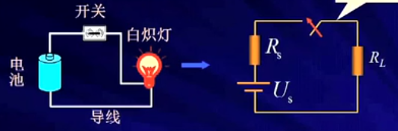
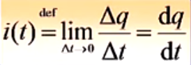
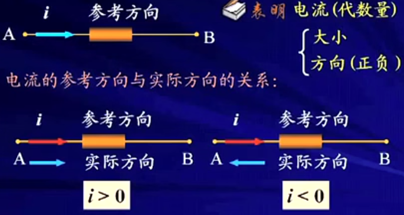
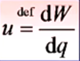
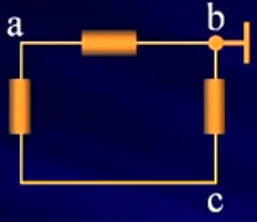

## 第一章 电路模型和电路定律

#### 1.1.电路模型

```
1-1:电路模型
实际电路--->由电工设备和电气器件按预期目的连接构成的电流的通路
电路功能：
1.能量的传输，分配与转换
2.信息的传递，控制与处理
共性：
建立在同一电路理论基础上
```
电路模型（画电路符号工具[图1.1]）:


```
Rs:内阻（考虑电线的连接实际电阻）
RL:电阻（表示灯泡）
Us:电源
电路模型：反应实际电路部件的主要电磁性质的理想电路元件及其组合。
电路模型不考虑光，热等因素。
主要考虑主要电磁效应（电压，电流）
理想电路元件：有某种确定的电磁性能的理想元件
```
5种基本的理想电路元件：
```
* 电阻元件，表示消耗电能的元件
* 电感元件，表示产生磁场，存储磁场能量的元件
* 电容元件，表示产生电场，存储电场能量的元件
* 电压源 和 电流源，表示将其它形式的能量转变成电能的元件
注意：
1）5个基本理想电路元件有三个基本特征：
* 只有两个端子。
* 可以用电压或电流按数学方式描述。
* 不能分解为其他元件
2）具有相同的主要电磁性能的实际电路部件，在一定条件下可用同一电路模型表示。
3）同一实际电路部件，在不同的应用条件下，其电路模型可以有不同的形式（电感部件的不同应用？？？）
一定要知道电路部件的工作条件(主要电流，电压大小)
```
实际电路与电路模型:
```
实际电路（测量结果）--->电路模型(分析计算结果)
测量，分析的结果是电压与电流
实际电路与电路模型最终的结果有一定的出入的，但要满足实际工程误差量（一般误差5%）
```
#### 1.2 电流参考方向
```
电路中的主要物理量有电压，电流，电荷，磁链，能量，电功率等。
在线性电路分析中人们主要关心的物理量是电流，电压和功率

* 电流的参考方向
电流--->带电粒子有规则的定向运动
电流强度--->单位时间内通过导体横截面的电荷
    公式([图1.2])
    
单位--->A（安培），kA,mA,uA
方向--->规定正电荷的运动方向为电流的实际方向

dq（电荷大小） / dt（单位时间内） = i(电流)

注意：
元件(导线)中电流流动的实际方向只有两种(对于复杂电路或电路中的电流随时间变化时，电流的实际方向往往很难事先判断)。
A->B或A<-B

比如交流电(时儿从A->B,时儿是A<-B)，所以要指定一个电流参考方向：

参考方向：
见[图1.3]

电流参考方向表示(有两种不同表示电流方向的方式)
```
图1.2


图1.3



#### 1.3.电压参考方向
```
电位--->单位正电荷q从电路中一点移至参考点时电场力作工的大小
电压--->单位正电荷q从电路中一点移至另一点时电场力作工的大小
实际电压方向--->电位真正降低的方向
单位--->V（伏特），kV,mV,uV

公式(见[图1.4])

作工大小/电荷 = 电压
dW（作工）/dq（电荷大小） = u(电压)
```
图1.4


#### 例子1
```
已知：4C正电荷由a点均匀移动至b点电场力作工8J,由b点移动到c点电场力作工为12J。
* 若以b点为参考点，求a,b,c点电电位和电压Uab,Ubc（见[图1.5]）;
* 若以c点为参考点，再求以上各值（见[图1.7]）
结论：
电路中电位参考点可任意选择。参考点一经选定，电路中各点的电位值就唯一确定。
当选择不同的电位参考点时，电路中各点电位值将改变，但任意两点间电压保持不变。

结论：
电路中电位参考点可任意选择。参考点一经选定，电路中各点的电位值就唯一确定。
当选择不同的电位参考点时，电路中各点电位值将改变，但任意两点间电压保持不变。

问题：
在复杂电路或交变电路中，两点间电压的实际方向往往不易判别，给实际电路问题的分析，计算带来困难。
* 电压（降）的参考方向--->假设高电位指向低电位方向。
实际方向 与 参考方向相同：计算出（u>0）
实际方向 与 参考方向相反：计算出（u<0）

电压参考方向（有3种电压参考方向表示方式）：

参考方向：
	见[图1.8]
```

图1.5:

图1.5解
