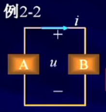
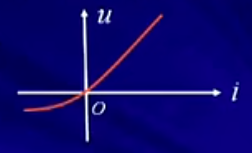

## 第一章 电路模型和电路定律

1.1.电路模型

1.2.电流参考方向

1.3.电压参考方向

1.4.关联参考方向

1.5.电功率和能量

1.6.电路元件

1.7.电阻元件

1.8.电压源和电流源

#### 1.1.电路模型

```
1-1:电路模型
实际电路--->由电工设备和电气器件按预期目的连接构成的电流的通路
电路功能：
1.能量的传输，分配与转换
2.信息的传递，控制与处理
共性：
建立在同一电路理论基础上
```
电路模型（画电路符号工具[图1.1]）:


```
Rs:内阻（考虑电线的连接实际电阻）
RL:电阻（表示灯泡）
Us:电源
电路模型：反应实际电路部件的主要电磁性质的理想电路元件及其组合。
电路模型不考虑光，热等因素。
主要考虑主要电磁效应（电压，电流）
理想电路元件：有某种确定的电磁性能的理想元件
```
5种基本的理想电路元件：
```
* 电阻元件，表示消耗电能的元件
* 电感元件，表示产生磁场，存储磁场能量的元件
* 电容元件，表示产生电场，存储电场能量的元件
* 电压源 和 电流源，表示将其它形式的能量转变成电能的元件
注意：
1）5个基本理想电路元件有三个基本特征：
* 只有两个端子。
* 可以用电压或电流按数学方式描述。
* 不能分解为其他元件
2）具有相同的主要电磁性能的实际电路部件，在一定条件下可用同一电路模型表示。
3）同一实际电路部件，在不同的应用条件下，其电路模型可以有不同的形式（电感部件的不同应用？？？）
一定要知道电路部件的工作条件(主要电流，电压大小)
```
实际电路与电路模型:
```
实际电路（测量结果）--->电路模型(分析计算结果)
测量，分析的结果是电压与电流
实际电路与电路模型最终的结果有一定的出入的，但要满足实际工程误差量（一般误差5%）
```
#### 1.2 电流参考方向
```
电路中的主要物理量有电压，电流，电荷，磁链，能量，电功率等。
在线性电路分析中人们主要关心的物理量是电流，电压和功率

* 电流的参考方向
电流--->带电粒子有规则的定向运动
电流强度--->单位时间内通过导体横截面的电荷
    公式([图1.2])
    
单位--->A（安培），kA,mA,uA
方向--->规定正电荷的运动方向为电流的实际方向

dq（电荷大小） / dt（单位时间内） = i(电流)

注意：
元件(导线)中电流流动的实际方向只有两种A->B或A<-(对于复杂电路或电路中的电流随时间变化时，电流的实际方向往往很难事先判断)。

比如交流电(时儿从A->B,时儿是A<-B)，所以要指定一个电流参考方向：

参考方向：
见[图1.3]

电流参考方向表示(有两种不同表示电流方向的方式)
```
图1.2


图1.3


#### 1.3.电压参考方向
```
电位--->单位正电荷q从电路中一点移至参考点时电场力作工的大小
电压--->单位正电荷q从电路中一点移至另一点时电场力作工的大小
实际电压方向--->电位真正降低的方向
单位--->V（伏特），kV,mV,uV

公式(见[图1.4])

作工大小/电荷 = 电压
dW（作工）/dq（电荷大小） = u(电压)

问题：
在复杂电路或交变电路中，两点间电压的实际方向往往不易判别，给实际电路问题的分析，计算带来困难。
* 电压（降）的参考方向--->假设高电位指向低电位方向。
实际方向 与 参考方向相同：计算出（u>0）
实际方向 与 参考方向相反：计算出（u<0）

参考方向：
	见[图1.8]
	
电压参考方向（有3种电压参考方向表示方式）：
	见[图1.9]
```
图1.4


图1.8解


图1.9


#### 例子1
```
已知：4C正电荷由a点均匀移动至b点电场力作工8J,由b点移动到c点电场力作工为12J。
* 若以b点为参考点，求a,b,c点电电位和电压Uab,Ubc（见[图1.5]）;
* 若以c点为参考点，再求以上各值（见[图1.7]）
结论：
电路中电位参考点可任意选择。参考点一经选定，电路中各点的电位值就唯一确定。
当选择不同的电位参考点时，电路中各点电位值将改变，但任意两点间电压保持不变。

结论：
电路中电位参考点可任意选择。参考点一经选定，电路中各点的电位值就唯一确定。
当选择不同的电位参考点时，电路中各点电位值将改变，但任意两点间电压保持不变。
```

图1.5:


图1.5解


图1.7


#### 1.4 关联参考方向

```
元件或支路的u,i采用相同的参考方向称为“关联参考方向”。
反之，称为“非关联参考方向”
	见[图1.20.png]

例2：
电压，电流参考方向见如图[图1.21.png]。
问：对A,B两部分电路电压，电流参考方向是否关联？
解答(要相对[A,B]或某个电路元件来讲)：A电压，电流参考方向非关联，B电压，电流参考方向关联

*分析电路前必须选定电压和电流参考方向
*参考方向一经选定，必须在图中相应位置标注（包括方向和符号），在计算中不得任意改变（不是绝对？？？）
*参考方向不同时，其表达式相差一负号，但电压，电流的实际方向不变
```
图1.20


图1.21


#### 1.5 电功率和能量
```
电功率--->单位时间内电场力所作的功
p = dw/dt 	u = dw/dq	i = dq / dt
p = dw/dt = (dw/dq) * (dq / dt) =ui
功率的单位：W(瓦特)
能量的单位：J（焦耳）
	见[图1.22.png]

电路吸收或发出功率的判断：
u,i取关联参考方向
p = ui 表示元件吸收功率
p > 0 吸收正功率（实际吸收）
p < 0 吸收负功率（实际发出）

u,i取非关联参考方向
p = ui 表示元件发出功率
p > 0 发出正功率（实际发出）
p < 0 发出负功率（实际吸收）	
	见[1.23.png]

例：
求图示电路中各方框所代表的元件吸收或发出的功率
	见[1.24.png]
	
解答：
	P1 = U1*I1=1*2W=2W(发出)
	p2 = ...(发出)
	p4 = ...(发出)
	p3 = ...(吸收)
	p5 = ...(发出)
	p5 = ...(吸收)

验证(校对)：一个电路中判断是否计算正确（电路中吸收与发出是守恒的）。
能量守恒定律(吸收的功率一定等于发出的功率)： 吸收的功率 = 发出的功率
```
图1.22


图1.23


图1.24


#### 1.6 电路元件
```
1. 5种基本的理想电路元件：
电阻元件，表示消耗电能的元件
电感元件，表示产生磁场，存储磁场能量的元件
电容元件，表示产生电场，存储电场能量的元件
电压源 和 电流源，表示将其它形式的能量转变成电能的元件

如果表征元件端子特性的数学关系是线性关系，该元件称为线性元件，否则为非线性元件

2.集总参数电路
--->由集总元件构成的电路
集总元件--->假定发生的电磁过程都集中在元件内部进行
集总条件--->见[图1.25.png]

注意：
	集总参数电路中u,i可用是时间的函数，但与空间坐标无关。因此，任何时刻，流入两端元件一个端子的电流等于从另一个端子流出的电流；端子间的电压为确定值

分布参数电路???（只做介绍，本书只讲“集总参数电路”）
	分布参数电路条件--->见[图1.26.png]
```
图1.25


图1.26


#### 1.7 电阻元件
```
定义：
电阻元件--->对电流呈现阻力的元件。其特性可用u-i平面上的一条曲线来描述
f（u,i）=0(表示为代数关系，而不是微分积分关系)

伏安特性：见[图1.27.png]

2.线性时不变电阻元件
	任何时刻电压与电流成正比的电阻元件,见[图1.27.1.png]
电路符号:R
欧姆定律：
	u=Ri
	I=u/R=Gu(电阻元件也可用用G表示)
单位：R称为电阻（单位：欧姆），G称为电导（单位：西门子）,G是R的倒数
	* 只适用于线性时不变电阻（R为常数），线性时变为Rt。
	* 如电阻上的电压与电流参考方向非关联，公式中应冠以负号。
		u = - R i 		i= - G u
	* 说明线性电阻是无记忆，双向性的元件（正，负两边都可以流通，典型非双向性“二极管”）
	u=-Ri
	I=u/R=-Gu(电阻元件也可用用Gu表示)

过原点线性时不变元件，当u与i都过原点并且是一条直线，那这个元件就是一个线性元件
如果不过原点即使是一条直线，那也不是线性元件
如果过原点，但线是不段变化的，那也不是线性元件

3.功率和能量(见[图1.28.png])
* 关联参考方向：
	p = ui = i2R = u2 / R
* 非关联参考方向：
	p = ui = (-Ri)i = -i2R = -u2/R
证明：电阻在任何时刻总是吸收功率（电阻耗能元件）的

能量：
   见[图1.29.png]

4.开路与短路
   见[图1.30.png]
```
图1.27


图1.27.1


图1.28


图1.29


图1.30


#### 1.8 电压源和电流源
**理想电压源**

```
* 定义---> 其两端电压总能保持定值或一定的时间函数，其值与流过它的电流i无关的元件叫理想电压源。
电路符号：
	见[图1.31.png]

* 理想电压源的电压，电流关系（电压源不能短路，比如电磁不能直接把正负两级连接起来）
	见[图1.32.png]

* 电压源的功率
	---> p = (Us)i
	见[图1.33.png]

例子1：(一般电路中不会把电路接成这样)
	计算图示电路各元件的功率。
	见[图1.34.png]
```
图1.31


图1.32


图1.33


图1.34


**理想电流源**

```
* 定义--->其输出电流总能保持定值或一定的时间函数，其值与它的两端电压u无关的元件叫理想电流源。
电路符号：
	见[图1.35.png]

* 理想电流源的电压，电流关系（电流源不能开路，比如电流互感器[并不是所有电流源会造成电流无穷大的])
1）电流源的输出电流由本身决定，与外电路无关；与它两端电压的方向，大小无关。
2）电流源两端的电压由电源及外电路共同决定。
	见[图1.36.png]

实际电流源的产生：
	可由稳流电子设备产生，如晶体管的集电极电流与负载无关；光电池在一定光线照射下光电子被激发产生一定值的电流等。

* 电流源的功率
	--->p = u(is)
	见[图1.37.png]
	
例子：
	计算图示电路各元器件的功率
	见[图1.38.png]
	

实际电源：
	？？？
```
图1.35


图1.36


图1.37


图1.38
