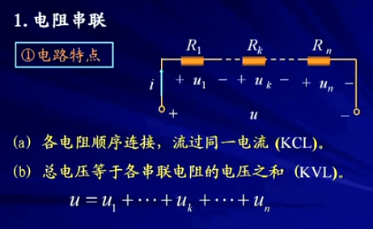
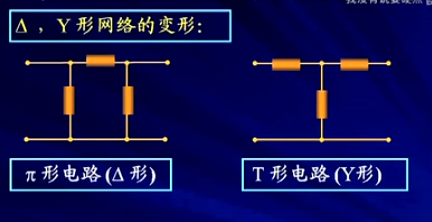

## 第二章 电阻电路的等效变换

2.1 引言

2.2 电路的等效变换

2.3 电阻的串联和并联

2.4 电阻的Y形联接和 Δ形联结的等效变换

2.5 电压源，电流源的串联和并联

2.6 实际电源的两种模型及其等效变换

2.7 输入电阻

#### 2.1 引言

```
* 电阻电路--->
			仅由电源和线性电阻构成的电路。
* 分析方法--->
			1>欧姆定律和基尔霍夫定律是分析电阻电路的依据
			2>等效变换的方法，也称为化简的方法
```

#### 2.2 电路的等效变换
```
1.二端电路(网络)
	任何一个复杂的电路，向外引出两个端钮，且从一个端子流入的电流等于从另一个端子流出的电流，则称这一电路为二端网络（或一端口网络）
	见[图2.1]
	无源一端口网络，一定没有独立源，有受控源不一定

2.二端电路等效的概念
	见[图2.2]
	
明确：
	1>电路等效变换的条件：
		---> 两电路端口处有相同的VCR
	2>电路等效变化的对象：
		---> 未改变的外电路A中的电压，电流和功率。
			（即对外等效，对内不等效）
	3>电路等效变换的目的：
		---> 化简电路，方便计算
```
图2.1


图2.2


#### 2.3 电阻的串联和并联

电阻串联

```
1.电阻串联
	见[图2.3]

等效电阻
	见[图2.4]
串联电阻分压
	见[图2.5]
功率
	见[图2.6]
表明：
	1>电阻串联时，各电阻消耗的功率与电阻大小成正比
	2>等效电阻消耗的功率等于各串联电阻消耗功率的总和
```
图2.3


图2.4


图2.5


图2.6


电阻并联

```
2.电阻并联
	见[图2.7]

等效电阻
	见[图2.8]
并联电阻的分流，结论
	见[图2.9]
例3-2：
	两电阻的分流
	见[图2.10]
功率：
	见[图2.11]

表明：
	1>电阻并联时，各电阻消耗的功率与电阻大小成反比
	2>等效电阻消耗的功率等于各并联电阻消耗功率的总和
```
图2.7


图2.8


图2.9


图2.10


图2.11


电阻的串并联
```
3.电阻的串并联
	电路中有电阻的串联，又有电阻的并联，这种连接方式称为电阻的串并联。
	
例3-3：
	计算图示电路中各支路的电压和电流
	见[图2.12]，[图2.13]
例3-4：
	求I1，I4，U4
	[图2.14]
	
求串并联电路的一般步骤：
	1>求出等效电阻或等效电导
	2>应用欧姆定律求出总电压或总电流
	3>应用欧姆定律或分压，分流公式求各电阻上的电流和电压
	
例3-4：
	从不同端口看，它等效电阻是不相同的
	[图2.15]
	注意：
	根据如上例子说明：等效电阻针对端口而言（一定是针对某一端口而言）
	
例3-4：
	......
```
图2.12


图2.13


图2.14


图2.15


#### 2.4 电阻的Y形联接和 Δ形联结的等效变换

```
1.电阻的Δ，Y形联结
	[图2.16]
	对外相等，满足Kcl，kvl定律

2.Δ，Y形网络的变形
	[图2.17]
	注意：这两个电路当它们的电阻满足一定的关系时，能够相互等效
	
3.Δ-Y变换的等效条件
	[图2.18]，[图2.19]，[图2.20]，[图2.21]

简单记忆方法：
	[图2.22]
	
注意：
	1>等效对外部（端钮以外)有效，对内不成立。
	2>等效电路与外部电路无关
	3>用于化简电路
	
例4-1：
	桥T电路
	[图2.23]

例4-2
	计算90欧电阻吸收的功率
	[图2.24]
```
图2.16


图2.17


图2.18


图2.19


图2.20


图2.21


图2.22


图2.23


图2.24


#### 2.5 电压源，电流源的串联和并联

理想电压源的串联和并联

```
1.理想电压源的串联和并联
[图2.25]
串联：U = Us1 + Us2 + ... +Usn;
并联：相同的理想电压源才能并联，每个电压源的电流不能确定

2.电压源与支路的串，并联等效
[图2.26]
电压源不能并联受控电压源
```
图2.25


图2.26


理想电流源的串联和并联

```
1.理想电流源的串联和并联
[图2.27]
并联：I = Is1 + Is2 + ... +Isn;
串联：相同的理想电流源才能串联，每个电流源的端电压不能确定

2.电流源与支路的串，并联等效
[图2.28]
电流源不能串联受控电流源
```
图2.27


图2.28


#### 2.6 实际电源的两种模型及其等效变换

```

```

#### 2.7 输入电阻
```

```


