## 第三章 电阻电路的一般分析

3.1 电路的图

3.2 KCL和KVL的独立方程数

3.3 支路电流法

3.4 网孔电流法

3.5 回路电流法

3.6 结点电压法

```
前面内容对简单电路可以等效分析进行求解，对外等效，是一种特殊求解过程，对复合电路难以分析

本章是一种普遍求解方法，后面会穿插一些等效方法

本章重点：
1.KCL,KVL的独立方程数
2.回路电流法，结点电压法

支路电流法，方程比较多，不推荐使用，但适用广，也可以用在非线性电路
回路电流法，结点电压法用在非线性电路需要做一些更复杂处理
```
#### 3.1 电路的图

```
* 线性电路的一般分析方法
	1>普遍性：对任何线性电路都适用
	2>系统性：计算方法由规律可循
* 方法的基础
	1>电路的拓扑关系，KCL,KVL定律
	2>元件的电压，电流关系特性VCR
	复杂电路的一般分析法就是根据KCL,KVL及元件的电压与电流关系列方程，解方程。根据列方程时所选变量的不同可分为支路电流法，回路电流法和结点电压法。
	
一。电路的图
网络图论
	图论时拓扑学的一个分支，是富有趣味和应用极为广泛的一门学科
	哥尼斯堡七桥难题

1.电路的图
	见[图3.1]
结论：
	电路的图是用以表示电路几何结构的图形，图中的支路和结点与电路的支路和结点一一对应
1）图的定义 ---> G={支路，结点}
	*）图中的结点和支路各自是一个整体
	*）移除图中的支路，与它所连接的结点依然存在，因此允许有孤立结点存在
	*）如果把结点移去，则应把与它连接的全部支路同时移去。
	见[图3.2]

2）路径 ---> 
	从图G的一个结点出发沿着一些支路连续移动到另一个结点所经过的支路构成路径。
	
3）连通图 --->
	图G的任意两结点间至少有一条路径称为联通图，非联通图至少存在两个分离部分。
	见[图3.3]

4）子图 --->
	若图G1中所有支路和结点都是图G中的支路和结点，则G1是G的子图。
	见[图3.4]
	4.1）树(Tree) :
		T是连通图的一个子图且满足如下列条件：
            a）连通；
            b）包含所有结点；
            c）不包含闭合路径；
    见[图3.5]
    
    4.2）回路（Loop）
   	见[图3.6]
   	
   	基本回路(单连支回路)
   	见[图3.7]
   	
例1-1：
	图示为电路的图，画出三种可能的树及其对应的基本回路。
	见[图3.8]
```
图3.1
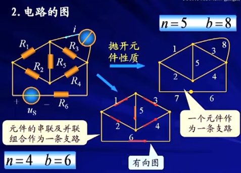

图3.2


图3.3
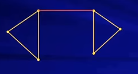

图3.4


图3.5
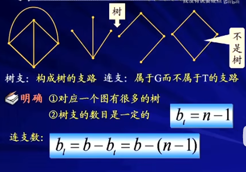

图3.6
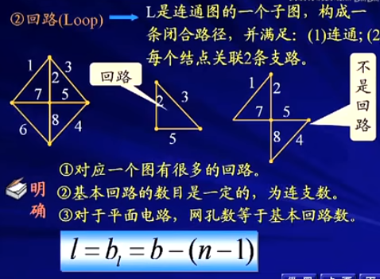

图3.7
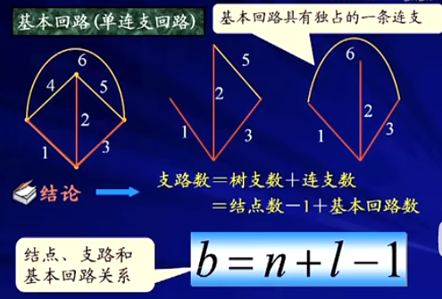

图3.8
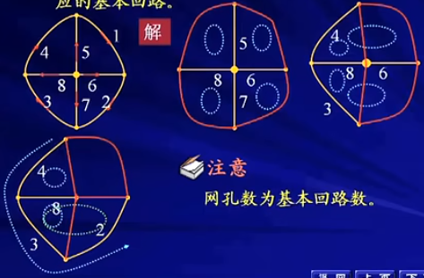

#### ３.2.KCL和KVL的独立方程数
```
1.KCL的独立方程
见[图3.9]

2.KVL的独立方程
见[图3.10]

	2.1结论
		* KVL的独立方程数=基本回路-b-(n-1)
		* n个节点，b条支路的电路，独立的KCL和KVL方程数为
			（n-1）+b-(n-1)=b
			
```
图3.9
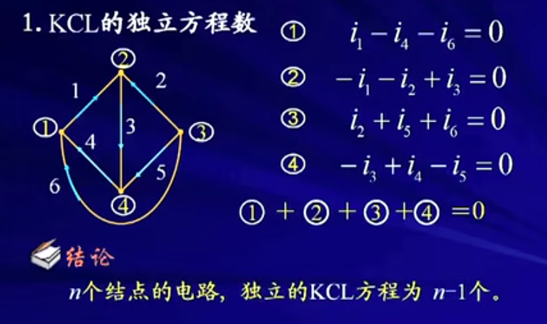

图3.10
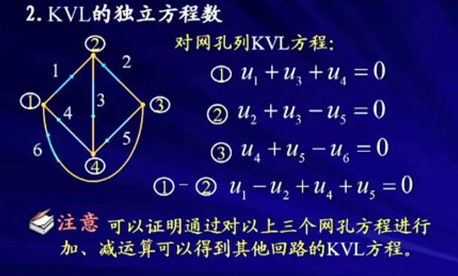

#### 3.3.支路电流法
```
1.支路电流法  ---> 以各支路电流为未知量列写电路方程分析电路的方法。
	对于有n个结点，b条支路的电路，要求解支路电流，未知量共有b个。只要列出b个独立的电路方程，便可以求解这b个未知量。

2.独立方程的列写
	* 从电路的n个结点中任意选择n-1个结点列写KCL方程。
	* 选择基本回路列写b-(n-1)个KVL方程

	例3-1：
	[图3.11]，[图3.12]
	上面回路3可以另外一种方式编写
	
3.小结
	（1）支路电流法的一般步骤
		1）标定各支路电流，电压的参考方向
		2）选定n-1个结点，列写KCL方程
		3）选定b-(n-1)个独立回路，指定回路绕行方向，结合KVL和支路方程列写
			[图3.13]
		4）求解上述方程，得到b个支路电流
		5）进一步计算支路电压和进行其他分析
		
	（2）支路电流法的特点：
		支路电流法列写的是KCL和KVL方程，所以方程列写方便，直观，但方程数较多，宜于在支路数不多的情况使用。
	例3-2：
		[图3.14]，[图3.15]
	
例3-3：
	[图3.16]
	
。。。。。
```

图3.11
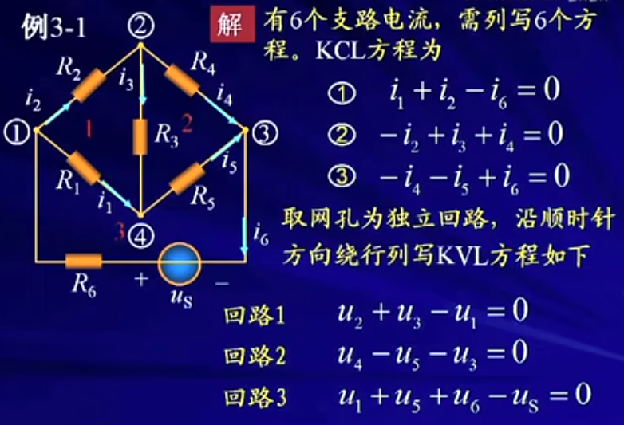

图3.12
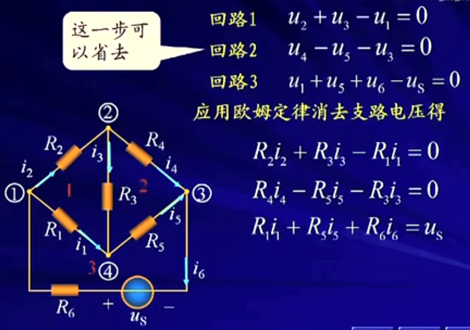

图3.13


图3.14
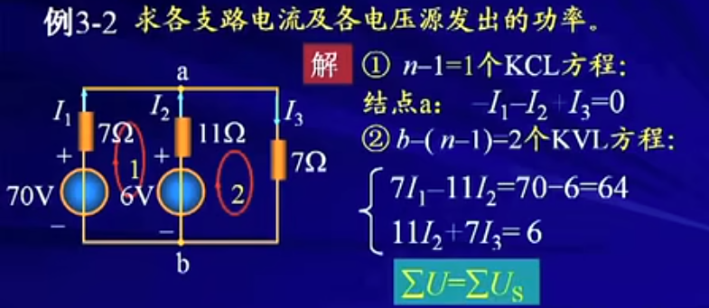

图3.15
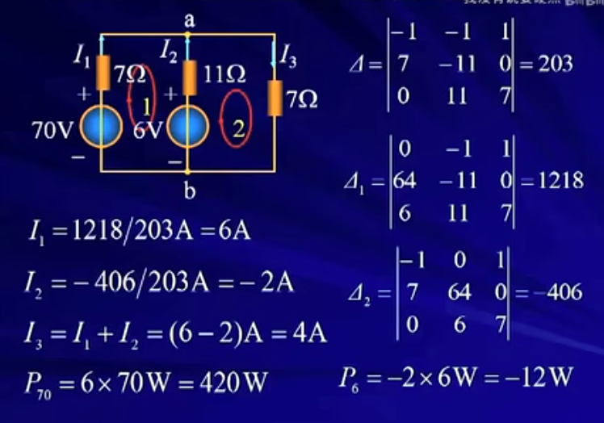

图3.16
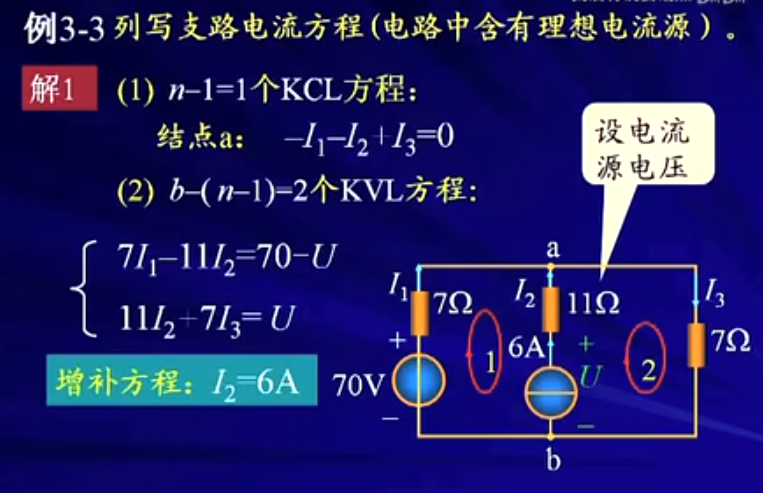

#### 3.4 网孔电流法
```
1.网孔店里流法
	以沿网孔连续流动的假想电流为未知量列写电路方程分析电路的方法称网孔电流法。它仅适用于平面电路
* 基本思想
	为减少未知量（方程）的个数，假想每个网孔中有一个网孔电流。各支路电流可用网孔电流的线性组合表示来求得电路的解
	
例
	见[图3.17],[图3.18],[图3.19],[图3.20],[图3.21]
	

例4-1：
	[图3.22]
	
* 小结
网孔电流法的一般步骤：
1）选网孔为独立回路，并确定其绕行方向
2）以网孔电流为未知量，列写其KVL方程
3）求解上述方程，得到l各网孔电流
4）求各支路电流
5）其他分析
```

图3.17
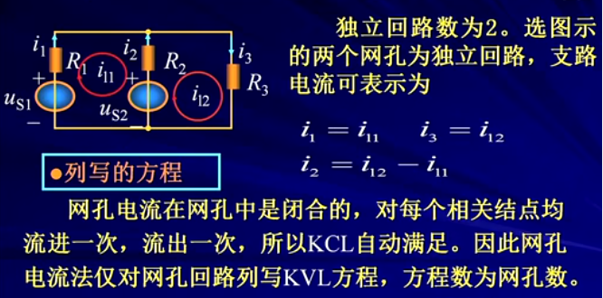

图3.18
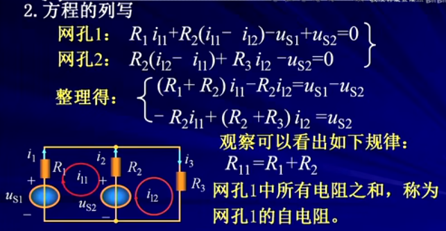

图3.19
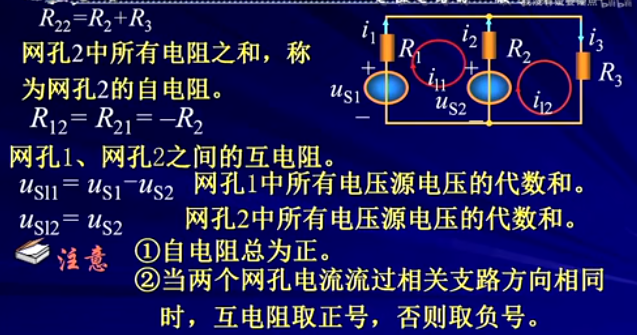

图3.20
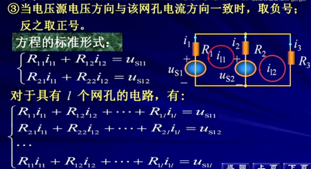

图3.21
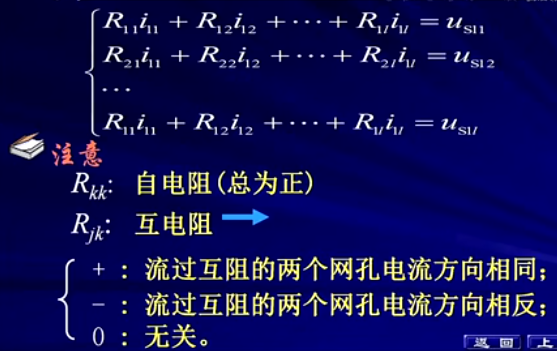

图3.22
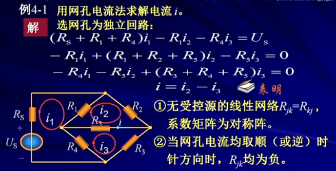

#### 3.5 回路电流法

```
网孔电流法 是 回路电流法的一种特殊形式

1.回路电流法
	以基本回路中沿回路连续流动的假想电流为未知量写电路方程分析电路的方法。它适用于平面和非平面电路。
* 列写的方程
	回路电流法是对独立回路列写KVL方程。方程数为
		b-(n-1)
注意：
	与支路电流法比，方程数减少n-1个。

例5-1：
	用回路电流法求解电流i。
	首先选定树[图3.23]
	求解[图3.24]
	
方程式的标准形式：
	[图3.25]
	
小结：
	1）回路法的一般步骤：
        1.1）选定l=b-（n-1）个独立回路，并确定其绕行方向
        1.2）对l个独立回路，以回路电流为未知量，列写其KVL方程
        1.3）求解上述方程，得到l个回路电流。
        1.4）求各支路电流
        1.5）其他分析
	2）回路法的特点：
		2.1）通过灵活的选取回路可以减少计算量
		2.2）互电阻的识别难度加大，易遗漏互电阻
		
		

2.理想电流源支路的处理
例5-2
	。。。
```
图3.23
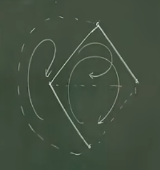

图3.24
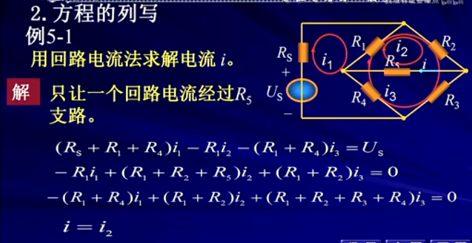

图3.25
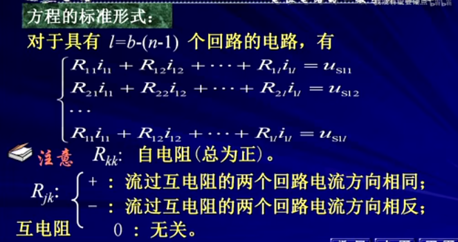

#### 3.6 结点电压法

```


```
