## 第四章 电路定理

4-1 叠加定理
4-2 替代定理
4-3 戴维宁定理和诺顿定理
4-4 最大功率传输定理
4-5 特勒根定理
4-6 互易定理
4-7 对偶原理

#### 4.1 叠加定理

```
1.叠加定理 --->在线性电路中，任一支路的电流（或电压）可以看成是电路中每一个独立电源单独作用于电路时，在该支路产生的电流（或电压）的代数和

2.定理的证明
	见[图4.1]，[图4.2]

结论：
	结点电压和支路电流均为各电压源的电压或电流源的电流的一次函数，均可看成各独立电源单独作用时，产生的响应叠加。

3.几点说明
	1）叠加定理只适用于线性电路。
	2）一个电源作用，其余电源置零：
		电压源置零---用短路替代。
		电流源置零---用开路替代。
		例子：
		见[图4.3]
	3）功率不能叠加（功率为电压和电流的乘机，为电源的二次函数）
	4）u,i叠加时要注意各分量的参考方向
	5）含受控源（线性）电路亦可叠加，但受控源应该始终保留。

4.叠加定理的应用
	例1-1，求电压源的电流及功率
		见[图4.4]，[图4.5]
	例1-2:计算电压u
		。。。。
```
图4.1
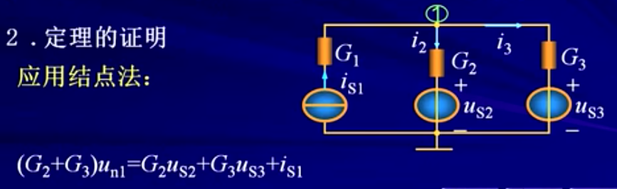

图4.2
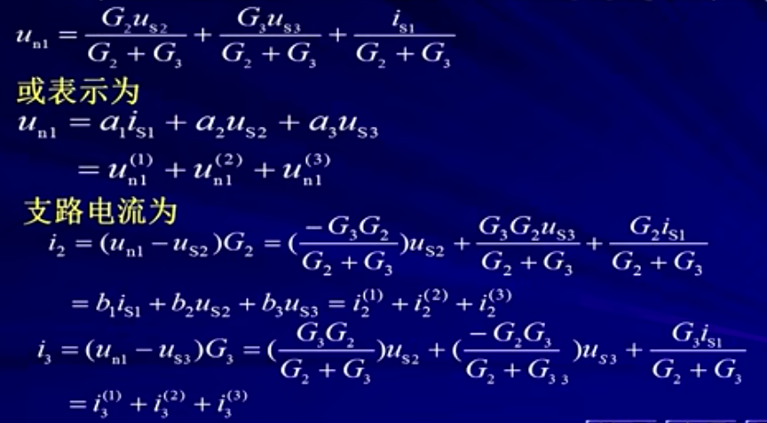

图4.3
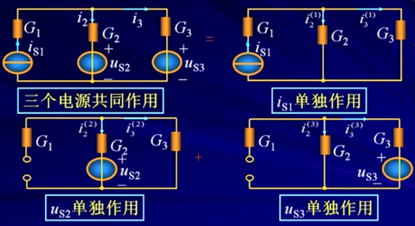

图4.4
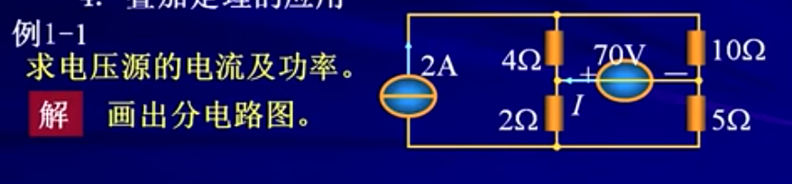

图4.5
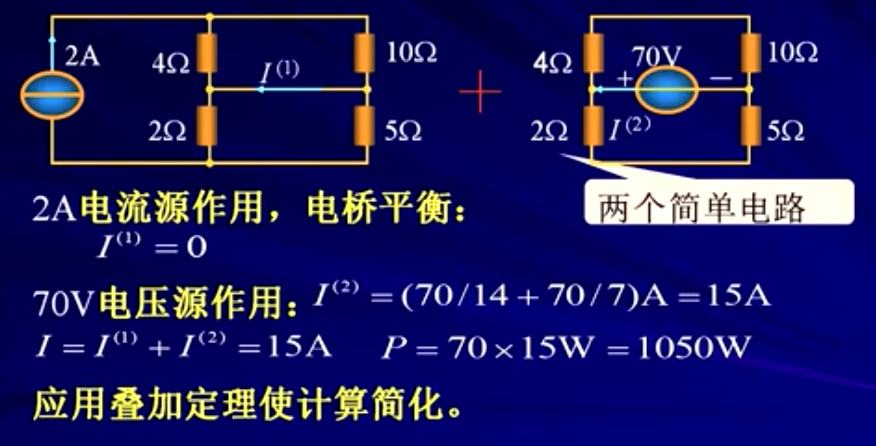

#### 4.2替代定理

```
1.替代定理
	对于给定的任意一个电路，若某一支路电压为uk,电流为ik,那么这条支路就可以用一个电压等于uk的独立电压源，或者用一个电流等于ik的独立电流源，或用R=uk/ik的电阻来替代，替代后电路中全部电压和电流均保持原有值（解答唯一 ）
	见[图4.6]
	
2.定理的证明
	见[图4.7]
例2-1：
	求图示电路的支路电压和电流
	见[图4.8]
原因：
	替代前后KCL,KVL关系相同，其余支路的u,i关系不变。用uk替代后吗，其余支路电压不变(KVL),其余支路电流也不变，故第k条支路ik也不变(KCL).用ik替代后，其余支路电流不变（KCL）,其余支路电压不变，故第k条支路uk也不变（KVL）。
注意：
	1）替代定理既适用于线性电路，也适用于非线性电路。
	2）替代后电路必须有唯一解。
		{ 无电压源回路
		{ 无电流源结点（含广义结点）
		见[图4.9]，[图4.10]
3.替代定理的应用
	见[图4.11]，[图4.12]
```
图4.6
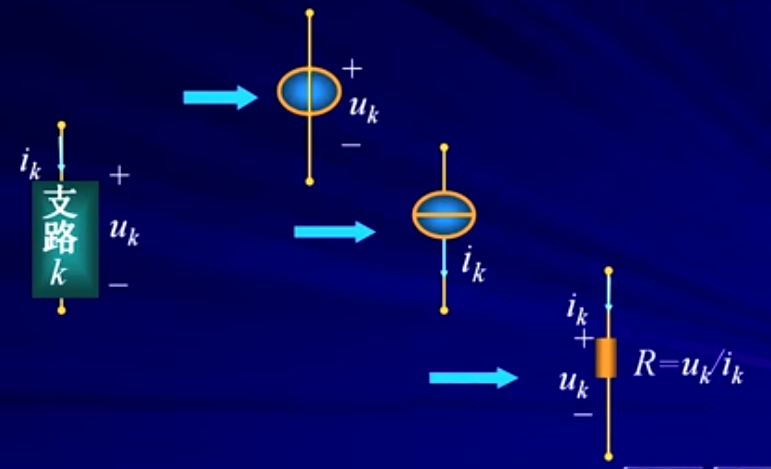

00图4.7
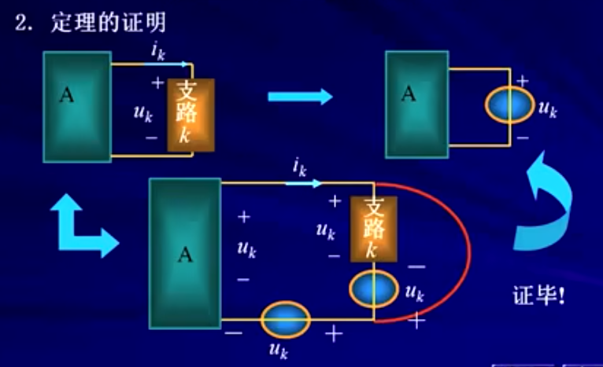

图4.8
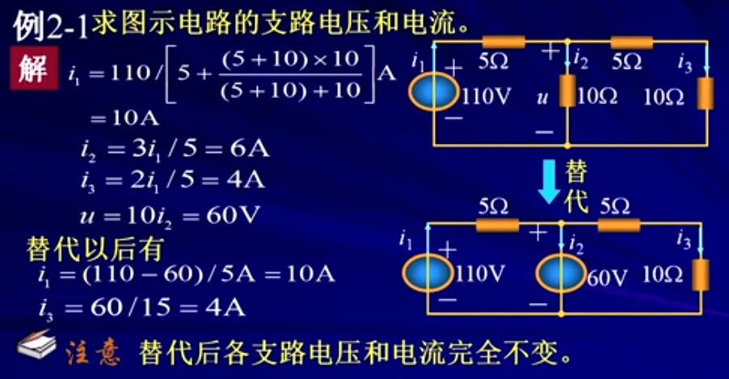

图4.9
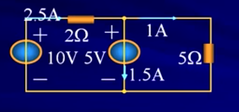

图4.10
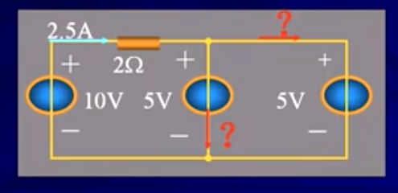

图4.11
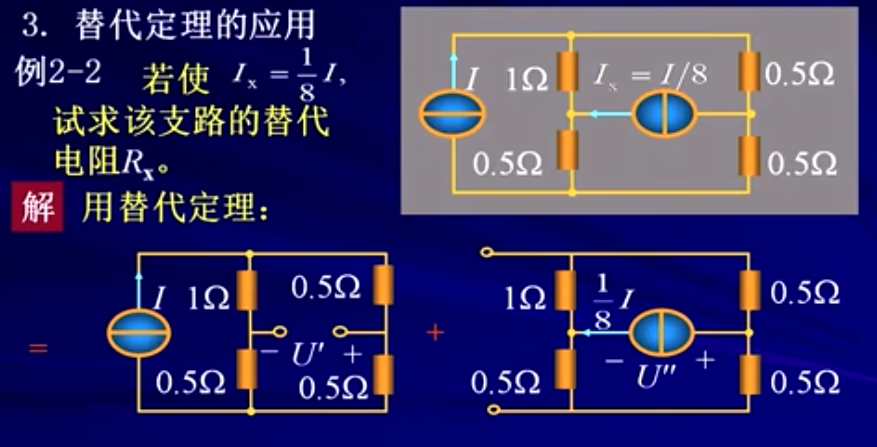

图4.12
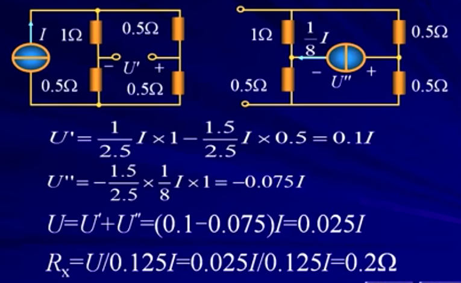

#### 4.3 戴维宁定理和诺顿定理

```
	工程实际中，常常碰到只需研究某一支路的电压，电流或功率问题。对所研究的支路来说，电路的其余部分就成为一个含源二端网络，可等效变换为较简单的含源支路（电压源与电阻串联或电流源与电阻并联支路），使分析和计算简化。戴维宁定理和诺顿定理正是给出了等效含源支路及计算方法。
```

1.戴维宁定理

```
1.戴维宁定理
	任何一个线性含源一端口网络，对外电路来说，总可以用一个电压源和电阻的串联组合来等效置换；此电压源的电压等于外电路断开时端口处的开路电压Uoc,而电阻等于一端口的输入电阻（或等效电阻）Req
	见[图4.13]
	
例(等效变换):
	见[图4.14]
	
戴维宁方式：
	见[图4.15]

2.定理的证明
	见[图4.16]，....不太清楚
	
3.定理的应用
	1）开路电压Uoc的计算
		戴维宁等效电路中电压源电压等于将外电路断开时的开路电压Uoc,电压源方向与所求开路电压方向有关。计算Uoc的方法视电路形式选择前面学过的任意方法，使易于计算。
	2）等效电阻的计算
		等效电阻为将一端口网络内部独立电源全部置零（电压源短路，电流源开路）后，所得不含独立源一端口网络的输入电阻，常用下列方法计算：
		1> 当网络内部不含有受控源时可采用电阻窜并联和△-Y互换的方法计算等效电阻
		2>外加电源法(加电压求电流或加电流求电压)
		3>开路电压，短路电流法
		见[图4.17]

注意：
	1）外电路可用是任意的线性或非线性电路，外电路发生改变时，含源一端口网络的等效电路不变（伏安特性等效）
	2）当一端口内部含有受控源时，控制电路与受控源必须包含在被简化的同一部分电路中。
	例：计算Rx分别为1.2欧，5.2欧时的电流I。
	解：断开Rx支路，将剩余一端口网络化为戴维宁等效电路。
		见[图4.18]，[图4.19]
		
例子：
	。。。。。。
```
图4.13
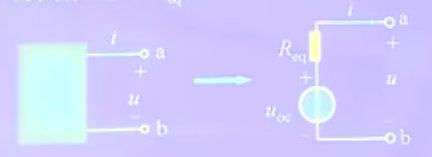

图4.14


图4.15
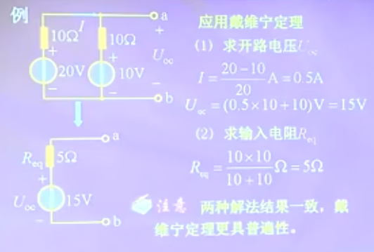

图4.16
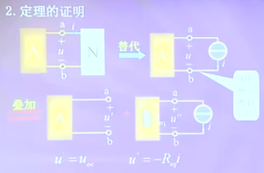

图4.17
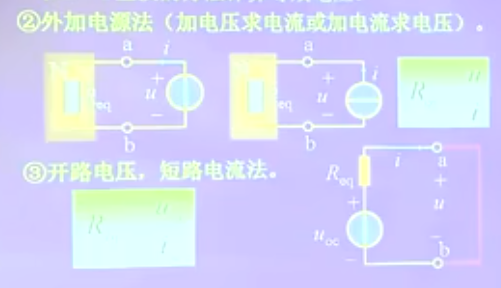

图4.18
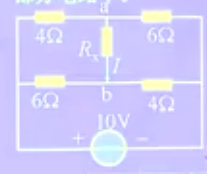

图4.19
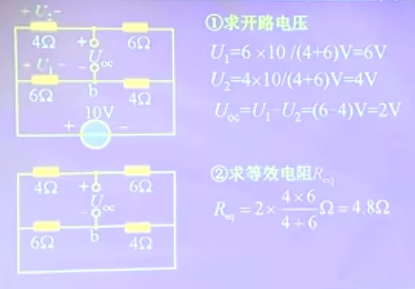

2.诺顿定理

```

```