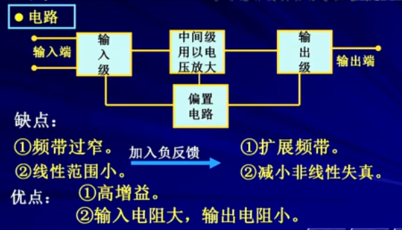
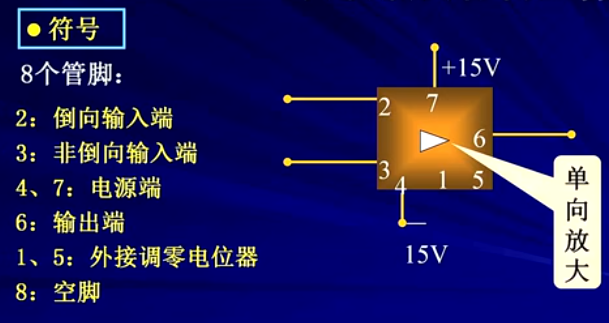
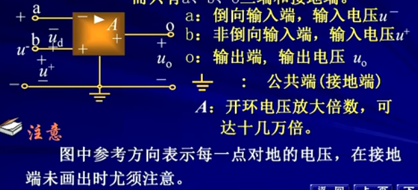
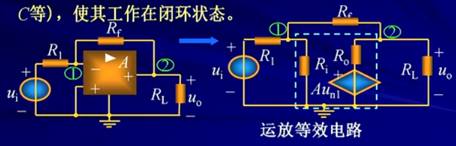
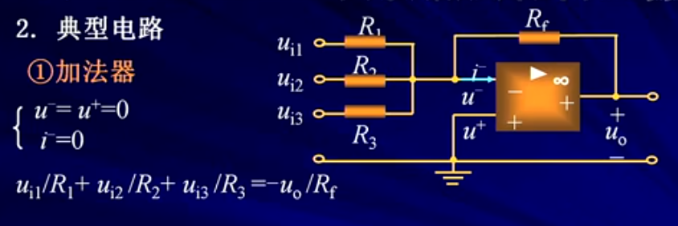

#### [第五章 含有运算放大器的电阻电路](chapter5.md)

5-1 运算放大器的电路模型 
5-2 比例电路的分析
5-3 含有理想运算放大器的电路分析

#### 5-1 运算放大器的电路模型 
```

	1.简介
* 运算放大器
	是一种有着十分广泛用途的电子器件。最早开始适用于1940年。1960年后，随着集成电路的发展，运算放大器逐步集成化，大大降低了成本，获得了越来越广泛的应用
	
* 电路(优缺点)
	见[图5.1]
	偏置电路（通常是直流，让器件能正常工作）
	
* 符号
	见[图5.2]

* 电路符号
	在电路符号图中一般不画出直流电源端，而只有a,b,o三端和接地端
	见[图5.3]

2.运算放大器的静特性

3.电路模型

4.理想运算放大器
```
图5.1


图5.2


图5.3


#### 5-2 比例电路的分析
```
1.倒向比例器
	运放开环工作极不稳定，一般外部接若干元件（R,C等），使其工作在闭环状态。
	见[图5.4]

2.电路分析

。。。。。。

```
图5.4


#### 5-3 含有理想运算放大器的电路分析
```
1.分析方法
	1）根据理想运放的特性，抓住以下两条规则：
		a)倒向端和非倒向端的输入电流均为零
		【虚断路】
		b）对于公共端（地），倒向输入端的电压与非倒向输入端的电压相等
		【虚断路】
	2）合理地运用这两条规则，并与结点电压法相结合
2.典型电路
	1）加法器
	见[图5.5]
	
	2）非倒向比例器
	
	3）电压跟随器
	
	4）减法运算
	见[图5.6]
	
例子：
	。。。。
```
图5.5


