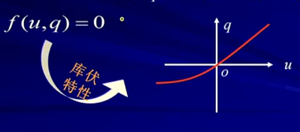
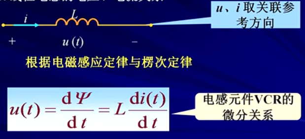

#### ## 第六章 储能元件

6-1 电容元件
6-2 电感元件
6-3 电容，电感元件的串联与并联

#### 6-1 电容元件
```
电容器
	在外电源作用下，正，负 电极上分别带上等量异号电荷，撤除电源，电极上的电荷仍可长久地聚集下去，是一种存储电能的元件。
	见[图6.1]
注意：
	电导体由绝缘材料分开就可以产生电容。
	
1.定义
	电容元件--->储存电能的两端元件。任何时刻其存储的电荷q与其两端的电压u能用q-u平面上的一条曲线来描述。
	见[图6.2]

2.线性时不变电容元件
	任何时刻，电容元件极板上的电荷q与电压u成正比。q-u特性曲线是过原点的直线。
	见[图6.3]
	*电路符号
	见[图6.4]
	*单位
	见[图6.5]

3.电容的电压-电流关系
	见[图6.6]，[图6.6_1]
表明：
	3.1）某一时刻电容电流i的大小取决于电容电压u的变化率，而与该时刻电压u的大小无关。电容是动态元件。
	3.2）当u为常数（直流）时，i=0.电容相当于开路，电容有隔断直流作用。
	3.3）实际电路中通过电容的电流i为有限值，则电容电压u必定是时间的连续函数。
	
4.电容的功率和储能
	* 功率
	见[图6.7]
	表明：
		电容能在一段时间内吸收外部供给的能量转化为电场能量存储起来，在另一段时间内又把能量释放回电路，因此电容元件是储能元件，它本身不消耗能量
	
	* 储能
	
	表明：
		4.1）电容的储能只与当时的电压值有关，电容电压不能跃变，反映了储能不能跃变。
		4.2）电容储存的能量一定大于或等于零。

例子：
	？？？
```
图6.1


图6.2


图6.3


图6.4


图6.5


图6.6


图6.6_1


图6.7


#### 6-2 电感元件
```
电感线圈
	把金属导线绕在一骨架上可构成一实际电感线圈。当电流通过线圈时，将产生磁通，是一种抵抗电流变化，存储磁能的元件
	
1.定义
	电感元件--->储存磁能的两端元件。任何时刻，其特性可用 “韦”-i 平面上的一条曲线来描述。
	见[图6.10]

2.线性时不变电感元件
	任何时刻，通过电感元件的电流i与其磁链“韦”成正比。“韦”-i特性为过原点的直线
	见[图6.11]
	*电路符号
	见[图6.12]
	*单位
	见[图6.13]

3.线性电感的电压，电流关系
	见[图6.14]
	表明：
	3.1）电感电压u的大小取决于i的变化率，与i的大小无关，电感是动态元件。
	3.2）当i为常数（直流）时，u=0。电感相当于短路。
	3.3）实际电路中电感的电压u为有限值，则电感电流i不能越变，必定是时间的连续函数。
	
4.电感的功率和储能
	* 功率
	见[图6.15]
	
	* 电感的储能
	电感能在一段时间内吸收外部供给的能量并转化为磁场能量储存起来，在另一段时间内又把能量释放回电路，因此电感元件是无源元件，储能元件，它本身不消耗能量
	表明：
	4.1）电感的储能只与当时的电流值有关，电感电流不能跃变，反映了储能不能跃变
	4.2）电感储存的能量一定大于或等于零
	
	* 实际电感线圈的模型
	
```
图6.10


图6.11


图6.12


图6.13


图6.14


图6.15


#### 6-3 电容，电感元件的串联与并联
```
1.电容的串联
	* 等效电容
	见[图6.20]，[图6.20_2]
	* 串联电容的分压

2.电容的并联
	* 等效电容
	见[图6.21]
	* 并联电容的分流

3.电感的串联
	* 等效电感
	见[图6.22]
	* 串联电感的分压

4.电感的并联
	* 等效电感
	见[图6.23]
	* 并联电感的分流
```
图6.20


图6.20_2


图6.21


图6.22


图6.23
