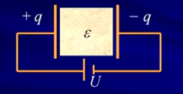
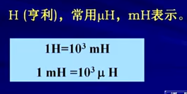

#### ## 第六章 储能元件

6-1 电容元件
6-2 电感元件
6-3 电容，电感元件的串联与并联

#### 6-1 电容元件
```
电容器
	在外电源作用下，正，负 电极上分别带上等量异号电荷，撤除电源，电极上的电荷仍可长久地聚集下去，是一种存储电能的元件。
	见[图6.1]
注意：
	电导体由绝缘材料分开就可以产生电容。
	
1.定义
	电容元件--->储存电能的两端元件。任何时刻其存储的电荷q与其两端的电压u能用q-u平面上的一条曲线来描述。
	见[图6.2]

2.线性时不变电容元件
	任何时刻，电容元件极板上的电荷q与电压u成正比。q-u特性曲线是过原点的直线。
	见[图6.3]
	*电路符号
	见[图6.4]
	*单位
	见[图6.5]

3.电容的电压-电流关系
	
4.电容的功率和储能
	
```
图6.1


图6.2


图6.3


图6.4


图6.5


#### 6-2 电感元件
```
电感线圈
	把金属导线绕在一骨架上可构成一实际电感线圈。当电流通过线圈时，将产生磁通，是一种抵抗电流变化，存储磁能的元件
	
1.定义
	电感元件--->储存磁能的两端元件。任何时刻，其特性可用 “韦”-i 平面上的一条曲线来描述。
	见[图6.10]

2.线性时不变电感元件
	任何时刻，通过电感元件的电流i与其磁链“韦”成正比。“韦”-i特性为过原点的直线
	见[图6.11]
	*电路符号
	见[图6.12]
	*单位
	见[图6.13]

3.线性电感的电压，电流关系
	见[图6.14]

4.电感的功率和储能

```
图6.10


图6.11


图6.12


图6.13


图6.14


#### 6-3 电容，电感元件的串联与并联
```
1.电容的串联
	见[图6.20]，[图6.20_2]

2.电容的并联
	见[图6.21]

3.电感的串联
	见[图6.22]

4.电感的并联
	见[图6.23]
```
图6.20


图6.20_2


图6.21


图6.22


图6.23
