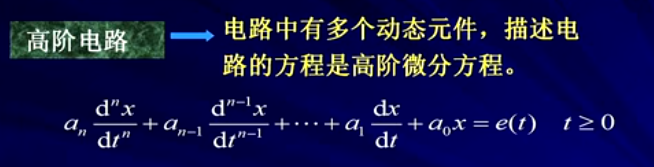

#### 第七章 一阶电路和二阶电路的时域分析

7-1 动态电路的方程及其初始条件
7-2 一阶电路的零输入响应
7-3 一阶电路的零状态响应
7-4 一阶电路的全响应
7-5	二阶电路的零输入响应
7-6 二阶电路的零状态响应和全响应
7-7 一阶电路和二阶电路的阶越响应
7-8 一阶电路和二阶电路的冲激响应
7-9 卷积积分
7-10 状态方程
7-11 动态电路时域分析中的几个问题

#### 7-1 动态电路的方程及其初始条件

```
1.动态电路 --->
	含有动态元件电容和电感的电路称为动态电路
	
	* 特点：
		当动态电路状态发生改变时（环路），需要经历一个变化过程才能达到新的稳定状态。这个变化过程称为电路的过渡过程
		
	* 电阻电路：
	见[图7.1]
	电阻电路过渡期为零，没有过渡过程。
	
	* 电容电路：
	见[图7.2]
	S未动作前，电路处于稳定状态：i=0,Uc=0
	S接通电源后很长时间，电容充电完毕，电路达到新的稳定状态：i=0,Uc=Us
	电容电路有一个过渡期。
	
	* 电感电路：
	见[图7.3]
	S未动作前，电路处于稳定状态：i=0,UL=0
	S接通电源后很长时间，电路达到新的稳定状态，电感视为：UL=0,i=Us/R
	见[图7.4]
	S未动作前，电路处于稳定状态：UL=0，i=Us/R
	S断开瞬间 i=0 ,UL=无穷
	
	*注意：
	工程实际中在切断电容或电感电路时会出现过电压和过电流现象

	* 换路 ---> 
		电路结构，状态发生变化
			1）支路接入或断开
			2）电路参数变化
	* 过渡过程产生的原因 --->
		电路内部含有储能元件L,C，电路在换路时能量发生变化，而能量的储存和释放都需要一定的时间来完成
		见[图7.5]
```
图7.1


图7.2


图7.3


图7.4


图7.5


2.动态电路的方程
```
2.动态电路的方程
	* RC电路
	见[图7.6]
	
	* RL电路
	见[图7.7]
	
	结论：
		含有一个动态元件电容或电感的线性电路，其电路方程为一阶线性常微分方程，称为一阶电路。
	
	* RCL电路
	见[图7.8]
	
	结论：
		1）描述动态电路的电路方程为微分方程
		2) 动态电路方程的阶数通常等于电路种动态元件的个数(有时候未必，可以电路等效进行降阶)
		见[图7.9]，[图7.10]
	
	* 动态电路分析方法
		1)根据KVL,KCL和VRC建立微分方程。
		2)求解微分方程。
		见[图7.11]
		备注：
		本书用到的分析方法是图中“时域分析法"里面的"经典法"。
		常见的是用”数值法“解"状态变量法"(用matlab）
	
	* 稳态分析和动态分析的区别(特解，通解)
		见[图7.12]
```
图7.6


图7.7


图7.8


图7.9


图7.10


图7.11


图7.12


3.电路的初始条件
```
3.电路的初始条件
	3.1）t=o+与t=0-的概念(认为换路在t=0时刻进行
		见[图7.13]
	例1-1：
		图示为电容放电电路，电容原先带有电压U0，求开闭合后电容电压随时间的变化。
		见[图7.14]

	3.2）电容的初始条件
		见[图7.14]，[图7.15]，[图7.16]
		
	3.3）电感的初始条件
		见[图7.17]，[图7.18]
	
	3.4）换路定律
		见[图7.19]
		
	3.5）电路初始值的确定
		例子：
		见[图7.20],[图7.21]
		
	小结：
		求初始值的步骤：
		1）由换路前电路（稳定状态）求Uc（0-）和iL(0-)
		2）由换路定律得Uc(0+)和iL(0+).
		3）画0+等效电路。
			* 换电路后的电路
			* 电容（电感）用电压源（电流源）替代。
				（取0+时刻值，方向与原假定的电容电压，电感电流方向相同）
		4）由0+电路求所需各变量的0+值。
	
	例子：
		见[图7.22],[图7.23]
```
图7.13


图7.14


图7.15


图7.16


图7.17


图7.18


图7.19


图7.20


图7.21


图7.22


图7.23


#### 7-2 一阶电路的零输入响应

```

```

#### 7-3 一阶电路的零状态响应

```

```

#### 7-4 一阶电路的全响应

```

```