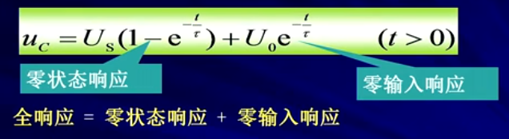

#### 第七章 一阶电路和二阶电路的时域分析

7-1 动态电路的方程及其初始条件
7-2 一阶电路的零输入响应
7-3 一阶电路的零状态响应
7-4 一阶电路的全响应
7-5 二阶电路的零输入响应
7-6 二阶电路的零状态响应和全响应
7-7 一阶电路和二阶电路的阶越响应
7-8 一阶电路和二阶电路的冲激响应
7-9 卷积积分
7-10 状态方程
7-11 动态电路时域分析中的几个问题

#### 7-1 动态电路的方程及其初始条件

```
1.动态电路 --->
	含有动态元件电容和电感的电路称为动态电路
	
	* 特点：
		当动态电路状态发生改变时（环路），需要经历一个变化过程才能达到新的稳定状态。这个变化过程称为电路的过渡过程
		
	* 电阻电路：
	见[图7.1]
	电阻电路过渡期为零，没有过渡过程。
	
	* 电容电路：
	见[图7.2]
	S未动作前，电路处于稳定状态：i=0,Uc=0
	S接通电源后很长时间，电容充电完毕，电路达到新的稳定状态：i=0,Uc=Us
	电容电路有一个过渡期。
	
	* 电感电路：
	见[图7.3]
	S未动作前，电路处于稳定状态：i=0,UL=0
	S接通电源后很长时间，电路达到新的稳定状态，电感视为：UL=0,i=Us/R
	见[图7.4]
	S未动作前，电路处于稳定状态：UL=0，i=Us/R
	S断开瞬间 i=0 ,UL=无穷
	
	*注意：
	工程实际中在切断电容或电感电路时会出现过电压和过电流现象

	* 换路 ---> 
		电路结构，状态发生变化
			1）支路接入或断开
			2）电路参数变化
	* 过渡过程产生的原因 --->
		电路内部含有储能元件L,C，电路在换路时能量发生变化，而能量的储存和释放都需要一定的时间来完成
		见[图7.5]
```
图7.1


图7.2


图7.3


图7.4


图7.5


2.动态电路的方程
```
2.动态电路的方程
	* RC电路
	见[图7.6]
	
	* RL电路
	见[图7.7]
	
	结论：
		含有一个动态元件电容或电感的线性电路，其电路方程为一阶线性常微分方程，称为一阶电路。
	
	* RCL电路
	见[图7.8]
	
	结论：
		1）描述动态电路的电路方程为微分方程
		2) 动态电路方程的阶数通常等于电路种动态元件的个数(有时候未必，可以电路等效进行降阶)
		见[图7.9]，[图7.10]
	
	* 动态电路分析方法
		1)根据KVL,KCL和VRC建立微分方程。
		2)求解微分方程。
		见[图7.11]
		备注：
		本书用到的分析方法是图中“时域分析法"里面的"经典法"。
		常见的是用”数值法“解"状态变量法"(用matlab）
	
	* 稳态分析和动态分析的区别(特解，通解)
		见[图7.12]
```
图7.6


图7.7


图7.8


图7.9


图7.10


图7.11


图7.12


3.电路的初始条件
```
3.电路的初始条件
	3.1）t=o+与t=0-的概念(认为换路在t=0时刻进行
		见[图7.13]
	例1-1：
		图示为电容放电电路，电容原先带有电压U0，求开闭合后电容电压随时间的变化。
		见[图7.14]

	3.2）电容的初始条件
		见[图7.14]，[图7.15]，[图7.16]
		
	3.3）电感的初始条件
		见[图7.17]，[图7.18]
	
	3.4）换路定律
		见[图7.19]
		
	3.5）电路初始值的确定
		例子：
		见[图7.20],[图7.21]
		
	小结：
		求初始值的步骤：
		1）由换路前电路（稳定状态）求Uc（0-）和iL(0-)
		2）由换路定律得Uc(0+)和iL(0+).
		3）画0+等效电路。
			* 换电路后的电路
			* 电容（电感）用电压源（电流源）替代。
				（取0+时刻值，方向与原假定的电容电压，电感电流方向相同）
		4）由0+电路求所需各变量的0+值。
	
	例子：
		见[图7.22],[图7.23]
```
图7.13


图7.14


图7.15


图7.16


图7.17


图7.18


图7.19


图7.20


图7.21


图7.22


图7.23


#### 7-2 一阶电路的零输入响应

```
零输入响应--->换路后外加激励为零，仅有动态元件初始储能产生的电压和电流
```
1.RC电路的零输入响应

```

1.RC电路的零输入响应
	见[图7.24]，[图7.25]，[图7.26]

表明：
	1）电压，电流是随时间按同一指数规律衰减的函数。
	2）响应与初始状态成线性关系，其衰减快慢与RC有关。
		见[图7.27]，[图7.28]，[图7.29]
注意：
	1）t：电容电压衰减到原来电压36.8%所需的时间。工程上认为，经过3t-5t,过渡过程结束
	2）时间常数t的几何意义：
		见[图7.30]
	3）能量关系
		电容不断释放能量被电阻吸收，直到全部消耗完毕。
		见[图7.31]
例2-1：
	图示电路中的电容原充有24V电压，求S闭合后，电容电压和各支路电流随时间变化的规律。
	见[图7.31]，[图7.32]

例2-2：
	求：1)图示电路S闭合后各元件电压和电流随时间变化的规律；2）电容的初始储能和最终时刻的储能及电阻的耗能。
	解，这是一个求一阶RC零输入响应问题，有
	C = C1*C2 / C1+c2 = 4uF , u(0+)=u(0-)=-20V
	见[图7.33],[图7.34]
	储能[图7.35]
```

图7.24


图7.25


图7.26


图7.27


图7.28


图7.29


图7.30


图7.31


图7.32


图7.33


图7.34


图7.35


2.RL电路的零输入响应

```
2.RL电路的零输入响应
	见[图7.36],[图7.37]
	
表明：
	1）电压，电流是随时间按同一指数规律衰减的函数
	2）响应与初始状态成线性关系，其衰减快慢与L/R有关
		见[图7.38]
	3）能量关系
		电感不断释放能量被电阻吸收， 直到全部消耗完毕。
		见[图7.39]
小结：
	1）一阶电路的零输入响应是由储能元件的初始值引起响应，都是由初始值衰减为零的指数衰减函数。
		见[图7.40]
	2）衰减快慢取决于时间常数t。
		RC电路：t = R*C
		RL电路：t = L/R
		R为与动态元件相连的一端口电路的等效电阻。
	3) 同一电路中所有响应具有相同的时间函数。
		
```
图7.36


图7.37


图7.38


图7.39


图7.40


#### 7-3 一阶电路的零状态响应

零状态响应--->动态元件初始能量为零，由t>0时刻电路中外加激励作用所产生的响应

```
1.RC电路的零状态响应
	见[图7.42]
	解答形式：
	Uc = Uc`(特解) + Uc``（通解）
	* 特解，通解：
	见[图7.43]
	* 全解
	见[图7.44]
表明：
	1）电流，电压是随时间按同一指数规律变化的函数：
	电容电压由两部分构成：
	稳态分量（强制分量）+瞬态分量(自由分量)
	2）响应变化的快慢，由时间常数t=RC决定，t大，充电慢，t小，充电快
	3）响应与外加激励成线性关系
	4）能量关系：
		见[图7.45]
	表明，电源提供的能量一半消耗在电阻上，一半转化成电场能量储存在电容中。

例3-1：
		见[图7.46]
```
图7.42


图7.43


图7.44


图7.45


图7.46

2.RL电路的零状态响应

```
2.RL电路的零状态响应
		见[图7.47],[图7.48]
		
例3-2：
	见[图7.49]
	
例3-3：
	见[图7.50]
```

图7.47


图7.48


图7.49


图7.50


#### 7-4 一阶电路的全响应
```
全响应--->电路的初始状态不为零，同时又有外加激励源作用时电路中产生的响应
```

1.RC电路全响应
```
1.RC电路全响应
	见[图7.51],[图7.52]

2.全响应的两种分解方式
	1）着眼于电路的两种工作状态
	全响应 = 强制分量（稳态解）+ 自由分量（瞬态解）
	见[图7.53]
	2）着眼于因果关系
	全响应 = 零状态响应 + 零输入响应
	见[图7.54]
	见[图7.55]

例4-1：
	见[图7.56]，[图7.57]
	
例......

3.三要素法分析一阶电路
	见[图7.58]，[图7.59]
	
例子。。。。。
```
图7.51


图7.52


图7.53


图7.54


图7.55


图7.56


图7.57


图7.58


图7.59


#### 7-5 二阶电路的零输入响应

1.二阶电路的零输入响应

```
1.二阶电路的零输入响应
	见[图7.61]，[图7.62]
	
2.零状态响应的三种情况
	见[图7.66]
```
图7.61


图7.62


#### 7-6 二阶电路的零状态响应和全响应

```

```

#### 7-7 一阶电路和二阶电路的阶越响应

```

```
#### 7-8 一阶电路和二阶电路的冲激响应

```

```
#### 7-9 卷积积分

```

```
#### 7-10 状态方程

```

```
#### 7-11 动态电路时域分析中的几个问题

```

```