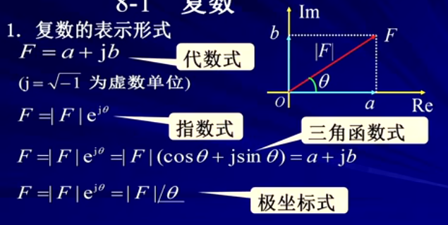
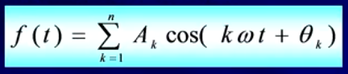

## 第八章  相量法

8-1 复数
8-2 正弦量
8-3 相量法的基础
8-4 电路定律的相量形式

#### 8-1 复数
```
1.复数的表示形式
	1) F = a + jb 							代数形式
	(j=根号-1，为虚数单位)
	2）F = |F|ej0 							指数形式
	3）F = |F|ej0 = （cos0+jsin0）= a + jb	   三角函数
	4）F = |F|ej0 = |F|<0					极坐标形式
	见[图8.1]
	
几种表示法的关系：
	???
	
2.复数运算
	1）加减法运算 （采用代数形式）
	2）乘除运算	 （采用坐标形式）
	3）旋转因子
	特殊旋转因子：
	
例子：
	
```
图8.1


#### 8-2 正弦量
```
1.正弦量
* 瞬时值表达式子
	见[图8.6]

* 周期t和频率f
	周期T：重复一次所需的时间。单位:s秒
	平率ft:每秒重复变化的次数。单位：Hz赫兹

* 正弦电流电路
	激励和响应均为同频率的正玹量的线性电路（正弦稳态电路）称为正弦电路或交流电路

* 研究正弦电路的意义
	1）正弦稳态电路在电力系统和电子技术领域占有十分重要的地位。
	优点：
	1.1)正弦函数是周期函数，其加减，求导，积分运算后仍是同频率的正弦函数
	1.2)正弦信号容易产生，传送和适用
	2）正弦信号是一种基本信号，任何非正弦周期信号可以分解为按正弦规律变化的分量。
	见[图8.7]
	结论：
		对正弦电路的分析研究具有重要的理论价值和实际意义
		
2.正弦量的三要素
	见[图8.8]
	1）幅值（振幅，最大值）Im
		--->反映正弦量变化幅度的大小
	2)角频率w
		--->相位变化的速度，反映正弦量变化快慢
		见[图8.9]
	3)初相位x
		见[图8.10]
		
例子2-1：
	
3.同频率正弦量的相位差


4.相量法的应用

```
图8.7


图8.7
、

图8.8


图8.9


图8.10


#### 8-3 相量法的基础
```

```

#### 8-4 电路定律的相量形式
```

```

