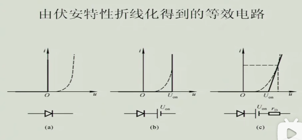
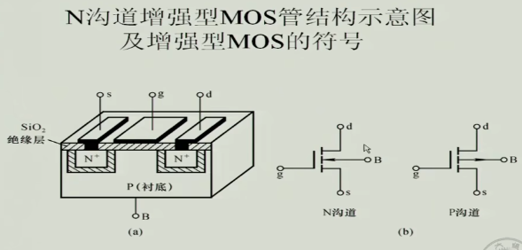
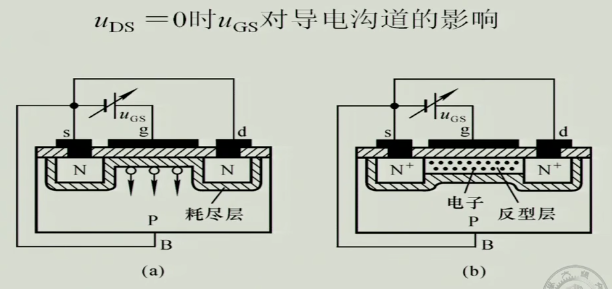
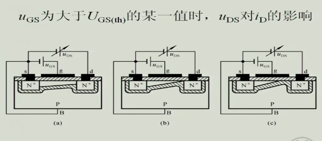
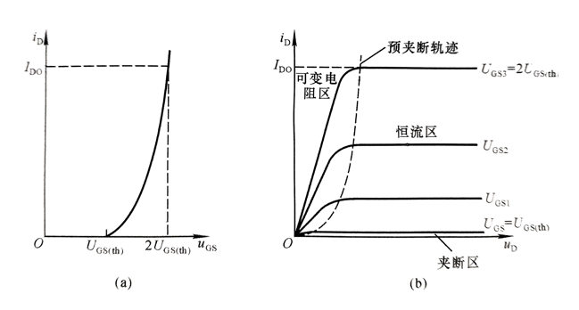

## 第一章 常用半导体器件

1.半导体基础知识
2.半导体二极管
3.晶体三极管
4.场效应管
5.单结晶体管和晶闸管
6.集成电路种的元件

#### 1.半导体基础知识

**1.1。本征半导体**

```
1。本征半导体
* 半导体是什么？
  半导体介于 导体 与 绝缘体之间
  
* 本征半导体是什么？
  是一种纯净的半导体（具有晶体结构的半导体）

* 本征半导体晶体结构
  	见[图1.1]
价电子是导不了电的，怎么导电？

2。载流子
	见[图1.2]
* 本征激发：
这些所有的价电子会永远束缚在共价键中么？
如果不是在绝对零度，粒子会由热运动，就会逃逸共价键束缚，就会产生自由电子，留下空穴，这叫本征激发。
* 自由电子
* 空穴
* 复合
在电场吸引下自由电子会沿着电场依次填补空穴，这样就造成空穴的相对复合运动
本征载流子种包含电子(负电)，与 空穴（正电）

本征激发和复合速度，温度决定了载流子浓度
```
图1.1


图1.2


**1.2 杂质半导体**

```
1.杂质半导体
本征半导体导电能力与什么有关？载流子浓度(与温度有关)
* 杂质半导体
在本征半导体里参入少量的杂质元素
1）N型半导体
	参入磷（5价),本征4个电子构成共价键，还有1个电子非常容易逃脱。
	导致自由电子大大增加，简称“多子“，空穴 称”少子”
	“多子“（温度影响可以忽略不计）
	”少子”（温度影响比较敏感）
	
2）P型半导体
	参入硼（3价），概念与N型相反
```
**1.3 PN结**

```
1.4。PN结形成
	见[图1.3]
	
* 扩散运动
	浓度高向浓度低的方向运动扩散
	
* 空间电荷区
	耗尽层，阻挡层，PN结

* 漂移运动
	不断进行扩散运动存在耗尽时刻，必然会有反向运动。
	自由电子，少子进入空间电荷区后就直接漂移过去。
	在一定条件下“多子”扩散运动，“少子”的漂移运动会达到动态平衡

* 对称结，不对称结
	上面图空间电荷区叫“对称结“（参杂浓度一样）
	”不对称”（参杂浓度不一样），空间电荷区宽窄不一样。浓度高的中间会窄，浓度低的会宽。
	
1.5。单向导电性
	正向电压（导通）
	见[图1.4]
	反向电压(截止)
	见[图1.5]
		反向电压，漂移运动加强（电流特别小)，由“少子“构成。对温度特别敏感
	
	* PN结的电流方程
	???
	
	PN导通电压U/V
	锗：0.1~0.3	硅：0.6~0.8
	
1.6。PN结伏安特性
	电压变化引起电流变化
	见[图1.6]
	* 正向特性
		死区，导通电压
	* 反向特性
		反向击穿
		 	1>雪崩击穿
		 		参杂浓度低(PN结宽)，击穿电压高
			2>齐纳击穿
            	参杂浓度高(PN结窄),击穿电压低
         PN结反向击穿后不一定会坏，是因为反向击穿后，功率过大发热烧毁
    * PN结电容效应
    	当两端电压变化时，中间[空间电荷区]存储的电荷是否变化
    	1>势垒电容（工作在反向）
    		反向电压大，小的时候中间[空间电荷区]电荷变化
    		见[图1.7]
		2>扩散电容（工作在正向，非平衡少子)
			电压能引起两边的电荷变化，它就等效于电容
			见[图1.8]
		
1.7。半导体二极管
	PN封装起来。并两端加上电极就构成了半导体二极管。
	
常见结构：
	1.类单独的PN结封装，属于分立器件
	2.在一个基片上封装多个PN结，属于集成器件
	
	* 二极管伏安特性
		见[图1.9]
	1>温度的影响，正向左移，反向下移
	
	实现：
	稳压：利用二极管反向特性（可调的），也可以用正向特性但不太好
	整流：交流变成直流
	温度传感器：利用二极管反向电压
	
```
图1.3


图1.4


图1.5


图1.6


图1.7


图1.8


图1.9


**二极管的直流等效电路**

```
*二极管主要参数：
1）If:最大整流电流
2）Ur:最高反向工作电压
3）Ir:反向电流（要求反向截止好的，就要Ir值越小）
4）Fm:最高工作频率（高频电容要考虑）

*等效电路：
二极管是一个非线性的电阻，往往我们非线性元件用线性方式表示出来，这种电路叫等效电路，给分析带来极大便利。

3种等效电路，伏安特性折线化：
	[图1.10]


* 微变等效电路分析
？？？

* 稳压二极管
	主要参数
	？？？

```
图1.10


#### 三极管（晶体三极管）
```
* 晶体管结构与符号
	见[图1.11]
	自由电子，空穴都参与导电（多子，少子都参与），相对mos管受温度影响
	
	形成两个PN结，发射结，集电结。
	发射极e：参杂浓度高，发射载流子
	基极b:  参杂浓度低，比较薄，控制
	集电极c：掺杂浓度低，面积大，可以收集载流子
	 
	2）内部载流子的运动
	见[图1.13]
	
* 放大作用(电流放大)
	放大系数（共射）：常数 = ic / ib 
	放大系数（共基）：常数2 = ic / ie
	穿透电流(电流很小): Iceo (c与e之间的)
		当电流ib为0时，正常应该截止，但会有很小的Iceo穿透电流
	反向电流：Icbo（c与b之间的）
	交流放大系数（绝大情况与直流放大系数相同），？？？
	
	所有的放大都有外部条件的，外部必须有电源支持，三极管控制电源功率达到的

  1）基本公射的放大电路(NPN是用的比较多的)
  三极管工作在放大状态的外部条件：发射结正向偏置，集电结反向偏置
  基本共射放大电路：见[图1.12]
  
  例1：
  图1.12中为啥要由一个Rb电阻（限流电阻），视频解释在[21:00]
  电路R取值范围：模电书[27页]
  
  
* 三极管特性曲线(共射极)
	1）输入特性曲线
		见[图1.14]
		取常数Uce
		Ib 电流受 Ube电压控制
	2）输出特性曲线
		见[图1.15]
		取常数电流Ib
		
	区域：
    1>截止区
    	双结反偏，ce段路
    2>放大区
    3>饱和区
    	双结正偏，ce开关闭合
    
    怎么判断三极管工作状态？
    	求Ib量，求Ic max,如果（放大系数*Ib)<Ic max,表示工作状态
    三极管除了放大功能，还能做开关功能.
    	截止区，饱和区来回切换可以做开关电路(高低电平控制）
    三极管控制大功率需要用到继电器
    
* 主要参数：
	1）直流参数
		共射放大系数：贝塔 = Ic / Ib
		共基放大系数：贝塔2 = Ic / Ie
	2）交流参数
		共射放大系数：贝塔 = Ic / Ib
		共基放大系数：贝塔2 = Ic / Ie
	3）极限参数
		设计电路时要考虑的，买管子的重要指标，容量越大越贵
	
* 温度对晶体管的影响
    ？？？
    
```
图1.11


图1.12 


图1.13


图1.14


图1.15


#### 三极管(场效应管，又名mos管)
```
场效应管：
优点：
	场效应管功耗，发热小，是集成电路发展一次飞跃。
	晶体三极管是控制电流，进行放大有功率消耗。
	场效应管温度，稳定性比三极管好很多
原理：
	场效应管是电场效应，几乎没电流没功耗消耗。
	晶体三极管分配电流，有功耗。
	
类型：
	1）结型场效应管
	2）绝缘栅型场效应管(应用广，又名mosfet）
		又名mosfet基础上COMS电路，电脑coms电路就是（耗电小)
	绝缘栅型很多特性都可以替代结型，但结型在结构上更不容易损坏

* 绝缘栅型场效应管
	场效应管只又多子参与导电，受温度影响小
	1）N沟道增强型MOS管
		结构图及符号：
			见[图1.16]
		
		原理图（Uds=0时Ugs对导电沟道的影响)
			见[图1.17]
		Ugs加电压(Ugs（th）开启电压)，产生沟道，ds导通，产生Rds;
		Ugs>Ugs（th）导通，由此产生Ugs控制的可变电阻。
		
		原理图2（Ugs为大于Ugs(th)的某一值时Uds对Id的影响
			见[图1.18]
			
		特性曲线
			见[图1.19]
		
	2）N沟道耗尽型MOS管

* 结型场效应管

	连接方式：
	Ugs反偏，不能工作在Ugs>0
	低频跨导(类贝塔=Ic / Ib)： 贝塔 = Id / Ugs
	
	结构场效应管结构和符号
	见[图1.20]
	1）N沟道结型场效应管结构
	见[图1.21]
	
	2）Uds=0时Ugs对导电沟道的控制作用
	见[图1.22]
	
	
	Ugs加反压，沟道变小(电阻增大)，加到一定程度夹断。 
	
	3）ds加电压，Uds>0且Ugs(off)<Ugs<0
	见[图1.23]
	Uds加电压，上面沟道变窄(双结变厚)，加到一定程度也存在夹断。
	
	* 输出特性曲线
		Ugs=常数，Uds与Id的关系
		见[图1.24]
	
	* 转移特性
		Uds=常数
		见[图1.25]
	4）场效应管特性及符号
		见[图1.26]
		
	5）场效应管参数
	* 直流参数
		开启电压：Ugs(th)
		夹断电压：Ugs(off)
		饱和漏极电流：Idss
		直流输入电阻：Rgs(dc)
	* 交流参数
	* 极限参数
		最大漏极电流:Idm
		击穿电压
		最大耗散功率:Pdm
		选管子时候要考虑的
```
图1.16


图1.17


图1.18


图1.19
