## 第二章 基本放大电路

2.1.放大的概念和放大电路的主要性能指标
2.2.基本共射放大电路的工作原理
2.3.放大电路的分析方法
2.4.放大电路静态工作点的稳定
2.5.晶体管放大电路的三种基本接法
2.6.场效应管放大电路（包含三种接法)
2.7.基本放大电路的派生电路

#### 2.1.放大的概念和放大电路的主要性能指标

```
1.放大构成
	* 放大概念
		特征：功率放大
		本质：能量的控制
	* 必要条件
		有源元件
	* 前提
		不失真
	* 测试信号
		正玹信号的叠加
		
2.放大电路的组成
	目标：
		小功率(几毫伏）->大功率
	条件：
		元件，能量(电源)
	技术线：
		三极管，放大状态
		小信号->Ib（ube)
		合理输出
		
扩音机:
	见[图2.1]
	
3.放大电路的性能指标
	1）放大倍数
		有四个放大参数
	2）输入电阻
	3）输出电阻
	4）通频带
	5）非线性失真系数
	6）最大不失真输出电压
	7）最大输出功率与效率
```

图2.1
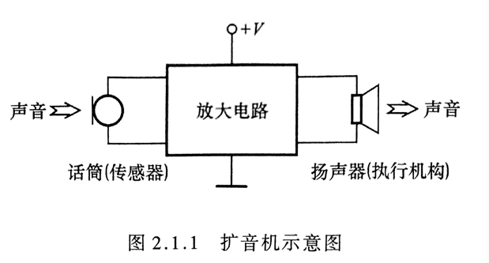

#### 2.2.基本共射放大电路的工作原理

```
1.基本共射放大电路
见[图2.2]

基本共射放大分析
见[图2.3]

2,基极电源与，集电集电源合二为一
* 直接耦合
见[图2.4]

* 阻容耦合
见[图2.5]
```

图2.2
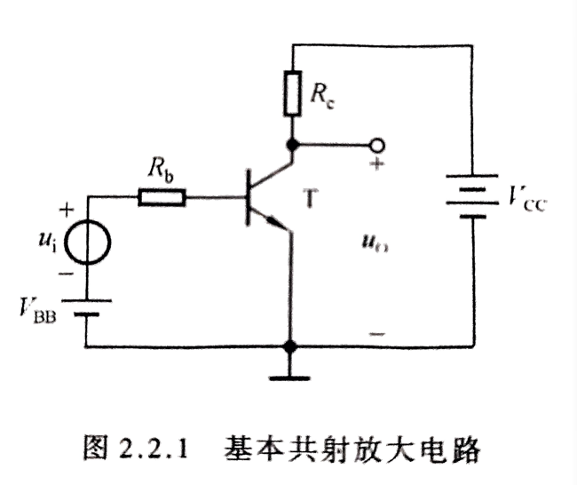

图2.3
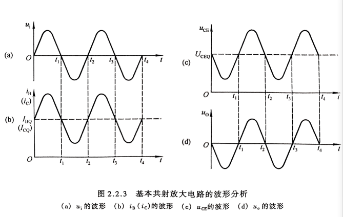

图2.4
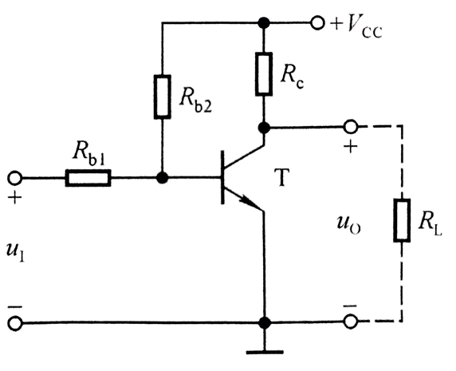

图2.5
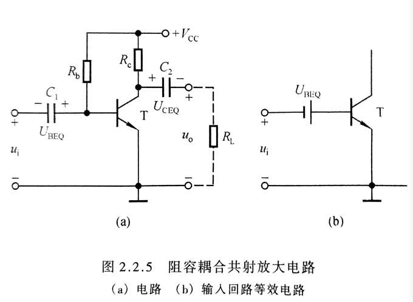

#### 2.3.放大电路的分析方法

**直流通路（ui置0，电容断路，电感短路），**
**交流通路（vbb置0，电容短路，电感断路）**

```
* 基本共射
	见[图2.6]

* 直接耦合
	见[图2.7]

* 阻容耦合
	见[图2.8]
```
图2.6
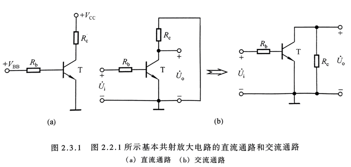

图2.7
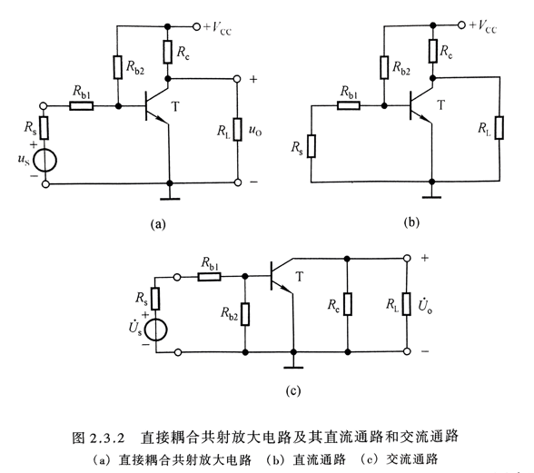

图2.8
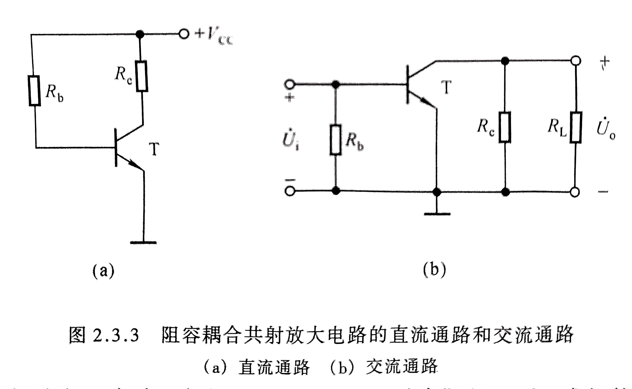

**一。图解法**

```
	见[图2.9]
	见[图2.10]
	见[图2.11]
```
图2.9
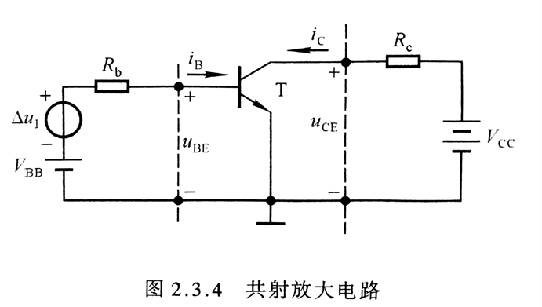

图2.10
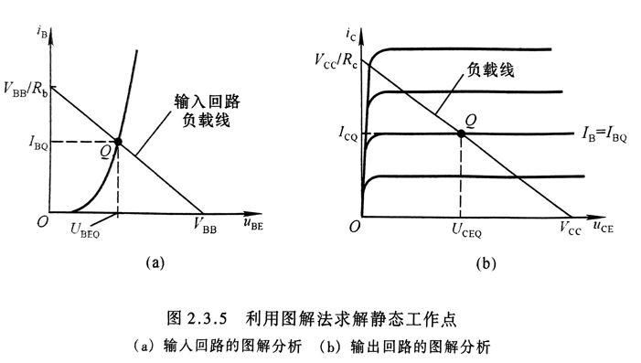

图2.11
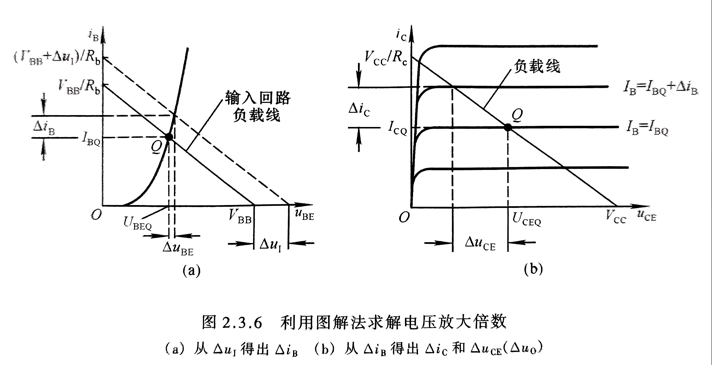

**二。等效电路法**

1.直流模型及静态工作点的估算法

```
三极管线性化，斜率问题？？？，Rbe值。
	微变等效电路，在书22页。

见[图2.12]
```
图2.12
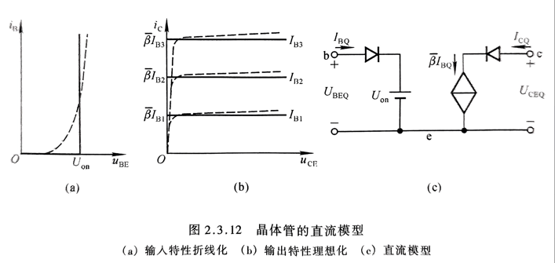

2.共射h参数等效模型

```
见[图2.13]
见[图2.14]

全微分方程？？？
```
图2.13
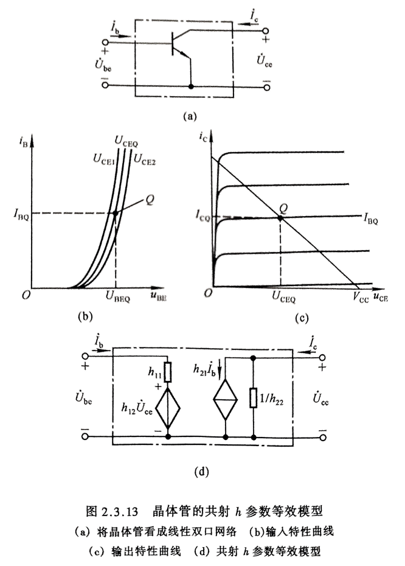

图2.14
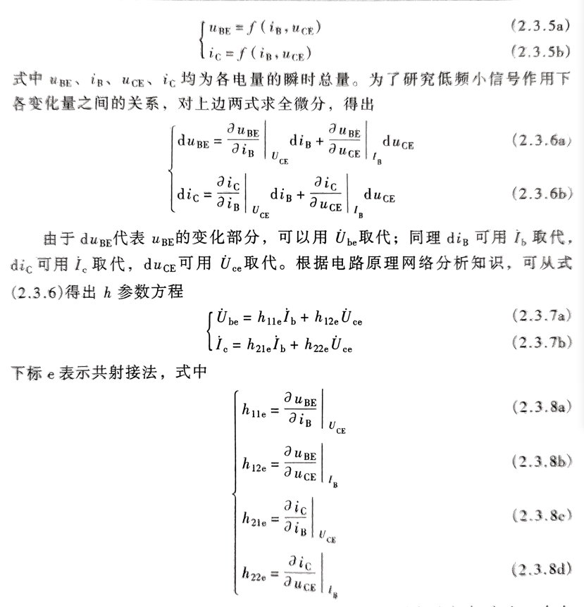

3.共射放大电路动态参数的分析

```
1.直流通路(静态分析)
	工作在放大状态下
	找到静态工作点，推出Rbe

2.交流通路
	h参数等效
	输入电阻，输出电阻？？？
	找到工作区域（是放大还是饱和状态）
```

#### 2.4 放大电路静态工作点的稳定

```
由于温度容易会影响Q点变化，所以在电路设计中增加“负反馈电路”，减小误差

1.静态工作稳定电路（直接耦合，阻容耦合）
	见[图2.15]

2.静态工作点的估算

3.动态参数的估算

```
图2.15
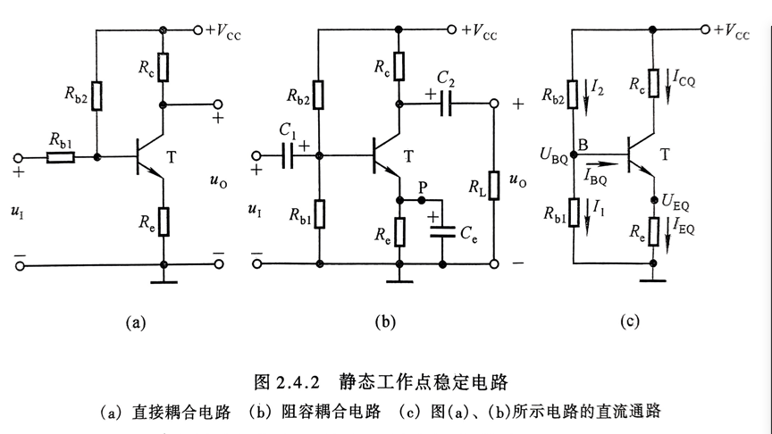

#### 2.5 晶体管放大电路的三种基本接法

```
1.基本共集放大电路
	见[图2.16]
2.基本共基放大电路
	见[图2.17]
3.基本共射放大电路
前面一直讲的都是“基本共射放大电路”

三种接法比较：
？？？？
```
图2.16
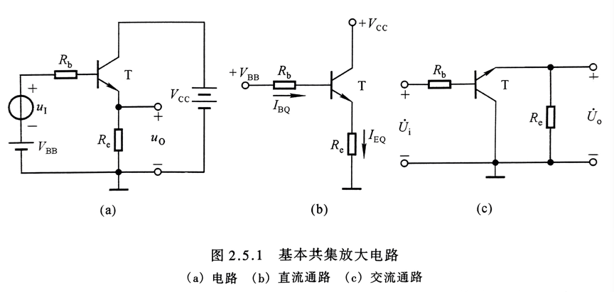

图2.17
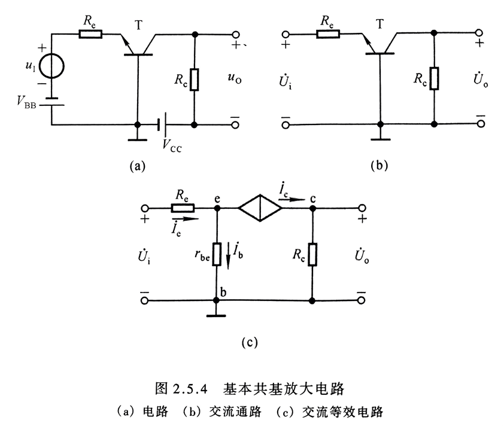

#### 2.6 场效应管放大电路（包含三种接法)

```
场效应管放大电路三种接法
	见[图2.18]
	
三极管有Rbe,场效应管是断路的，比三极管分析简单
```
图2.18
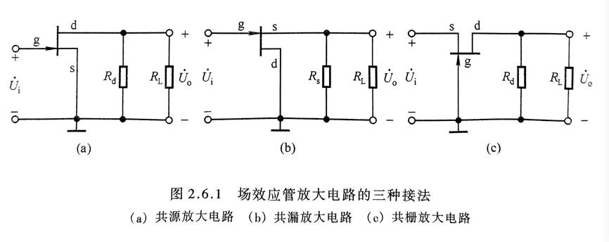
#### 2.7 基本放大电路的派生电路

```
* 复合管放大器
	见[图2.19]
	
复合管接法：
1）复合管共射放大电路

2）复合管共源放大电路

3）共射-共基放大电路

4）共集-共基放大电路
```
图2.19
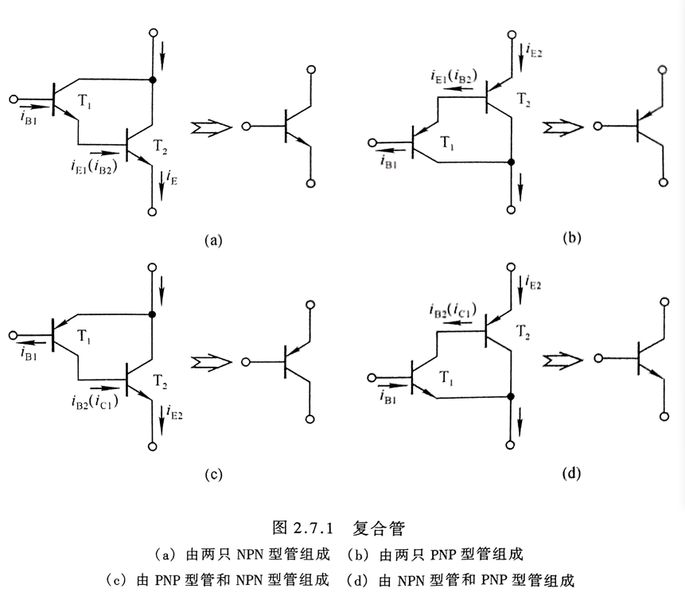