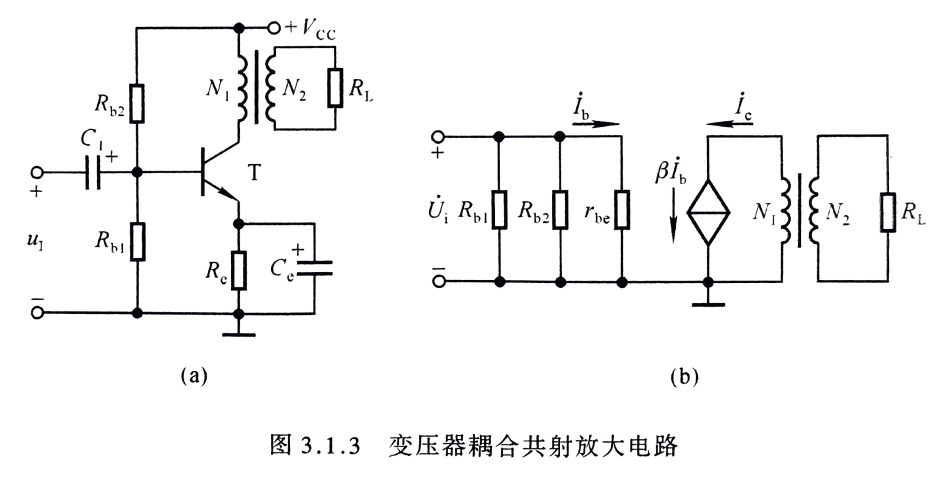

## 第三章 多级放大电路

3.1 多级放大电路的耦合方式
3.2 多级放大电路的动态分析
3.3 直接耦合放大电路

#### 3.1 多级放大电路的耦合方式
```
1.直接耦合
	见[图3.1]
	优点：
	缺点：
	
2.阻容耦合
	见[图3.2]
	优点：
	缺点：

3.变压器耦合
	见[图3.3]

4.光电耦合
	见[图3.4]
```
图3.1


图3.2


图3.3


图3.4


#### 3.2 多级放大电路的动态分析
```
1.多级放大电路分析
	见[图3.5]

```
图3.5


#### 3.3 直接耦合放大电路
```
1.直接耦合电路的零点漂移现象
		见[图3.8]
    * 零点漂移现象及其产生原因

    * 抑制温度方法

    1.1）差分电路组成
        见[图3.9]

    * 共模信号
      如果有干扰信号产生，Ui1与Ui2大小相等，方向相同，产生抑制  

    * 差模信号
      大小相等，极性相反的信号为差模信号。
      如果是正常信号进来，信号放大，Re电阻可以等效掉。
      如果是干扰信号进来，ie方向相同产生2倍ie，信号减小

2.差分放大电路,与四种接法
	2.1）长尾式差分放大电路
		见[图3.10]
	2.2) 差分放大电路四种接法
	* 双端输入，单端输出电路
		见[图3.11]
	* 单端输入，双端输出电路
		见[图3.12]
	* 单端输入，单端输出电路
		见[图3.13]
	* 改进型差分放大电路
		见[图3.14]
```

图3.8


图3.9


图3.10


图3.11


图3.12


图3.13


图3.14


3.直接耦合互补输出级

```
备注：关联功率放大电路，第九章，1，2两节
工作状态(举例)：
	1.甲类（不失真）2.乙类（信号腰斩）3.甲乙类(游走在甲乙间)4.丙类（小于乙类）
	
基于乙类改进：
	对称失真，改进电路
	
1）基本电路
	见[图3.15]
2）消除交越失真的互补输出级
	见[图3.16]
3）采用复合管的准互补输出级
	见[图3.17]
```
图3.15


图3.16


图3.17

4.直接耦合多级放大电路

```
	差分放大电路(一般作为多级放大电路的【输入端】)：在实际中很难找到特性一抹一样的管子，很难用分立器件来实现，但通常用在集成芯片里面
    ↓
    共射放大电路（一般作为【中间】） 
    ↓
    直接耦合互补输出级（功率输出【末尾】）  

* 直接耦合多级放大电路
	见[图3.18]，[图3.19]
```

图3.18


图3.19
