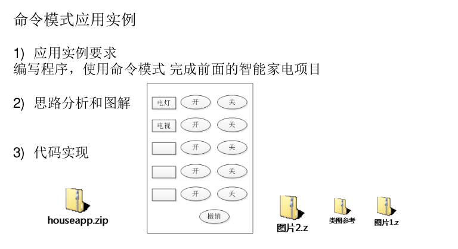
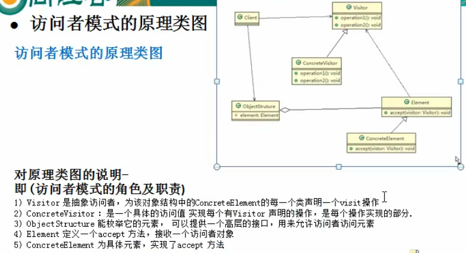
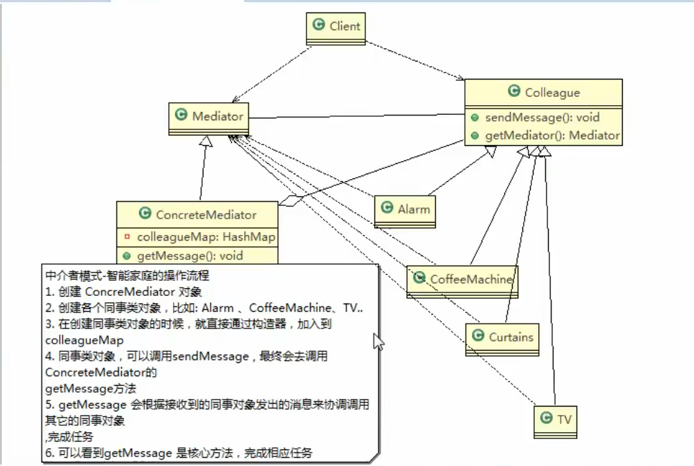
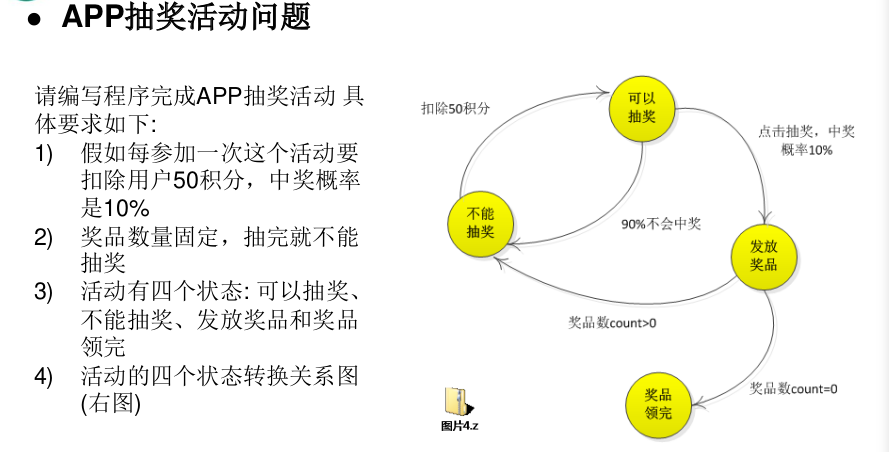

# 行为型模式

**1.模板模式**

基本介绍

```
1) 模板方法模式(Template Method Pattern),又叫模板模式(Template Pattern),z
在一个抽象类公开定义了执行它的方法的模板。它的子类可以按需要重写方法
实现,但调用将以抽象类中定义的方式进行。
2) 简单说,模板方法模式 定义一个操作中的算法的骨架,而将一些步骤延迟到子
类中,使得子类可以不改变一个算法的结构,就可以重定义该算法的某些特定
步骤
3) 这种类型的设计模式属于行为型模式。


```

对原理类图的说明-即(模板方法模式的角色及职责)

```
1) AbstractClass 抽象类, 类中实现了模板方法(template),定义了算法的骨
架,具体子类需要去实现 其它的抽象方法operationr2,3,4
2) ConcreteClass 实现抽象方法operationr2,3,4, 以完成算法中特点子类的步
骤
```

模板方法模式的**钩子**

```
1) 在模板方法模式的父类中,我们可以定义一个方法,它默认不做任何事,子类可以
视情况要不要覆盖它,该方法称为“钩子”。
2) 还是用上面做豆浆的例子来讲解,比如,我们还希望制作纯豆浆,不添加任何的配
料,请使用钩子方法对前面的模板方法进行改造
```

场景：遥控器，将命令请求者，命令执行者揭耦。模版方法一定有撤回方法。

项目源码：spring框架，JdbcTemplate

实例:com.liyuan3210.design23.acts.template2

**2.命令模式**

基本介绍

```
1) 命令模式(Command Pattern):在软件设计中,我们经常需要向某些对象发送请求,但是并不知道请求的接收者是谁,也不知道被请求的操作是哪个,我们只需在程序运行时指定具体的请求接收者即可,此时,可以使用命令模式来进行设计
2) 命名模式使得请求发送者与请求接收者消除彼此之间的耦合,让对象之间的调用关系更加灵活,实现解耦。
3) 在命名模式中,会将一个请求封装为一个对象,以便使用不同参数来表示不同的请求(即命名),同时命令模式也支持可撤销的操作。
4) 通俗易懂的理解:将军发布命令,士兵去执行。其中有几个角色:将军(命令发布者)、士兵(命令的具体执行者)、命令(连接将军和士兵)。Invoker是调用者(将军),Receiver是被调用者(士兵),MyCommand是命令,实现了Command接口,持有接收对象
```

对原理类图的说明-即(命名模式的角色及职责)
1)Invoker 是调用者角色
2)Command: 是命令角色,需要执行的所有命令都在这里,可以是接口或抽象类
3)Receiver: 接受者角色,知道如何实施和执行一个请求相关的操作
4)ConcreteCommand: 将一个接受者对象与一个动作绑定,调用接受者相应的操作,实现execute


实例:om.liyuan3210.design23.acts.command2


**3.访问者模式**

场景介绍:

```
1) 将观众分为男人和女人,对歌手进行测评,当看完某个歌手表演后,得到他们对该歌手不同的评价(评价 有不同的种类,比如 成功、失败 等)
```

访问者模式基本介绍

```
1) 访问者模式(Visitor Pattern),封装一些作用于某种数据结构的各元素的操作,它可以在不改变数据结构的前提下定义作用于这些元素的新的操作。
2) 主要将数据结构与数据操作分离,解决 数据结构和操作耦合性问题
3) 访问者模式的基本工作原理是:在被访问的类里面加一个对外提供接待访问者的接口
4) 访问者模式主要应用场景是:需要对一个对象结构中的对象进行很多不同操作
(这些操作彼此没有关联),同时需要避免让这些操作"污染"这些对象的类,可以选用访问者模式解决
```



双分派

应用案例的小结
-上面提到了双分派,所谓双分派是指不管类怎么变化,我们都能找到期望的方法运行。
双分派意味着得到执行的操作取决于请求的种类和两个接收者的类型

- 以上述实例为例,假设我们要添加一个Wait的状态类,考察Man类和Woman类的反
应,由于使用了双分派, 只需增加一个Action子类即可在客户端调用即可,不
需要改动任何其他类的代码 。

实例:


**4.迭代器模式(实现系统Iterator接口)**

基本介绍
1) 迭代器模式(Iterator Pattern)是常用的设计模式,属于行为型模式
2) 如果我们的 **集合元素是用不同的方式实现** 的,有数组,还有java的集合类,
或者还有其他方式,当客户端要 遍历这些集合元素 的时候就要使用多种遍历
方式,而且还会暴露元素的内部结构,可以考虑使用迭代器模式解决。
3) 迭代器模式,提供一种遍历集合元素的统一接口,用一致的方法遍历集合元素,
不需要知道集合对象的底层表示,即:**不暴露其内部的结构**。

实例:com.liyuan3210.design23.acts.iterator2

**5.观察者模式**

天气预报项目需求,具体要求如下:

```
1) 气象站可以将每天测量到的温度,湿度,气压等等以公告的形式发布出去(比如发布到自己的网站或第三方)。
2) 需要设计开放型API,便于其他第三方也能接入气象站获取数据。
3) 提供温度、气压和湿度的接口
4) 测量数据更新时,要能实时的通知给第三方
```

1）传统写法：
    传统写法问题(不能方便添加第三方)

2）要求：
	有第三方要加入时，能方便注册，移除。有数据变更时能及时通知注册的第三方
升级在improve包里面。

3）类图：
	???

**主要有两个接口及实现类:**

气象局有新温度情况,要主动推送第三方.

Subject: 气象局(消息推送模式)

Observer: 第三方网站/用户

观察者模式的好处

```
1) 观察者模式设计后,会以集合的方式来管理用户(Observer),包括注册,移除和通知。
2) 这样,我们增加观察者(这里可以理解成一个新的公告板),就不需要去修改核心类WeatherData不会修改代码,遵守了ocp原则。
```
实例:com.liyuan3210.design23.acts.observer2

**6.中介者模式**

基本介绍

```
1) 中介者模式(Mediator Pattern),用一个中介对象来封装一系列的对象交互。
中介者使各个对象不需要显式地相互引用,从而使其耦合松散,而且可以独立地改变它们之间的交互
2) 中介者模式属于行为型模式,使代码易于维护
3) 比如MVC模式,C(Controller控制器)是M(Model模型)和V(View视图)的中介者,在前后端交互时起到了中间人的作用
```
中介者模式的注意事项和细节

```
1) 多个类相互耦合,会形成网状结构, 使用中介者模式将网状结构分离为星型结构,进行解耦
2) 减少类间依赖,降低了耦合,符合迪米特原则
3) 中介者承担了较多的责任,一旦中介者出现了问题,整个系统就会受到影响
4) 如果设计不当,中介者对象本身变得过于复杂,这点在实际使用时,要特别注意
```



实例:com.liyuan3210.design23.acts.mediator2

**7.备忘录模式**

游戏角色状态恢复问题

```
游戏角色有攻击力和防御力,在大战Boss前保存自身的状态(攻击力和防御力),当大战Boss后攻击力和防御力下降,从备忘录对象恢复到大战前的状态
```

基本介绍

```
1) 备忘录模式(Memento Pattern)在不破坏封装性的前提下,捕获一个对象的内部状态,并在该对象之外保存这个状态。这样以后就可将该对象恢复到原先保存的状态
2) 可以这里理解备忘录模式:现实生活中的备忘录是用来记录某些要去做的事情,或者是记录已经达成的共同意见的事情,以防忘记了。而在软件层面,备忘录模式有着相同的含义,备忘录对象主要用来记录一个对象的某种状态,或者某些数据,当要做回退时,可以从备忘录对象里获取原来的数据进行恢复操作
3) 备忘录模式属于行为型模式
```

备忘录模式的角色及职责

```
1) originator : 对象(需要保存状态的对象)
2) Memento : 备忘录对象,负责保存好记录,即Originator内部状态
3) Caretaker: 守护者对象,负责保存多个备忘录对象, 使用集合管理,提高效率
4) 说明:如果希望保存多个originator对象的不同时间的状态,也可以,只需要要 HashMap <String, 集合>
```

实例:com.liyuan3210.design23.acts.memento2

**8.解释器模式**

通过解释器模式来实现四则运算,如计算a+b-c的值,具体要求
1)先输入表达式的形式,比如 a+b+c-d+e, 要求表达式的字母不能重复
2)在分别输入a ,b, c, d, e 的值

基本介绍

```
1) 在编译原理中,一个算术表达式通过 词法分析器 形成词法单元,而后这些词法
单元再通过 语法分析器 构建语法分析树,最终形成一颗抽象的语法分析树。这
里的词法分析器和语法分析器都可以看做是解释器
2) 解释器模式(Interpreter Pattern):是指给定一个语言(表达式),定义它的文法
的一种表示,并定义一个解释器,使用该解释器来解释语言中的句子(表达式)
3) 应用场景
• 应用可以将一个需要解释执行的语言中的句子表示为一个抽象语法树
• 一些重复出现的问题可以用一种简单的语言来表达
• 一个简单语法需要解释的场景
4) 这样的例子还有,比如编译器、运算表达式计算、正则表达式、机器人等

对原理类图的说明-即(解释器模式的角色及职责)
1) Context: 是环境角色,含有解释器之外的全局信息.
2) AbstractExpression: 抽象表达式, 声明一个抽象的解释操作,这个方法为抽象语法树中所有的节点所共享
3) TerminalExpression: 为终结符表达式, 实现与文法中的终结符相关的解释操作
4) NonTermialExpression: 为非终结符表达式,为文法中的非终结符实现解释操作.
5) 说明: 输入Context he TerminalExpression 信息通过Client 输入即可
```

实例：com.liyuan3210.design23.acts.interpreter2

**9.状态模式**



基本介绍

```
1) 状态模式(State Pattern):它主要用来解决对象在多种状态转换时,需要对外输出不同的行为的问题。状态和行为是一一对应的,状态之间可以相互转换
2) 当一个对象的内在状态改变时,允许改变其行为,这个对象看起来像是改变了其类

对原理类图的说明-即(状态模式的角色及职责)
1)Context 类为环境角色, 用于维护State实例,这个实例定义当前状态
2)State 是抽象状态角色,定义一个接口封装与Context 的一个特点接口相关行为
3)ConcreteState 具体的状态角色,每个子类实现一个与Context 的一个状态相关行为
```

抽奖问题实例：com.liyuan3210.design23.acts.state2

借贷平台问题

```
if(审核){
//审核逻辑
}elseif(发布){
//发布逻辑
}elseif(接单){
//接单逻辑
}
```

```
状态模式的注意事项和细节
1) 代码有很强的可读性。状态模式将每个状态的行为封装到对应的一个类中
2) 方便维护。将容易产生问题的if-else语句删除了,如果把每个状态的行为都放到一个类中,每次调用方法时都要判断当前是什么状态,不但会产出很多if-else语句,而且容易出错
3) 符合“开闭原则”。容易增删状态
4) 会产生很多类。每个状态都要一个对应的类,当状态过多时会产生很多类,加大维护难度
5) 应用场景:当一个事件或者对象有很多种状态,状态之间会相互转换,对不同的状态要求有不同的行为的时候,可以考虑使用状态模式
```

借贷平台实例（com.liyuan3210.design23.acts.state2.money）：

**10.策略模式**

鸭子问题：

```
场景：
1)有各种鸭子(比如 野鸭、北京鸭、水鸭等, 鸭子有各种行为,比如 叫、飞行等)
2)显示鸭子的信息

传统方案：
写个父类duck（相同方法写到父类）,具体鸭子继承duck.如果不同鸭子不需要父类方法，可以重写父类方法

传统的方式实现的问题分析和解决方案：
1) 其它鸭子,都继承了Duck类,所以fly让所有子类都会飞了,这是不正确的
2) 上面说的1 的问题,其实是继承带来的问题:对类的局部改动,尤其超类的局部改
动,会影响其他部分。会有溢出效应
3) 为了改进1问题,我们可以通过覆盖fly 方法来解决 => 覆盖解决
4) 问题又来了,如果我们有一个玩具鸭子ToyDuck, 这样就需要ToyDuck去覆盖Duck
的所有实现的方法 => 解决思路 策略模式 (strategy pattern)
```

基本介绍

```
1) 策略模式(Strategy Pattern)中,定义算法族,分别封装起来,让他们之间可以互相替换,此模式让算法的变化独立于使用算法的客户
2) 这算法体现了几个设计原则,第一、把变化的代码从不变的代码中分离出来;第二、针对接口编程而不是具体类(定义了策略接口);第三、多用组合/聚合,少用继承(客户通过组合方式使用策略)。
```

项目源码：jdk Comparator

实例：com.liyuan3210.design23.acts.strategy2

**11.责任链模式**

OA系统采购审批系统

```
学校OA系统的采购审批项目：需求是
1) 采购员采购教学器材
2) 如果金额 小于等于5000, 由教学主任审批 （0<=x<=5000）
3) 如果金额 小于等于10000, 由院长审批 (5000<x<=10000)
4) 如果金额 小于等于30000, 由副校长审批 (10000<x<=30000)
5) 如果金额 超过30000以上，有校长审批 ( 30000<x)
```

责任链模式介绍

```
1) 职责链模式（Chain of Responsibility Pattern）, 又叫 责任链模式，为请求创建了一个接收者对象的链(简单示意图)。这种模式对请求发送者和接收者进行解耦。
2) 职责链模式通常每个接收者都包含对另一个接收者的引用。如果一个对象不能处理该请求，那么它会把相同的请求传给下一个接收者，依此类推。
```

项目源码：springMVC HandlerExecutionChain

实例：com.liyuan3210.design23.acts.chain2