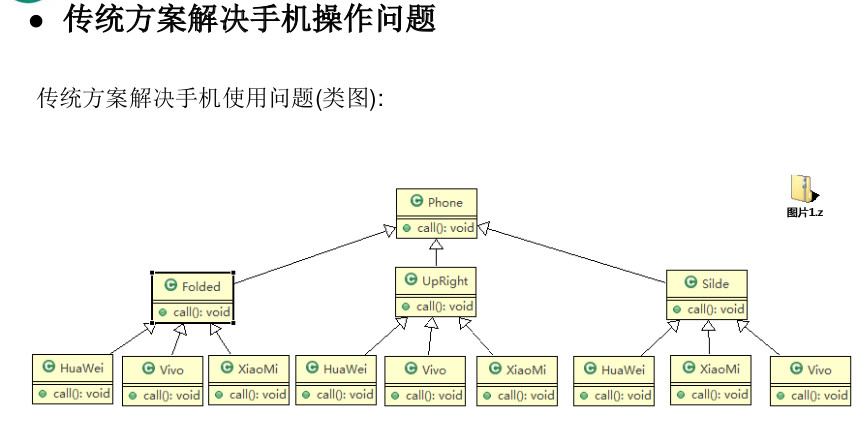
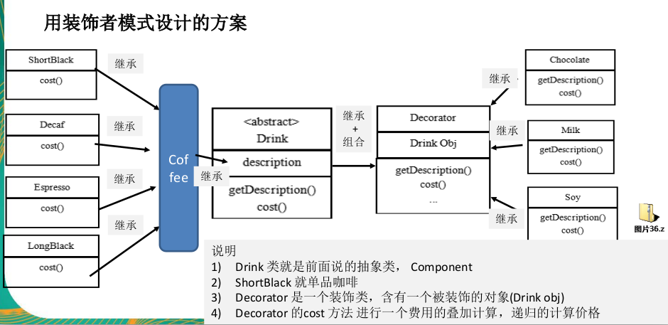
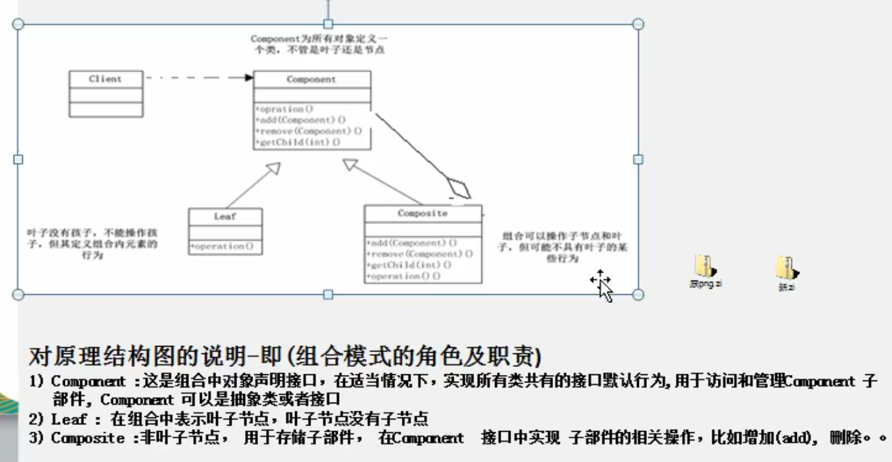
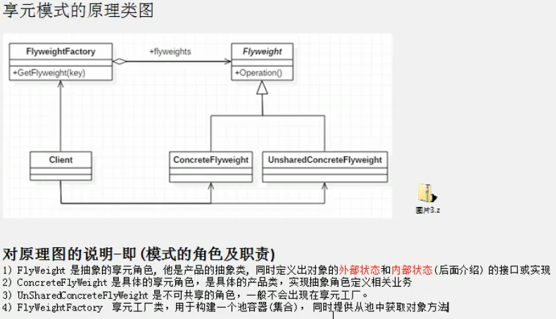

# 结构型模式

**1.代理模式**

静态代理（被代理的类，与代理类都需要实现一个接口）

jdk动态代理（被代理的类需要实现接口，代理类不需要实现接口）

cglib动态代理（被代理类不需要实现任何接口，可以是一个单独的类,但被代理的类不能为final（还有目标对象方法不能为final或static））,动态代理还有aspectj

实例：com.liyuan3210.design23.structure.proxy2


**2.适配器模式**

基本介绍

```
1) 适配器模式(Adapter Pattern)将某个类的接口转换成客户端期望的另一个接口表
示,主的目的是兼容性,让原本因接口不匹配不能一起工作的两个类可以协同
工作。其别名为包装器(Wrapper)
2) 适配器模式属于结构型模式
3) 主要分为三类:类适配器模式、对象适配器模式（在之前类继承改为聚合）、接口适配器模式（适用于不想实现所有方法情况）
```

场景：

​			生活中220V电压，与手机适配器（充电器）关系

项目源码：spring mvc 里面的Dispatcher

实例：com.liyuan3210.design23.structure.adapter2

**3.桥接模式**

手机案例



```
传统方案解决手机操作问题分析:
1) 扩展性问题(类爆炸),如果我们再增加手机的样式(旋转式),就需要增加各个品
牌手机的类,同样如果我们增加一个手机品牌,也要在各个手机样式类下增加。
2) 违反了单一职责原则,当我们增加手机样式时,要同时增加所有品牌的手机,这
样增加了代码维护成本.
3) 解决方案-使用桥接模式
```

基本介绍

```
1) 桥接模式(Bridge模式)是指:将实现与抽象放在两个不同的类层次中,使两个层
次可以独立改变。
2) 是一种结构型设计模式
3) Bridge模式基于类的最小设计原则,通过使用封装、聚合及继承等行为让不同
的类承担不同的职责。它的主要特点是把抽象(Abstraction)与行为实现
(Implementation)分离开来,从而可以保持各部分的独立性以及应对他们的功能
扩展
```

实例：com.liyuan3210.design23.structure.bridge2

**4.装饰者模式**

问题描述：

```
星巴克咖啡订单项目(咖啡馆):
1) 咖啡种类/单品咖啡:Espresso(意大利浓咖啡)、ShortBlack、LongBlack(美式
咖啡)、Decaf(无因咖啡)
2) 调料:Milk、Soy(豆浆)、Chocolate
3) 要求在扩展新的咖啡种类时,具有良好的扩展性、改动方便、维护方便
4) 使用OO的来计算不同种类咖啡的 费用: 客户可以点 单品咖啡 ,也可以单品咖
啡+调料组合。
```

基本介绍：

```
装饰者模式定义
1) 装饰者模式:动态的将新功能附加到对象上。在对象功能扩展方面,它比继承更
有弹性,装饰者模式也体现了开闭原则(ocp)
```



实例：com.liyuan3210.design23.structure.decorator2

**5.组合模式**

打印学校及下面院校信息：

```
--------清华大学-------
---计算机学院----
计算机科学与技术
软件工程
网络工程
---信息工程学院---
通信工程
信息工程
```

传统可以通过继承方式来实现，**但不能很好实现 的管理的 操作**

基本介绍

```
1) 组合模式(Composite Pattern),又叫部分整体模式,它创建了对象组的树形结
构,将对象组合成树状结构以表示“整体-部分”的层次关系。
2) 组合模式依据树形结构来组合对象,用来表示部分以及整体层次。
3) 这种类型的设计模式属于结构型模式。
4) 组合模式使得用户对单个对象和组合对象的访问具有一致性, 即 :组合能让客
户以一致的方式处理个别对象以及组合对象
```



项目源码：HashMap源码

实例：com.liyuan3210.design23.structure.composite2

**6.外观模式**

```
基本介绍
1) 外观模式(Facade),也叫“过程模式:外观模式为子系统中的一组接口提供一个一致的界面,此模式定义了一个高层接口,这个接口使得这一子系统更加容易使用
2) 外观模式通过定义一个一致的接口,用以屏蔽内部子系统的细节,使得调用端只需跟这个接口发生调用,而无需关心这个子系统的内部细节
```

用来解决客户端调用依赖多个复杂类情况,

```
1) 定义一个高层接口,给子系统中的一组接口提供一个 一致的界面(比如在高层接口提供四个方法 ready, play, pause, end ) ,用来访问子系统中的一群接口
2) 也就是说 就是通过定义一个一致的接口(界面类),用以屏蔽内部子系统的细节,
使得调用端只需跟这个接口发生调用,而无需关心这个子系统的内部细节 => 外观
模式
```

项目源码：Mybatis中的Configuration去创建MetaObject对象使用到外观模式

实例:com.liyuan3210.design23.structure.facade2

**7.享元模式**

解决没必要创建许多一样的对象情况,减少内存使用 

```
享元模式基本介绍
基本介绍
1) 享元模式(Flyweight Pattern) 也叫 蝇量模式: 运用共享技术有效地支持大量细粒度的对象
2) 常用于系统底层开发,解决系统的性能问题。像数据库连接池,里面都是创建好的连接对象,在这些连接对象中有我们需要的则直接拿来用,避免重新创建,如果没有我们需要的,则创建一个
3) 享元模式能够解决重复对象的内存浪费的问题,当系统中有大量相似对象,需要缓冲池时。不需总是创建新对象,可以缓冲池里拿。这样可以降低系统内存,同时提高效率
4) 享元模式经典的应用场景就是池技术了,String常量池、数据库连接池、缓冲池等等都是享元模式的应用,享元模式是池技术的重要实现方
```



重点是要抽离出外部状态(可变的)和内部状态(不变的)

```
比如围棋、五子棋、跳棋,它们都有大量的棋子对象,围棋和五子棋只有黑白两色,跳棋颜色多一
点,所以棋子颜色就是棋子的内部状态;而各个棋子之间的差别就是位置的不同,当我们落子后,
落子颜色是定的,但位置是变化的,所以棋子坐标就是棋子的外部状态
1) 享元模式提出了两个要求:细粒度和共享对象。这里就涉及到内部状态和外部状态
了,即将对象的信息分为两个部分:内部状态和外部状态
2) 内部状态指对象共享出来的信息,存储在享元对象内部且不会随环境的改变而改变
3) 外部状态指对象得以依赖的一个标记,是随环境改变而改变的、不可共享的状态。
4) 举个例子:围棋理论上有361个空位可以放棋子,每盘棋都有可能有两三百个棋子对
象产生,因为内存空间有限,一台服务器很难支持更多的玩家玩围棋游戏,如果用
享元模式来处理棋子,那么棋子对象就可以减少到只有两个实例,这样就很好的解
决了对象的开销问题
```

项目源码：Integer源码

实例:com.liyuan3210.design23.structure.flyweight2

