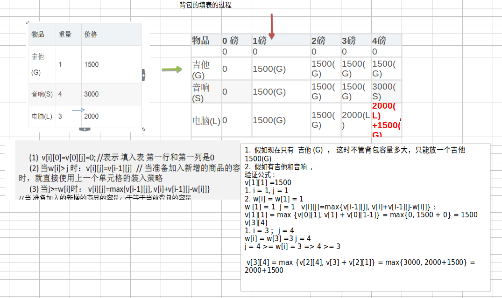
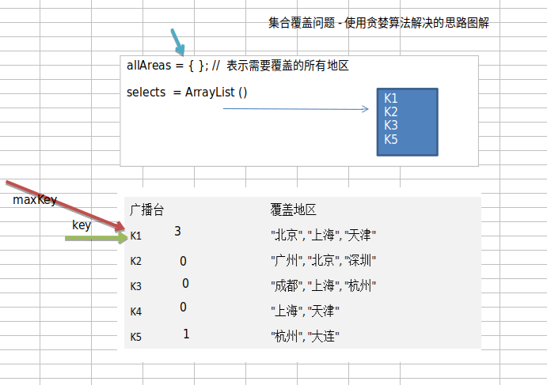
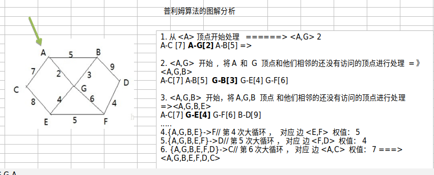
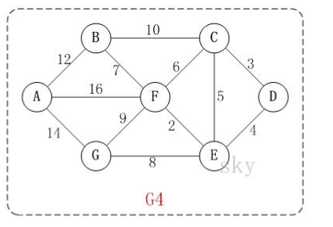
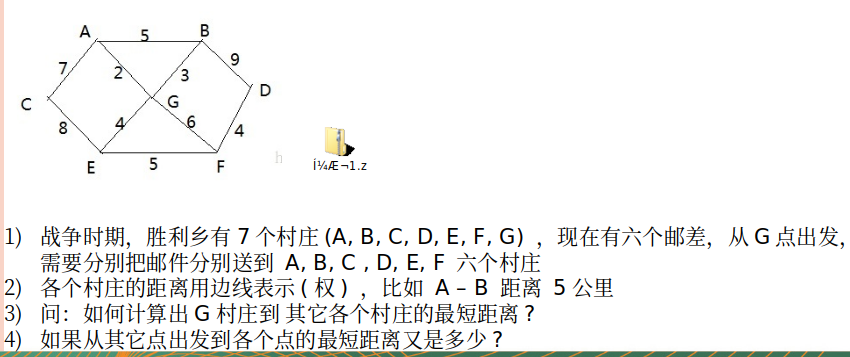
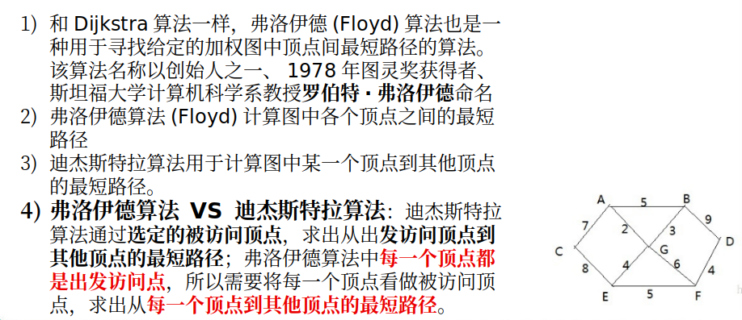

# 算法(十种常见算法)

##### 1.二分查找算法

二分查找算法(**非递归**)介绍

```
1>.前面我们讲过了二分查找算法，是使用递归的方式，下面我们讲解二分查找算法的非递归方式
2>.二分查找法只适用于从有序的数列中进行查找(比如数字和字母等)，将数列排序后再进行查找
3>二分查找法的运行时间为对数时间O(㏒₂n) ，即查找到需要的目标位置最多只需要㏒₂n步，假设从[0,99]的队列(100个数，即n=100)中寻到目标数30，则需要查找步数为㏒₂100 , 即最多需要查找7次( 2^6 < 100 < 2^7)
```

实例（非递归）：com.liyuan3210.dsa.algorithm.binarysearchnorecursion

##### 2.分治算法

问题：汉诺塔算法

分治算法介绍

```
1>.分治法是一种很重要的算法。字面上的解释是“分而治之”，就是把一个复杂的问题分成两个或更多的相同或相似的子问题，再把子问题分成更小的子问题……直到最后子问题可以简单的直接求解，原问题的解即子问题的解的合并。这个技巧是很多高效算法的基础，如排序算法(快速排序，归并排序)，傅立叶变换(快速傅立叶变换)……
2>.分治算法可以求解的一些经典问题
二分搜索
大整数乘法
棋盘覆盖
合并排序
快速排序
线性时间选择
最接近点对问题
循环赛日程表
汉诺塔
```

分治算法的基本步骤

```
分治法在每一层递归上都有三个步骤：
分解：将原问题分解为若干个规模较小，相互独立，与原问题形式相同的子问题
解决：若子问题规模较小而容易被解决则直接解，否则递归地解各个子问题
合并：将各个子问题的解合并为原问题的解
```

实例(汉诺塔)：com.liyuan3210.dsa.algorithm.dac

##### 3.动态规划算法

问题：背包问题

有一个包，容量4磅。有如下物品：

吉他（G）	重量（1磅）	价格（1500）

音响（S）	 重量（4磅）	价格（3000）

电脑（L）	 重量（3磅）	 价格（2000）

```
要求：
1>.达到的目标为装入的背包的总价值最大，并且重量不超出
2>.装入的物品不能重复
```

动态规划算法介绍

```
1>.动态规划(Dynamic Programming)算法的核心思想是：将大问题划分为小问题进行解决，从而一步步获取最优解的处理算法
2>.动态规划算法与分治算法类似，其基本思想也是将待求解问题分解成若干个子问题，先求解子问题，然后从这些子问题的解得到原问题的解。
3>.与分治法不同的是，适合于用动态规划求解的问题，经分解得到子问题往往不是互相独立的。 ( 即下一个子阶段的求解是建立在上一个子阶段的解的基础上，进行进一步的求解 )
4>.动态规划可以通过填表的方式来逐步推进，得到最优解.
```



算法步骤详细见笔记里面pdf

```
???
```

实例（背包问题）：com.liyuan3210.dsa.algorithm.dynamic

##### 4.KMP算法

暴力匹配算法

```
如果用暴力匹配的思路，并假设现在str1匹配到 i 位置，子串str2匹配到 j 位置，则有:
1>.如果当前字符匹配成功（即str1[i] == str2[j]），则i++，j++，继续匹配下一个字符
2>.如果失配（即str1[i]! = str2[j]），令i = i - (j - 1)，j = 0。相当于每次匹配失败时，i 回溯，j 被置为0。
3>.用暴力方法解决的话就会有大量的回溯，每次只移动一位，若是不匹配，移动到下一位接着判断，浪费了大量的时间。(不可行!)
暴力匹配算法实现.
```

KMP算法介绍

```
1>.KMP是一个解决模式串在文本串是否出现过，如果出现过，最早出现的位置的经典算法
2>.Knuth-Morris-Pratt 字符串查找算法，简称为 “KMP算法”，常用于在一个文本串S内查找一个模式串P 的出现位置，这个算法由Donald Knuth、Vaughan Pratt、James H. Morris三人于1977年联合发表，故取这3人的姓氏命名此算法.
3>.KMP方法算法就利用之前判断过信息，通过一个next数组，保存模式串中前后最长公共子序列的长度，每次回溯时，通过next数组找到，前面匹配过的位置，省去了大量的计算时间
4>.参考资料：https://www.cnblogs.com/ZuoAndFutureGirl/p/9028287.html
```

算法核心

```
暴力匹配是依次读取目标字符串位数与源进行匹配，如果读到不匹配的，置零目标字符串指针，再重新匹配。为了提高效率，通过KMP算法可以跳过没必要已经匹配的字符串。
怎么跳过没必要匹配的字符串？？？
需要通过目标字符串得到`部分匹配表`
```

算法步骤详细见笔记里面pdf

```
???
```

实例：com.liyuan3210.dsa.algorithm.kmp

##### 5.贪心算法

集合覆盖问题:

假设存在下面需要付费的广播台，以及广播台信号可以覆盖的地区。 如何选择最少的广播台，让所有的地区都可以接收到信号.

贪心算法介绍:

```
1>.贪婪算法(贪心算法)是指在对问题进行求解时，在每一步选择中都采取最好或者最优(即最有利)的选择，从而希望能够导致结果是最好或者最优的算法
2>.贪婪算法所得到的结果不一定是最优的结果(有时候会是最优解)，但是都是相对近似(接近)最优解的结果
```



算法步骤详细见笔记里面pdf

```
???
```

实例：com.liyuan3210.dsa.algorithm.greedy

##### 6.普利姆算法(prim)

修路问题：

```
1>.有胜利乡有7个村庄(A, B, C, D, E, F, G) ，现在需要修路把7个村庄连通
2>.各个村庄的距离用边线表示(权) ，比如 A – B 距离 5公里
3>.问：如何修路保证各个村庄都能连通，并且总的修建公路总里程最短?
思路: 将10条边，连接即可，但是总的里程数不是最小.
正确的思路，就是尽可能的选择少的路线，并且每条路线最小，保证总里程数最少. 
```

最小生成树问题：

```
修路问题本质就是就是最小生成树问题， 先介绍一下最小生成树(Minimum Cost Spanning Tree)，简称MST。
1>.给定一个带权的无向连通图,如何选取一棵生成树,使树上所有边上权的总和为最小,这叫最小生成树 
2>.N个顶点，一定有N-1条边,包含全部顶点
```

求最小生成树的算法主要是**普里姆算法**和**克鲁斯卡尔算法**



算法步骤详细见笔记里面pdf

```
???
```

实例：com.liyuan3210.dsa.algorithm.prim

##### 7.克鲁斯卡尔算法(kruskal)



公交站问题：

```
1) 某城市新增 7 个站点(A, B, C, D, E, F, G) ,现在需要修路把 7 个站点连通
2) 各个站点的距离用边线表示(权) ,比如 A – B 距离 12 公里
3) 问:如何修路保证各个站点都能连通,并且总的修建公路总里程最短?
```

算法步骤详细见笔记里面pdf

```
???
```

实例：com.liyuan3210.dsa.algorithm.kruskal

##### 8.迪杰斯特拉(Dijkstra)

问题(最短路径)：



迪杰斯特拉算法介绍：

```
迪杰斯特拉(Dijkstra)算法是典型最短路径算法，用于计算一个结点到其他结点的最短路径。 它的主要特点是以起始点为中心向外层层扩展(广度优先搜索思想)，直到扩展到终点为止。
```

算法过程

```
设置出发顶点为v，顶点集合V{v1,v2,vi...}，v到V中各顶点的距离构成距离集合Dis，Dis{d1,d2,di...}，Dis集合记录着v到图中各顶点的距离(到自身可以看作0，v到vi距离对应为di)
1>.从Dis中选择值最小的di并移出Dis集合，同时移出V集合中对应的顶点vi，此时的v到vi即为最短路径

2>.更新Dis集合，更新规则为：比较v到V集合中顶点的距离值，与v通过vi到V集合中顶点的距离值，保留值较小的一个(同时也应该更新顶点的前驱节点为vi，表明是通过vi到达的)
3>.重复执行两步骤，直到最短路径顶点为目标顶点即可结束

三个变量：
// 记录各个顶点是否访问过 1表示访问过,0未访问,会动态更新
public int[] already_arr;
// 每个下标对应的值为前一个顶点下标, 会动态更新
public int[] pre_visited;
// 记录出发顶点到其他所有顶点的距离,比如G为出发顶点，就会记录G到其它顶点的距离，会动态更新，求的最短距离就会存放到dis
public int[] dis;
```

实例：com.liyuan3210.dsa.algorithm.dijkstra

##### 9.弗洛伊德算法(Floyd)

算法介绍



问题：

```
1>.胜利乡有7个村庄(A, B, C, D, E, F, G)
2>.各个村庄的距离用边线表示(权) ，比如 A – B 距离 5公里
问：如何计算出各村庄到 其它各村庄的最短距离? 
```

算法分析：

```
1>.设置顶点vi到顶点vk的最短路径已知为Lik，顶点vk到vj的最短路径已知为Lkj，顶点vi到vj的路径为Lij，则vi到vj的最短路径为：min((Lik+Lkj),Lij)，vk的取值为图中所有顶点，则可获得vi到vj的最短路径
2>.至于vi到vk的最短路径Lik或者vk到vj的最短路径Lkj，是以同样的方式获

主要数据
private char[] vertex; // 存放顶点的数组
private int[][] dis; // 保存，从各个顶点出发到其它顶点的距离，最后的结果，也是保留在该数组
private int[][] pre;// 保存到达目标顶点的前驱顶点
```

实例：com.liyuan3210.dsa.algorithm.floyd

##### 10.xxxxxx
