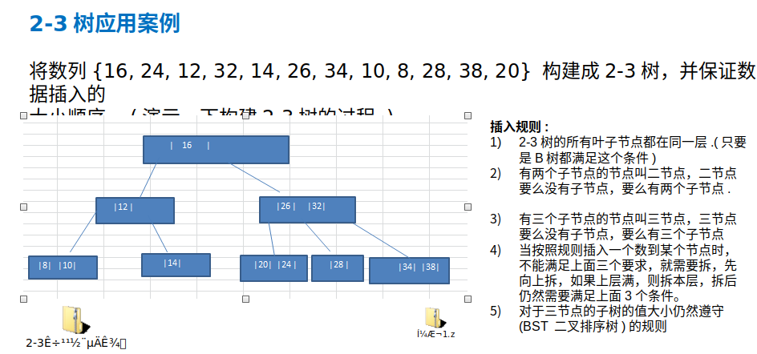
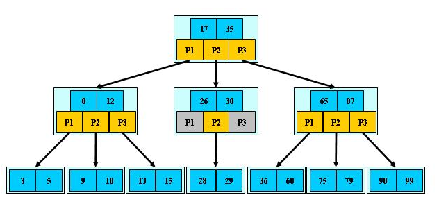
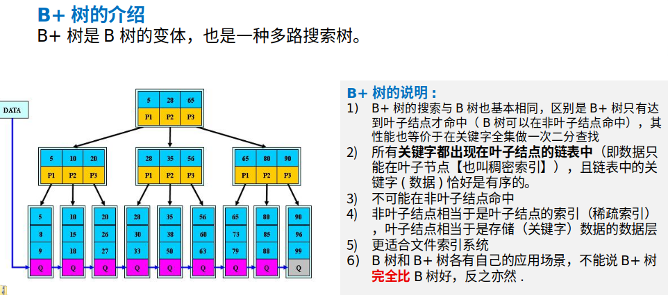
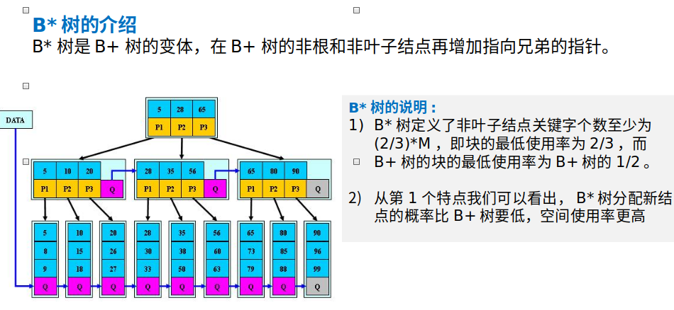

# 数据结构

1.**赫夫曼树**(即是一种数据结构,也是一直算法)

```
基本介绍
1>.给定n个权值作为n个叶子结点，构造一棵二叉树，若该树的带权路径长度(wpl)达到最小，称这样的二叉树为最优二叉树，也称为哈夫曼树(Huffman Tree), 还有的书翻译为霍夫曼树。
2>.赫夫曼树是带权路径长度最短的树，权值较大的结点离根较近。
```

赫夫曼树:

```
赫夫曼树几个重要概念和举例说明

1).路径和路径长度：在一棵树中，从一个结点往下可以达到的孩子或孙子结点之间的通路，称为路径。通路中分支的数目称为路径长度。若规定根结点的层数为1，则从根结点到第L层结点的路径长度为L-1
2).结点的权及带权路径长度：若将树中结点赋给一个有着某种含义的数值，则这个数值称为该结点的权。结点的带权路径长度为：从根结点到该结点之间的路径长度与该结点的权的乘积
3).树的带权路径长度：树的带权路径长度规定为所有叶子结点的带权路径长度之和，记为WPL(weighted path length) ,权值越大的结点离根结点越近的二叉树才是最优二叉树。
4).WPL最小的就是赫夫曼树
```


```
构成赫夫曼树的步骤：
1) 从小到大进行排序, 将每一个数据，每个数据都是一个节点 ， 每个节点可以看成是一颗最简单的二叉树
2) 取出根节点权值最小的两颗二叉树 
3) 组成一颗新的二叉树, 该新的二叉树的根节点的权值是前面两颗二叉树根节点权值的和  
4) 再将这颗新的二叉树，以根节点的权值大小 再次排序， 不断重复  1-2-3-4 的步骤，直到数列中，所有的数据都被处理，就得到一颗赫夫曼树
```


实例:com.liyuan3210.dsa.dataStructures.huffmantree

**1.1赫夫曼编码**(压缩与解压):

```
基本介绍

1).赫夫曼编码也翻译为    哈夫曼编码(Huffman Coding)，又称霍夫曼编码，是一种编码方式, 属于一种程序算法
2).赫夫曼编码是赫哈夫曼树在电讯通信中的经典的应用之一。
3).赫夫曼编码广泛地用于数据文件压缩。其压缩率通常在20%～90%之间
4).赫夫曼码是可变字长编码(VLC)的一种。Huffman于1952年提出一种编码方法，称之为最佳编码
```

原理介绍:

```
1).定长编码:数据按照原始要传谁的长度进行传输
2).变长编码:数据按照一定算法进行压缩进行传输,接收时要按照算法规则进行反解码

注意:
这个赫夫曼树根据排序方法不同，也可能不太一样，这样对应的赫夫曼编码也不完全一样，但是wpl 是一样的，都是最小的, 比如: 如果我们让每次生成的新的二叉树总是排在权值相同的二叉树的最后一个，则生成的二叉树为:
```

**1.2.数据压缩(实例):**

```
传输的 字符串 
1) i like like like java do you like a java    
2)  d:1 y:1 u:1 j:2  v:2  o:2  l:4  k:4  e:4 i:5  a:5   :9  // 各个字符对应的个数
3)  按照上面字符出现的次数构建一颗赫夫曼树, 次数作为权值 
```


```
4)  根据赫夫曼树，给各个字符,规定编码 (前缀编码)， 向左的路径为0 向右的路径为1 ， 编码如下:
o: 1000   u: 10010  d: 100110  y: 100111  i: 101
a : 110     k: 1110    e: 1111       j: 0000       v: 0001
l: 001          : 01
5) 按照上面的赫夫曼编码，我们的"i like like like java do you like a java"   字符串对应的编码为 (注意这里我们使用的无损压缩)
1010100110111101111010011011110111101001101111011110100001100001110011001111000011001111000100100100110111101111011100100001100001110  通过赫夫曼编码处理  长度为  133
```

**1.3.数据解压(实例):**

```
1). 将huffmanCodeBytes [-88, -65, -56, -65, -56, -65, -55, 77, -57, 6, -24, -14, -117, -4, -60, -90, 28]重写先转成 赫夫曼编码对应的二进制的字符串 "1010100010111..."
2). 赫夫曼编码对应的二进制的字符串 "1010100010111..." =》 对照 赫夫曼编码  =》 "i like like like java do you like a java"
```
赫夫曼编码压缩文件注意事项
```
1).如果文件本身就是经过压缩处理的，那么使用赫夫曼编码再压缩效率不会有明显变化, 比如视频,ppt 等等文件  [举例压一个 .ppt]
2).赫夫曼编码是按字节来处理的，因此可以处理所有的文件(二进制文件、文本文件) [举例压一个.xml文件]
3).如果一个文件中的内容，重复的数据不多，压缩效果也不会很明显. 
```

实例:com.liyuan3210.dsa.dataStructures.huffmancode

**2.BST二叉排序树**

二叉排序树介绍

二叉排序树：BST: (Binary Sort(Search) Tree), 对于二叉排序树的任何一个非叶子节点，`要求左子节点的值比当前节点的值小，右子节点的值比当前节点的值大`。
`特别说明：`如果有相同的值，可以将该节点放在左子节点或右子节点


`中序遍历二叉排序树,数组是一个有序的数组`(从小到大).

二叉树添加(比较简单),删除,删除有点逻辑,大致如下:


```
1).删除叶子节点 (比如：2, 5, 9, 12)
2).删除只有一颗子树的节点 (比如：1)
3).删除有两颗子树的节点. (比如：7, 3，10 )

第一种情况:
删除叶子节点 (比如：2, 5, 9, 12)
思路
(1) 需求先去找到要删除的结点  targetNode
(2)  找到targetNode 的 父结点 parent 
(3)  确定 targetNode 是 parent的左子结点 还是右子结点
(4)  根据前面的情况来对应删除
左子结点 parent.left = null
右子结点 parent.right = null;

第二种情况: 删除只有一颗子树的节点 (代码逻辑问题???)
思路
(1) 需求先去找到要删除的结点  targetNode
(2)  找到targetNode 的 父结点 parent 
(3) 确定targetNode 的子结点是左子结点还是右子结点
(4) targetNode 是 parent 的左子结点还是右子结点
(5) 如果targetNode 有左子结点
5. 1 如果 targetNode 是 parent 的左子结点
parent.left = targetNode.left;
5.2  如果 targetNode 是 parent 的右子结点
parent.right = targetNode.left;
(6) 如果targetNode 有右子结点
6.1 如果 targetNode 是 parent 的左子结点
parent.left = targetNode.right;
6.2 如果 targetNode 是 parent 的右子结点
parent.right = targetNode.right

情况三 ： 删除有两颗子树的节点. (比如：7, 3，10 )
思路
(1) 需求先去找到要删除的结点  targetNode
(2)  找到targetNode 的 父结点 parent 
(3)  从targetNode 的右子树找到最小的结点 或者从 左子数找最大的(???)
(4) 用一个临时变量，将 最小结点的值保存 temp = 11
(5)  删除该最小结点
(6)  targetNode.value = temp
```

实例:com.liyuan3210.dsa.dataStructures.binarysorttree

**3.AVL平衡二叉树**

BST二叉排序树问题分析:

```
左边BST 存在的问题分析:
给你一个数列{1,2,3,4,5,6}，要求创建一颗二叉排序树(BST), 并分析问题所在.

1>左子树全部为空，从形式上看，更像一个单链表.
2>插入速度没有影响
3>查询速度明显降低(因为需要依次比较), 不能发挥BST的优势，因为每次还需要比较左子树，其查询速度比单链表还慢
解决方案-平衡二叉树(AVL)
```

基本介绍

1>平衡二叉树也叫平衡二叉搜索树（Self-balancing binary search tree）又被称为AVL树， 可以保证查询效率较高。
2>具有以下特点：它是一 棵空树或它的左右两个子树的高度差的绝对值不超过1，并且左右两个子树都是一棵平衡二叉树。平衡二叉树的**常用实现方法有红黑树、AVL、替罪羊树、Treap、伸展树**等。

**平衡二叉树ADD时有三种情况:**

首先要编写获取当前节点,左节点,右节点有几成3个方法 

3.1.左旋转


3.2.右旋转


3.3.双旋转


需要判断条件旋转两次

实例:com.liyuan3210.dsa.dataStructures.avl

**4.多路查找树(B树, B+树,B*树)**

`二叉树的问题:`

```
1>.二叉树需要加载到内存的，如果二叉树的节点少，没有什么问题，但是如果二叉树的节点很多(比如1亿)， 就存在如下问题:
2>.问题1：在构建二叉树时，需要多次进行i/o操作(海量数据存在数据库或文件中)，节点海量，构建二叉树时，速度有影响
3>.问题2：节点海量，也会造成二叉树的高度很大，会降低操作速度.
```

`1.简单B树(2-3树)`

```
1>.B树通过重新组织节点， 降低了树的高度.
2>.文件系统及数据库系统的设计者利用了磁盘预读原理，将一个节点的大小设为等于一个页(页得大小通常为4k)，这样每个节点只需要一次I/O就可以完全载入
3>.将树的度M设置为1024，在600亿个元素中最多只需要4次I/O操作就可以读取到想要的元素, B树(B+)广泛应用于文件存储系统以及数据库系统中
```

2-3树是最简单的B树结构, 具有如下特点:

```
1>.2-3树的所有叶子节点都在同一层.(只要是B树都满足这个条件)
2>.有两个子节点的节点叫二节点，二节点要么没有子节点，要么有两个子节点.
3>.有三个子节点的节点叫三节点，三节点要么没有子节点，要么有三个子节点.
4>.2-3树是由二节点和三节点构成的树。
```



**B树说明**

```
1>B树的阶：节点的最多子节点个数。比如2-3树的阶是3，2-3-4树的阶是4
2>B-树的搜索，从根结点开始，对结点内的关键字（有序）序列进行二分查找，如果命中则结束，否则进入查询关键字所属范围的儿子结点；重复，直到所对应的儿子指针为空，或已经是叶子结点
3>关键字集合分布在整颗树中, 即叶子节点和非叶子节点都存放数据.
4>搜索有可能在非叶子结点结束
5>其搜索性能等价于在关键字全集内做一次二分查找
```



`2.B+树`



`3.B*树`



**5.图**

当我们需要表示多对多的关系时， 这里我们就用到了**图**

`图常用概念:`

1).顶点(vertex)
2).边(edge)
3).路径
4).无向图(顶点之间的连接没有方向，比如A-B,即可以是 A-> B 也可以 B->A .)

```
路径:  比如从 D -> C 的路径有
1) D->B->C
2) D->A->B->C
```

5).有向图(顶点之间的连接有方向，比如A-B,只能是 A-> B 不能是 B->A .)
6).带权图(这种边带权值的图也叫网.)

`图表示方式:`

邻接矩阵,邻接表


`图的遍历:`

1.深度优先

深度优先遍历基本思想

```
1>深度优先遍历，从初始访问结点出发，初始访问结点可能有多个邻接结点，深度优先遍历的策略就是首先访问第一个邻接结点，然后再以这个被访问的邻接结点作为初始结点，访问它的第一个邻接结点， 可以这样理解：每次都在访问完当前结点后首先访问当前结点的第一个邻接结点。
2>我们可以看到，这样的访问策略是优先往纵向挖掘深入，而不是对一个结点的所有邻接结点进行横向访问。
显然，深度优先搜索是一个递归的过程

深度优先遍历算法步骤
1>访问初始结点v，并标记结点v为已访问。
2>查找结点v的第一个邻接结点w。
3>若w存在，则继续执行4，如果w不存在，则回到第1步，将从v的下一个结点继续。
4>若w未被访问，对w进行深度优先遍历递归（即把w当做另一个v，然后进行步骤123）。
5>查找结点v的w邻接结点的下一个邻接结点，转到步骤3。
```

2.广度优先

广度优先遍历基本思想

```
类似于一个分层搜索的过程，广度优先遍历需要使用一个队列以保持访问过的结点的顺序，以便按这个顺序来访问这些结点的邻接结点

广度优先遍历算法步骤
1.访问初始结点v并标记结点v为已访问。
2.结点v入队列
3.当队列非空时，继续执行，否则算法结束。
4.出队列，取得队头结点u。
5.查找结点u的第一个邻接结点w。
6.若结点u的邻接结点w不存在，则转到步骤3；否则循环执行以下三个步骤：
6.1 若结点w尚未被访问，则访问结点w并标记为已访问。 
6.2 结点w入队列 
6.3 查找结点u的继w邻接结点后的下一个邻接结点w，转到步骤6。
```

实例:com.liyuan3210.dsa.dataStructures.graph

