# 数据结构与算法

## 一。算法入门

## 资源
    原始资料：https://gitee.com/liyuan3210/book_source/tree/master/dsa
    代码：https://github.com/liyuan3210/java/tree/master/dsa
    流程图：https://github.com/liyuan3210/data/blob/master/drawio/dsa.drawio

**1.字符串匹配问题**

```
Str1 = “阿斯顿你好 阿斯顿阿斯顿阿斯你好阿斯顿阿斯顿”
Str2 = "你好阿斯"
判断Str1是否包含Str2，如果有返回第一次出现的位置，否则返回-1

解决方案：
* 暴力匹配（比较傻瓜方法）
* KMP算法（部分匹配表）
```

**2.汉诺塔游戏**

```
在线游戏：
https://zhangxiaoleiwk.gitee.io/h.html

游戏规则，将A塔的所有圆盘移动到C塔：
1) 小圆盘上不能放大圆盘，2)在三根柱子之间一次只能移动一个圆盘

解决方案：
分治算法
```

**3.八皇后问题**

```
在线游戏：
https://www.novelgames.com/zh/queens/

游戏规则，在8×8格的国际象棋上摆放八个皇后，使其不能互相攻击，并且规定：
任意两个皇后都不能处于同一行、同一列或同一斜线上，问有多少种摆法？【92种】
```

**4.马踏棋盘**

```
在线游戏：
http://h5.17173.com/content/05252016/143559215.shtml

游戏规则，马随机放在国际象棋的8×8棋盘，马走日，并且规定：
要求每个方格只进入一次，走遍棋盘上全部64个方格

解决方案：
图的深度优化遍历算法(DFS) + 贪心算法优化
```

## 二。数据结构与算法区别

**程序 = 数据结构 + 算法**

**问题1:**
			str.replaceAll("Java", "尚硅谷~"); //思考底层算法实现
			使用单链表
**问题2:**
			五子棋
**问题3:**
			约瑟夫(Josephu)问题 

**数据结构分类：**

```
1.1 线性结构
		存储分类
			* 顺序存储（存储是连续的）
			* 链式存储（存储不是连续的）
		线性结构常见的有：数组，队列，链表和栈
1.2 非线性结构
		非线性结构包括：二维数组，多维数组，广义表，树结构，图结构
```

## 三。数据结构

#### 1.稀疏数组

#### 2.数组模拟队列（简单）

#### 3.数组模拟队列（环形）

#### 4.单向链表

#### 5.双向链表

#### 6.约瑟夫（环形链表）

* 课外题：
	6.1）求单链表中有效节点的个数
	6.2）查找链表中的倒数第k个节点
	6.3）单链表的反转（有难度）
	6.4）从尾打印单链表（方式1:反向遍历，方式2：Stack栈（先进后出））
	6.5）合并两个有序的单链表，合并之后单链表依然有序（课后题）

#### 7.栈

* 数组模拟栈

* 栈实现综合计算器

* 前缀，中缀，后缀表达式

  **前缀表达式（波兰表达式）：**

  ```
  前缀表达式的计算机求值
  
  从右至左扫描表达式，遇到数字时，将数字压入堆栈，遇到运算符时，弹出栈顶的两个数，用运算符对它们做相应的计算（栈顶元素 和 次顶元素），并将结果入栈；重复上述过程直到表达式最左端，最后运算得出的值即为表达式的结果
  
  例如: (3+4)×5-6 对应的前缀表达式就是 - × + 3 4 5 6 , 针对前缀表达式求值步骤如下:
  
  1）从右至左扫描，将6、5、4、3压入堆栈
  2）遇到+运算符，因此弹出3和4（3为栈顶元素，4为次顶元素），计算出3+4的值，得7，再将7入栈
  3）接下来是×运算符，因此弹出7和5，计算出7×5=35，将35入栈
  4）最后是-运算符，计算出35-6的值，即29，由此得出最终结果
  ```

  **中缀表达式（人能理解的）：**

  **后缀表达式（逆波兰表达式）：**

* 中缀转后缀表达式

  ```
  后缀表达式适合计算式进行运算，但是人却不太容易写出来，尤其是表达式很长的情况下，因此在开发中，我们需要将 中缀表达式转成后缀表达式。
  
  具体步骤如下:
  1）初始化两个栈：运算符栈s1和储存中间结果的栈s2；
  2）从左至右扫描中缀表达式；
  3）遇到操作数时，将其压s2；
  4）遇到运算符时，比较其与s1栈顶运算符的优先级：
  4.1）如果s1为空，或栈顶运算符为左括号“(”，则直接将此运算符入栈；
  4.2）否则，若优先级比栈顶运算符的高，也将运算符压入s1；
  4.3）否则，将s1栈顶的运算符弹出并压入到s2中，再次转到(4.1)与s1中新的栈顶运算符相比较；
  5）遇到括号时：
  5.1) 如果是左括号“(”，则直接压入s1
  5.2) 如果是右括号“)”，则依次弹出s1栈顶的运算符，并压入s2，直到遇到左括号为止，此时将这一对括号丢弃
  6) 重复步骤2至5，直到表达式的最右边
  7) 将s1中剩余的运算符依次弹出并压入s2
  8) 依次弹出s2中的元素并输出，结果的逆序即为中缀表达式对应的后缀表达式
  ```

  

* 完整版逆波兰计算器小结

#### 8.递归

* 递归调用场景与调用机制
* 迷宫回溯实现
* 八皇后游戏实现

## 四。算法

#### 1.算法复杂度衡量

* 度量一个程序（算法）执行效率的两个方法

  ```
  1）事后统计的方法
  这种方法可行, 但是有两个问题：一是要想对设计的算法的运行性能进行评测，需要实际运行该程序；二是所得时间的统计量依赖于计算机的硬件、软件等环境因素, 这种方式，要在同一台计算机的相同状态下运行，才能比较那个算法速度更快。
  
  2）事前估算的方法
  通过分析某个算法的时间复杂度来判断哪个算法更优.
  ```

* 事前估算介绍

  ```
  
  1）时间频度
  时间频度：一个算法花费的时间与算法中语句的执行次数成正比例，哪个算法中语句执行次数多，它花费时间就多。一个算法中的语句执行次数称为语句频度或时间频度。记为T(n)。
  备注：时间频度指T(n)
  
  2）时间复杂度
  T(n)=n²+7n+6 与 T(n)=3n²+2n+2 算法是相同的时间复杂度，它们的T(n) 不同，但时间复杂度相同，都为O(n²).可以忽略 常数项,低次项,系数，因为当时间频度n无限大时执行曲线将趋于接近
  备足：时间复杂度指 O(n²)
  ```

* 常见时间复杂度（通常以“时间复杂度”来衡量一个算法）

  ```
  1）常数阶O(1)
  2）对数阶O(log2n)
  3）线性阶O(n)
  4）线性对数阶O(nlog2n)
  5）平方阶O(n^2)
  6）立方阶O(n^3)
  7）k次方阶O(n^k)
  8）指数阶O(2^n)
  ```

* 空间复杂度简介

  ```
  1）类似于时间复杂度的讨论，一个算法的空间复杂度(Space Complexity)定义为该算法所耗费的存储空间，它也是问题规模n的函数。
  2）空间复杂度(Space Complexity)是对一个算法在运行过程中临时占用存储空间大小的量度。有的算法需要占用的临时工作单元数与解决问题的规模n有关，它随着n的增大而增大，当n较大时，将占用较多的存储单元，例如快速排序和归并排序算法就属于这种情况
  3）在做算法分析时，主要讨论的是时间复杂度。从用户使用体验上看，更看重的程序执行的速度。一些缓存产品(redis, memcache)和算法(基数排序)本质就是用空间换时间.
  ```

#### 2.排序算法

代码：

**排序算法分类：**

```
1) 内部排序:
指将需要处理的所有数据都加载到内部存储器中进行排序。
2) 外部排序法：
数据量过大，无法全部加载到内存中，需要借助外部存储进行
排序。
```

**常见排序算法：**

```
1.内部排序
	* 插入排序
		直接插入排序，希尔排序
	* 选择排序
		简单选择排序，堆排序
	* 交换排序
		冒泡排序，快速排序
	* 归并排序
	* 基数排序
2.外部排序
使用内存与外部存储结合
```

* 冒泡排序
* 选择排序
* 插入排序
* 希尔排序
* 快速排序
* 归并排序
* 基数排序

#### 3.查找算法

```
* 顺序（线性）查找

* 二分查找/折半查找
  二分查找要保证数据是有序的

* 插值查找
类似二分查找，自适应mid处开始查找（公式）
 low表示左索引left，high表示右索引right，key表示要查找的值，arr是数组
 mid = low + (key - arr[low]) / (arr[high] - arr[low]) * (high - low)

* 斐波那契查找（黄金分割法）
 也是基于mid取值确定
 mid=low + F(k-1)-1
```
#### 4.哈希表
 		哈希表是一种数据结构，通常把常用数据按**照散列函数**加载到哈希表里面
```
 常用哈希表：
     * 数组 + 链表
     * 数组 + 二叉树
```
#### 5.二叉树

```
* 数组，链表，树 存储分析：
    1）.数组
    优点：可以通过下标访问，检索快
    缺点：插入速度慢，涉及到整体移动问题

    2）.链表
    优点：在一定程度相对数组，对数据存储方面有所优化，只需要改变前后指针即可
    缺点：检索时效率低

    3）.树
    能提高数据存储，读取效率。
    即可保证数据检索，也可以提高数据插入，删除，修改速度

1）树的概念与常用俗语
？？？

2）树的前序，中序，后序遍历：
？？？

3）顺序存储二叉树
二叉树与数组可以相互转换，即数组形式下的index与树的左右子节点存在一个公式关系

4）线索化二叉树
n个节点有，n+1个空指针域。利用二叉树空指针域指向某种遍历下的前驱和后驱的指针称为“线索”二叉树

5）大顶堆与小顶堆
	大顶堆（最大值在顶端），小顶堆（最小值在顶端）

6）堆排序
	平均时间复杂度是线性的，也是不稳定排序

```

#### 6.赫夫曼树（哈夫曼树）

```
1）基本介绍

2）赫夫曼树创建步骤

3）赫夫曼树编码
		是一种编码方式，也是一种程序算法，通信领域信息处理的3种方式
		3.1）定长编码
			问题
		3.2）变长编码
			问题
		3.3）赫夫曼编码
			赫夫曼编码是一种“前缀编码”（编码后前缀可以保证唯一性）
			问题：
			赫夫曼编树排序方法不同，编码可能会不一样（比如字母，l与i同样出现4次，按照本文方式就有可能会不一样）

4）赫夫曼编码，解码实现

5）赫夫曼压缩，解压文件
```

#### 7.AVL，平衡，B树（B+树）


--------------------------------------------OLD----------------------------------

## 一．数据结构与算法

### 内容介绍

应用场景（程序）　＝ 	数据结构	＋　算法

内容：

[1.数据结构与算法-上](#datastructures-1)

[2.数据结构与算法-下](dataStructures.md)

[3.十种常见算法](algorithm.md)

### 一．数据结构分类
<div id="datastructures-1"/>
#### 线性结构：

数组，队列，链表和栈

```
特点是数据元素之间存在一对一的线性关系

有两种不同存储结构，顺序存储（存储元素是连续的），链式存储（元素不一定是连续的，元素存储相邻的元素地址信息）
```

#### 非线性结构：

二维数组，多维数组，广义表，**树结构，图结构**

**1.稀疏数组(五子棋例子)**

实例：dsa.dataStructures.sparsearray

**2.队列**

实例：dsa.dataStructures.queue

简单队列：com.liyuan3210.dsa.dataStructures.queue.ArrayQueueDemo.java

```
数组模拟队列一个思路，但有问题（数组不能重复使用）
```

环形队列：com.liyuan3210.dsa.dataStructures.queue.CircleArrayQueueDemo.java

```
改进成环形队列（通过取模方式）。算法可以有多种，但这种数据有效个数是lenth-1(因为有个预留空间)
```

**3.链表**

链表方式：
分为，有头链表，无头链表两种

实例：dsa.dataStructures.linkedlist

**单向链表：**

实例：com.liyuan3210.dsa.dataStructures.linkedlist.SingleLinkedListDemo.java

链表排序，添加，删除

面试题：

```
1>求单链表中有效节点个数
2>查找单链表中的倒数K个结点
3>单链表反转(数据结构反转)
4>从头打印单链表(不改变链表数据顺序，使用到了栈Stack)
```

**双向链表：**

实例：com.liyuan3210.dsa.dataStructures.linkedlist.DoubleLinkedListDemo.java

双向链表显示，添加，删除，修改

**单向环形链表（约瑟夫问题）:**

```
Josephu  问题为：设编号为1，2，… n的n个人围坐一圈，约定编号为k（1<=k<=n）的人从1开始报数，数到m 的那个人出列，它的下一位又从1开始报数，数到m的那个人又出列，依次类推，直到所有人出列为止，由此产生一个出队编号的序列。
```

实例：com.liyuan3210.dsa.dataStructures.linkedlist.Josepfu.java

数组取模也可以完成（环形链表）

**4.栈**

使用场景：

子程序的调用 	
处理递归调用
表达式的转换[中缀表达式转后缀表达式]与求值(实际解决)。
二叉树的遍历。
图形的深度优先(depth一first)搜索法。

实例：dsa.dataStructures.stack

4.1>.数组实现栈 ：ArrayStackDemo.java

4.2>.栈实现计算器：Calculator.java

4.3>.前缀，中缀，后缀表达式规则

每一种表达式有不同方式读取计算规则

```
前缀表达式（波兰表达式）:
中缀:前面实现的都是按照中缀实现的(人比较好理解，但计算机不太容易处理)
后缀（逆波兰表达式）:计算机容易处理的表达式
```

4.4>.中缀表达式转后缀表达式

PolandNotation.java

4.5>.逆波兰计算器完整版

课件ppt第56页

**5.递归使用**

递归能解决的问题：

```
5.1>.各种数学问题如: 8皇后问题 , 汉诺塔, 阶乘问题, 迷宫问题, 球和篮子的问题(google编程大赛)
5.2>.各种算法中也会使用到递归，比如快排，归并排序，二分查找，分治算法等.
5.3>将用栈解决的问题-->第归代码比较简洁
```

实例：com.liyuan3210.dsa.dataStructures.recursion

递归机制：

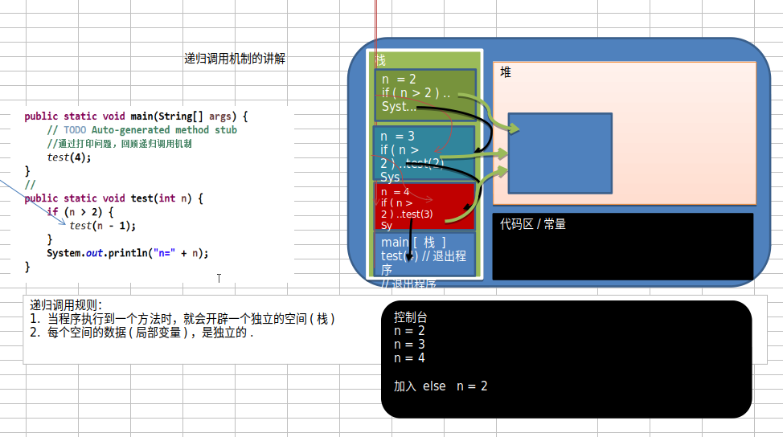

递归需要遵守的重要规则:

```
*.执行一个方法时，就创建一个新的受保护的独立空间(栈空间)
*.方法的局部变量是独立的，不会相互影响, 比如n变量
*.如果方法中使用的是引用类型变量(比如数组)，就会共享该引用类型的数据.
*.递归必须向退出递归的条件逼近，否则就是无限递归,出现StackOverflowError，死龟了:)
*.当一个方法执行完毕，或者遇到return，就会返回，遵守谁调用，就将结果返回给谁，同时当方法执行完毕或者返回时，该方法也就执行完毕。
```

案例分析：

*.迷宫问题分析：MiGong.java

```
1>.小球得到的路径，和程序设置的找路策略有关即：找路的上下左右的顺序相关
2>.再得到小球路径时，可以先使用(下右上左)，再改成(上右下左)，看看路径是不是有变化
3>.测试回溯现象
思考: 如何求出最短路径? 
```

*.八皇后问题分析：Queue8.java

```
1>.第一个皇后先放第一行第一列
2>.第二个皇后放在第二行第一列、然后判断是否OK， 如果不OK，继续放在第二列、第三列、依次把所有列都放完，找到一个合适
3>.继续第三个皇后，还是第一列、第二列……直到第8个皇后也能放在一个不冲突的位置，算是找到了一个正确解
4>.当得到一个正确解时，在栈回退到上一个栈时，就会开始回溯，即将第一个皇后，放到第一列的所有正确解，全部得到.
5>.然后回头继续第一个皇后放第二列，后面继续循环执行 1,2,3,4的步骤 【示意图】

说明：理论上应该创建一个二维数组来表示棋盘，但是实际上可以通过算法，用一个一维数组即可解决问题. arr[8] = {0 , 4, 7, 5, 2, 6, 1, 3} //对应arr 下标 表示第几行，即第几个皇后，arr[i] = val , val 表示第i+1个皇后，放在第i+1行的第val+1列
```

**6.排序算法**

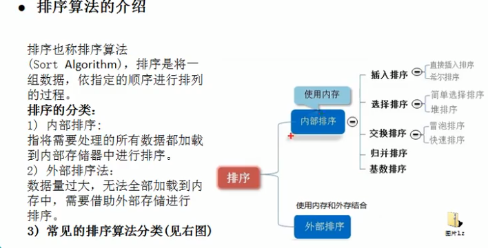


衡量程序执行时间，**时间复杂度**，衡量

表示方法：T(n)=2n²+7n+6 

由于随着时间频度增加，有些系数可以忽略（参照上面表达式）：

忽略常数项（6忽略），忽略低次项（7n忽略），忽略系数（2n²的2）

最终：T(n²)


常见的时间复杂度（详细见ppt）:

```
1)常数阶O(1)
2)对数阶O(log2n)
3)线性阶O(n)
4)线性对数阶O(nlog2n)
5)平方阶O(n^2)（两个for循环）
6)立方阶O(n^3)（三个for循环）
7)k次方阶O(n^k)
8)指数阶O(2^n)
```


平均时间复杂度和最坏时间复杂度：

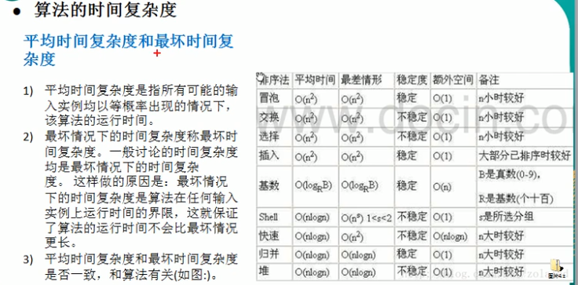

什么是`稳定`？

```
注:假定在待排序的记录序列中，存在多个具有相同的关键字的记录，若经过排序，这些记录的相对次序保持不变，即在原序列中，r[i]=r[j]，且r[i]在r[j]之前，而在排序后的序列中，r[i]仍在r[j]之前，则称这种排序算法是稳定的；否则称为不稳定的
```

6.1.冒泡排序

```
基本介绍
冒泡排序（Bubble Sorting）的基本思想是：通过对待排序序列从前向后（从下标较小的元素开始）,依次比较相邻元素的值，若发现逆序则交换，使值较大的元素逐渐从前移向后部，就象水底下的气泡一样逐渐向上冒。
```

从小到大（第一轮for循环找到最大的），从大到小（第一轮for循环找到最小的）

实例：com.liyuan3210.dsa.dataStructures.sort.BubbleSort.java


6.2.选择排序

```
选择排序思想:

选择排序（select sorting）也是一种简单的排序方法。它的基本思想是：
第一次从arr[0]~arr[n-1]中选取最小值，与arr[0]交换，
第二次从arr[1]~arr[n-1]中选取最小值，与arr[1]交换，
第三次从arr[2]~arr[n-1]中选取最小值，与arr[2]交换，…，第i次从arr[i-1]~arr[n-1]中选取最小值，与arr[i-1]交换，…, 第n-1次从arr[n-2]~arr[n-1]中选取最小值，与arr[n-2]交换，总共通过n-1次，得到一个按排序码从小到大排列的有序序列。
```

从小到大（第一轮for循环找到最大的），从大到小（第一轮for循环找到最小的）

实例：com.liyuan3210.dsa.dataStructures.sort.SelectSort.java


6.3.插入排序

```
插入排序法思想:

插入排序（Insertion Sorting）的基本思想是：把n个待排序的元素看成为一个有序表和一个无序表，开始时有序表中只包含一个元素，无序表中包含有n-1个元素，排序过程中每次从无序表中取出第一个元素，把它的排序码依次与有序表元素的排序码进行比较，将它插入到有序表中的适当位置，使之成为新的有序表。
```

实例：com.liyuan3210.dsa.dataStructures.sort.InsertSort.java


6.4.希尔排序

插入排序存在一定问题，从小到大排序时当最小的数在最右边，会增加处理步骤（缩小增量排序）。

```
希尔排序法基本思想

希尔排序是把记录按下标的一定增量分组，对每组使用直接插入排序算法排序；随着增量逐渐减少，每组包含的关键词越来越多，当增量减至1时，整个文件恰被分成一组，算法便终止
```

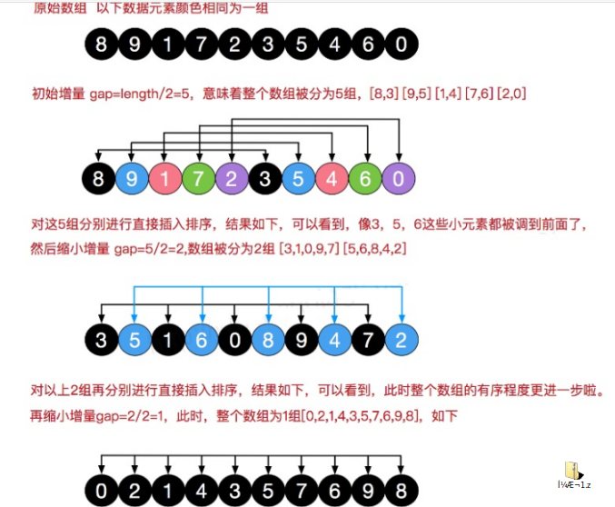Added Added 

插入时有两种方法，**交换法（效率很慢）**，**移位法（效率高）**

实例：com.liyuan3210.dsa.dataStructures.sort.ShellSort.java


6.5.快速排序

快速排序法介绍:

```
快速排序（Quicksort）是对冒泡排序的一种改进。基本思想是：通过一趟排序将要排序的数据分割成独立的两部分，其中一部分的所有数据都比另外一部分的所有数据都要小，然后再按此方法对这两部分数据分别进行快速排序，整个排序过程可以递归进行，以此达到整个数据变成有序序列
```

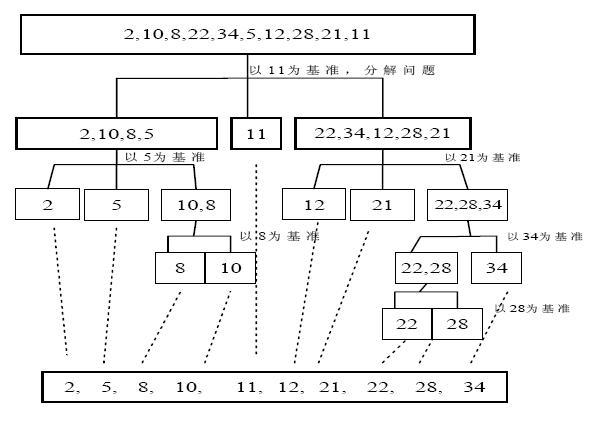

实例：com.liyuan3210.dsa.dataStructures.sort.QuickSort.java


6.6.归并排序

归并排序介绍:

```
归并排序（MERGE-SORT）是利用归并的思想实现的排序方法，该算法采用经典的分治（divide-and-conquer）策略（分治法将问题分(divide)成一些小的问题然后递归求解，而治(conquer)的阶段则将分的阶段得到的各答案"修补"在一起，即分而治之)。
```

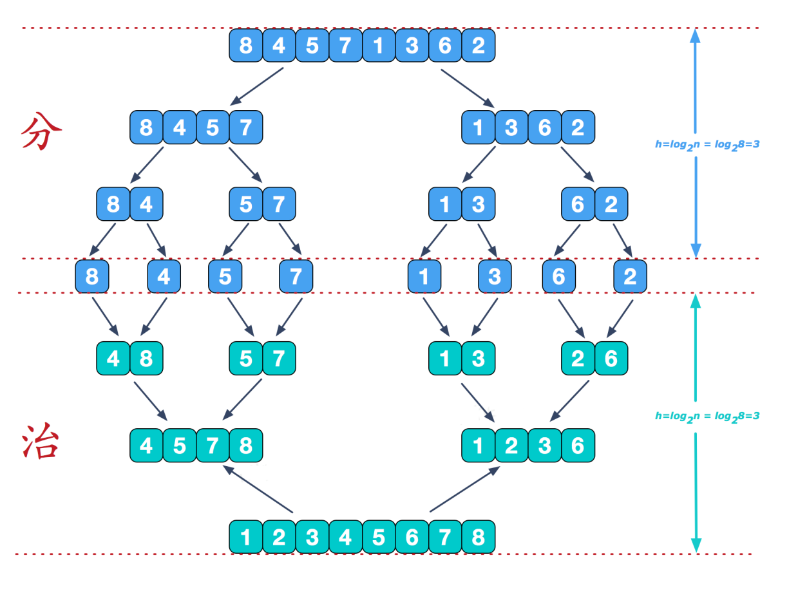

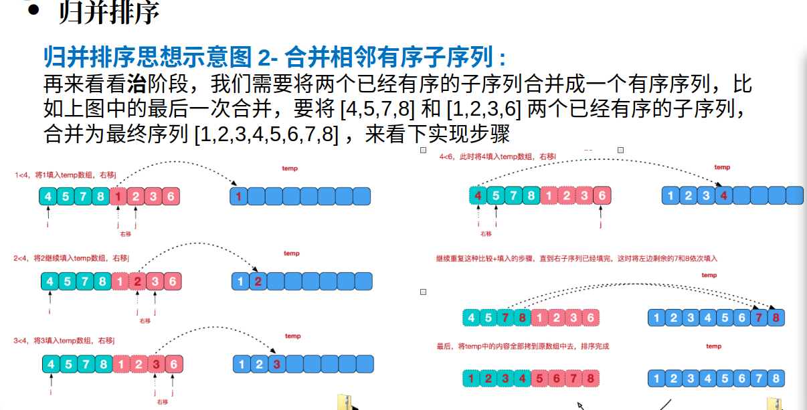

实例：com.liyuan3210.dsa.dataStructures.sort.MergetSort.java


6.7.基数排序

基数排序(桶排序)介绍:

```
1>基数排序（radix sort）属于“分配式排序”（distribution sort），又称“桶子法”（bucket sort）或bin sort，顾名思义，它是通过键值的各个位的值，将要排序的元素分配至某些“桶”中，达到排序的作用
2>基数排序法是属于稳定性的排序，基数排序法的是效率高的稳定性排序法
3>基数排序(Radix Sort)是桶排序的扩展
4>基数排序是1887年赫尔曼·何乐礼发明的。它是这样实现的：将整数按位数切割成不同的数字，然后按每个位数分别比较。

基数排序基本思想:
将所有待比较数值统一为同样的数位长度，数位较短的数前面补零。然后，从最低位开始，依次进行一次排序。这样从最低位排序一直到最高位排序完成以后, 数列就变成一个有序序列。
```

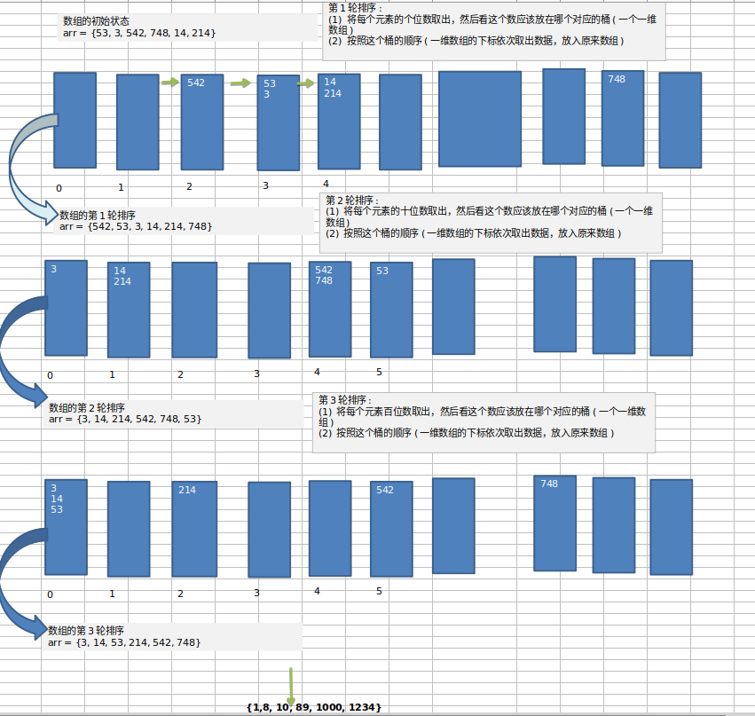

实例：com.liyuan3210.dsa.dataStructures.sort.RadixSort.java

6.8.时间复杂度比较：

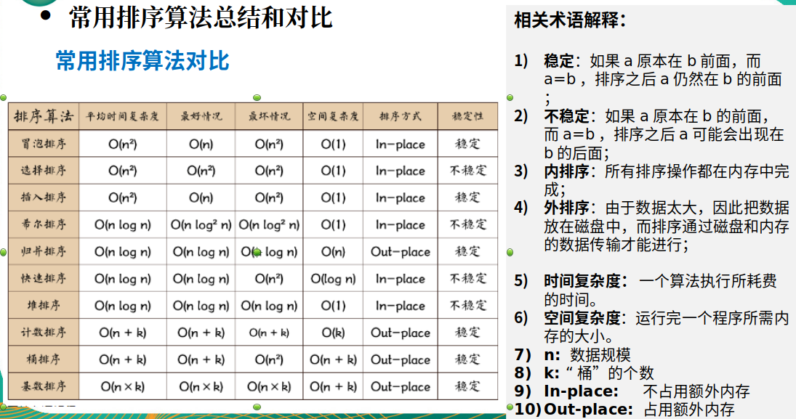

### 二．算法分类

**常见查找算法：**

1.顺序查找（传统一个一个查找）

2.二分查找/折半查找

```
二分查找(必须是有序的)：
   请对一个有序数组进行二分查找 {1,8, 10, 89, 1000, 1234} ，输入一个数看看该数组是否存在此数，并且求出下标，如果没有就提示"没有这个数"。

思考题： {1,8, 10, 89, 1000, 1000，1234} 当一个有序数组中，有多个相同的数值时，如何将所有的数值都查找到，比如这里的 1000
```

实例：com.liyuan3210.dsa.dataStructures.search.BinarySearch.java

3.插值查找

```
1>插值查找算法类似于二分查找，不同的是插值查找每次从自适应mid处开始查找。
2>将折半查找中的求mid 索引的公式 , low 表示左边索引left, high表示右边索引right
3>公式：
int mid = low + (high - low) * (key - arr[low]) / (arr[high] - arr[low])  ;/*插值索引*/
对应前面的代码公式：
int mid = left + (right – left) * (findVal – arr[left]) / (arr[right] – arr[left])

插值查找注意事项：
对于数据量较大，关键字分布比较均匀的查找表来说，采用插值查找, 速度较快.
关键字分布不均匀的情况下，该方法不一定比折半查找要
```

实例：com.liyuan3210.dsa.dataStructures.search.InsertValueSearch.java

4.斐波那契查找

？？？

实例：com.liyuan3210.dsa.dataStructures.search.FibonacciSearch.java

**哈希表(数据结构)：**

哈希表 = 数组 + 链表

```
散列表（Hash table，也叫哈希表），是根据关键码值(Key value)而直接进行访问的数据结构。
也就是说，它通过把关键码值映射到表中一个位置来访问记录，以加快查找的速度。这个映射函数叫做散列函数，存放记录的数组叫做散列表。
```

*数组下标（取模确定）=  (唯一id值%数组size)，hash取模方式有多种*

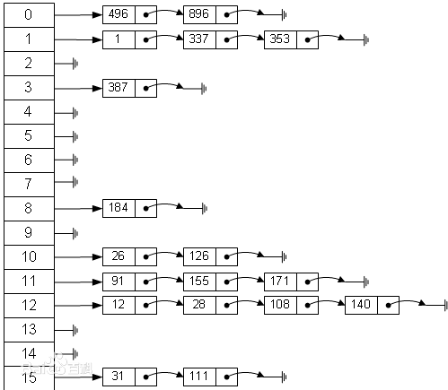

实例：com.liyuan3210.dsa.dataStructures.hashtab.HashTabDemo.java

**二插树:**

为什么需要树这种数据结构

```
数组存储方式的分析
优点：通过下标方式访问元素，速度快。对于有序数组，还可使用二分查找提高检索速度。
缺点：如果要检索具体某个值，或者插入值(按一定顺序)会整体移动，效率较低

链式存储方式的分析
优点：在一定程度上对数组存储方式有优化(比如：插入一个数值节点，只需要将插入节点，链接到链表中即可， 删除效率也很好)。
缺点：在进行检索时，效率仍然较低，比如(检索某个值，需要从头节点开始遍历) 

树存储方式的分析
能提高数据存储，读取的效率,  比如利用 二叉排序树(Binary Sort Tree)，既可以保证数据的检索速度，同时也可以保证数据的插入，删除，修改的速度。
```

树(二叉树)与 数组，链式结构相比，可以提高新增，删除的同时又能提高检索速度。

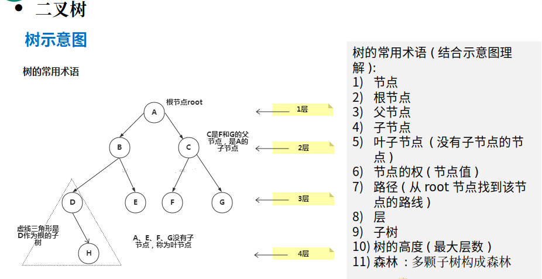

二叉树**分类**：
1>.如果该二叉树的`所有叶子节点都在最后一层`，并且结点总数= 2^n -1 , n 为层数，则我们称为满二叉树。
2>.如果该二叉树的`所有叶子节点都在最后一层或者倒数第二层`，而且最后一层的叶子节点在左边连续，倒数第二层的叶子节点在右边连续，我们称为完全二叉树。

二叉树遍历方式**（前序，中序，后序）**：

```
前序遍历: 先输出父节点，再遍历左子树和右子树
中序遍历: 先遍历左子树，再输出父节点，再遍历右子树
后序遍历: 先遍历左子树，再遍历右子树，最后输出父节点
小结: 看输出父节点的顺序，就确定是前序，中序还是后序
```

实例：com.liyuan3210.dsa.dataStructures.tree.BinaryTreeDemo.java

二叉树遍历(前序，中序，后序)，二叉树查找，二叉树删除（节点的子树都删除）

**顺序二叉树（数组和二叉树可互转）：**

顺序存储二叉树的概念

```
基本说明
从数据存储来看，数组存储方式和树的存储方式可以相互转换，即数组可以转换成树，树也可以转换成数组，看右面的示意图。

顺序存储二叉树的特点:
顺序二叉树通常只考虑完全二叉树
第n个元素的左子节点为  2 * n + 1 
第n个元素的右子节点为  2 * n + 2
第n个元素的父节点为  (n-1) / 2
```

实例：com.liyuan3210.dsa.dataStructures.tree.ArrBinaryTreeDemo.java

**线索化二叉树：**

利用前面left,right空节点指向

```
线索二叉树基本介绍:
1>.n个结点的二叉链表中含有n+1  【公式 2n-(n-1)=n+1】 个空指针域。利用二叉链表中的空指针域，存放指向该结点在某种遍历次序下的前驱和后继结点的指针（这种附加的指针称为"线索"）

2>这种加上了线索的二叉链表称为线索链表，相应的二叉树称为线索二叉树(Threaded BinaryTree)。根据线索性质的不同，线索二叉树可分为前序线索二叉树、中序线索二叉树和后序线索二叉树三种

一个结点的前一个结点，称为前驱结点
一个结点的后一个结点，称为后继结点
```

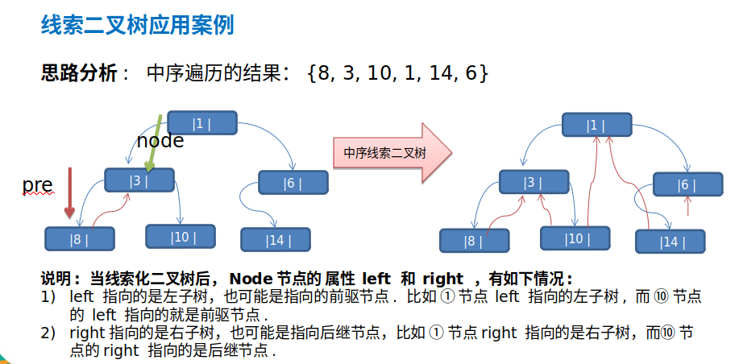

实例：com.liyuan3210.dsa.dataStructures.tree.threadedbinarytree.ThreadedBinaryTreeDemo.java

**堆排序：**

堆是一种选择排序,分为**大顶堆**,**小顶堆**(一般升序采用大顶堆，降序采用小顶堆 )

大顶堆特性:`arr[i] >= arr[2*i+1] && arr[i] >= arr[2*i+2]  // i 对应第几个节点，i从0开始编号`

数组中顺序(大顶堆):50 , 45 , 40 , 20 , 25 , 35, 30 , 10 , 15


小顶堆特性:`arr[i] <= arr[2*i+1] && arr[i] <= arr[2*i+2] // i 对应第几个节点，i从0开始编号`

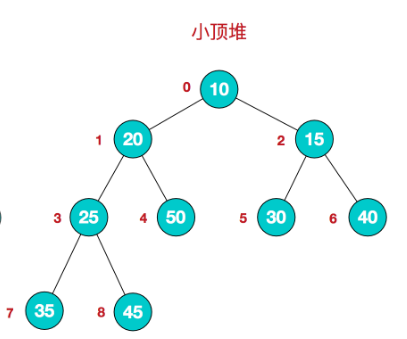

堆排序的基本思想是：

```
1).将待排序序列构造成一个大顶堆
2).此时，整个序列的最大值就是堆顶的根节点。
3).将其与末尾元素进行交换，此时末尾就为最大值。
4).然后将剩余n-1个元素重新构造成一个堆，这样会得到n个元素的次小值。如此反复执行，便能得到一个有序序列了。

可以看到在构建大顶堆的过程中，元素的个数逐渐减少，最后就得到一个有序序列了.
```

实例:com.liyuan3210.dsa.dataStructures.tree.HeapSort.java