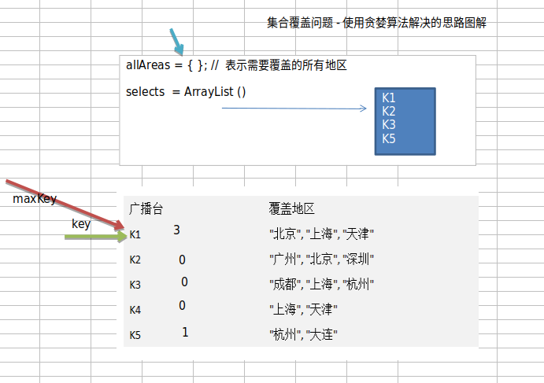
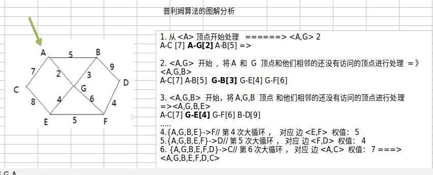
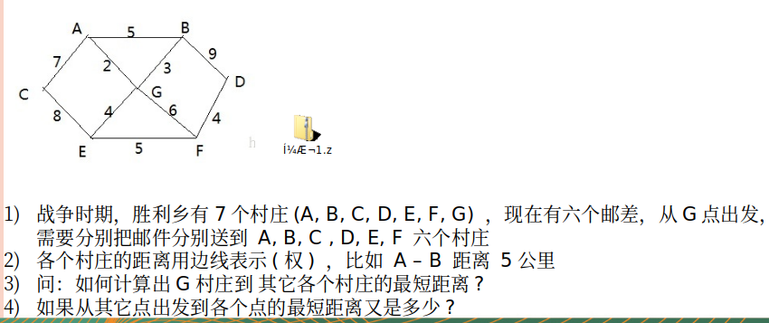

# 数据结构与算法

[1.数据结构与算法-上](#datastructures-1)

[2.数据结构与算法-下](dataStructures.md)

[3.十种常见算法](algorithm.md)

## 资源
    原始资料：https://gitee.com/liyuan3210/book_source/tree/master/dsa
    代码：https://github.com/liyuan3210/java/tree/master/dsa
    流程图：https://github.com/liyuan3210/data/blob/master/drawio/dsa.drawio
    liyuandf账号:共享资源>course>java>【Java】数据结构和算法,韩顺平(全195讲)
    
    力扣
    https://leetcode.cn
    
    主页（各个语言动态图）
    https://www.hello-algo.com/
    https://github.com/krahets/hello-algo

## 概述

**1.字符串匹配问题**

```
Str1 = “阿斯顿你好 阿斯顿阿斯顿阿斯你好阿斯顿阿斯顿”
Str2 = "你好阿斯"
判断Str1是否包含Str2，如果有返回第一次出现的位置，否则返回-1

解决方案：
* 暴力匹配（比较傻瓜方法）
* KMP算法（部分匹配表）
```

**2.汉诺塔游戏**

```
在线游戏：
https://zhangxiaoleiwk.gitee.io/h.html

游戏规则，将A塔的所有圆盘移动到C塔：
1) 小圆盘上不能放大圆盘，2)在三根柱子之间一次只能移动一个圆盘

解决方案：
分治算法
```

**3.八皇后问题**

```
在线游戏：
https://www.novelgames.com/zh/queens/

游戏规则，在8×8格的国际象棋上摆放八个皇后，使其不能互相攻击，并且规定：
任意两个皇后都不能处于同一行、同一列或同一斜线上，问有多少种摆法？【92种】
```

**4.马踏棋盘**

```
在线游戏：
http://h5.17173.com/content/05252016/143559215.shtml

游戏规则，马随机放在国际象棋的8×8棋盘，马走日，并且规定：
要求每个方格只进入一次，走遍棋盘上全部64个方格

解决方案：
图的深度优化遍历算法(DFS) + 贪心算法优化
```

**数据结构与算法区别：**

**程序 = 数据结构 + 算法**

**问题1:**
			str.replaceAll("Java", "尚硅谷~"); //思考底层算法实现
			使用单链表
**问题2:**
			五子棋
**问题3:**
			约瑟夫(Josephu)问题 

**数据结构分类：**

```
1.1 线性结构
		存储分类
			* 顺序存储（存储是连续的）
			* 链式存储（存储不是连续的）
		线性结构常见的有：数组，队列，链表和栈
1.2 非线性结构
		非线性结构包括：二维数组，多维数组，广义表，树结构，图结构
```

## 一。数据结构

#### 1.稀疏数组

#### 2.数组模拟队列（简单）

#### 3.数组模拟队列（环形）

#### 4.单向链表

#### 5.双向链表

#### 6.约瑟夫（环形链表）

* 课外题：
	6.1）求单链表中有效节点的个数
	6.2）查找链表中的倒数第k个节点
	6.3）单链表的反转（有难度）
	6.4）从尾打印单链表（方式1:反向遍历，方式2：Stack栈（先进后出））
	6.5）合并两个有序的单链表，合并之后单链表依然有序（课后题）

#### 7.栈

* 数组模拟栈

* 栈实现综合计算器

* 前缀，中缀，后缀表达式

  **前缀表达式（波兰表达式）：**

  ```
  前缀表达式的计算机求值
  
  从右至左扫描表达式，遇到数字时，将数字压入堆栈，遇到运算符时，弹出栈顶的两个数，用运算符对它们做相应的计算（栈顶元素 和 次顶元素），并将结果入栈；重复上述过程直到表达式最左端，最后运算得出的值即为表达式的结果
  
  例如: (3+4)×5-6 对应的前缀表达式就是 - × + 3 4 5 6 , 针对前缀表达式求值步骤如下:
  
  1）从右至左扫描，将6、5、4、3压入堆栈
  2）遇到+运算符，因此弹出3和4（3为栈顶元素，4为次顶元素），计算出3+4的值，得7，再将7入栈
  3）接下来是×运算符，因此弹出7和5，计算出7×5=35，将35入栈
  4）最后是-运算符，计算出35-6的值，即29，由此得出最终结果
  ```

  **中缀表达式（人能理解的）：**

  **后缀表达式（逆波兰表达式）：**

* 中缀转后缀表达式

  ```
  后缀表达式适合计算式进行运算，但是人却不太容易写出来，尤其是表达式很长的情况下，因此在开发中，我们需要将 中缀表达式转成后缀表达式。
  
  具体步骤如下:
  1）初始化两个栈：运算符栈s1和储存中间结果的栈s2；
  2）从左至右扫描中缀表达式；
  3）遇到操作数时，将其压s2；
  4）遇到运算符时，比较其与s1栈顶运算符的优先级：
  4.1）如果s1为空，或栈顶运算符为左括号“(”，则直接将此运算符入栈；
  4.2）否则，若优先级比栈顶运算符的高，也将运算符压入s1；
  4.3）否则，将s1栈顶的运算符弹出并压入到s2中，再次转到(4.1)与s1中新的栈顶运算符相比较；
  5）遇到括号时：
  5.1) 如果是左括号“(”，则直接压入s1
  5.2) 如果是右括号“)”，则依次弹出s1栈顶的运算符，并压入s2，直到遇到左括号为止，此时将这一对括号丢弃
  6) 重复步骤2至5，直到表达式的最右边
  7) 将s1中剩余的运算符依次弹出并压入s2
  8) 依次弹出s2中的元素并输出，结果的逆序即为中缀表达式对应的后缀表达式
  ```

  

* 完整版逆波兰计算器小结

#### 8.递归

* 递归调用场景与调用机制
* 迷宫回溯实现
* 八皇后游戏实现

## 二。算法

#### 1.算法复杂度衡量

* 度量一个程序（算法）执行效率的两个方法

  ```
  1）事后统计的方法
  这种方法可行, 但是有两个问题：一是要想对设计的算法的运行性能进行评测，需要实际运行该程序；二是所得时间的统计量依赖于计算机的硬件、软件等环境因素, 这种方式，要在同一台计算机的相同状态下运行，才能比较那个算法速度更快。
  
  2）事前估算的方法
  通过分析某个算法的时间复杂度来判断哪个算法更优.
  ```

* 事前估算介绍

  ```
  
  1）时间频度
  时间频度：一个算法花费的时间与算法中语句的执行次数成正比例，哪个算法中语句执行次数多，它花费时间就多。一个算法中的语句执行次数称为语句频度或时间频度。记为T(n)。
  备注：时间频度指T(n)
  
  2）时间复杂度
  T(n)=n²+7n+6 与 T(n)=3n²+2n+2 算法是相同的时间复杂度，它们的T(n) 不同，但时间复杂度相同，都为O(n²).可以忽略 常数项,低次项,系数，因为当时间频度n无限大时执行曲线将趋于接近
  备足：时间复杂度指 O(n²)
  ```

* 常见时间复杂度（通常以“时间复杂度”来衡量一个算法）

  ```
  1）常数阶O(1)
  2）对数阶O(log2n)
  3）线性阶O(n)
  4）线性对数阶O(nlog2n)
  5）平方阶O(n^2)
  6）立方阶O(n^3)
  7）k次方阶O(n^k)
  8）指数阶O(2^n)
  ```

* 空间复杂度简介

  ```
  1）类似于时间复杂度的讨论，一个算法的空间复杂度(Space Complexity)定义为该算法所耗费的存储空间，它也是问题规模n的函数。
  2）空间复杂度(Space Complexity)是对一个算法在运行过程中临时占用存储空间大小的量度。有的算法需要占用的临时工作单元数与解决问题的规模n有关，它随着n的增大而增大，当n较大时，将占用较多的存储单元，例如快速排序和归并排序算法就属于这种情况
  3）在做算法分析时，主要讨论的是时间复杂度。从用户使用体验上看，更看重的程序执行的速度。一些缓存产品(redis, memcache)和算法(基数排序)本质就是用空间换时间.
  ```

#### 2.排序算法

代码：

**排序算法分类：**

```
1) 内部排序:
指将需要处理的所有数据都加载到内部存储器中进行排序。
2) 外部排序法：
数据量过大，无法全部加载到内存中，需要借助外部存储进行
排序。
```

**常见排序算法：**

```
1.内部排序
	* 插入排序
		直接插入排序，希尔排序
	* 选择排序
		简单选择排序，堆排序
	* 交换排序
		冒泡排序，快速排序
	* 归并排序
	* 基数排序
2.外部排序
使用内存与外部存储结合
```

* 冒泡排序
* 选择排序
* 插入排序
* 希尔排序
* 快速排序
* 归并排序
* 基数排序

#### 3.查找算法

```
* 顺序（线性）查找

* 二分查找/折半查找
  二分查找要保证数据是有序的

* 插值查找
类似二分查找，自适应mid处开始查找（公式）
 low表示左索引left，high表示右索引right，key表示要查找的值，arr是数组
 mid = low + (key - arr[low]) / (arr[high] - arr[low]) * (high - low)

* 斐波那契查找（黄金分割法）
 也是基于mid取值确定
 mid=low + F(k-1)-1
```
#### 4.哈希表
 		哈希表是一种数据结构，通常把常用数据按**照散列函数**加载到哈希表里面
```
 常用哈希表：
     * 数组 + 链表
     * 数组 + 二叉树
```
#### 5.二叉树

```
* 数组，链表，树 存储分析：
    1）.数组
    优点：可以通过下标访问，检索快
    缺点：插入速度慢，涉及到整体移动问题

    2）.链表
    优点：在一定程度相对数组，对数据存储方面有所优化，只需要改变前后指针即可
    缺点：检索时效率低

    3）.树
    能提高数据存储，读取效率。
    即可保证数据检索，也可以提高数据插入，删除，修改速度

1）树的概念与常用俗语
？？？

2）树的前序，中序，后序遍历：
？？？

3）顺序存储二叉树
二叉树与数组可以相互转换，即数组形式下的index与树的左右子节点存在一个公式关系

4）线索化二叉树
n个节点有，n+1个空指针域。利用二叉树空指针域指向某种遍历下的前驱和后驱的指针称为“线索”二叉树

5）大顶堆与小顶堆
	大顶堆（最大值在顶端），小顶堆（最小值在顶端）

6）堆排序
	平均时间复杂度是线性的，也是不稳定排序

```

#### 6.赫夫曼树（哈夫曼树）

```
1）基本介绍

2）赫夫曼树创建步骤

3）赫夫曼树编码
		是一种编码方式，也是一种程序算法，通信领域信息处理的3种方式
		3.1）定长编码
			问题
		3.2）变长编码
			问题
		3.3）赫夫曼编码
			赫夫曼编码是一种“前缀编码”（编码后前缀可以保证唯一性）
			问题：
			赫夫曼编树排序方法不同，编码可能会不一样（比如字母，l与i同样出现4次，按照本文方式就有可能会不一样）

4）赫夫曼编码，解码实现

5）赫夫曼压缩，解压文件
```

#### 7.二叉排序树（BST）,平衡二叉树(AVL)，B树（B+树）

1。二叉排序树（BST）

```
1.二叉排序树
数据：{7,3,10,12,5,1,9}
规则：
对于二叉排序树的任何一个非叶子节点，要求左子节点的值比当前节点值小，右子节点的值比当前节点的值大。
特别说明：如果有相同值，可以将该节点放在左节点或右子节点

* 遍历
* 删除

```

2。平衡二叉树(AVL)

```
2.平衡二叉树
问题（二叉排序树）
如果数据是{1,2,3,4,5,6}，树相当于就是一个链表（查询比链表还慢）

为了保证查询效率,有了 平衡二叉树
实现方式：
	* 红黑树,AVL,替罪羊树,Treap,伸展树等...
	
```

3。多路查找树（2-3树，B树，B+树，B*树 ）

```
问题：
	二叉树是要加载到内存的，如果数据过多，会存在如下问题：
	1）构建二叉树时要多次io
	2) 结点海量，也会造成二叉树的高度很大，会降低操作速度

* 2-3树
	每个结点只能有2个或3个子结点。
	2-3树构建过程
	图？？？
	
* B树
	每个结点分层多个段来存放数据
	图？？？

* B+树
	只有子结点存放数据，非子结点不能存放数据
	图？？？
	注意：
	一般B树经常适合使用在文件系统的实现。
	B树与B+树不能认为哪个更好，只能说能使用不同场景。

* B*树
	非子结点有前后指针
	图？？？
```

#### 8.图算法

当我们需要表示多对多的关系时， 这里我们就用到了**图**

###### 8.1.图常用概念:

1).顶点(vertex)
2).边(edge)
3).路径
4).无向图(顶点之间的连接没有方向，比如A-B,即可以是 A-> B 也可以 B->A .)

```
路径:  比如从 D -> C 的路径有
1) D->B->C
2) D->A->B->C
```

5).有向图(顶点之间的连接有方向，比如A-B,只能是 A-> B 不能是 B->A .)
6).带权图(这种边带权值的图也叫网.)

###### 8.2.图表示方式:

1).邻接矩阵


2).邻接表


###### 8.3.图的遍历

1）深度优先（DFS）

```

```


2）广度优先（BFS）

```

```

代码:com.liyuan3210.dsa.dataStructures.graph

#### 9.算法应用

###### 1.二分查找算法

二分查找算法(**非递归**)介绍

```
1>.前面我们讲过了二分查找算法，是使用递归的方式，下面我们讲解二分查找算法的非递归方式
2>.二分查找法只适用于从有序的数列中进行查找(比如数字和字母等)，将数列排序后再进行查找
3>二分查找法的运行时间为对数时间O(㏒₂n) ，即查找到需要的目标位置最多只需要㏒₂n步，假设从[0,99]的队列(100个数，即n=100)中寻到目标数30，则需要查找步数为㏒₂100 , 即最多需要查找7次( 2^6 < 100 < 2^7)
```

实例（非递归）：com.liyuan3210.dsa.algorithm.binarysearchnorecursion

###### 2.分治算法

问题：汉诺塔算法

分治算法介绍

```
1>.分治法是一种很重要的算法。字面上的解释是“分而治之”，就是把一个复杂的问题分成两个或更多的相同或相似的子问题，再把子问题分成更小的子问题……直到最后子问题可以简单的直接求解，原问题的解即子问题的解的合并。这个技巧是很多高效算法的基础，如排序算法(快速排序，归并排序)，傅立叶变换(快速傅立叶变换)……
2>.分治算法可以求解的一些经典问题
二分搜索，大整数乘法，棋盘覆盖，合并排序，快速排序，线性时间选择，最接近点对问题，循环赛日程表 汉诺塔
```

分治算法的基本步骤

```
分治法在每一层递归上都有三个步骤：
分解：将原问题分解为若干个规模较小，相互独立，与原问题形式相同的子问题
解决：若子问题规模较小而容易被解决则直接解，否则递归地解各个子问题
合并：将各个子问题的解合并为原问题的解
```

实例(汉诺塔)：com.liyuan3210.dsa.algorithm.dac

###### 3.动态规划算法

问题：背包问题

有一个包，容量4磅。有如下物品：

吉他（G）	重量（1磅）	价格（1500）

音响（S）	 重量（4磅）	价格（3000）

电脑（L）	 重量（3磅）	 价格（2000）

```
要求：
1>.达到的目标为装入的背包的总价值最大，并且重量不超出
2>.装入的物品不能重复
```

动态规划算法介绍

```
1>.动态规划(Dynamic Programming)算法的核心思想是：将大问题划分为小问题进行解决，从而一步步获取最优解的处理算法
2>.动态规划算法与分治算法类似，其基本思想也是将待求解问题分解成若干个子问题，先求解子问题，然后从这些子问题的解得到原问题的解。
3>.与分治法不同的是，适合于用动态规划求解的问题，经分解得到子问题往往不是互相独立的。 ( 即下一个子阶段的求解是建立在上一个子阶段的解的基础上，进行进一步的求解 )
4>.动态规划可以通过填表的方式来逐步推进，得到最优解.
```


算法步骤详细见笔记里面pdf

```
???
```

实例（背包问题）：com.liyuan3210.dsa.algorithm.dynamic

###### 4.KMP算法

暴力匹配算法

```
如果用暴力匹配的思路，并假设现在str1匹配到 i 位置，子串str2匹配到 j 位置，则有:
1>.如果当前字符匹配成功（即str1[i] == str2[j]），则i++，j++，继续匹配下一个字符
2>.如果失配（即str1[i]! = str2[j]），令i = i - (j - 1)，j = 0。相当于每次匹配失败时，i 回溯，j 被置为0。
3>.用暴力方法解决的话就会有大量的回溯，每次只移动一位，若是不匹配，移动到下一位接着判断，浪费了大量的时间。(不可行!)
暴力匹配算法实现.
```

KMP算法介绍

```
1>.KMP是一个解决模式串在文本串是否出现过，如果出现过，最早出现的位置的经典算法
2>.Knuth-Morris-Pratt 字符串查找算法，简称为 “KMP算法”，常用于在一个文本串S内查找一个模式串P 的出现位置，这个算法由Donald Knuth、Vaughan Pratt、James H. Morris三人于1977年联合发表，故取这3人的姓氏命名此算法.
3>.KMP方法算法就利用之前判断过信息，通过一个next数组，保存模式串中前后最长公共子序列的长度，每次回溯时，通过next数组找到，前面匹配过的位置，省去了大量的计算时间
4>.参考资料：https://www.cnblogs.com/ZuoAndFutureGirl/p/9028287.html
```

算法核心

```
暴力匹配是依次读取目标字符串位数与源进行匹配，如果读到不匹配的，置零目标字符串指针，再重新匹配。为了提高效率，通过KMP算法可以跳过没必要已经匹配的字符串。
怎么跳过没必要匹配的字符串？？？
需要通过目标字符串得到`部分匹配表`
```

算法步骤详细见笔记里面pdf

```
???
```

实例：com.liyuan3210.dsa.algorithm.kmp

###### 5.贪心算法

集合覆盖问题:

假设存在下面需要付费的广播台，以及广播台信号可以覆盖的地区。 如何选择最少的广播台，让所有的地区都可以接收到信号.

贪心算法介绍:

```
1>.贪婪算法(贪心算法)是指在对问题进行求解时，在每一步选择中都采取最好或者最优(即最有利)的选择，从而希望能够导致结果是最好或者最优的算法
2>.贪婪算法所得到的结果不一定是最优的结果(有时候会是最优解)，但是都是相对近似(接近)最优解的结果
```


算法步骤详细见笔记里面pdf

```
???
```

实例：com.liyuan3210.dsa.algorithm.greedy

###### 6.普利姆算法(prim)

修路问题：

```
1>.有胜利乡有7个村庄(A, B, C, D, E, F, G) ，现在需要修路把7个村庄连通
2>.各个村庄的距离用边线表示(权) ，比如 A – B 距离 5公里
3>.问：如何修路保证各个村庄都能连通，并且总的修建公路总里程最短?
思路: 将10条边，连接即可，但是总的里程数不是最小.
正确的思路，就是尽可能的选择少的路线，并且每条路线最小，保证总里程数最少. 
```

最小生成树问题：

```
修路问题本质就是就是最小生成树问题， 先介绍一下最小生成树(Minimum Cost Spanning Tree)，简称MST。
1>.给定一个带权的无向连通图,如何选取一棵生成树,使树上所有边上权的总和为最小,这叫最小生成树 
2>.N个顶点，一定有N-1条边,包含全部顶点
```

最小生成树:


求最小生成树的算法主要是**普里姆算法**和**克鲁斯卡尔算法**，普里姆算法 求指定，克鲁斯卡尔 求最短


算法步骤详细见笔记里面pdf

```
???
```

实例：com.liyuan3210.dsa.algorithm.prim

###### 7.克鲁斯卡尔算法(kruskal)


公交站问题：

```
1) 某城市新增 7 个站点(A, B, C, D, E, F, G) ,现在需要修路把 7 个站点连通
2) 各个站点的距离用边线表示(权) ,比如 A – B 距离 12 公里
3) 问:如何修路保证各个站点都能连通,并且总的修建公路总里程最短?
```

算法步骤详细见笔记里面pdf

```
???
```

实例：com.liyuan3210.dsa.algorithm.kruskal

###### 8.迪杰斯特拉(Dijkstra)

**迪杰斯特拉(Dijkstra)**与**弗洛伊德算法(Floyd)**类似。迪杰斯特拉 求指定的，弗洛伊德 求每一个

问题(最短路径)：



迪杰斯特拉算法介绍：

```
迪杰斯特拉(Dijkstra)算法是典型最短路径算法，用于计算一个结点到其他结点的最短路径。 它的主要特点是以起始点为中心向外层层扩展(广度优先搜索思想)，直到扩展到终点为止。
```

算法过程

```
设置出发顶点为v，顶点集合V{v1,v2,vi...}，v到V中各顶点的距离构成距离集合Dis，Dis{d1,d2,di...}，Dis集合记录着v到图中各顶点的距离(到自身可以看作0，v到vi距离对应为di)
1>.从Dis中选择值最小的di并移出Dis集合，同时移出V集合中对应的顶点vi，此时的v到vi即为最短路径

2>.更新Dis集合，更新规则为：比较v到V集合中顶点的距离值，与v通过vi到V集合中顶点的距离值，保留值较小的一个(同时也应该更新顶点的前驱节点为vi，表明是通过vi到达的)
3>.重复执行两步骤，直到最短路径顶点为目标顶点即可结束

三个变量：
// 记录各个顶点是否访问过 1表示访问过,0未访问,会动态更新
public int[] already_arr;
// 每个下标对应的值为前一个顶点下标, 会动态更新
public int[] pre_visited;
// 记录出发顶点到其他所有顶点的距离,比如G为出发顶点，就会记录G到其它顶点的距离，会动态更新，求的最短距离就会存放到dis
public int[] dis;
```

实例：com.liyuan3210.dsa.algorithm.dijkstra

###### 9.弗洛伊德算法(Floyd)

算法介绍


问题：

```
1>.胜利乡有7个村庄(A, B, C, D, E, F, G)
2>.各个村庄的距离用边线表示(权) ，比如 A – B 距离 5公里
问：如何计算出各村庄到 其它各村庄的最短距离? 
```

算法分析：

```
1>.设置顶点vi到顶点vk的最短路径已知为Lik，顶点vk到vj的最短路径已知为Lkj，顶点vi到vj的路径为Lij，则vi到vj的最短路径为：min((Lik+Lkj),Lij)，vk的取值为图中所有顶点，则可获得vi到vj的最短路径
2>.至于vi到vk的最短路径Lik或者vk到vj的最短路径Lkj，是以同样的方式获

主要数据
private char[] vertex; // 存放顶点的数组
private int[][] dis; // 保存，从各个顶点出发到其它顶点的距离，最后的结果，也是保留在该数组
private int[][] pre;// 保存到达目标顶点的前驱顶点


第一轮循环中，以A(下标为：0)作为中间顶点
【即把A作为中间顶点的所有情况都进行遍历, 就会得到更新距离表 和 前驱关系】，距离表和前驱关系更新为

将A作为中间顶点情况有
1. C-A-G [9]
2. C-A-B [12]
3. G-A-B [7]

中间顶点   			[A, B, C, D, E, F, G]
出发顶点   			[A, B, C, D, E, F, G]
终点            	 [A, B, C, D, E, F, G]
```

实例：com.liyuan3210.dsa.algorithm.floyd

###### 10.骑士周游问题


马踏棋盘游戏代码实现

```
1>.马踏棋盘问题(骑士周游问题)实际上是图的深度优先搜索(DFS)的应用。

2>.如果使用回溯（就是深度优先搜索）来解决，假如马儿踏了53个点，如图：走到了第53个，坐标（1,0），发现已经走到尽头，没办法，那就只能回退了，查看其他的路径，就在棋盘上不停的回溯…… ，思路分析+代码实现

3>.分析第一种方式的问题，并使用贪心算法（greedyalgorithm）进行优化。解决马踏棋盘问题.

使用前面的游戏来验证算法是否正确。
```

实例：com.liyuan3210.dsa.algorithm.horse