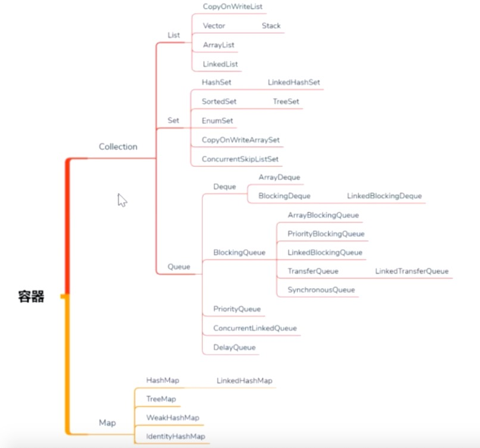

# 四.Collection,Map并发容器



## 1.Hashtable,HashMap,synchronizedMap,ConcurrentHashMap比较

代码：com.liyuan3210.juc.c05.map

```
Hashtable		线程安全
HashMap			线程不安全
synchronizedMap()	与Hashtable效率相当
ConcurrentHashMap	 插入效率低，读取效率高
```

## 2.以卖票系统为例，比较ArrayList，Vector，LinkedList，ConcurrentLinkedQueue

代码：com.liyuan3210.juc.c05.collection

```

```

## 3.容器

代码：com.liyuan3210.juc.c05.queue

```
总结：
1：对于map/set的选择使用(线程不安全)
HashMap	无序,遍历效率低
TreeMap	有序，使用红黑树，平衡
LinkedHashMap	无序，链表接口，查询效率会变高

2.线程安全
Hashtable
HashMap+Collections.sychronizedXXX	//等同Hashtable

3.线程安全,高并发(无锁cas实现)
ConcurrentHashMap
ConcurrentSkipListMap 排好序，在链表基础上加上分段索引（cas在tree上实现非常复杂，然后实现skip）

3：队列
ArrayList
LinkedList
Collections.synchronizedXXX
CopyOnWriteList		写时候加索，读的时候不加索。使用在写少读多情况
Queue
	CocurrentLinkedQueue 	//concurrentArrayQueue,内部加锁队列,offer(添加结果返回值表示),add(不成功会报异常) | poll（取出值并移除），peek（只取出）
	BlockingQueue			//阻塞队列
		LinkedBQ	//无界队列 put(满了就阻塞)，take（为空就阻塞）
		ArrayBQ		//有界队列	put(满了就阻塞)，
		TransferQueue	//transfer('data')是阻塞（确认数据已取走），另一个线程take后才往下走，多个生产对应多个消费线程基于SynchronusQueue
		SynchronusQueue	 //同步数据交换，put阻塞，消费线程take后才往下走，1对1线程
	DelayQueue执行定时任务	  //自定义方法根据规则，根据时间规则调度
		PriorityQueue 					//内部二叉树实现排序
		
代码:
	T01_ConcurrentMap		//高并发集合
	T02_CopyOnWriteList		//写时复制。写时效率低,读时效率高(读没加锁),适合写少都多情况
	T03_SynchronizedList	//synchronizedList返回加锁集合
	T04_ConcurrentQueue		//内部加锁Queue常用操作,offer类似add,poll类似remove,peek拿出来但不从队列删除
	T05_LinkedBlockingQueue //阻塞队列,生产消费队列使用
	T06_ArrayBlockingQueue  //有界队列
	T07_DelayQueue			//定时任务执行
	T08_TransferQueue		//消费者先启动(transfer找不到消费者会阻塞),再启动生产者
	T09_SynchronusQueue		//容量为零,put阻塞,等待消费者消费(用add会报错)
	
	list queue区别？
	对线程提供友好的api offer,peek,poll
	blocking阻塞：put,take


ConcurrentHashMap	无序,迭代效率低
ConcurrentSkipListMap 排好序，在链表基础上加上分段索引
TreeMap	使用红黑树，
linkHashMap	使用链表，迭代查询效率高

CopyOnWriteArrayList	写时候加索，读的时候不加索。使用在写少读多情况

BlockingQueue 阻塞队列
						无界
						有界

```

