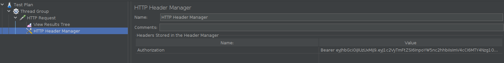
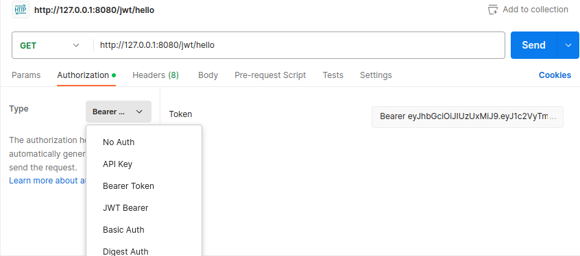

# java多线程高并发

```
官网api：
https://docs.oracle.com/javase/8/docs/api/index.html
示例源码：
https://github.com/liyuan3210/java/juc
```

### 概要

```
一。线程基础

二。并发编程的三大特征

三。锁

四。阻塞队列

五。线程池

六。并发集合

七。JUC并发工具

八。异步编程
```

## [一．线程，synchronized基础](1-thread-sync.md)

代码：com.liyuan3210.juc.c00	，	com.liyuan3210.juc.c01

```
synchronized升级，CAS,volatile,AtomicXXX原理
```

## [二．concurrent多线程类](2-concurrent.md)

代码：com.liyuan3210.juc.c02

```
ReentrantLock，CountDownLatch，CyclicBarrier．．．线程同步容器，基于AQS实现
```

## [三.生产消费容器demo,读源码规则](3-concurrent.md)

代码：com.liyuan3210.juc.c03，com.liyuan3210.juc.c04

```
demo1(2个进程一个进行add数据，另一个进程监控数量给出提示并退出)
demo2(生产消费demo，2个生产线程，10个消费线程)
AQS源码阅读
VarHandle(普通属性原子操作，比反射快，直接操作二进制码)

代码：com.liyuan3210.juc.c04
	java四种引用‘强软弱虚’与TheadLocal
	
JUC:	java.util.concurrent.*			//高并发工具类
AQS:	AbstractQueuedSynchronizer.*	//所有锁的核心
CAS：	AQS底层实现是CAS
```

## [四.Collection,Map并发容器](4-collection-map.md)

代码：com.liyuan3210.juc.c05

```
买票系统实现demo（List，Vector，ConcurrentLinkedQueue）
Map
queue
A1B2C3各种实现
```

## [五．线程池](5-thread-pool.md)

代码：com.liyuan3210.juc.c06

```
...
```

## 六．JMH,Disruptor

相对遍历　链表　一定　比　数组低

## 七.jMeter使用

网络参考

https://www.cnblogs.com/spareyaya/p/12807638.html

**代码**：https://github.com/liyuan3210/java/tree/master/frame/demo/jwt

```
一。jmeter简单使用
1.安装
https://jmeter.apache.org/
并准备启动好测试java项目jwt

2.切换成简体中文
菜单栏的Options->Choose Language->Chinese(Simplified)

3.新建一个简单的测试计划
默认打开jmeter会默认新建一个测试计划“Test Plan”（我们也可以新建一个测试计划File->new）
3.1）创建线程组（Threads group）
右键点击TestPlan->添加->线程（用户）->线程组
3.2）创建http请求
完成后选择线程组(Thread Group)，在这个线程组上点击右键，添加->取样器（sampler）->HTTP请求

4.添加“查看结果树”（View Results Tree）与“聚合报告”（Summary Report）
查看结果树，聚合报告 可以放在“测试计划”，“线程组”，“Http请求”。
放在“测试计划”里面表示监控真个测试计划，如果放在“线程组”表示监控这一个线程组，放在单独http请求里面，表示只监控这一个接口

5.根据简单例子获取token
http://127.0.0.1:8080/jwt/login

6.根据获取token 配置授权，调用授权接口
选中“http请求头右键”添加->配置原件(config element)->HTTP信息头管理器(Http header manager)Authorization
http://127.0.0.1:8080/jwt/hello


7.线程组配置介绍
number。。。:一次发X次请求
Ramp。。。。：0（点击压测开始一刹那发X次请求）或数字为 n（表示n秒要发X次请求）
Loop。。。。：表示循环上面步骤多少次


二。jmeter高级使用
1.共享配置
2.线程并行，顺序
3.参数
```

### jmeter授权配置与postman授权配置，及各种授权的区别？？？

jmeter授权配置
选中“http请求头右键”添加->配置原件(config element)->HTTP Authorization Manager/


 postman授权配置


参考
postman的Authorization <br/>
https://zhuanlan.zhihu.com/p/470189410<br/>
jmeter 新增带token的http请求<br/>
https://blog.csdn.net/fwk19840301/article/details/123046759<br/>