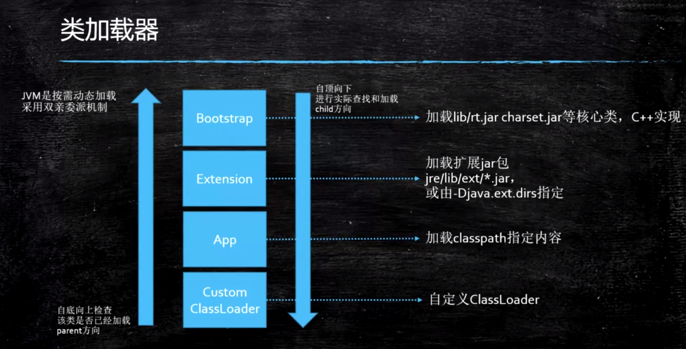

# jvm

## 一．jvm基础

### 1.虚拟机基础概念

#### 1.1.jvm概念


#### 1.2 java语言与jvm

jvm跟java无关

https://docs.oracle.com/en/java/javase/13/index.html

栏目Specifications>Language and VM:

java Language specification:  java语言规范(规定java语法)

**java virtual Machine specification**:　虚拟机规范(java虚拟机规范)

#### 1.3 vm虚拟机语言规范

根据java虚拟机jvm规范设计一套语言(涉及到流程点如下)


#### 1.4虚拟机有不同的标准

oracle是Ｈotspot，除了oracle还有其它标准如下


### 2.class文件结构

java类文件格式???（根据官网文档查找）

#### 2.1默认会添加构造方法

源码

```java
package com.liyuan3210.jvm.bytecode;
public class Bytecode01 {
}
```

class文件(idea反编译)

```java
package com.liyuan3210.jvm.bytecode;
public class Bytecode01 {
    public Bytecode01() {
    }
}
```

#### 2.2二进制，十六进制格式

class二进制打开就是01010,用16进制不同编辑器打开

nppd或ideal插件（有很多工具）

在idea安装:BinEd-Binary/Hexadecimal Editor

在idea使用:File->open As Binary


#### 2.4javap与idea插件(明细)

 javap-v file.class

在ideal中javap 实现：选中class文件->view->show bytecode

在ideal安装：jclasslib Bytecode viewer

在idea使用：选中class文件->view->show bytecode with jclasslab

#### 2.5格式定义


参考jvm官方文档.

x86是基于寄存器的，jvm是基于栈的，不同的体系

#### 2.6jvm汇编指令

???

### 3.内存加载过程

3.1类加载初始化


3.2类加载器



双亲委派，为了安全(防止自己定义覆盖java核心类型)

3.3类加载器范围

3.4自定义加载器


4.运行时内存结构

5.jvm常用指令

6.gc优化

## 二．jvm调优实战


