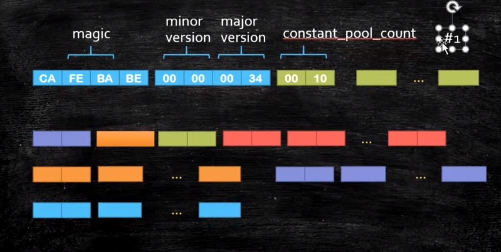

# 2.class文件结构

java类文件格式???（根据官网文档查找）

#### 2.1默认会添加构造方法

源码

```java
package com.liyuan3210.jvm.bytecode;
public class Bytecode01 {
}
```

class文件(idea反编译)

```java
package com.liyuan3210.jvm.bytecode;
public class Bytecode01 {
    public Bytecode01() {
    }
}
```

#### 2.2二进制，十六进制格式

class二进制打开就是01010,用16进制不同编辑器打开

nppd或ideal插件（有很多工具）

在idea安装:BinEd-Binary/Hexadecimal Editor

在idea使用:File->open As Binary



#### 2.4javap与idea插件(明细)

 javap-v file.class

在ideal中javap 实现：选中class文件->view->show bytecode

在ideal安装：jclasslib Bytecode viewer

在idea使用：选中class文件->view->show bytecode with jclasslab

#### 2.5格式定义


参考jvm官方文档.

x86是基于寄存器的，jvm是基于栈的，不同的体系

#### 2.6jvm汇编指令

???