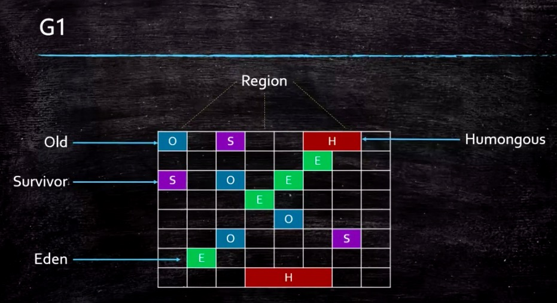

# G1介绍，三色标记算法

## G1特点

并发收集

压缩空闲空间不会延长GC暂停时间

更易预测的GC暂停时间

适用不需要更实现很高的吞吐量场景

## G1内存结构（逻辑分代，物理不分代）

## 基本概念

1.Car table（与垃圾回收器无关）

【年轻代】【老年代】	

由于做YGC时，需要扫描整个OLD区，效率非常低，设计car table。

如果一个OLD区Car table中有对象指向Y区，就将它设置为dirty,下次扫描时

只需要扫描Car table。Car table用BitMap实现

2.CSet = collection set

一组可被回收的分区集合

在CSet中存活的数据会在GC过程中移动到另一个可用分区，

CSet中的分区可以来自Eden,survivor,old区。

CSet会占用不到整个堆空间1%大小

3.RSet = remembered set（是G1高效回收关键，但占用空间大，ZGC取消，占10%）

记录了其它region中的对象到本region对象到引用。

使垃圾收集器不需要扫描整个堆栈，谁引用了当前分区中的对象

4.humongous object

超过单个region的50% 

## 阿里多租户JVM(前沿)

.没租户单空间

.session based GC	

## G1参数指定

.新老年代一般不需要指定（jvm会动态调整）

.region大小可以指定

## GC何时触发

.YGC

​	-eden空间不足

​	-多线程并行执行

.FGC

​	-old空间不足

​	-system.gc()

.G1垃圾回收类型

YGC , MixedgGC , FULLGC(java10之前是串行FullGC ,之后是并行FullGC )

## MixedgGC（混合回收不分年轻代，老年代） = CMS

.减少FGC方法之一，降低MixedgGC 触发预值，让MixedgGC提早发生

MixedgGC作用和cms类似，垃圾回收流程也和CMS类似，

MixedgGC回收如下：

1.初始标记STW

2.并发标记

3.最终标记STW(重新标记)

4.筛选回收STW (并行)

## 三色标记算法（cms,g1）

难点是，在标记对象过程中，对象引用关系正发生改变

黑色：自身，成员变量均已标记

灰色：自身被标记，成员变量未标记

白色：未被标记代对象

### 漏标（下面两个条件同时满足才会漏标）

.在标记过程中，黑色指向了白色，如果不对黑色重新扫描，则会漏标

会把白色d对象当做没有新引用指向，从而回收

.在标记过程中，mutator删除了所有从灰色到白色的引用，会产生漏标，

此时白色对象被回收

### 解决方法（打破上面两种其中一个即可）：

1.incremental update --增量更新，关注引用的增加，

把黑色重新标记为灰色，下次重新扫描属性（CMS使用）

2.SATB snapshot at the beginning- 关注引用的删除

当黑色->白色消失时，要把这个引用推到GC的堆栈，

保证白色还能被扫描到（SATB配合RSet，不需要重新扫描效率高，G1使用）

## 垃圾回收器分别使用算法：

CMS,G1: 使用三色标记

ZGC : 颜色指针

