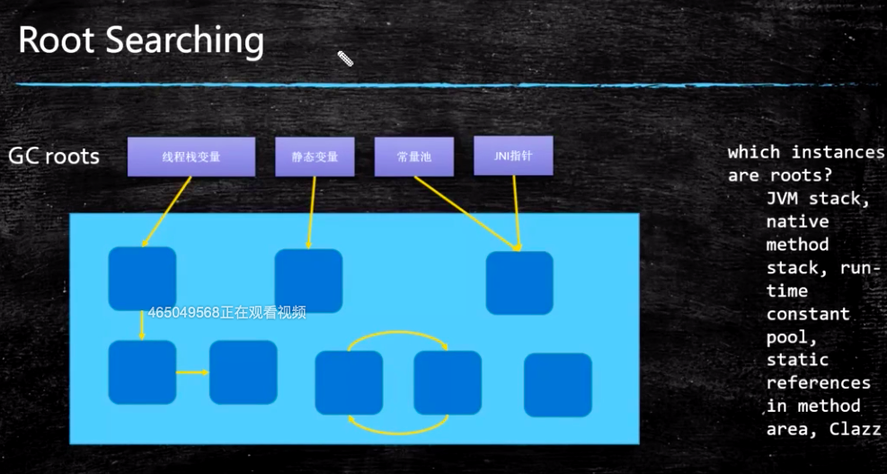
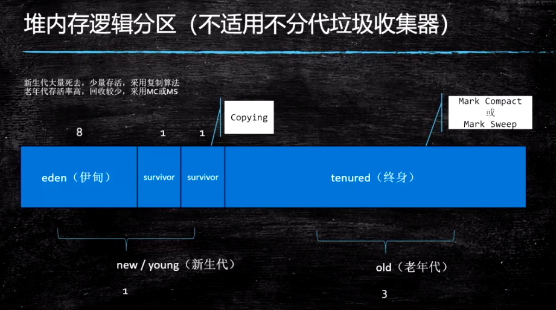
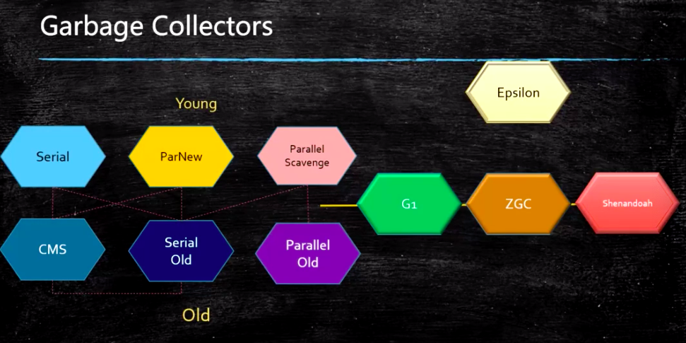
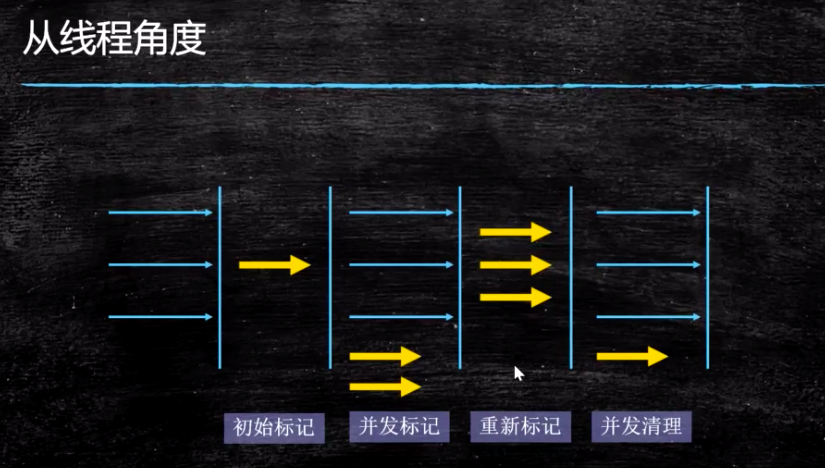

# gc垃圾回收理论


示例源码：

```
https://github.com/liyuan3210/java/jvm
com.liyuan3210.jvm.gc
```

除epsilon（调试） ，zgc，shenandoah之外的gc都是分代模型

⬇

1.8前（包含1.8）逻辑分代，物理分代

G1逻辑分代，物理不分

##  一．分带模型

跟可达算法：



分带逻辑分区



#### 1.如何定位垃圾

1. 引用计数（ReferenceCount）
2. 根可达算法(RootSearching)(jvm使用的)

#### 2.常见的垃圾回收算法

1. 标记清除(mark sweep) - 位置不连续 产生碎片 效率偏低（两遍扫描）
2. 拷贝算法 (copying) - 没有碎片，浪费空间
3. 标记压缩(mark compact) - 没有碎片，效率偏低（两遍扫描，指针需要调整）

#### 3.新生代 + 老年代 + 【永久代（1.7）Perm Generation/ 元数据区(1.8) Metaspace】

1. 永久代 元数据 - Class
2. 永久代必须指定大小限制 ，元数据可以设置，也可以不设置，无上限（受限于物理内存）
3. 字符串常量 1.7 - 永久代，1.8 - 堆
4. MethodArea逻辑概念 = 永久代、元数据

## 二．常见垃圾组合



1.serial + serial old（jdk诞生，单线程回收)

2.parallel scavenge + parallel old (1.8默认，多线程回收)

3.parNew + cms	(可以搭配调整，不打段应用并行回收，但问题较多)

浮动垃圾过会出发stw,切换成serial old(等待时间会非常慢)浮动垃圾



### 常见垃圾回收器组合参数设定：(1.8)

- -XX:+UseSerialGC = Serial New (DefNew) + Serial Old
  - 小型程序。默认情况下不会是这种选项，HotSpot会根据计算及配置和JDK版本自动选择收集器
- -XX:+UseParNewGC = ParNew + SerialOld
  - 这个组合已经很少用（在某些版本中已经废弃）
  - https://stackoverflow.com/questions/34962257/why-remove-support-for-parnewserialold-anddefnewcms-in-the-future
- -XX:+UseConc(urrent)MarkSweepGC = ParNew + CMS + Serial Old
- -XX:+UseParallelGC = Parallel Scavenge + Parallel Old (1.8默认) 【PS + SerialOld】
- -XX:+UseParallelOldGC = Parallel Scavenge + Parallel Old
- -XX:+UseG1GC = G1
- Linux中没找到默认GC的查看方法，而windows中会打印UseParallelGC 
  - java +XX:+PrintCommandLineFlags -version
  - 通过GC的日志来分辨
- Linux下1.8版本默认的垃圾回收器到底是什么？
  - 1.8.0_181 默认（看不出来）Copy MarkCompact
  - 1.8.0_222 默认 PS + PO


### 三．JVM调优第一步，了解JVM常用命令行参数

- JVM的命令行参数参考：https://docs.oracle.com/javase/8/docs/technotes/tools/unix/java.html

- HotSpot参数分类

  > 标准： - 开头，所有的HotSpot都支持
  >
  > 非标准：-X 开头，特定版本HotSpot支持特定命令
  >
  > 不稳定：-XX 开头，下个版本可能取消

  java -version

  java -X

常见命令使用：

查看-XX所有参数

java -XX:+PrintFlagsFinal -version

查看新生代 与 老年代 比例（查找命令）

java -XX:+PrintFlagsFinal -version | grep NewRatio


#### 四．三色标记（标记算法）???：

cms		三色标记	+	incremental update

g1			三色标记  + satb算法（配合rset进行）

zgc				coloredPointer（颜色指针算法）+写屏障？

shenandoah	coloredPointer（颜色指针算法）+读屏障？

