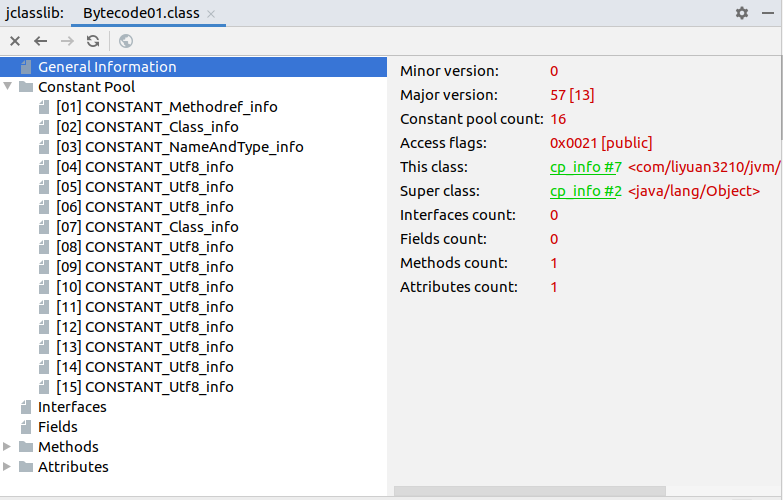
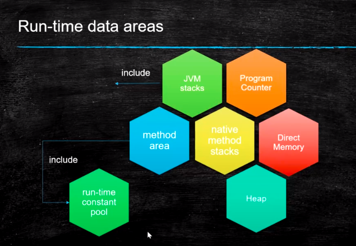
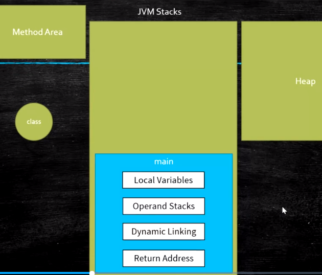

# jvm

## 目录

### 概要(当前页面)

[1.虚拟机基础概念](#)

[2.class文件结构](#)

[3.内存加载过程](#)

[4.jmm内存模型](#)

[5.运行时内存结构 / jvm常用指令](#)

### gc调优(点击跳转)

[6.jvm调优实战-理论](#gc-tuning.md)

[7.1jvm调优实战-1](#gc-tuning.md)

[7.2jvm调优实战-2](#gc-tuning.md)

[7.3jvm调优参数配置](#gc-tuning.md)

[8.G1介绍，三色标记算法](#gc-tuning.md)

#### 语言的发展

* c/c++

  ---手动管理 malloc , free / new delete

  ---忘记释放 -memory leak(内存泄露) 会导致 -out of memory（内存溢出）

  ---释放多次 -释放一次的时候，已经有另外进程使用此内存地址了，会导致使用的程序出现异常问题

  ---开发效率低

  优点：运行效率高

* java python go

  ---java空指针问题（野指针问题依然没解决）

  ---存在gc线程，cpu利用率低

  优点：

  方便内存管理

  GC -Garbage Collector(应用线程只管分配，垃圾回收器负责回收)

  开发效率高，降低程序员门槛，

* rust

  --- 学习难度高

  优点：

  ---运行效率高（asm,c++）

  ---不用手动管理内存，没有gc

  ---ownership(栈消失，堆空间内存直接进行清理)，只要语法通过，就不会有bug

##### java线程死锁，内存分析

```
https://blog.51cto.com/u_16213336/7225274
1）查看java线程
jps -l
2）查看java线程信息
jstack pid
可以使用JConsole、VisualVM或者Java Mission Control等
3）dump文件
jstack -l pid > dump.log    //这里的-l选项表示详细列出线程的状态等信息
jstack -m pid > dump.log    //这里的-m选项表示只保存最小化的信息。
进程内存镜像信息
```

#### 问题

```
1.JIT编译模型
2.JVM栈空间分配
3.G1，ZGC,shenandoah模型
```

## 一。虚拟机基础概念

#### 1.1.jvm概念


#### 1.2 java语言与jvm

jvm跟java无关

https://docs.oracle.com/en/java/javase/13/index.html

栏目Specifications>Language and VM:

java Language specification:  java语言规范(规定java语法)

**java virtual Machine specification**:　虚拟机规范(java虚拟机规范)

#### 1.3 vm虚拟机语言规范

根据java虚拟机jvm规范设计一套语言(涉及到流程点如下)


#### 1.4虚拟机有不同的标准

oracle是Ｈotspot，除了oracle还有其它标准如下


## 二。class文件结构

java类文件格式???（根据官网文档查找）

示例源码：

```
https://github.com/liyuan3210/java/jvm
com.liyuan3210.jvm.bytecode
```

#### 2.1默认会添加构造方法

源码

```java
package com.liyuan3210.jvm.bytecode;
public class Bytecode01 {
}
```

class文件(idea反编译)

```java
package com.liyuan3210.jvm.bytecode;
public class Bytecode01 {
    public Bytecode01() {
    }
}
```

#### 2.2二进制，十六进制格式

class二进制打开就是01010,用16进制不同编辑器打开

nppd或ideal插件（有很多工具）

在idea安装:BinEd-Binary/Hexadecimal Editor

在idea使用:File->open As Binary


#### 2.4javap与idea插件(显示class二进制明细)

 javap-v file.class		//java命令查看

在ideal中javap 实现：选中class文件->view->show bytecode

在ideal安装：jclasslib Bytecode viewer

在idea使用：选中class文件->view->show bytecode with jclasslab

#### 2.5格式定义



参考jvm官方文档.

x86是基于寄存器的，jvm是基于栈的，不同的体系

#### 2.6jvm汇编指令

???

## 三。内存加载过程

示例源码：

```
https://github.com/liyuan3210/java/jvm
com.liyuan3210.jvm.classloader
```

## 3.1类加载初始化


```
loading
	类加载
linking
	verification:校验class文件格式
	preparation:赋默认值(如代码声明变量i=2,这一步赋0)
	resolution:class文件常量池符号引用转换成直接内存地址
initializing
	调用静态代码块赋初始值
```

＇T01_ClassLoadingProcedure＇

## 3.2类加载器


双亲委派 是为了安全(防止自己定义覆盖java核心类型)

## 3.3类加载器范围

来自Launcher源码

```
- sun.boot.class.path
	.Bootstrap.ClassLoader加载路径
- java.ext.dir
	.ExtensionClassLoader加载路径
- java.class.path
	.AppClassLoader加载路径
```

com.liyuan3210.jvm.classloader.T03_ClassLoaderScope

## 3.4自定义加载器

T05_LoadClassByHand

T06_MSBClassLoader	自定义加载

T11_ClassReloading1，T12_ClassReloading2　自定义重新load(实现热部署)

## other:

CompilerApi：	在内存中编译源码成class

.class文件加密：T07_MSBClassLoaderWithEncription

.lazyloading用到时候才去加载：T08_LazyLoading

```
．严格讲应该叫lazyloading
．jvm规范并没有规定何时加载
．但是严格规定了什么时候必须初始化
	－new getstatic putstatic invokestatic指令，访问final变量除外
	－java.lang.reflect对类进行反射调用时
	－初始化子类的时候，父类首先初始化
	－虚拟机启动时，被执行的主类必须初始化
	－动态语言支持java.lang.invoke.MethhodHandle解析的结果为
	REF_getstatic REF_putstatic REF_invokestatic的方法句柄时，该类必须初始化
```

.混合模式：T09_WayToRun（需要指定参数）

```
.解释器
	－bytecode intepreter
.JIT
	－Just In-Time compiler
.混合模式
	－混合使用解释器＋热点代码编译
	－起始阶段采用解释执行
	－热点代码检测
		．多次被调用的方法（方法计数器：检测方法执行频率）
		．多次被调用的循环（循环计数器：检测循环执行频率）
		．进行编译
参数：
.-Xmixed 默认为混合模式开始解释执行，启动速度较快对热点代码实行检测和编译
.-Xint 使用编译模式，启动很快执行稍慢
.-Xcomp 使用纯编译模式，执行很快，启动很慢

demo:
com.liyuan3210.jvm.classloader.T009_WayToRun
```

## 四。jmm内存模型

#### 硬件层数据一致性

协议很多

intel 用MESI

https://www.cnblogs.com/z00377750/p/9180644.html

现代CPU的数据一致性实现 = 缓存锁(MESI ...) + 总线锁

读取缓存以cache line为基本单位，目前64bytes

位于同一缓存行的两个不同数据，被两个不同CPU锁定，产生互相影响的伪共享问题

伪共享问题：JUC/c_028_FalseSharing

使用缓存行的对齐能够提高效率

#### 乱序问题

CPU为了提高指令执行效率，会在一条指令执行过程中（比如去内存读数据（慢100倍）），去同时执行另一条指令，前提是，两条指令没有依赖关系

https://www.cnblogs.com/liushaodong/p/4777308.html

写操作也可以进行合并

https://www.cnblogs.com/liushaodong/p/4777308.html

JUC/029_WriteCombining

乱序执行的证明：JVM/jmm/Disorder.java

原始参考：https://preshing.com/20120515/memory-reordering-caught-in-the-act/

#### 如何保证特定情况下不乱序

硬件内存屏障 X86

> sfence: store| 在sfence指令前的写操作当必须在sfence指令后的写操作前完成。 lfence：load | 在lfence指令前的读操作当必须在lfence指令后的读操作前完成。 mfence：modify/mix | 在mfence指令前的读写操作当必须在mfence指令后的读写操作前完成。

> 原子指令，如x86上的”lock …” 指令是一个Full Barrier，执行时会锁住内存子系统来确保执行顺序，甚至跨多个CPU。Software Locks通常使用了内存屏障或原子指令来实现变量可见性和保持程序顺序

JVM级别如何规范（JSR133）

> LoadLoad屏障： 对于这样的语句Load1; LoadLoad; Load2，
>
> ```
> 在Load2及后续读取操作要读取的数据被访问前，保证Load1要读取的数据被读取完毕。
> ```
>
> StoreStore屏障：
>
> ```
> 对于这样的语句Store1; StoreStore; Store2，
> 
> 在Store2及后续写入操作执行前，保证Store1的写入操作对其它处理器可见。
> ```
>
> LoadStore屏障：
>
> ```
> 对于这样的语句Load1; LoadStore; Store2，
> 
> 在Store2及后续写入操作被刷出前，保证Load1要读取的数据被读取完毕。
> ```
>
> StoreLoad屏障： 对于这样的语句Store1; StoreLoad; Load2，
>
> 	在Load2及后续所有读取操作执行前，保证Store1的写入对所有处理器可见。

volatile的实现细节

1. 字节码层面 ACC_VOLATILE

2. JVM层面 volatile内存区的读写 都加屏障

   > StoreStoreBarrier
   >
   > volatile 写操作
   >
   > StoreLoadBarrier

   > LoadLoadBarrier
   >
   > volatile 读操作
   >
   > LoadStoreBarrier

3. OS和硬件层面 https://blog.csdn.net/qq_26222859/article/details/52235930 hsdis - HotSpot Dis Assembler windows lock 指令实现 | MESI实现

synchronized实现细节

1. 字节码层面 ACC_SYNCHRONIZED monitorenter monitorexit
2. JVM层面 C C++ 调用了操作系统提供的同步机制
3. OS和硬件层面 X86 : lock cmpxchg / xxx [https](https://blog.csdn.net/21aspnet/article/details/88571740)[://blog.csdn.net/21aspnet/article/details/](https://blog.csdn.net/21aspnet/article/details/88571740)[88571740](https://blog.csdn.net/21aspnet/article/details/88571740)

#### [agent机制](jvm-mm-agent.md)

java的class加载到内存，会有个agent代理机制，通过这个机制可以改变class信息,内部可以通过代理进行调试虚拟机。

可以通过简单的demo来查看java对象load到内存时实际占多大内存。

## 五。运行时内存结构 / jvm常用指令

示例源码：

```
https://github.com/liyuan3210/java/jvm
com.liyuan3210.jvm.runtime
```

#### 1.运行时

1.运行时区域



2.运行时独有,共享区


一个线程是一个jvm stacks(栈)，每个方法对应一个栈帧

#### 2.指令

##### 指令集

Method Area:方法区存的是class信息，常量池

Heap：new 出来对象内存存放区域

##### 分类:

	1.基于寄存器的指令集
	
	2.基于栈的指令集 Hotspot中的Local Variable Table = JVM中的寄存器

代码示例：

```java
    public static void main(String[] args) {
        int i = 8;
        //i = i++;
        i = ++i;
        System.out.println(i);
    }
```

```
 0 bipush 8
 2 istore_1
 3 iinc 1 by 1
 6 iload_1
 7 istore_1
 8 getstatic #7 <java/lang/System.out>
11 iload_1
12 invokevirtual #13 <java/io/PrintStream.println>
15 return

```

介绍：

**Local varialbes(局部变量)**		==	寄存器						
**operand stacks(操作数栈)**

```

bipush 8 	表示将8压到 操作数栈
istore_1	表示将1号位置操作数栈压到 局部变量
iinc 1 by 1	 表示将局部变量1中的数自增1
iload_1		 表示将局部变量压入栈顶
istore_1	表示将1号位置操作数栈压到 局部变量
...
```

#### 3.栈与堆

JVM Stack

1. Frame - 每个方法对应一个栈帧
   1. Local Variable Table
   2. Operand Stack 对于long的处理（store and load），多数虚拟机的实现都是原子的 jls 17.7，没必要加volatile
   3. Dynamic Linking https://blog.csdn.net/qq_41813060/article/details/88379473 jvms 2.6.3
   4. return address a() -> b()，方法a调用了方法b, b方法的返回值放在什么地方

Heap

Method Area

1. Perm Space (<1.8) 字符串常量位于PermSpace FGC不会清理 大小启动的时候指定，不能变
2. Meta Space (>=1.8) 字符串常量位于堆 会触发FGC清理 不设定的话，最大就是物理内存

Runtime Constant Pool

Native Method Stack

Direct Memory

> JVM可以直接访问的内核空间的内存 (OS 管理的内存)
>
> NIO ， 提高效率，实现zero copy


内存溢出种类：

```
1.堆内存
2.栈溢出
3.直接内存溢出
4.方法区内存溢出
```