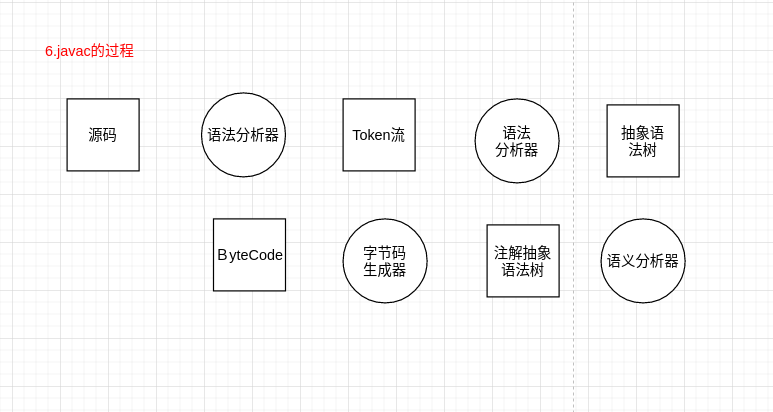

# 1.虚拟机基础概念

#### 1.1.jvm概念

#### 1.2 java语言与jvm

jvm跟java无关

https://docs.oracle.com/en/java/javase/13/index.html

栏目Specifications>Language and VM:

java Language specification:  java语言规范(规定java语法)

**java virtual Machine specification**:　虚拟机规范(java虚拟机规范)

#### 1.3 vm虚拟机语言规范

根据java虚拟机jvm规范设计一套语言(涉及到流程点如下)

#### 1.4虚拟机有不同的标准

oracle是Ｈotspot，除了oracle还有其它标准如下

