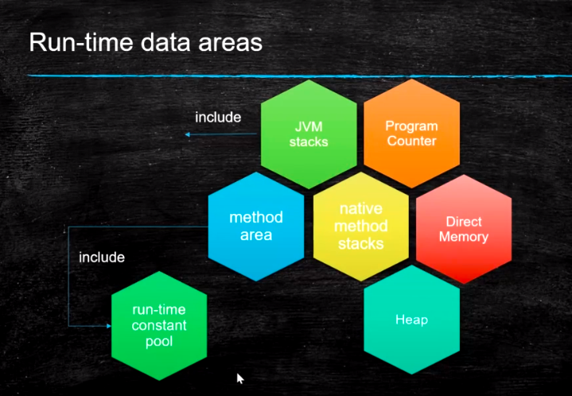
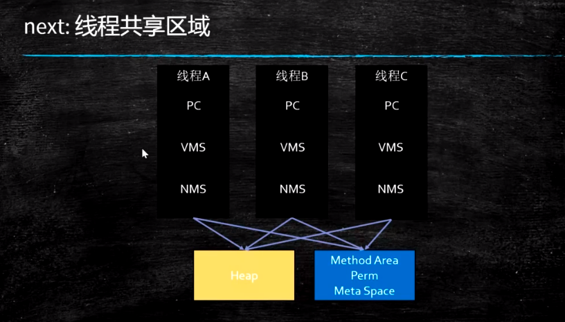
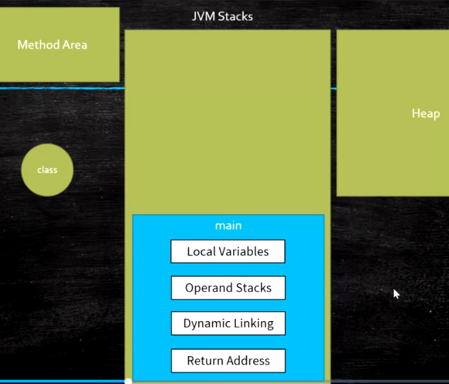

# jvm运行时

示例源码：

```
https://github.com/liyuan3210/java/jvm
com.liyuan3210.jvm.runtime
```

## 一.运行时

1.运行时区域



2.运行时独有,共享区



一个线程是一个jvm stacks(栈)，每个方法对应一个栈帧

## 二.指令

### 指令集

Method Area:方法区存的是class信息，常量池

Heap：new 出来对象内存存放区域

### 分类:

​	1.基于寄存器的指令集

​	2.基于栈的指令集 Hotspot中的Local Variable Table = JVM中的寄存器

代码示例：

```java
    public static void main(String[] args) {
        int i = 8;
        //i = i++;
        i = ++i;
        System.out.println(i);
    }
```

```
 0 bipush 8
 2 istore_1
 3 iinc 1 by 1
 6 iload_1
 7 istore_1
 8 getstatic #7 <java/lang/System.out>
11 iload_1
12 invokevirtual #13 <java/io/PrintStream.println>
15 return

```

介绍：

**Local varialbes(局部变量)**		==	寄存器						
**operand stacks(操作数栈)**

```

bipush 8 	表示将8压到 操作数栈
istore_1	表示将1号位置操作数栈压到 局部变量
iinc 1 by 1	 表示将局部变量1中的数自增1
iload_1		 表示将局部变量压入栈顶
istore_1	表示将1号位置操作数栈压到 局部变量
...
```

## 三.栈与堆

JVM Stack

1. Frame - 每个方法对应一个栈帧
   1. Local Variable Table
   2. Operand Stack 对于long的处理（store and load），多数虚拟机的实现都是原子的 jls 17.7，没必要加volatile
   3. Dynamic Linking https://blog.csdn.net/qq_41813060/article/details/88379473 jvms 2.6.3
   4. return address a() -> b()，方法a调用了方法b, b方法的返回值放在什么地方

Heap

Method Area

1. Perm Space (<1.8) 字符串常量位于PermSpace FGC不会清理 大小启动的时候指定，不能变
2. Meta Space (>=1.8) 字符串常量位于堆 会触发FGC清理 不设定的话，最大就是物理内存

Runtime Constant Pool

Native Method Stack

Direct Memory

> JVM可以直接访问的内核空间的内存 (OS 管理的内存)
>
> NIO ， 提高效率，实现zero copy


内存溢出种类：

```
1.堆内存
2.栈溢出
3.直接内存溢出
4.方法区内存溢出
```

