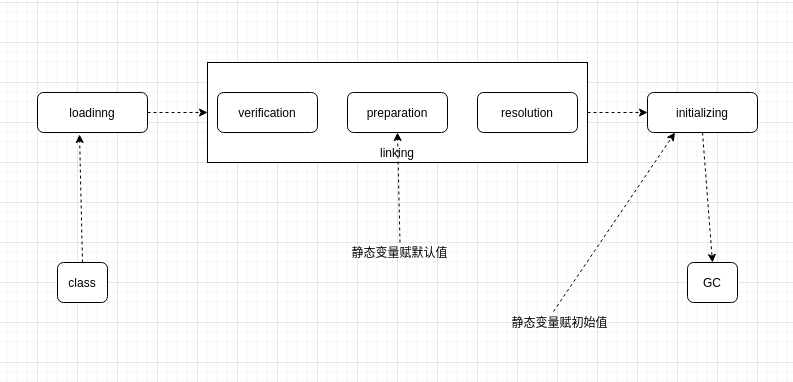

# 3.内存加载过程

## 3.1类加载初始化



```
loading
	类加载
linking
	verification:校验class文件格式
	preparation:赋默认值(如代码声明变量i=2,这一步赋0)
	resolution:class文件常量池符号引用转换成直接内存地址
initializing
	调用静态代码块赋初始值
```

## 3.2类加载器


双亲委派 是为了安全(防止自己定义覆盖java核心类型)

## 3.3类加载器范围

来自Launcher源码

```
- sun.boot.class.path
	.Bootstrap.ClassLoader加载路径
- java.ext.dir
	.ExtensionClassLoader加载路径
- java.class.path
	.AppClassLoader加载路径
```

com.liyuan3210.jvm.classloader.T03_ClassLoaderScope

## 3.4自定义加载器

T05_LoadClassByHand

T06_MSBClassLoader

## other:

CompilerApi：	在内存中编译源码成class

.class文件加密：T07_MSBClassLoaderWithEncription

.lazyloading用到时候才去加载：T08_LazyLoading


.混合模式：T09_WayToRun（需要指定参数）


