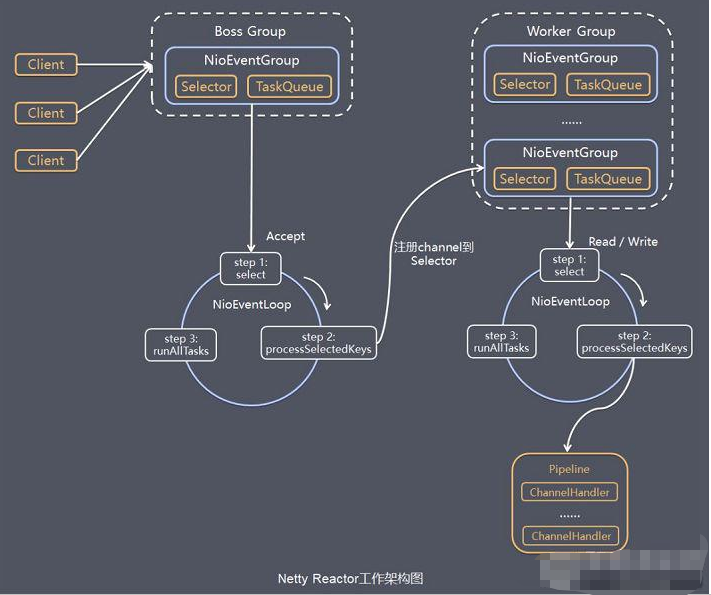
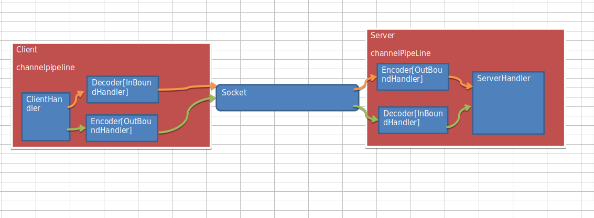
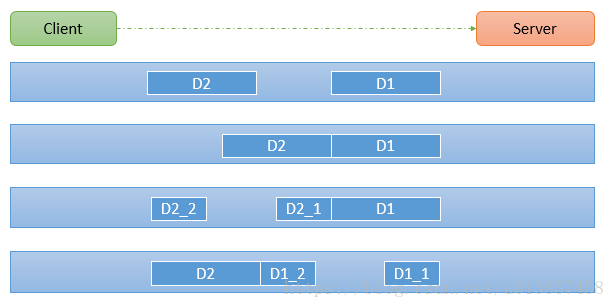

## 三.Netty模型介绍

## Reactor模式(线程模型)

Reactor是**基于多路复用（nio）**的线程模型

**1）单Reactor单线程**

accept与read,write事件还有worker都由一个线程完成

**2）单Reactor多线程**

accept与read,write事件由主线程完成，建立连接后handler任务扔给线程池来处理

**3）主从Reactor多线程（netty从此模型优化）**

accept由主线程处理，建立连接后扔给子线程处理read,write事件，拿到任务后由线程池处理handler

AIO使用了Proactor模式，对比Proactor与Reactor模式？？？

https://blog.csdn.net/KingCat666/article/details/77685608

**单Reactor实例：**

com.liyuan3210.netty.nio.groupchat

## 1.netty线程模型


**channel与pipeline是相互包含关系**

```
1）Netty抽象出两组线程池 BossGroup 专门负责接收客户端的连接, WorkerGroup 专门负责网络的读写
2）BossGroup 和 WorkerGroup 类型都是 NioEventLoopGroup
3）NioEventLoopGroup 相当于一个事件循环组, 这个组中含有多个事件循环 ，每一个事件循环是 NioEventLoop
4）NioEventLoop 表示一个不断循环的执行处理任务的线程， 每个NioEventLoop 都有一个selector , 用于监听绑定在其上的socket的网络通讯
5）NioEventLoopGroup 可以有多个线程, 即可以含有多个NioEventLoop
6）每个Boss NioEventLoop 循环执行的步骤有3步
	6.1）轮询accept 事件
	6.2）处理accept 事件 , 与client建立连接 , 生成NioScocketChannel , 并将其注册到某个worker NIOEventLoop 上的 selector 
	6.3）处理任务队列的任务 ， 即 runAllTasks
7) 每个 Worker NIOEventLoop 循环执行的步骤
	7.1）轮询read, write 事件
7.2）处理i/o事件， 即read , write 事件，在对应NioScocketChannel 处理
7.3）处理任务队列的任务 ， 即 runAllTasks
8) 每个Worker NIOEventLoop  处理业务时，会使用pipeline(管道), pipeline 中包含了 channel , 即通过pipeline 可以获取到对应通道, 管道中维护了很多的 处理器
```

## 2.simple实例（根据简单实例分析）

实例代码：com.liyuan3210.netty.netty.simple

```
例子描述
   1）简单netty实例，启动一个NettyServer服务，服务端监听NettyClient客户端发送消息。
   2）启动NettyClient客户端向NettyServer服务端发送“hello, server: (>^ω^<)喵”，服务端收到后向客户端回复"hello, 客户端~(>^ω^<)喵1"
```


## 3.taskqueue

实例代码：com.liyuan3210.netty.netty.simple

当请求执行的任务时间比较长事就需要放到线程队列里面，保证后面请求能够顺利执行不阻塞（因为为netty是基于nio,nio是单线程基于事件循环的）

三种task典型使用场景：

**１）用户程序自定义的普通任务（把线程放到workGroup task任务队列里面）**

```java
 ctx.channel().eventLoop().execute(new Runnable() {
            @Override
            public void run() {
                try {
                    Thread.sleep(5 * 1000);
                    ctx.writeAndFlush(Unpooled.copiedBuffer("hello, 客户端~(>^ω^<)喵2", CharsetUtil.UTF_8));
                    System.out.println("channel code=" + ctx.channel().hashCode());
                } catch (Exception ex) {
                    System.out.println("发生异常" + ex.getMessage());
                }
            }
});
```

**２）用户自定义定时任务**

```java
ctx.channel().eventLoop().schedule(new Runnable() {
            @Override
            public void run() {
                try {
                    Thread.sleep(5 * 1000);
                    ctx.writeAndFlush(Unpooled.copiedBuffer("hello, 客户端~(>^ω^<)喵4", CharsetUtil.UTF_8));
                    System.out.println("channel code=" + ctx.channel().hashCode());
                } catch (Exception ex) {
                    System.out.println("发生异常" + ex.getMessage());
                }
            }
}, 5, TimeUnit.SECONDS);
```

**３）非当前Reactor线程调用Channel各种方法？？？**

```
    例如在推送系统的业务线程里面，根据用户的标识，找到对应的 Channel 引用，然后调用 Write 类方法向该用户推送消息，就会进入到这种场景。最终的 Write 会提交到任务队列中后被异步消费
```

## 4.异步模型

```
基本介绍：
1)异步的概念和同步相对。当一个异步过程调用发出后，调用者不能立刻得到结果。实际处理这个调用的组件在完成后，通过状态、通知和回调来通知调用者。
2)Netty 中的 I/O 操作是异步的，包括 Bind、Write、Connect 等操作会简单的返回一个 ChannelFuture。
3)调用者并不能立刻获得结果，而是通过 Future-Listener 机制，用户可以方便的主动获取或者通过通知机制获得 IO 操作结果
4)Netty 的异步模型是建立在 future 和 callback 的之上的。callback 就是回调。重点说 Future，它的核心思想是：假设一个方法 fun，计算过程可能非常耗时，等待 fun返回显然不合适。那么可以在调用 fun 的时候，立马返回一个 Future，后续可以通过 Future去监控方法 fun 的处理过程(即 ： Future-Listener 机制)

Future与Future-Listener机制(addListener 方法来注册监听器)
```


## 5.服务程序http入门（过滤指定资源）

实例：com.liyuan3210.netty.http

浏览器每一次请求刷新产生不同的pipeline 和channelPipeline,因为http是无状态的连接

```
ch.pipeline().addLast(new XXXHandler());
ch.pipeline().addFirst(new XXXHandler());
区别？？？=
```

### 6.unpooled类buffer使用???

类似NIO中的ByteBuffer，但有区别。

实例：com.liyuan3210.netty.buf

### 7.群聊系统实现.(思考点对点私聊实现???)

实例：com.liyuan3210.netty.groupchat

### 8.心跳机制实例

当出现程序不可预料的连接断开时，需要心跳检测客户端是否还保持链接(并做相应业务处理)

MyServer启动后需要启动一个客户端连接验证(本例使用groupchat/GroupChatClient.java)

实例：netty.heartbeat

### 9.websocket

http协议升级websocket协议

实例：com.liyuan3210.netty.websocket

### 10. google protoBuff编码解码(效率高解决跨语言问题)

Protocol Buffers官网：https://protobuf.dev/
https://github.com/protocolbuffers/protobuf
百度云盘/liyuandf：云硬盘>env>env-linux>midd>netty>protobuf

**编码与解码数据流向：**

1.客户端向服务端发送数据

客户端（业务数据--->编码）===>二进制码===>服务端（解码--->业务数据）

2.服务端向客户端发送数据

客户端（业务数据<---解码）<===二进制码<===服务端（编码<---业务数据）

**netty自身提供编码与解码器，但会出现如下问题：**

*无法跨语言  *序列化性能太低 *序列化体积太大(是二进制五倍多)

引出方案protoBuff与使用流程：

1）编写.proto文件===>使用命令生成java文件(相关语言的类文件)

```js
syntax = "proto3"; //版本
option java_outer_classname = "StudentPOJO";//生成的外部类名，同时也是文件名
//protobuf 使用message 管理数据
message Student { //会在 StudentPOJO 外部类生成一个内部类 Student， 他是真正发送的POJO对象
    int32 id = 1; // Student 类中有 一个属性 名字为 id 类型为int32(protobuf类型) 1表示属性序号，不是值
    string name = 2;
}
```

2）生成java文件命令：protoc.exe --java_out=. Student.proto

生成的上面文件制定的StudentPOJO.java文件，此文件需要放到工程里面

**代码实例：**

客户端使用protoBuff向服务端发送一个对象数据，服务端收到后并打印出来，并给客户端一个消息回复

com.liyuan3210.netty.codec	

com.liyuan3210.netty.codec2	//如下message，一个message可以定义多个对象

```java
syntax = "proto3";
option optimize_for = SPEED; // 加快解析
option java_package="com.atguigu.netty.codec2";   //指定生成到哪个包下
option java_outer_classname="MyDataInfo"; // 外部类名, 文件名
//protobuf 可以使用message 管理其他的message
message MyMessage {
    //定义一个枚举类型
    enum DataType {
        StudentType = 0; //在proto3 要求enum的编号从0开始
        WorkerType = 1;
    }
    //用data_type 来标识传的是哪一个枚举类型
    DataType data_type = 1;
    //表示每次枚举类型最多只能出现其中的一个, 节省空间
    oneof dataBody {
        Student student = 2;
        Worker worker = 3;
    }1.客户端向服务端发送数据
}
message Student {
    int32 id = 1;//Student类的属性
    string name = 2; //
}
message Worker {
    string name=1;
    int32 age=2;
}
```

### 11.入站与出站机制

为了更好理解入站，出站流程详细见上面“编码与解码数据流向”

**编码与解码：**
数据发送需要编码，数据接收时需要解码

**出站与入站：**
数据出站与入站handler,相对客户端程序/服务端程序，对应不同ChannelPipeline.

```java
//入站
pipeline.addLast("decoder", new StringDecoder());//解码器(相对于“客户端/服务端”接收到的数据都要进行解码，所以为[入站])
//出站
pipeline.addLast("encoder", new StringEncoder());//编码器(相对于“客户端/服务端”要发出的数据都要进行编码，所以为[出站])
```

1.channel**In**boundHandler(入站)
2.channel**Out**boundHandler(出站)
通常在OutboundHandler里面是编码器，InboundHandler里面是解码器

**发送出站数据类型必须与实际处理接受的数据类型一致，否则会跳过处理发送出站数据类型必须与实际处理接受的数据类型一致，否则会跳过处理发送出站数据类型必须与实际处理接受的数据类型一致，否则会跳过处理客户端程序/服务端程序流程：**



**注意：编码与解码数据流向**

发送出站数据类型必须与实际处理接受的数据类型一致，否则会跳过处理


**常用编解码器：**

根据官方api文档查看常用编解码器有哪些，怎么使用？？？


**添加log4j支持：**

（方便查看调试日志）


**实例：**netty.inboundhandlerandoutboundhandler

```
实例要求:  
使用自定义的编码器和解码器来说明Netty的handler 调用机制
客户端发送long -> 服务器
服务端发送long -> 客户端
```

### 12.tcp粘包拆包解决方案

**为什么要有粘包，拆包：**
由于不可能知道远程节点是否会一次性发送一个完整信息，就会出现粘包，拆包。
这个类会对入站数据进行缓冲，直到它准备好被处理



假设客户端分别发送了两个数据包D1和D2给服务端，由于服务端一次读取到字节数是不确定的，故可能存在以下四种情况：
```
1)服务端分两次读取到了两个独立的数据包，分别是D1和D2，没有粘包和拆包
2)服务端一次接受到了两个数据包，D1和D2粘合在一起，称之为TCP粘包
3)服务端分两次读取到了数据包，第一次读取到了完整的D1包和D2包的部分内容，第二次读取到了D2包的剩余内容，这称之为TCP拆包
4)服务端分两次读取到了数据包，第一次读取到了D1包的部分内容D1_1，第二次读取到了D1包的剩余部分内容D1_2和完整的D2包。
```

TCP 粘包和拆包解决方案：
```
*.使用自定义协议 + 编解码器 来解决
*.关键就是要解决 服务器端每次读取数据长度的问题, 这个问题解决，就不会出现服务器多读或少读数据的问题，从而避免的TCP 粘包、拆包 。
```

**代码实例：**

1.演示tcp粘包，拆包（问题演示），com.liyuan3210.netty.tcp

读取的信息很随机

2.粘包，拆包解决方案：com.liyuan3210.netty.protocoltcp

```
发送出站数据类型必须与实际处理接受的数据类型一致，否则会跳过处理看一个具体的实例:
*.要求客户端发送 5 个 Message 对象, 客户端每次发送一个 Message 对象
*.服务器端每次接收一个Message, 分5次进行解码， 每读取到 一个Message , 会回复一个Message 对象 给客户端.
```
