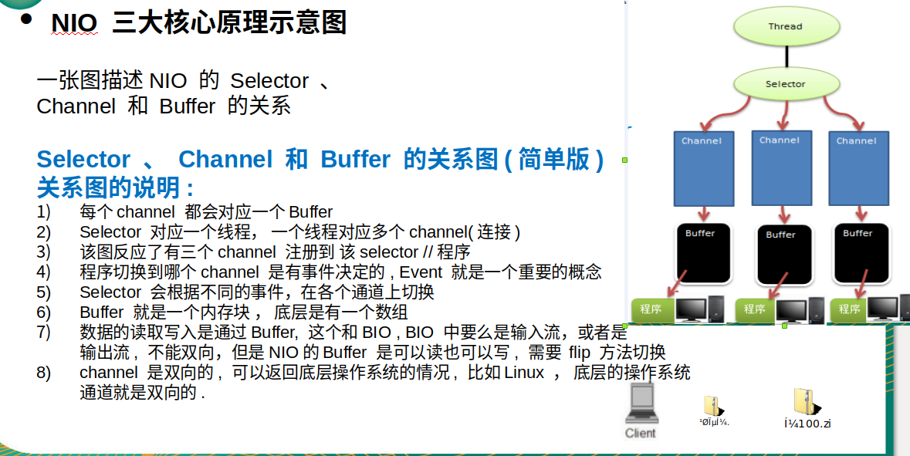

# 二.NIO核心三大组件Buffer,Channel,Selector

## 1.Buffer(缓冲区)

NIO程序－＞Buffer缓冲区－＞文件

四个重要属性：

​	Capacity	容量

​	Limit	限制读取长度

​	Position	下一个要读取的位置

​	Mark	标记

程序是直接操作Buffer的，不能直接操作文件

实例：

1.简单Buffer操作

## 2.Channel（通道）

可以想成一个连接

实例：

1.本地文件写数据

2.本地文件读数据

3.使用一个buffer完成文件读取

4.使用transferFrom完成文件拷贝

5.类型化（读出的类型必须按照写入的类型来读出），只读（只能读取不能写入否则报异常）

6.ＭappedByteBuffer（可以让文件直接在内存中修改，同步到文件由ＮＩＯ完成）？？？

7.scattering 和gathering（分散和聚合）？？？

## 3.Selector（选择器）

能够检测多个通道上是否有事件发生，多个Channel注册到Selector，如果Channel有事件发生，便获取事件对事件进行处理

实例：

1.聊天系统

2.零拷贝案例分析

