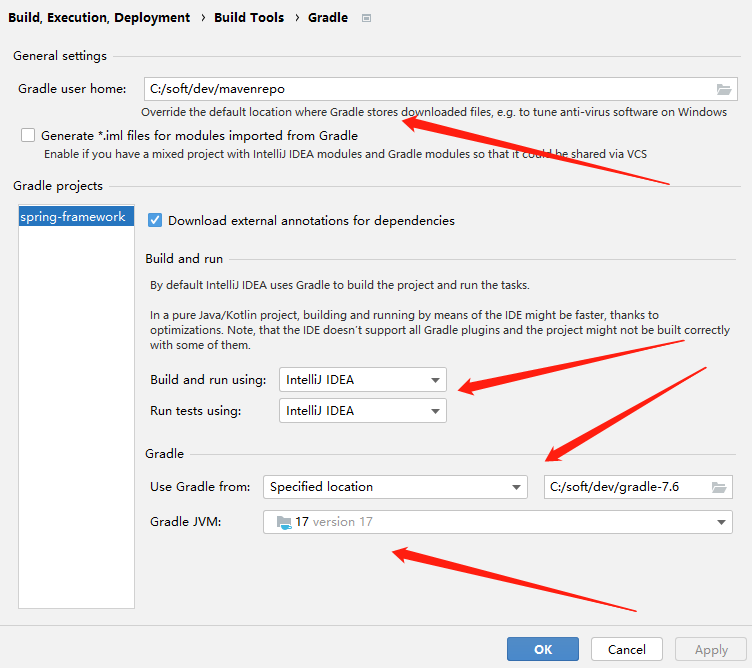

# spring

## 一.spring核心(源码)
```
官网：https://spring.io
核心模块：https://spring.io/projects/spring-framework
github：https://github.com/spring-projects/spring-framework
二进制包获取:https://github.com/spring-projects/spring-framework/wiki/Spring-Framework-Artifacts
```

代码：https://github.com/liyuan3210/spring

#### 1.知识必备

```
1）1.IOC控制反转(反射)
https://www.bilibili.com/video/BV1C4411373T?p=1
链接:https://pan.baidu.com/s/1o5s2sKa_FazhLKHmTLAO7g 提取码:te99
实例：https://github.com/liyuan3210/java/tree/master/spring/simple/src/main/java/com/liyuan3210/spring/simple/reflect

2）.AOP(使用aspectj标注，底层实现用标准jdk动态代理)
三种实现方式(详细见“设计模式”)
*.spring-AspectJ
*.jdk动态代理
*.CGLIB

实例：https://github.com/liyuan3210/java/tree/master/spring/simple
```

#### 2.idea导入spring源码

###### 构建步骤spring-framework-5.3.26
```
一。版本：
    1.版本列表
        1）.jdk11
            引用“https://github.com/spring-projects/spring-framework/wiki/Build-from-Source”
            To build you will need Git and JDK 17. Be sure that your JAVA_HOME environment variable points to the jdk17 folder extracted from the JDK download.
            高于jdk11会报错warnings found and -Werror specified,版本为最新6.x时jdk必须是jdk17
        2）.spring-framework5.3.26
        3）.gradle7.5.1
        4）.ideaIC-2022.3.3

    2.安装配置
        maven,gradle安装配置见../env/index.md

二。构建
	1.克隆项目
	$ git clone https://github.com/liyuan3210/spring
	
	2.导入idea及配置
		2.1）File--->Project Struture(配置工程jdk)
		2.2）File--->Settings--->搜索"File Encodings"(配置字符编码UTF-8)
		2.3）File--->Settings--->搜索"gradle"（配置gradle）
			见[图1.1]
			
	3.idea构建
        根据工程下.../spring-framework-5.3.26/import-into-idea.md构建
        ## Steps(官方引用)
        //第一步：表示需要预编译spring-oxm，spring-core
        1. Precompile `spring-oxm` with `./gradlew :spring-oxm:compileTestJava`
        //第二部：导入spring源码到idea
        2. Import into IntelliJ (File -> New -> Project from Existing Sources -> Navigate to directory -> Select build.gradle)
        //如果idea没装AspectJ，先要从idea把spring-aspects工程移除（右键选中spring整个项目-->Load/UnLoad Moudles）
        3. When prompted exclude the `spring-aspects` module (or after the import via File-> Project Structure -> Modules)
        4. Code away
            gradle build
		
	4.安装AspectJ（安装好后就可以load整个spring-aspects到工程进行构建了）
		https://blog.csdn.net/qq_32705919/article/details/124236568
		AspectJ介绍
		https://www.hreshhao.com/getting-started-with-aspectj/
		4.1）官方下载：
		https://www.eclipse.org/aspectj/downloads.php
		4.2）执行安装(预先准备好aspectj安装目录，安装过程中要指定jdk目录，aspectj安装目录)
		$ java -jar aspectj-1.9.6.jar
		4.3）配置环境变量
		export AJC_HOME=/home/ubuntu-a10/Desktop/soft/dev/aspectj
		export CLASSPATH=.:$AJC_HOME/lib/aspectjrt.jar
		export PATH=$JAVA_HOME/bin:$M2_HOME/bin:$NODEJS_HOME/bin:$GRADLE_HOME/bin:$NASM_HOME/bin:$AJC_HOME/bin:$NASM_WT:$PATH		4.4）idea配置（工程添加aspectjrt.jar的引用）
		菜单选择File-->Project Structure-->Libraries-->添加aspectjrt.jar
		
三。问题
1.A build scan was not published as you have not authenticated with server 'ge.spring.io'.
    https://blog.csdn.net/duqingqing5666/article/details/118503336
    问题解决方案：
    注释 settings.gradle
    文件下 id "io.spring.ge.conventions" version "0.0.7
    //id "io.spring.ge.conventions" version "0.0.7

2.jdk版本问题(warnings found and -Werror specified)
	需要切换到jdk11，jdk版本不能超过超过11（理论上向下兼容，奇怪），切换后报如下问题
	CoroutinesUtils类会报method.isAccessible() && !KCallablesJvm.isAccessible(function)过期错误
	解决办法：
	方法上加上@SuppressWarnings("deprecation")
	
3. Error resolving plugin [id: 'io.spring.gradle-enterprise-conventions', version: '0.0.2']
    https://blog.csdn.net/weixin_58195194/article/details/125091309
    问题解决方案：
        1.升级到jdk11
        2.或者找到 settings.gradle 文件
        注释掉 id "io.spring.gradle-enterprise-conventions" version "0.0.2"

//一直未解决
4.H2DatabasePopulatorTests（TimeoutException: executesHugeScriptInReasonableTime() timed out after 1 second）
https://blog.csdn.net/loveyouyuan/article/details/121541324
	解决办法(貌似不行)：
	修改spring-jdbc模块下的spring-jdbc.gradle文件，找到optional(“com.h2database:h2”)，将optional
改成compile
```
图1.1


###### 构建步骤spring-framework-5.2.23
```
一。版本
    1.版本列表
        1）.jdk11
            引用“https://github.com/spring-projects/spring-framework/wiki/Build-from-Source”
            To build you will need Git and JDK 17. Be sure that your JAVA_HOME environment variable points to the jdk17 folder extracted from the JDK download.
            高于jdk11会报错warnings found and -Werror specified,版本为最新6.x时jdk必须是jdk17
        2）.spring-framework5.2.23
        3）.gradle-5.6.4-bin.zip（降级）
        4）.ideaIC-2022.3.3

    2.安装配置
        maven,gradle安装配置见../env/index.md

二。构建
待验证：
	修改spring-jdbc模块下的spring-jdbc.gradle文件，找到optional(“com.h2database:h2”)。
	改成compile(“com.h2database:h2”)。
	
三。问题
//貌似还有
4.H2DatabasePopulatorTests（TimeoutException: executesHugeScriptInReasonableTime() timed out after 1 second）
https://blog.csdn.net/loveyouyuan/article/details/121541324
	解决办法(貌似不行)：
	修改spring-jdbc模块下的spring-jdbc.gradle文件，找到optional(“com.h2database:h2”)，将optional
改成compile
```
###### 创建spring子工程并验证
```

```

#### 3.spring源码核心(框架)

```
代码轮廓

1）idea的调试（debug）

2）快捷键
```

#### 4.spring源码debug

```
1）调试方法

2）添加子项目
```


## 二.spring方案


1.[jwt AND spring security](jwt_spring_security.md)
```
认证授权方案

课程
https://www.bilibili.com/video/BV15a411A7kP?from=search&seid=7599475529802441512

链接：https://pan.baidu.com/s/1atNzFMD9SYy[cv3](https://www.bilibili.com/read/cv3/)VwXW89eg 
提取码：ndv3

实例：https://github.com/liyuan3210/java/tree/master/jwt_spring-security/jwt-spring-security

**微服务登录授权方案(未看):**
https://www.bilibili.com/video/BV1VE411h7aL?from=search&seid=12553764359441323749
```

2.oauth2

```
https://haokan.baidu.com/v?vid=4100768588022005153&pd=bjh&fr=bjhauthor&type=video
```

3.spring boot创建单体项目，创建聚合项目

3.1）.spring boot创建单体项目

```
* 进入官方网站直接下载压缩包(配置语言，版本，名称)
https://start.spring.io

* idea创建
。。。。
```

3.2）.spring boot创建聚合项目（maven）

## [三.微服务](spring_cloud.md)


[spring cloud AND dubbo(微服务方案)](spring_cloud.md)

## 课程：

```
尚学堂：
https://www.bilibili.com/video/BV1ST4y1E7Pq?from=search&seid=10586365462229545516

鲁班学院：
https://www.bilibili.com/video/BV1uE411d7L5?from=search&seid=10586365462229545516

atguigu：
https://www.bilibili.com/video/BV1oW41167AV?from=search&seid=4518828841319066614
实例：https://gitee.com/liyuan3210/book_source/tree/master/spring/spring_source_parsing_data
https://www.bilibili.com/video/BV1oW41167AV?p=28
代码：https://github.com/liyuan3210/java/spring/simple
```

