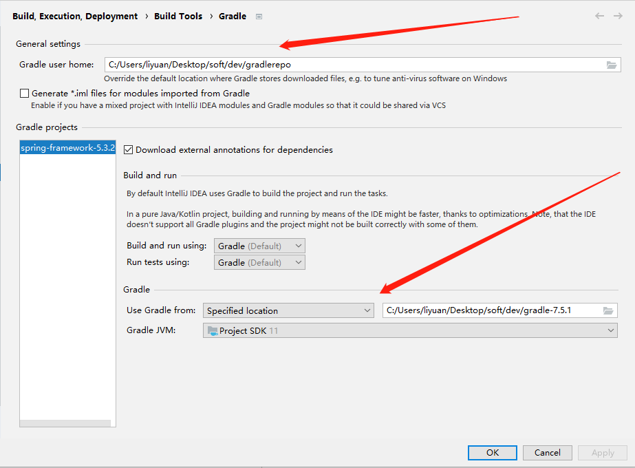

# spring

## 一.spring核心(源码)
```
官网：https://spring.io
核心模块：https://spring.io/projects/spring-framework
github：https://github.com/spring-projects/spring-framework
二进制包获取:https://github.com/spring-projects/spring-framework/wiki/Spring-Framework-Artifacts
```

#### 1.知识必备
```
1）1.IOC控制反转(反射)
https://www.bilibili.com/video/BV1C4411373T?p=1
链接:https://pan.baidu.com/s/1o5s2sKa_FazhLKHmTLAO7g 提取码:te99
实例：https://github.com/liyuan3210/java/tree/master/spring/simple/src/main/java/com/liyuan3210/spring/simple/reflect

2）.AOP(使用aspectj标注，底层实现用标准jdk动态代理)
三种实现方式(详细见“设计模式”)
*.spring-AspectJ
*.jdk动态代理
*.CGLIB

实例：https://github.com/liyuan3210/java/tree/master/spring/simple
```

#### 2.idea导入spring源码

版本：

1.jdk17

2.spring-framework6.0.8

3.gradle7.6

4.ideaIC-2022.3.3

```
maven,gradle安装配置见：
	../env/index.md
	
一。构建
	1.克隆项目
	$ git clone  ...
	
	2.导入idea及配置
		2.1）File--->Project Struture(配置工程jdk)
		2.2）File--->Settings--->搜索"File Encodings"(配置字符编码UTF-8)
		2.3）File--->Settings--->搜索"gradle"（配置gradle）
			见[图1.1]
			
二。添加一个子工程
	？？？
	
三。问题
    1.A build scan was not published as you have not authenticated with server 'ge.spring.io'.
    https://blog.csdn.net/duqingqing5666/article/details/118503336
    问题解决方案：
    注释 settings.gradle
    文件下 id "io.spring.ge.conventions" version "0.0.7
    //id "io.spring.ge.conventions" version "0.0.7

2. * What went wrong:
    Execution failed for task ':spring-jcl:compileJava'.
    > 错误: 无效的源发行版：17
    https://blog.csdn.net/weixin_58195194/article/details/125091309
    问题解决方案：
        1.spring版本切换到5.3.x
        2.升级jdk到jdk17
```
图1.1


#### 3.spring源码核心(框架)

```
代码轮廓

1）idea的调试（debug）

2）快捷键
```

#### 4.spring源码debug

```
1）调试方法

2）添加子项目
```


## 二.spring方案


1.[jwt AND spring security](jwt_spring_security.md)
```
认证授权方案

课程
https://www.bilibili.com/video/BV15a411A7kP?from=search&seid=7599475529802441512

链接：https://pan.baidu.com/s/1atNzFMD9SYy[cv3](https://www.bilibili.com/read/cv3/)VwXW89eg 
提取码：ndv3

实例：https://github.com/liyuan3210/java/tree/master/jwt_spring-security/jwt-spring-security

**微服务登录授权方案(未看):**
https://www.bilibili.com/video/BV1VE411h7aL?from=search&seid=12553764359441323749
```

2.oauth2

```
https://haokan.baidu.com/v?vid=4100768588022005153&pd=bjh&fr=bjhauthor&type=video
```

3.spring boot创建单体项目，创建聚合项目

3.1）.spring boot创建单体项目

```
* 进入官方网站直接下载压缩包(配置语言，版本，名称)
https://start.spring.io

* idea创建
。。。。
```

3.2）.spring boot创建聚合项目（maven）

## [三.微服务](spring_cloud.md)


[spring cloud AND dubbo(微服务方案)](spring_cloud.md)

## 课程：

```
尚学堂：
https://www.bilibili.com/video/BV1ST4y1E7Pq?from=search&seid=10586365462229545516

鲁班学院：
https://www.bilibili.com/video/BV1uE411d7L5?from=search&seid=10586365462229545516

atguigu：
https://www.bilibili.com/video/BV1oW41167AV?from=search&seid=4518828841319066614
实例：https://gitee.com/liyuan3210/book_source/tree/master/spring/spring_source_parsing_data
https://www.bilibili.com/video/BV1oW41167AV?p=28
代码：https://github.com/liyuan3210/java/spring/simple
```

