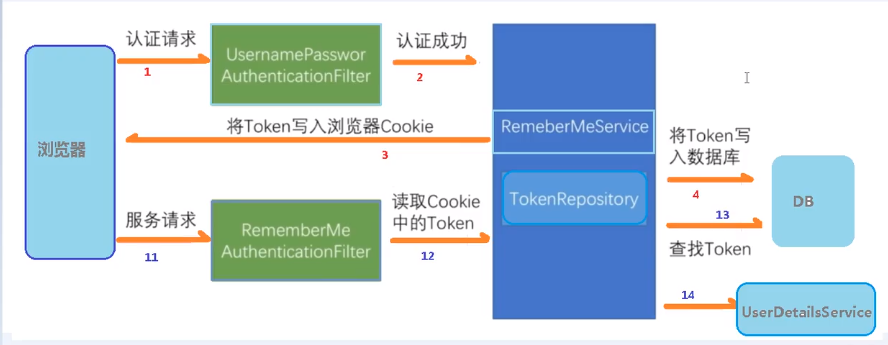
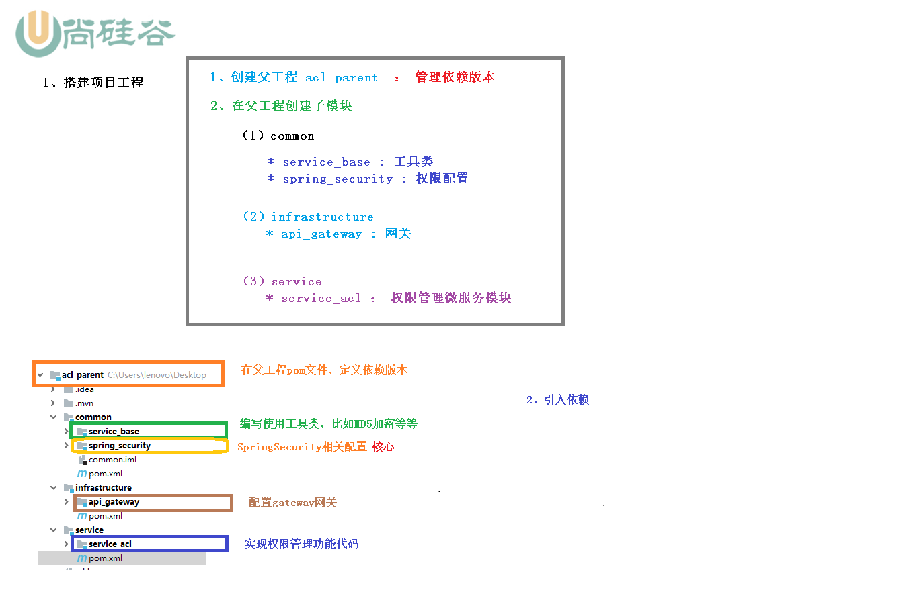

# jwt与spring_security

## 一.jwt

官网：

代码：

步骤：

* 创建工程（单体）

* 配置pom

  ```
  		<!-- 添加web模块验证 -->
  		<dependency>
  			<groupId>org.springframework.boot</groupId>
  			<artifactId>spring-boot-starter-web</artifactId>
  		</dependency>
  		<!-- jwt -->
  		<dependency>
  			<groupId>io.jsonwebtoken</groupId>
  			<artifactId>jjwt</artifactId>
  			<version>0.7.0</version>
  		</dependency>
  ```

* 编写代码

  ```
  编写代码：
  com.liyuan3210.demo.jwt.config.JwtAuthenticationFilter
  com.liyuan3210.demo.jwt.util.JwtUtil
  com.liyuan3210.demo.jwt.controller.LoginController
  com.liyuan3210.demo.jwt.controller.TestController
  
  开启jwt：JwtApplication.java启动类注释掉如下方法
  	@Bean
      public FilterRegistrationBean jwtFilter() {
          final FilterRegistrationBean registrationBean = new FilterRegistrationBean();
          JwtAuthenticationFilter filter = new JwtAuthenticationFilter();
          registrationBean.setFilter(filter);
          return registrationBean;
      }
      
  配置端口
  server.port=8080
  ```

* 启动验证

  首先访问login获取token

  http://127.0.0.1:8080/jwt/login
  
  然后通过token访问hello接口
  
  http://127.0.0.1:8080/jwt/hello
  

问题：

java.lang.NoClassDefFoundError: javax/xml/bind/DatatypeConverter

JAXB [API](https://so.csdn.net/so/search?q=API&spm=1001.2101.3001.7020)是java EE 的API，因此在java SE 9.0 中不再包含这个 Jar 包。java 9 中引入了模块的概念，默认情况下，Java SE中将不再包含java EE 的Jar包。而在 java 6/7/8 时关于这个API 都是捆绑在一起的

```
解决办法：
1.JDK 版本降到 JDK 8（之前是jbr-11）
2.添加pom配置
		<!-- JAXB -->
		<dependency>
			<groupId>javax.xml.bind</groupId>
			<artifactId>jaxb-api</artifactId>
			<version>2.3.0</version>
		</dependency>
		<dependency>
			<groupId>com.sun.xml.bind</groupId>
			<artifactId>jaxb-impl</artifactId>
			<version>2.3.0</version>
		</dependency>
		<dependency>
			<groupId>com.sun.xml.bind</groupId>
			<artifactId>jaxb-core</artifactId>
			<version>2.3.0</version>
		</dependency>
		<dependency>
			<groupId>javax.activation</groupId>
			<artifactId>activation</artifactId>
			<version>1.1.1</version>
		</dependency>
```

## 二.mybatisPlus

代码：？？？

代码生成器比较

https://blog.csdn.net/m0_37524586/article/details/88351833

1.Mybatis-generator
http://mybatis.org/generator/index.html

2.Mybatis-Plus
https://baomidou.com/
https://baomidou.com/pages/779a6e/

* 准备环境建表

  ```
  --创建角色表
  CREATE TABLE `tb_role` (
    `id` int(11) NOT NULL AUTO_INCREMENT COMMENT '主键ID',
    `name` varchar(45) DEFAULT NULL COMMENT '角色名称',
    `desc` varchar(45) DEFAULT NULL COMMENT '角色描述',
    `create_dt` varchar(45) DEFAULT NULL COMMENT '创建时间',
    PRIMARY KEY (`id`)
  ) ENGINE=InnoDB DEFAULT CHARSET=utf8mb4;
  --创建用户表
  CREATE TABLE `tb_user2` (
    `id` bigint(20) NOT NULL AUTO_INCREMENT COMMENT '主键ID',
    `name` varchar(30) DEFAULT NULL COMMENT '姓名',
    `age` int(11) DEFAULT NULL COMMENT '年龄',
    `email` varchar(50) DEFAULT NULL COMMENT '邮箱',
    PRIMARY KEY (`id`)
  ) ENGINE=InnoDB AUTO_INCREMENT=6 DEFAULT CHARSET=utf8mb4;
  --插入数据，自增id
  INSERT INTO tb_user2 (id, name, age, email) VALUES
  (1, 'Jone', 18, 'test1@baomidou.com'),
  (2, 'Jack', 20, 'test2@baomidou.com'),
  (3, 'Tom', 28, 'test3@baomidou.com'),
  (4, 'Sandy', 21, 'test4@baomidou.com'),
  (5, 'Billie', 24, 'test5@baomidou.com'),
  (6, 'z1', 3, '000@111,com'),
  (7, 'z1', 3, '000@222,com'),
  (8, 'z1', 3, '000@333,com'),
  (9, 'z4', 3, '000@444,com'),
  (10, 'z5', 3, '000@555,com'),
  (11, 'z6', 3, '000@666,com'),
  (12, 'z7', 3, '000000000000');
  ```
  
* 配置pom

  ```
  	<!-- web -->
  		<dependency>
  			<groupId>org.springframework.boot</groupId>
  			<artifactId>spring-boot-starter-web</artifactId>
  		</dependency>
  		<!-- jdbc -->
  		<dependency>
  			<groupId>org.springframework.boot</groupId>
  			<artifactId>spring-boot-starter-jdbc</artifactId>
  		</dependency>
  		<!-- mybatis-plus-boot -->
  		<dependency>
  			<groupId>com.baomidou</groupId>
  			<artifactId>mybatis-plus-boot-starter</artifactId>
  			<version>3.4.1</version>
  		</dependency>
  		<!-- mybatis-plus -->
  		<dependency>
  			<groupId>com.baomidou</groupId>
  			<artifactId>mybatis-plus-generator</artifactId>
  			<version>3.4.1</version>
  		</dependency>
  		<dependency>
  			<groupId>org.apache.velocity</groupId>
  			<artifactId>velocity-engine-core</artifactId>
  			<version>2.2</version>
  		</dependency>
  		<!--mysql-->
  		<dependency>
  			<groupId>mysql</groupId>
  			<artifactId>mysql-connector-java</artifactId>
  			<version>8.0.23</version>
  		</dependency>
  		<!-- 引入JAXB -->
  		....
  ```

* 数据库配置application.properties

  ```
  server.port=8081
  # mysql
  spring.datasource.driver-class-name=com.mysql.cj.jdbc.Driver
  spring.datasource.url=jdbc:mysql://127.0.0.1:3306/mybatisPlus?useUnicode=true&characterEncoding=UTF-8&useSSL=false&serverTimezone=GMT%2B8
  spring.datasource.username=root
  spring.datasource.password=123456
  ```

* 代码生成

  ```
  com.liyuan3210.demo.myBatisPlus.util.CodeGenerator
  ```

* Mapper,service 测试单元

  

* 分页实现

  配置分页插件

  ```
  放在启动类下面：
  	@Bean
  	public MybatisPlusInterceptor MybatisPlusInterceptor(){
  		MybatisPlusInterceptor interceptor = new MybatisPlusInterceptor();
  		interceptor.addInnerInterceptor(new PaginationInnerInterceptor(DbType.MYSQL));
  		return interceptor;
  	}
  ```

  简单分页：

  ```
  
  ```

  xml自定义分页：

  ```
  
  ```

  

* 条件构造器Wrapper

## 三.spring_security

**概述：**

spring_security包含两部分，**用户认证**，**用户授权**，是重量级框架

不局限web环境，可以脱离web使用

**同款产品对比：**

shiro：是apache旗下轻量级控制框架

### 1.入门案例

1.1>创建spring boot工程，引入pom包(与spring boot)无缝集成

```
<dependency>
	<groupId>org.springframework.boot</groupId>
	<artifactId>spring-boot-starter-security</artifactId>
	<version>2.2.1.RELEASE</version>
</dependency>
```

 1.2>创建测试类

com.liyuan3210.jwtspringsecurity.springsecurity.controller.TestController3.java

http://127.0.0.1:8080/test/hello

1.3>浏览器访问

http://127.0.0.1:8080/test/hello

Using generated security password: b197d0c2-a1c7-4040-82b2-75d09cfeffcc（启动时控制台打印）

默认用户名/密码：user / b197d0c2-a1c7-4040-82b2-75d09cfeffcc


### 2.基本原理

spring_security本质是一个过滤器链（有很多过滤器)

new FilterSecurityInterceptor();		//方法级过滤器(过滤哪些方法可以放行)
new ExceptionTranslationFilter();		//异常过滤器
new UsernamePasswordAuthenticationFilter();	//用户认证过滤器

2.1过滤器如何进行加载？

DelegatingFilterProxy(如果不使用spring boot,首先要配置这个过滤器,spring boot已帮我们做了)

用户/密码登录（自定义认证，两个重要接口）：

UserDetailsService

PasswordEncoder


### 3.权限方案

用户名/密码认证有三种方案：

3.1>.第一种：通过配置文件

```
spring.security.user.name=admin
spring.security.user.password=123456
```

验证：http://127.0.0.1:8080/test/hello

3.2>.第二种：通过配置类

```java
@Configuration
public class SecurityConfig extends WebSecurityConfigurerAdapter {
    @Override
    protected void configure(AuthenticationManagerBuilder auth) throws Exception {
        BCryptPasswordEncoder passwordEncoder = new BCryptPasswordEncoder();
        String password = passwordEncoder.encode("123");
        auth.inMemoryAuthentication().withUser("lucy").password(password).roles("admin");
    }

    @Bean
    PasswordEncoder password() {
        return new BCryptPasswordEncoder();
    }
}
```

验证：http://127.0.0.1:8080/test/hello

3.3>.第三种：自定义编写实现类

编写SecurityConfig配置类：

```java
@Configuration
public class SecurityConfigTest extends WebSecurityConfigurerAdapter {
	@Autowired
	private UserDetailsService userDetailsService;
	
	protected void configure(AuthenticationManagerBuilder auth) throws Exception {
		auth.userDetailsService(userDetailsService).passwordEncoder(password());
	}
	
	@Bean
	PasswordEncoder password() {
		return new BCryptPasswordEncoder();
	}
}
```

编写MyUserDetailsService实现类（UserDetailsService）

```java
@Service("userDetailsService")
public class MyUserDetailsService implements UserDetailsService {

	@Override
	public UserDetails loadUserByUsername(String username) throws UsernameNotFoundException {
		List<GrantedAuthority> auths = AuthorityUtils.commaSeparatedStringToAuthorityList("role");
		return new User("mary",new BCryptPasswordEncoder().encode("123"),auths);
	}

}
```

验证：http://127.0.0.1:8080/test/hello

mary	/	123


### 4.查询数据库验证

1.整合MyBatisPlus完成操作，使用引入相关依赖

```
 <!-- db -->
 <dependency>
     <groupId>com.baomidou</groupId>
     <artifactId>mybatis-plus-boot-starter</artifactId>
     <version>3.0.5</version>
 </dependency>
 <!--mysql-->
 <dependency>
     <groupId>mysql</groupId>
     <artifactId>mysql-connector-java</artifactId>
 </dependency>
```

配置数据库：

```
spring.datasource.driver-class-name=com.mysql.cj.jdbc.Driver
spring.datasource.url=jdbc:mysql://192.168.1.136:3306/test?serverTimezone=GMT%2B8
spring.datasource.username=adm
spring.datasource.password=adm!>KTH*23L6
```

2.创建数据库表

```
CREATE TABLE `test`.`users` (
  `id` INT NOT NULL,
  `username` VARCHAR(45) NULL,
  `password` VARCHAR(45) NULL,
  PRIMARY KEY (`id`));
--插入数据  
INSERT INTO `test`.`users` (`id`, `username`, `password`) VALUES ('1', 'lucy', '123');
INSERT INTO `test`.`users` (`id`, `username`, `password`) VALUES ('2', 'mary', '456');
```

3.编写entity,mapper类

4.实现UserDetailsService接口，MyUserDetailsService类编写

5.添加注解MapperScan

@MapperScan("com.liyuan3210.jwtspringsecurity.springsecurity.mapper")

## 4.1自定义用户登录界面

1.自定义设置登录界面，不需要认证可以访问

步骤：

1>实现MyUserDetailsService接口方法

```java
@Override
protected void configure(HttpSecurity http) throws Exception {
    http.formLogin()   //自定义自己编写的登录页面
    .loginPage("/login.html")  //登录页面设置
    .loginProcessingUrl("/user/login")   //登录访问路径
    .defaultSuccessUrl("/test/index").permitAll()  //登录成功之后，跳转路径
    .and().authorizeRequests()
        .antMatchers("/","/test/hello","/user/login").permitAll() //设置哪些路径可以直接访问，不需要认证
       .anyRequest().authenticated()
       .and().csrf().disable();//关闭csrf
}
```

2>编写页面，与controller

resources下新建static目录,页面目录,在static目录下新建login.html页面

```html
<!DOCTYPE html>
<!-- 需要添加
<html  xmlns:th="http://www.thymeleaf.org">
这样在后面的th标签就不会报错
 -->
<html  xmlns:th="http://www.thymeleaf.org">
<head lang="en">
    <meta http-equiv="Content-Type" content="text/html; charset=UTF-8"/>
    <title>Title</title>
</head>
<body>
<h1>表单提交</h1>
<!-- 表单提交用户信息,注意字段的设置,直接是*{} -->
<form action="/user/login"  method="post">
    <input type="text" name="username" />
    <br/>
    <input type="text" name="password" />
    <br/>
    <input type="submit" value="login"/>
</form>
</body>
</html>
```

添加一个/test/index访问路径controller

```java
@RestController
@RequestMapping("/test")
public class TestController3 {
	@GetMapping("hello")
	public String hello() {
		return "hello security";
	}
	@GetMapping("index")
	public String index() {
		return "hello index";
	}
}
```

**用户名与密码名称必须是username,password**

验证：

http://127.0.0.1:8080/test/hello	//不需要登录可以访问的路径

http://127.0.0.1:8080/test/index	//登录后才能访问的路径

### 4.2基于角色或权限访问控制

首先要在MyUserDetailsService.java把返回user对象设置权限（角色)

```java
List<GrantedAuthority> auths =
        AuthorityUtils.commaSeparatedStringToAuthorityList("admins,ROLE_sale,ROLE_role");
```

1 hasAuthority方法(当登录用户具有**admins权限**才可以访问）
.antMatchers("/test/index").hasAuthority("admins")针对某一个
2 hasAnyAuthority方法(当登录用户具有**admins,manager有多个权限**属于某一个时才可以访问）针对多个权限
.antMatchers("/test/index").hasAnyAuthority("admins,manager")
3 hasRole方法   ROLE_sale（返回user对象设置时前面必须是ROLE_*)
.antMatchers("/test/index").hasRole("sale")
4 hasAnyRole方法 (有多个角色属于某一个角色时才可以访问)
.antMatchers("/test/index").hasAnyRole("sale,role")


**自定义没权限访问的页面：**

首先创建没权限跳转的页面static/unauth.html，然后配置类：

```java
//配置没有权限访问跳转自定义页面
http.exceptionHandling().accessDeniedPage("/unauth.html");
```


**注解使用：**

注解使用前需要在启动类添加开启注解：@EnableGlobalMethodSecurity(securedEnabled=true,prePostEnabled = true)

注解使用：

@Secured：判断用户是否有这个角色，有这个角色才可以访问

```
@Secured({"ROLE_sale","ROLE_manager"})
```

@PreAuthorize：在方法访问之前进行验证

```
@PreAuthorize("hasAnyAuthority('admins')")
```

@PostAuthorize：在方法执行之后

```
@PostAuthorize("hasAnyAuthority('admins')")
```

@PostFilter：对数据进行过滤

```
@PostFilter("filterObject.username == 'admin1'")
```

权限表达式：

```
？？？
```


**用户注销操作：**

添加一个登录成功页面success.html,并添加一个退出按钮事件

配置操作：

```java
http.logout().logoutUrl("/logout").logoutSuccessUrl("/test/hello").permitAll();
.defaultSuccessUrl("/success.html").permitAll()  //修改之前的登录成功后的跳转地址
```


**基于数据库的记住我（自动登录功能):**




实现：

1.首先建表，可以自动生成，可以查看JdbcTokenRepositoryImpl类看到

```sql
CREATE TABLE persistent_logins (
    username VARCHAR(64) NOT NULL,
    series VARCHAR(64) PRIMARY KEY,
    token VARCHAR(64) NOT NULL,
    last_used TIMESTAMP NOT NULL
);
```

2.配置类，注入数据源

```java
//注入数据源
@Autowired
private DataSource dataSource;
//配置对象
@Bean
public PersistentTokenRepository persistentTokenRepository() {
JdbcTokenRepositoryImpl jdbcTokenRepository = new JdbcTokenRepositoryImpl();
jdbcTokenRepository.setDataSource(dataSource);
//jdbcTokenRepository.setCreateTableOnStartup(true);//自动生成表
return jdbcTokenRepository;
}
```

3.配置：

```java
//自动登录，设置60秒
...
.anyRequest().authenticated()
.and().rememberMe().tokenRepository(persistentTokenRepository())
.tokenValiditySeconds(60)//设置有效时长，单位秒
.userDetailsService(userDetailsService)
...
```

4.页面编写(用的是框架所以remember-me名称是固定的)

```html
<input type="checkbox" name="remember-me"/>自动登录
```

验证：

http://127.0.0.1:8080/test/hello


**CSRF功能：**

跨站请求伪造，过滤器在CsrfFilter

默认开启csrf防护功能，如下进行关闭

```
http.csrf().disable();
```

请求时添加携带参数：

```
<input type="hidden" th:name="${_csrf.parameterName}" th:value="${_csrf.token}"/>
```

验证：

验证失败？？？

**小笔记（马士兵教育笔记）**

```
一．session与cookies关系(token)
浏览器同源策略（浏览器自动判断，session与cookies作用域）
跨域(不同源)
			iframe,img,<script src="url">（只能get读取）
跨域实现(框架)
			jsonp	只能get(iframe,img,src)通过回调函数，老版本都支持
			cors	浏览器+服务器（产生共识），新版本支持，现在用的用的一般都支持
二．CSRF与XSS
XSS	跨站点脚本攻击，流量攻击（黑掉足够多的站点,通过<script src=url />嵌入攻击的url），或者可以通过微博，富文本编辑嵌入script 
解决办法，使用post
CSRF	伪装请求(可以跨过需要登录的站点，利用本地已登录账号进行调用里面的api)
```

### 5.微服务方案

**pdf文件：44页**

**权限方案(用户流程)：**


**项目结构(工程介绍)：**



**运行：**

问题1：sh: 1: webpack-dev-server: Permission denied

npm install webpack -g
npm install webpack-dev-server -g

问题2：error node-sass@4.13.1 postinstall: `node scripts/build.js`

npm config set sass_binary_site=https://npm.taobao.org/mirrors/node-sass
npm install

完成npm install后就可以执行如下运行

npm start


**nacos环境：**

nacos = 配置注中心+册中心：

https://nacos.io/

下载解压安装包：

wget https://github.com/alibaba/nacos/releases/download/1.4.1/nacos-server-1.4.1.tar.gz

启动：

cd nacos/bin

sh startup.sh -m standalone

访问：

http://192.168.1.136:8848/nacos

帐号/密码： nacos / nacos


