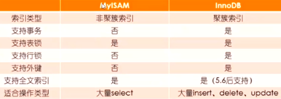

# mysql监控与优化

### 索引

```

```


## 一.mysql监控

1.show profile与profiles

show profile监控sql情况

命令官网文档：https://dev.mysql.com/doc/refman/5.7/en/show-profile.html

​							 https://dev.mysql.com/doc/refman/5.7/en/show-profiles.html

```sql
mysql> SET profiling = 1;		//需要开启
mysql> select * from test;		//执行sql语句
mysql> show profiles;			//查看执行sql的列表并显示总时间
mysql> show profile;			//查看最近执行详细
mysql> show profile for query 2;//根据Query_ID查询具体的详细信息
```

2.performance_schema

mysql5.7后performance_schema将替代show profile

命令官网文档：

https://dev.mysql.com/doc/refman/5.7/en/performance-schema.html

root用户才能看到这个表

performance_schema是一个内存数据库，默认开启。

但有些属性值不是默认开启的。为了保证完整监控到一些数据信息，需要我们手动执行sql开启一下.

执行sql开启:

```sql
mysql> UPDATE performance_schema.setup_instruments
       SET ENABLED = 'YES', TIMED = 'YES';
Query OK, 560 rows affected (0.04 sec)
mysql> UPDATE performance_schema.setup_consumers
       SET ENABLED = 'YES';
Query OK, 10 rows affected (0.00 sec)
```

3.查看mysql当前连接

官网文档：https://dev.mysql.com/doc/refman/5.7/en/show-processlist.html

```sql
mysql> show processlist;
```

## 二.数据类型优化

？？？？

## 三.查看执行计划

官网文档：https://dev.mysql.com/doc/refman/5.7/en/explain.html

https://dev.mysql.com/doc/refman/5.7/en/explain-output.html

```sql
explain select * from test;
```

## 四.索引优化

官网文档：https://dev.mysql.com/doc/refman/5.7/en/optimization-indexes.html

1.索引实现原理

mysql常用的有三种存储引擎，不同的存储引擎索引实现方式也不同。

算法演变：

```
二叉树（节点过深，bst树会有倾斜问题）
↓
AVL平衡树（插入效率低，查询效率高）
↓
红黑树（插入，查询平衡）

hash:has算法，查询数据需要把所有数据加载到内存
b+tree:mysql索引实现一般树是3层,非子节点存储数据范围指向下一个节点.子节点存储数据或数据地址
```

InnoDB 磁盘	b+tree(物理索引数据都存在一个文件,b+tree跟节点存数据)
MyIsam 磁盘  b+tree(物理存储索引，数据两个文件,b+tree跟节点存数据地址)
memory 内存 hash

算法学习网站：

https://www.cs.usfca.edu/~galles/visualization/Algorithms.html


2.常用三种存储引擎的不同



## 五.查询优化

1.下载官方提供的数据demo

https://dev.mysql.com/doc/index-other.html

使用source命令导入

## 六.分区分表

## 七.服务器参数设置

## 八.集群设置

1.maycat 插件

mysql水平，纵向扩展

2.主从复制