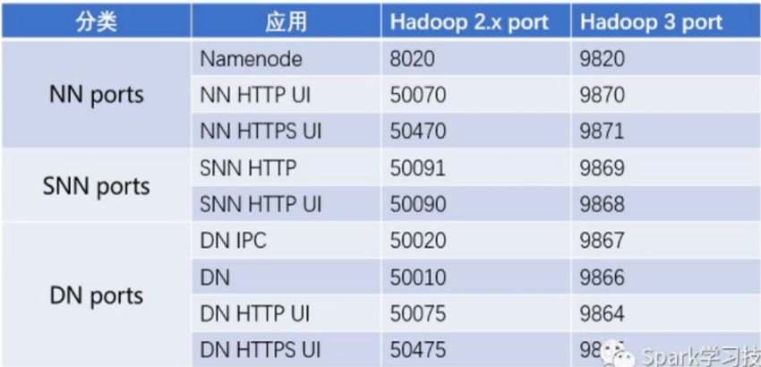

# hadoop3.x安装

## HDFS与YARN都可以单独启动

## 一．环境配置

```
官方文档：
	https://hadoop.apache.org/docs/r3.1.2/
环境配置:
	1.java,hadoop环境配置(/etc/profile)
	export JAVA_HOME=/home/liyuan/soft/jre1.8.0_162
	export HADOOP_HOME=/home/liyuan/soft/hadoop-3.1.2
	export PATH=$JAVA_HOME/bin:$HADOOP_HOME/bin:$HADOOP_HOME/sbin:$PATH    
	export CLASSPATH=.:$JAVA_HOME/lib/dt.jar:$JAVA_HOME/lib/tools.jar:$CLASSPATH

	命令生效:source /etc/profile
	
	查看hadoop版本命令
	hadoop version
	
	2.配置节点hosts
	vi /etc/hosts
	192.168.122.90 node1
	192.168.122.22 node2
	192.168.122.24 node3
	192.168.122.23 node4

	3.ssh免密登录
	生成免密登录密钥对
		ssh-keygen -t rsa -P ""
	配置/etc/ssh/sshd_config
		AuthorizedKeysFile		%h/.ssh/authorized_keys //注释拿掉
	生成authorized_keys文件(.ssh目录的权限必须是700,authorized_keys文件权限必须是600)
		cat ../.ssh/id_rsa.pub >> ../.ssh/authorized_keys
	最后把.ssh目录分发到各个节点
	
	注意
	a>.上面生成配置好后,就可以复制虚拟机节点,启动后就可以相互免密登录了
	b>.可以通过scp向其它节点发送文件
	
	查看进程
	ps a
```

## 二．HDFS伪分布式安装(单台机器)



**1) 单机安装hdfs**

参考：hadoop-3.3.6/share/doc/hadoop/hadoop-project-dist/hadoop-common/SingleCluster.html

```
hadoop配置../etc/hadoop(伪分布式安装)
	解压后可以把share/doc删掉

	hadoop-env.sh
		3.x要对进程角色,环境变量进行限制,最下面配置(echo $JAVA_HOME)
		export JAVA_HOME=/opt/jdk-11.0.2
		export HDFS_NAMENODE_USER=liyuan
		export HDFS_DATANODE_USER=liyuan
		export HDFS_SECONDARYNAMENODE_USER=liyuan

	core-site.xml//3.x后端口默认是9820
		<configuration>
			<property>
				<name>fs.defaultFS</name>
				<value>hdfs://node1或172.18.1.20:9820</value>
			</property>
			//hadoop.tmp.dir目录下面包含namenode,datanode节点信息。tmp名字貌似取的有点不妥,需要指定目录
			<property>
				<name>hadoop.tmp.dir</name>
				<value>/data/hadoop</value>
			</property>
		</configuration>

	hdfs-site.xml(伪分布式不要写1以上)
		<configuration>
			//配置副本
			<property>
				<name>dfs.replication</name>
				<value>1</value>
			</property>
			//secondary文件合并工作
			<property>
				<name>dfs.namenode.secondary.http-address</name>	
				<value>node1或172.18.1.20:9868</修改配置value>
			</property>
		</configuration>
		
	workers配置从节点(在3.x中的配置)2.x中是slave
	默认为localhost,单台伪分布式可以不用配置
	172.18.1.20

	伪分布式启动
	格式化(头一次启动时)
	bin/hdfs namenode -format

	启动
	sbin/start-dfs.sh

	停止
	sbin/stop-dfs.sh

	浏览器访问
	http://172.18.1.20:9870
```

## 三．HDFS配置全分布式(多台机器)

**2）多台机器安装hdfs**

```
环境（docker容器为了方便，把secondary放在了ndoe1节点）
							NN		SNN		DN
	node1(主)				X
	node2(secondary)				X		X
	node3									X
	node4									X

	修改配置（基于上节配置做调整）：
		hadoop-env.sh不变
		core-site.xml不变
	非必配项：
		hdfs-site.xml
			dfs.replication	共3台机器,副本可以设置为2
			dfs.namenode.secondary.http-address	可以设置secondary为66机器(非namenode节点)
			其它配置(非必配置项目)
				1>namenode,datanode路径指定
					dfs.namenode.name.dir 指定 NameNode 数据存放路径；
					dfs.datanode.data.dir 指定 DataNode 数据存放路径；
					注意，要提前创建好/home/hadoop/data/dfs 文件夹)
					<property>
						<name>dfs.namenode.name.dir</name>
						<value>/home/liyuan/namenode</value>
					</property>
					<property>
						<name>dfs.datanode.data.dir</name>
						<value>/home/liyuan/datanode</value>
					</property>
				2>如果在/etc/hosts(ip 别名)配置,就不需要下面的配置
					<property>		
						<name>dfs.namenode.datanode.registration.ip-hostname-check</name>
						<value>false</value>
					</property>
				3>尚学堂里面有的????
				<property>
					<name>hadoop.http.staticuser.user</name>
					<value>liyuan</value>
				</property>
			
	1）workers配置(只配置从节点)
		node2
		node3
		node4
		
	2）分发
		使用scp命令
			scp -r /home/liyuan/soft/hadoop-3.1.2  liyuan@172.18.1.20:/home/liyuan/soft/

	3）启动
		格式化(头一次启动时)
		bin/hdfs namenode -format

		启动
		sbin/start-dfs.sh

		停止
		sbin/stop-dfs.sh

		浏览器访问
		http://192.168.5.18:9870

	命令
	hdfs dfs -mkdir /tool	//上传文件
	hdfs dfs -put hadoop-3.1.2.tar.gz /tool

	问题：
	1.DisallowedDatanodeException: Datanode
	https://blog.csdn.net/qqpy789/article/details/78189335

	2.ip变动问题(ubuntu18静态Ip设置)

	3.(core-site.xml)配置hadoop.http.staticuser.user 值配置为 liyuan
	?
```

## 五. YARN单机，分布式HA安装

**3).YARN单机安装**

参考YARN部分：

hadoop-3.3.6/share/doc/hadoop/hadoop-project-dist/hadoop-common/SingleCluster.html

```
0.)准备好zookeeper资源

1.）etc/hadoop/mapred-site.xml:
从官网copy过来有$HADOOP_MAPRED_HOME环境变量要配置，或者直接写绝对路径
<property>
	<name>mapreduce.framework.name</name>
	<value>yarn</value>
</property>
<property>
	<name>mapreduce.application.classpath</name>
	<value>/opt/hadoop/share/hadoop/mapreduce/*:/opt/hadoop/share/hadoop/mapreduce/lib/*</value>
</property>

2）etc/hadoop/yarn-site.xml
<property>
	<name>yarn.nodemanager.aux-services</name>
	<value>mapreduce_shuffle</value>
</property>
<property>
	<name>yarn.nodemanager.env-whitelist</name>
<value>JAVA_HOME,HADOOP_COMMON_HOME,HADOOP_HDFS_HOME,HADOOP_CONF_DIR,CLASSPATH_PREPEND_DISTCACHE,HADOOP_YARN_HOME,HADOOP_HOME,PATH,LANG,TZ,HADOOP_MAPRED_HOME</value>
</property>

3）配置hadoop-env.sh
export YARN_RESOURCEMANAGER_USER=root
export YARN_NODEMANAGER_USER=root

4）启动
$ sbin/start-yarn.sh

YARN管理控制台
http://172.18.1.20:8088/
```

**4).YARN分布式HA安装**

参考：

hadoop-3.3.6/share/doc/hadoop/hadoop-yarn/hadoop-yarn-site/ResourceManagerHA.html

```
基于上面“4）YARN单机安装”不变

1）hadoop/etc/hadoop/workers配置(只配置从节点)
	node2或IP
	node3或IP
	node4或IP
	
2）etc/hadoop/yarn-site.xml
<property>
  <name>yarn.resourcemanager.ha.enabled</name>
  <value>true</value>
</property>
<property>
  <name>yarn.resourcemanager.cluster-id</name>
  <value>cluster1</value>
</property>
<property>
  <name>yarn.resourcemanager.ha.rm-ids</name>
  <value>rm1,rm2</value>
</property>
<property>
  <name>yarn.resourcemanager.hostname.rm1</name>
  <value>master1</value>
</property>
<property>
  <name>yarn.resourcemanager.hostname.rm2</name>
  <value>master2</value>
</property>
<property>
  <name>yarn.resourcemanager.webapp.address.rm1</name>
  <value>master1:8088</value>
</property>
<property>
  <name>yarn.resourcemanager.webapp.address.rm2</name>
  <value>master2:8088</value>
</property>
<property>
  <name>hadoop.zk.address</name>
  <value>zk1:2181,zk2:2181,zk3:2181</value>
</property>

2）启动(如果hdfs在node1启动，那yarn的ha启用建议在其他node2节点启动)
$ sbin/start-yarn.sh

YARN管理控制台
http://172.18.1.20:8088/
```

## 四．HDFS配置HA

```
环境
				NN-1		NN-2		DN		ZK		ZKFC		JNN
	node1(主)	X										X			X
	node2(备)				X			X		X		X			X
	node3								X		X					X	
	node4								X		X	
	
	解释:
		zk: zookeeper(可以单独部署)
		ZKFC: 必须与namenode在一起,健康检查namenode(active)
		JNN: 存储共享日志信息(集群存在,信息同步)

	QJM(NFS已过时)
	https://hadoop.apache.org/docs/r3.1.2/hadoop-project-dist/hadoop-hdfs/HDFSHighAvailabilityWithQJM.html

	1.node1
	cd ../hadoop-3.1.2/etc
	cp -r hadoop hadoop-full	//首先进行备份

	hadoop-env.sh修改
		#export HDFS_SECONDARYNAMENODE_USER=liyuan
		export HDFS_ZKFC_USER=liyuan
		export HDFS_JOURNALNODE_USER=liyuan
		
	core-site.xml修改
		<configuration>
			<property>
				<name>fs.defaultFS</name>
				<value>hdfs://mycluster</value>
			</property>
			<property>
				<name>hadoop.tmp.dir</name>
				<value>/home/liyuan/soft/ha3</value> //修改hahdtmp目录
			</property>
			<property>
				<name>ha.zookeeper.quorum</name>
				<value>node2:2181,node3:2181,node4:2181</value>
			</property>
		</configuration>

	hdfs-site.xml修改
		<configuration>
			<!-- 把这个secondary配置去掉
			<property>		
				<name>dfs.namenode.secondary.http-address</name>	
				<value>192.168.157.65:9868</value>
			</property>
			-->
			<property>
				<name>dfs.nameservices</name>
				<value>mycluster</value>
			</property>
			<property>	//mycluster要与上面定义的value对应
				<name>dfs.ha.namenodes.mycluster</name>
				<value>nn1,nn2</value>
			</property>
			
			<property>
				<name>dfs.namenode.rpc-address.mycluster.nn1</name>
				<value>node1:8020</value>
			</property>
			<property>
				<name>dfs.namenode.rpc-address.mycluster.nn2</name>
				<value>node2:8020</value>
			</property>
			
			<property>
			  <name>dfs.namenode.http-address.mycluster.nn1</name>
			  <value>node1:9870</value>
			</property>
			<property>
			  <name>dfs.namenode.http-address.mycluster.nn2</name>
			  <value>node2:9870</value>
			</property> 
			
			<property>
				<name>dfs.namenode.shared.edits.dir</name>
				<value>qjournal://node1:8485;node2:8485;node3:8485/mycluster</value>
			</property>
			
			<property>
				<name>dfs.client.failover.proxy.provider.mycluster</name>
				<value>org.apache.hadoop.hdfs.server.namenode.ha.ConfiguredFailoverProxyProvider</value>
			</property>
			
			//namenode1由于网络原因触发zk事件namenode2变为active,当namenode1网络恢复会有两个namenode
			//首先会强制切换另外一个为standby,然后提升备选namenode
			//切换状态时候需要一个隔离方法,远程控制对法机器变为standby,所以需要指定id_rsa
			<property>
				<name>dfs.ha.fencing.methods</name>
				<value>sshfence</value>
			</property>
			<property>
				<name>dfs.ha.fencing.ssh.private-key-files</name>
				<value>/home/liyuan/.ssh/id_rsa</value>
			</property>
			
			<property>	//Journal edits日志存储路径
				<name>dfs.journalnode.edits.dir</name>
				<value>/home/liyuan/soft/ha3/journalnode</value>
			</property>
			
			<property>	//自动故障转移
				<name>dfs.ha.automatic-failover.enabled</name>
				<value>true</value>
			</property>
		</configuration>
		
	分发
		在当前目录
		scp core-site.xml hdfs-site.xml hadoop-env.sh liyuan@node2:/home/liyuan/soft/hadoop-3.1.2/etc/hadoop
		scp core-site.xml hdfs-site.xml hadoop-env.sh liyuan@node3:/home/liyuan/soft/hadoop-3.1.2/etc/hadoop
		scp core-site.xml hdfs-site.xml hadoop-env.sh liyuan@node4:/home/liyuan/soft/hadoop-3.1.2/etc/hadoop
	
	HA格式化
		两种
			1.之前有过格式化元数据信息,最简单同步执行(备节点执行)
			hdfs namenode -initializeSharedEdits
			2.重新格式化一个namenode节点(当前使用的)
			hdfs namenode -bootstrapStandby
			
	1.启动journalnode(每个节点node1,node2,node3手动启动)
		hdfs --daemon start journalnode
	停止journalnode	
		hdfs --daemon stop journalnode
	2.node1格式化(主节点任意选择一台格式化)
		hdfs namenode -format
		查看集群id
		cat soft/ha3/dfs/name/current/V*
	3.node1执行启动namenode
	  hadoop-daemon.sh start namenode
	  也可以使用hdfs --daemon start
	4.node2执行同步
	  hdfs namenode -bootstrapStandby
		再查看集群Id(与node1相同)
		cat soft/ha3/dfs/name/current/V*
	5.node1格式化zk,创建注册目录(前提让zk集群启动起来)
	  hdfs zkfc -formatZK
	6.启动集群(再次启动hdfs集群启动此命令)
		start-dfs.sh(包含启动两个namenode)
	7.测试
		干掉node1(active状态的节点),观测切换情况
		hdfs --daemon stop namenode
		启动node1
		hdfs --daemon start namenode
		干掉node2 zkfc
		hdfs --daemon stop zkfc
```

## 六．YARN配置HA

```
环境
				NN-1		NN-2		DN		ZK		ZKFC		JNN			RS			NM
	node1(主)	X										X			X
	node2(备)				X			X		X		X			X						X
	node3								X		X					X			X			X
	node4								X		X								X			X
	单节点需要配置(添加如下配置):
	vi hadoop-env.sh
        export YARN_RESOURCEMANAGER_USER=root
        export YARN_NODEMANAGER_USER=root
	必须配置的(不管是单点，集群，HA都需要配置的)
		mapred-site.xml修改(可以配置本机):
			<configuration>
				<property>
					<name>mapreduce.framework.name</name>
					<value>yarn</value>
				</property>
				<property>
					<name>mapreduce.application.classpath</name>
					<value>$HADOOP_MAPRED_HOME/share/hadoop/mapreduce/*:$HADOOP_MAPRED_HOME/share/hadoop/mapreduce/lib/*</value>
				</property>
			</configuration>
		yarn-site.xml修改(拉取数据服务):
			<configuration>
				<property>
					<name>yarn.nodemanager.aux-services</name>
					<value>mapreduce_shuffle</value>
				</property>
				<property>
					<name>yarn.nodemanager.env-whitelist</name>
					<value>JAVA_HOME,HADOOP_COMMON_HOME,HADOOP_HDFS_HOME,HADOOP_CONF_DIR,CLASSPATH_PREPEND_DISTCACHE,HADOOP_YARN_HOME,HADOOP_MAPRED_HOME</value>
				</property>
			</configuration>
	HA文档：
		https://hadoop.apache.org/docs/r3.1.2/hadoop-yarn/hadoop-yarn-site/ResourceManagerHA.html
	HA配置：
		yarn-site.xml修改:
			<property>
			  <name>yarn.resourcemanager.ha.enabled</name>
			  <value>true</value>
			</property>
			<property>
			  <name>yarn.resourcemanager.cluster-id</name>
			  <value>cluster2</value>
			</property>
			<property>
			  <name>yarn.resourcemanager.ha.rm-ids</name>
			  <value>rm1,rm2</value>
			</property>
			<property>
			  <name>yarn.resourcemanager.hostname.rm1</name>
			  <value>node3</value>
			</property>
			<property>
			  <name>yarn.resourcemanager.hostname.rm2</name>
			  <value>node4</value>
			</property>
			<property>
			  <name>yarn.resourcemanager.webapp.address.rm1</name>
			  <value>node3:8088</value>
			</property>
			<property>
			  <name>yarn.resourcemanager.webapp.address.rm2</name>
			  <value>node4:8088</value>
			</property>
			<property>
			  <name>hadoop.zk.address</name>
			  <value>node2:2181,node3:2181,node4:2181</value>
			</property>
			
	分发:
		scp mapred-site.xml yarn-site.xml liyuan@node2:`pwd`
		scp mapred-site.xml yarn-site.xml liyuan@node3:`pwd`
		scp mapred-site.xml yarn-site.xml liyuan@node4:`pwd`
		
	复用slaves文件
	
	启动：
		在node1执行(再次启动yarn集群启动此命令)
			start-yarn.sh(包含启动两个resourcemanager)	//启动yarn
		在node3,node4执行(貌似3.x执行start-yarn.sh命令就包含下面的命令了)
			yarn-daemon.sh start resourcemanager
			提示：
				WARNING: Use of this script to stop YARN daemons is deprecated.
				WARNING: Attempting to execute replacement "yarn --daemon stop" instead.
	测试YARN的HA
		在node3或node4执行下面命令,查看active状态切换
			yarn-daemon.sh stop resourcemanager
			
	查看yarn浏览器:
	http://192.168.157.168:8088
	
	测试hadoop例子程序
		cd ../share/hadoop/mapreduce
		运行
		hadoop jar hadoop-mapreduce-examples-xxxxx.jar wordcount /hdfs文件(数据目录或文件) /root/不存在或空的目录
		
		hadoop jar hadoop-mapreduce-examples-3.1.2.jar wordcount /data /root/不存在或空的目录
		
		
错误问题(beyond the 'VIRTUAL' memory limit):
	https://www.cnblogs.com/scw2901/p/4331682.html
	https://blog.csdn.net/ahau10/article/details/53484770
	https://www.cnblogs.com/yjt1993/p/9483032.html
	
	[2019-06-10 14:32:00.715]Container [pid=43647,containerID=container_1560176151515_0003_01_000004] is running 369940992B beyond the 'VIRTUAL' memory limit. 
	Current usage: 160.7 MB of 1 GB physical memory used; 2.4 GB of 2.1 GB virtual memory used. Killing container.
	解决办法:
	mapred-site.xml修改添加
		<property>
		　　<name>mapreduce.map.memory.mb</name>
		　　<value>512</value>
		</property>
		<property>
		　　<name>mapreduce.map.java.opts</name>
		　　<value>-Xmx256M</value>
		</property>
		<property>
		　　<name>mapreduce.reduce.memory.mb</name>
		　　<value>512</value>
		</property>20190808环境启动步骤:
		1.在hosts配置ip对应的节点node,并scp分发
		2.首先要启动zk服务node2,node3,node4
		3.分布式启动hdfs
				start-dfs.sh(包含启动namenode)
		4.分布式启动yarn
				start-yarn.sh
	20190808hadoop目录结构(soft目录下面):
		hd2(hadoop2.x HDFS文件目录)
		hd3(hadoop3.x HDFS文件目录)
		ha2(hadoop2.x yarn计算文件目录)
		ha3(hadoop3.x yarn计算文件目录)
		
	客户端开发依赖包../hadoop-3.1.2/share/hadoop/client/
		hadoop-client-api-3.1.2.jar
		hadoop-client-runtime-3.1.2.jar
		hadoop-client-minicluster-3.1.2.jar	//做单元测试
	
	运行方式
	java -classpath mywc.jar mywc.Test2 a b c
	
	
	编写类:
		1.客户端main
		2.map
		3.reduce
		<property>
		　　<name>mapreduce.reduce.java.opts</name>
		　　<value>-Xmx256M</value>
		</property>
```

## 六．dev

```
20190808环境启动步骤:
		1.在hosts配置ip对应的节点node,并scp分发
		2.首先要启动zk服务node2,node3,node4
		3.分布式启动hdfs
				start-dfs.sh(包含启动namenode)
		4.分布式启动yarn
				start-yarn.sh
	20190808hadoop目录结构(soft目录下面):
		hd2(hadoop2.x HDFS文件目录)
		hd3(hadoop3.x HDFS文件目录)
		ha2(hadoop2.x yarn计算文件目录)
		ha3(hadoop3.x yarn计算文件目录)
		
	客户端开发依赖包../hadoop-3.1.2/share/hadoop/client/
		hadoop-client-api-3.1.2.jar
		hadoop-client-runtime-3.1.2.jar
		hadoop-client-minicluster-3.1.2.jar	//做单元测试
	
	运行方式
	java -classpath mywc.jar mywc.Test2 a b c
	
	
	编写类:
		1.客户端main
		2.map
		3.reduce
```