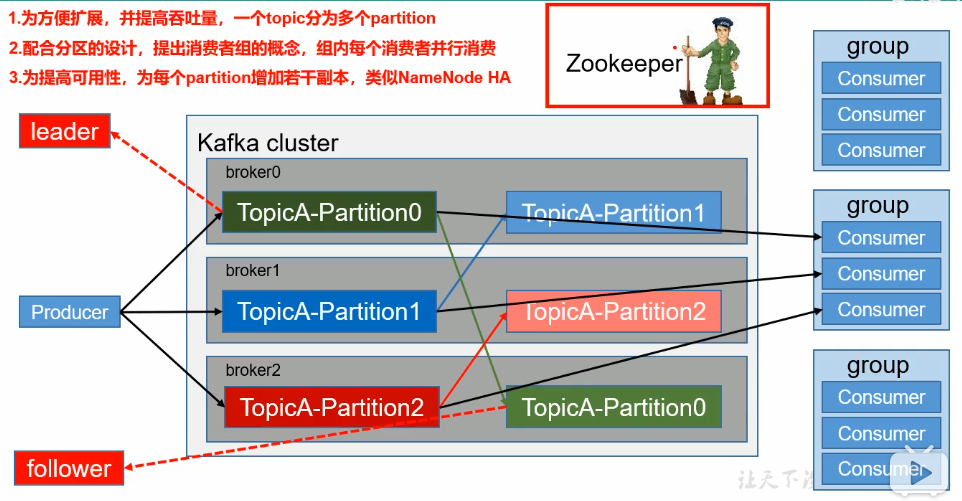
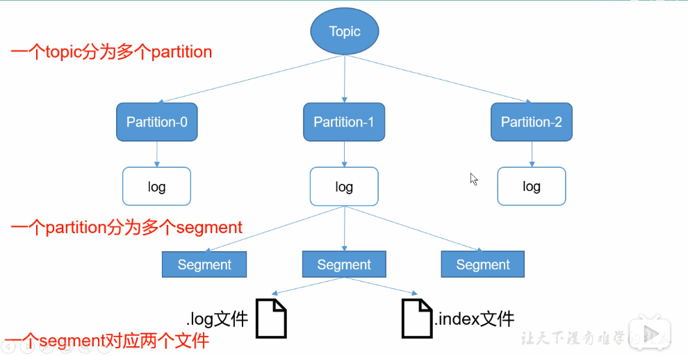
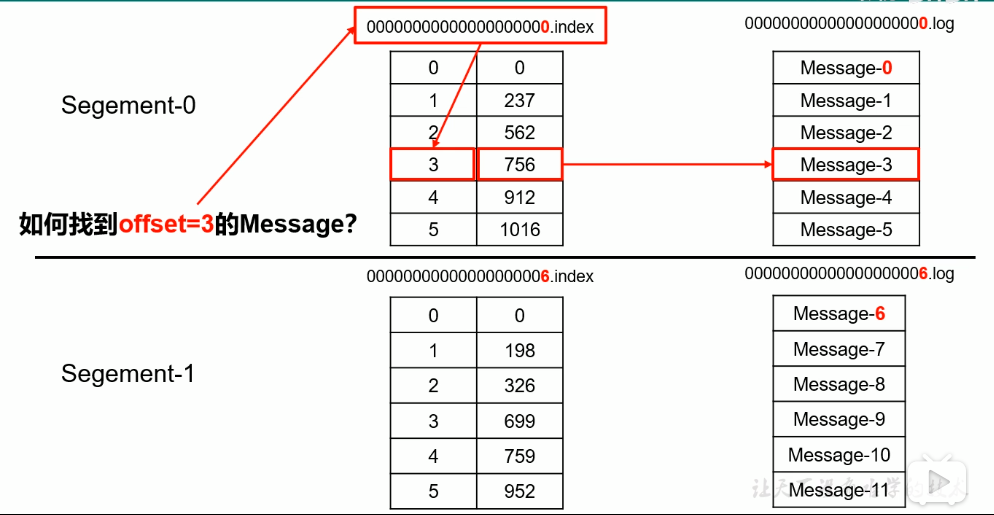
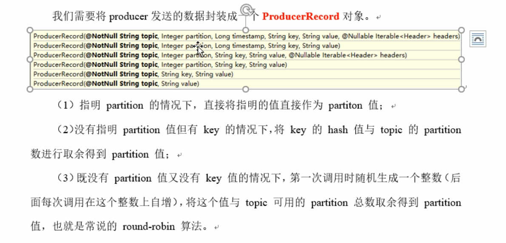
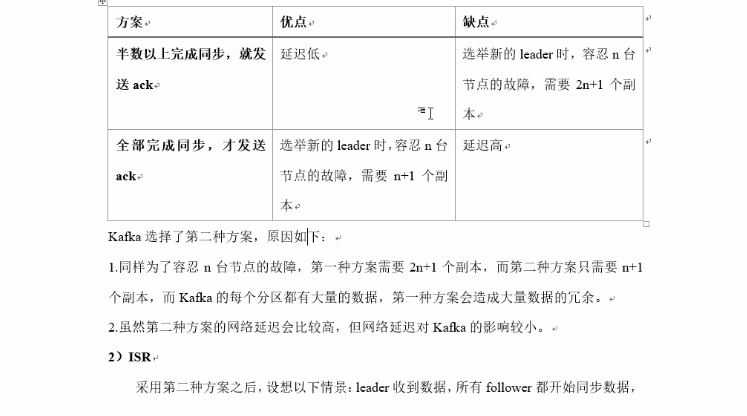
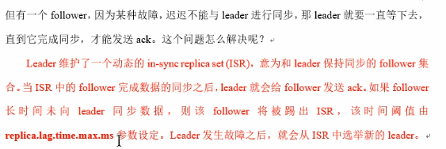

# kafka

## 教程：

1.https://www.bilibili.com/video/BV1AA411q7PK?from=search&seid=17071775111906625549

链接:https://pan.baidu.com/s/1uCeXe4STWN2lpct9HO2nMQ  密码:9dbo

2.https://www.bilibili.com/video/BV1a4411B7V9?from=search&seid=17071775111906625549

链接: https://pan.baidu.com/s/17XOeCBYdyfNqWJPxb_dMsA 提取码: 5sp9

kafka教程
https://www.w3cschool.cn/apache_kafka/apache_kafka_quick_guide.html

## 1.kafka架构图



kafka是一个分布式，基于于发布/订阅的消息队列

**topic**：生产者，消费者都是面向一个topic

**partition**：一个topic会有多个partition为了防止某一个partition挂掉后，数据不丢失，partition有laeder,folower概念

**replica**：分区可以设置若干个副本

**broker**：一台kafka服务器就是一个broker,一个集群由多个broker组成

一个topic分为多个partition,消费者组内每个消费者负责不同分区的数据，一个分区消息只能由一个消费者消费，消费者之间互不影响。

## 2.kafka安装版本及包：

1.kafka_2.11-0.11.0.2.tgz	2.11kafka服务器版本(服务器使用scala编写)，0.11.0.2是kafka消费端版本(java实现)

2.kafka-manageer-1.3.3.15 与 kafkaOffsetMontor-assemtbly-0.46

配置：config/server.properties

启动：bin/kafka-server-start.sh -daemon config/server.properties

安装：

```
下载解压kafka_2.12-2.7.0.tgz到/opt/kafka目录
http://kafka.apache.org/downloads
$ tar -xzvf kafka_2.12-2.7.0.tgz
$ mv kafka_2.12-2.7.0 kafka

1.配置config/server.properties
#broker的全局唯一编号，不能重复
broker.id=0
#删除topic功能(方便演示)
delete.topic.enable=true
#kafka运行日志存放路径
log.dirs=/opt/kafka/logs
#配置zoookeeper集群地址
zookeeper.connect=node1:2181,node2:2181,node3:2181

2.创建日志目录
$ mkdir /opt/kafka/logs

3.配置环境变量
#KAFKA_HOME
export KAFKA_HOME=/opt/kafka
export PATH=$PATH:$KAFKA_HOME/bin:

4.分发安装包并修改server.properties(broker.id)
scp -r kafka root@test2:/opt/	//scp分发

4.启动（各个节点启动）
/opt/kafka/bin/kafka-server-start.sh -daemon /opt/kafka/config/server.properties
```

安装验证：

```
1.查看所有topic
kafka-topics.sh --zookeeper test2:2128 --list

2.创建topic
kafka-topics.sh --zookeeper localhost:2181 --create --partition 3 --replication-factor 2 --topic test

3.删除topic
kafka-topics.sh --zookeeper localhost:2128  --delete --topic test

4.查看描述信息
kafka-topics --zookeeper localhost:2128 --describe --topic test
ISR　：和Leader保持同步的副本集合

5.发送消息
kafka-console-producer.sh --broker-list ip:9092,ip2:9092(也可以指定一个) --topic test

6.消费消息
kafka-console-consumer.sh  --topic test --bootstrap-server  --broker-list ip:9092  
--from-beginning(可无，从头消费)

7.修改分区数(partitions只能递增不能递减)
kafka-topics.sh --zookeeper ip:2128 --alter --topic first --partitions 6
```

## 3.运行流程及存储机制：





## 4.分区：

分区原因：方便集群扩展，提高并发


## 5.可靠性和ISR(所有同步完成才发送ack)：





**1.kafka采取全部完成同步才发送ack**

**2.当follower长时间没响应leader同步数据，则会剔除ISR,但剔除时间有个参数设定replica.lag.time.max.ms**


###### **ACKS等级（刷盘响应机制）:**

​			acks=0:broker一旦收到消息就返回ack。broker收到在内存，机器突然挂掉（有丢数据风险）

​			acks=1:leader落盘成功后返回ack，leader突然挂掉，也存在丢数据（有丢数据风险）

​			acks=-1:等待leader,follower都落盘成功后返回ack（**在返回ack之前leader发生故障，会产生数据重复问题，因为有重试机制**）


###### **LEO,HW(日志文件处理):**

​			LEO:每个副本最后offset

​			HW:所有副本中最小的offset

​			为了保证leader与follower数据同步一致，当leader挂掉后，重新选举到leader后，follower同步时会截取ＨＷ后面的数据.


###### **Exactly once(保证每条消息被发送且仅发送一次):**

​			kafka在0.11，引入了幂等性机制，配合acks=-1时的at least once语义，实现了producer到broker的Exactly once

​			生产者加上enable.idempotence属性设置为true(**kafka会自动设置acks为-1**)

## 6.consumer消费方式

**kafka消费采取pull模式**，因为push模式很难适应消费速率不同的消费者，因为发消息是由broker决定的，

pull模式可以根据consumer的消费能力，以适当的速率消费信息

**pull不足**，如果kafka没有数据，消费者可能陷入循环中，一直返回空数据．正对这点kafka的消费数据时会传入一个timeout参数（如果没有数据可消费会等待一下再返回）


**kafka消费策略：**

　	．roundrobin（轮循）

​		．range	(范围，默认) 可能导致消费不均匀


**offset维护：**

​		kafka0.9版本之前，consumer将offset保存在zookeeper中

​		kafka0.9版本之后，consumer默认保存在kafka一个内置topic中，该topic为__consumer_offsets


**kafka高效读写数据：**

​		顺序读写，kafka还用到**zero copy**技术，避免内核与用户空间的交互


### 7.生产/消费端实例

生产者：


```
* kafka异步发送后可以实现回调方法
* kafka发送消息本身属于异步发送，但是可以通过Future的get实现同步发送
```

消费者：

```
kafka消费端offset维护有三种方式:
1.自动提交
	enable.auto.commit：是否开启自动提交offset功能
	auto.commit.interval.ms：自动提交offset的时间间隔
问题：不能保证设置的时间段，主机挂掉，丢失了多少数据。
2.手动提交
	enable.auto.commit：false
	consumer.commitSync();//这是同步方式提交(同步提交失败会重试)，还有异步
问题：会产生 数据缺失与数据重复问题
	当先进行消费，再进行提交，会产生重复消费问题
	当先进行提交，再进行消费，会产生数据缺失问题
	
3.自己维护offset
	可以保存在redis,mysql其它存储里面，通过事务控制业务与提交、


拦截器：
？？？？

* 要保证顺序，只能一个分区，一个消费者
offset维护？？？


```

