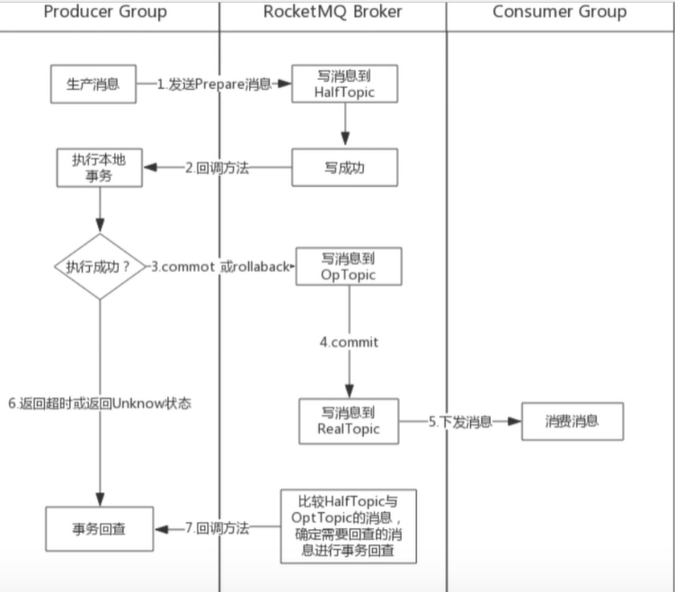
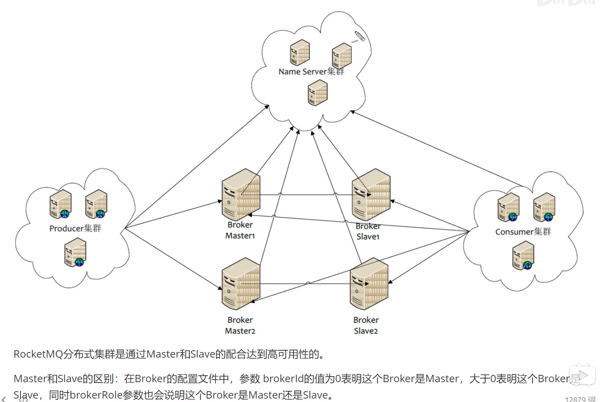
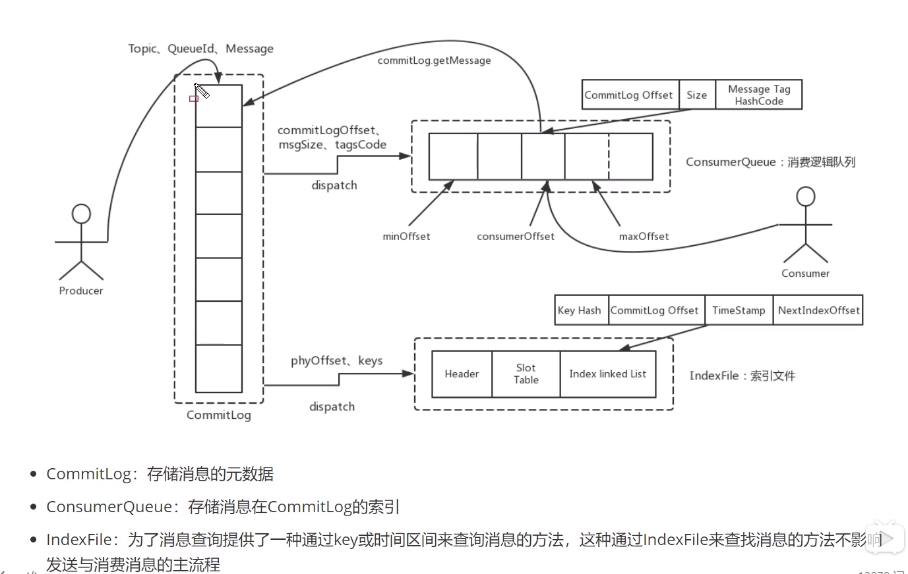

# rocketmq

## 教程

1.入门：

https://www.bilibili.com/video/BV1Qt411g76Z?from=search&seid=14846928329453188554

链接: https://pan.baidu.com/s/1IyXOl4l-5n_Q9y3fo0DTHw 提取码: 7ccd

2.深入详细：

https://www.bilibili.com/video/BV1L4411y7mn?from=search&seid=14846928329453188554

链接：https://pan.baidu.com/s/1Qc75ABjrNMqNqF4f92YZeQ  提取码：jfeq

##　一．安装

2m-2s-async:2主2从异步

2m-2s-sync:2主2从同步

2m-noslave:2主没有从

```
1.下载rocketmq-all-4.8.0-bin-release.zip并解压到/opt/
unzip rocketmq-all-4.8.0-bin-release.zip -d /opt/rocketmq

2.创建数据目录
mkdir /opt/rocketmq/data&&mkdir /opt/rocketmq/data/commitlog&&mkdir /opt/rocketmq/data/consumequeue&&mkdir /opt/rocketmq/data/index

3.进入conf/2m-2s-async目录配置broker-a.properties文件
```

broker-a.properties配置文件：

```
#所属集群名字
brokerClusterName=rocketmq-cluster
#broker名字，注意此处不同的配置文件填写的不一样
brokerName=broker-a
#0 表示 Master，>0 表示 Slave
brokerId=0
#nameServer地址，分号分割
namesrvAddr=test1:9876
#在发送消息时，自动创建服务器不存在的topic，默认创建的队列数
defaultTopicQueueNums=4
#是否允许 Broker 自动创建Topic，建议线下开启，线上关闭
autoCreateTopicEnable=true
#是否允许 Broker 自动创建订阅组，建议线下开启，线上关闭
autoCreateSubscriptionGroup=true
#Broker 对外服务的监听端口
listenPort=10911
#删除文件时间点，默认凌晨 4点
deleteWhen=04
#文件保留时间，默认 48 小时
fileReservedTime=120
#commitLog每个文件的大小默认1G
mapedFileSizeCommitLog=1073741824
#ConsumeQueue每个文件默认存30W条，根据业务情况调整
mapedFileSizeConsumeQueue=300000
#destroyMapedFileIntervalForcibly=120000
#redeleteHangedFileInterval=120000
#检测物理文件磁盘空间
diskMaxUsedSpaceRatio=88
#存储路径
storePathRootDir=/opt/rocketmq/data
#commitLog 存储路径
storePathCommitLog=/opt/rocketmq/data/commitlog
#消费队列存储路径存储路径
storePathConsumeQueue=/opt/rocketmq/data/consumequeue
#消息索引存储路径
storePathIndex=/opt/rocketmq/data/index
#checkpoint 文件存储路径
storeCheckpoint=/opt/rocketmq/data/checkpoint
#abort 文件存储路径
abortFile=/opt/rocketmq/data/abort
#限制的消息大小
maxMessageSize=65536
#flushCommitLogLeastPages=4
#flushConsumeQueueLeastPages=2
#flushCommitLogThoroughInterval=10000
#flushConsumeQueueThoroughInterval=60000
#Broker 的角色
#- ASYNC_MASTER 异步复制Master
#- SYNC_MASTER 同步双写Master
#- SLAVE
brokerRole=SYNC_MASTER
#刷盘方式
#- ASYNC_FLUSH 异步刷盘
#- SYNC_FLUSH 同步刷盘
flushDiskType=ASYNC_FLUSH
#checkTransactionMessageEnable=false
#发消息线程池数量
#sendMessageThreadPoolNums=128
#拉消息线程池数量
#pullMessageThreadPoolNums=128
```

下一步：

```
4.替换rocketmq/conf下面所有xml路径
sed -i 's#${user.home}#/opt/rocketmq#g' *.xml

5.根据实际内存，配置内存大小
vi /opt/rocketmq/bin/runbroker.sh
# 开发环境配置 JVM Configuration
JAVA_OPT="${JAVA_OPT} -server -Xms512m -Xmx512m -Xmn256m"

vi /opt/rocketmq/bin/runserver.sh
JAVA_OPT="${JAVA_OPT} -server -Xms512m -Xmx512m -Xmn256m -XX:MetaspaceSize=128m -XX:MaxMetaspaceSize=320m"

6.启动
启动nameserver:
nohup sh /opt/rocketmq/bin/mqnamesrv &

启动broker:
nohup sh /opt/rocketmq/bin/mqbroker -c /opt/rocketmq/conf/2m-2s-async/broker-a.properties &
或者
nohup sh /opt/rocketmq/bin/mqbroker -c /opt/rocketmq/conf/2m-2s-async/broker-a.properties > /dev/null 2>&1 &
```

管理控制台工具

```
项目
https://github.com/apache/rocketmq-externals.git
工程：
rocketmq-console

java -jar rocketmq-console-ng-2.0.0.jar --server.port=8081 --rocketmq.config.namesrvAddr=127.0.0.1:9876
```

`工作中常用集群模式：`

```
双主双从（同步双写,异步刷盘）
配置conf/2m-2s-sync里面的broker-a.properties文件：
```

配置如下：

四个重要参数：brokerName，brokerId，brokerRole，flushDiskType

```
////////////////////////////////////broker-a.properties
#所属集群名字
brokerClusterName=rocketmq-cluster
#broker名字，注意此处不同的配置文件填写的不一样
brokerName=broker-a
#0 表示 Master，>0 表示 Slave
brokerId=0
#nameServer地址，分号分割
namesrvAddr=test1:9876;test2:9876;test3:9876;test4:9876
#Broker 的角色(master同步复制)
#- ASYNC_MASTER 异步复制Master
#- SYNC_MASTER 同步双写Master
#- SLAVE
brokerRole=SYNC_MASTER
#刷盘方式（异步刷盘）
#- ASYNC_FLUSH 异步刷盘
#- SYNC_FLUSH 同步刷盘
flushDiskType=ASYNC_FLUSH
////////////////////////////////////broker-a-s.properties
#所属集群名字
brokerClusterName=rocketmq-cluster
#broker名字，注意此处不同的配置文件填写的不一样
brokerName=broker-a
#0 表示 Master，>0 表示 Slave
brokerId=1
#nameServer地址，分号分割
namesrvAddr=test1:9876;test2:9876;test3:9876;test4:9876
#Broker 的角色(master同步复制)
#- ASYNC_MASTER 异步复制Master
#- SYNC_MASTER 同步双写Master
#- SLAVE
brokerRole=SLAVE
#刷盘方式（异步刷盘）
#- ASYNC_FLUSH 异步刷盘
#- SYNC_FLUSH 同步刷盘
flushDiskType=ASYNC_FLUSH

////////////////////////////////////broker-b.properties
#所属集群名字
brokerClusterName=rocketmq-cluster
#broker名字，注意此处不同的配置文件填写的不一样
brokerName=broker-b
#0 表示 Master，>0 表示 Slave
brokerId=0
#nameServer地址，分号分割
namesrvAddr=test1:9876;test2:9876;test3:9876;test4:9876
#Broker 的角色(master同步复制)
#- ASYNC_MASTER 异步复制Master
#- SYNC_MASTER 同步双写Master
#- SLAVE
brokerRole=SYNC_MASTER
#刷盘方式（异步刷盘）
#- ASYNC_FLUSH 异步刷盘
#- SYNC_FLUSH 同步刷盘
flushDiskType=ASYNC_FLUSH
////////////////////////////////////broker-b-s.properties
#所属集群名字
brokerClusterName=rocketmq-cluster
#broker名字，注意此处不同的配置文件填写的不一样
brokerName=broker-b
#0 表示 Master，>0 表示 Slave
brokerId=1
#nameServer地址，分号分割
namesrvAddr=test1:9876;test2:9876;test3:9876;test4:9876
#Broker 的角色(master同步复制)
#- ASYNC_MASTER 异步复制Master
#- SYNC_MASTER 同步双写Master
#- SLAVE
brokerRole=SLAVE
#刷盘方式（异步刷盘）
#- ASYNC_FLUSH 异步刷盘
#- SYNC_FLUSH 同步刷盘
flushDiskType=ASYNC_FLUSH
```

操作步骤：

```
1.scp发送替换目录下conf/2m-2s-sync所有文件到从节点
2.首先每个节点启动nameserver
nohup sh /opt/rocketmq/bin/mqnamesrv &
3.启动每个节点broker
nohup sh /opt/rocketmq/bin/mqbroker -c /opt/rocketmq/conf/2m-2s-sync/broker-a.properties &
nohup sh /opt/rocketmq/bin/mqbroker -c /opt/rocketmq/conf/2m-2s-sync/broker-a-s.properties &
nohup sh /opt/rocketmq/bin/mqbroker -c /opt/rocketmq/conf/2m-2s-sync/broker-b.properties &
nohup sh /opt/rocketmq/bin/mqbroker -c /opt/rocketmq/conf/2m-2s-sync/broker-b-s.properties &
```


 ## 二．消息介绍

### 消息模式：

1.DefaultMQPushConsumer (push)Consumer与broker建立长连接，broker每隔5秒检查有没有推送的数据

2.DefaultMQPullConsumer (pull)为了减轻broker负担，Consumer端主动拉取

### 消息类型：

1.普通消息

2.顺序消息（实现有序消费）

3.事物消息



4.订阅消息(消费端)

### 刷盘机制

刷盘方式（这里指发送消息的方式，还有主从复制又分为同步与异步）：

​	异步：producer发送消息给broker,不管落盘返回结果给poducer（有数据丢失情况）

​	同步：producer发送消息给broker落盘后才返回给producer

## 三．架构



高效存储：使用顺序读写，系统内核零拷贝技术

nameServer	,	producer	,	consumer 是无状态的(可以动态添加)

​	master(可写，可读)，slaver（读取），

主从复制(分同步，异步)

​	异步：通常指master节点同步数据到slave节点的方式

​	同步：通常指master节点同步数据到slave节点的方式

​	当master挂掉后为了保证消费者完整消费slave数据，需要做同步主从复制

通常生产建议异步刷盘，同步复制

### 四.存储



通常有三个文件:

commitLog（默认1G）

consumerQueue（可以通过commitLog文件恢复）

indexFIle	


```
官网:http://rocketmq.apache.org/

安装实例
https://www.jianshu.com/p/4a275e779afa

配置环境变量
ROCKETMQ_HOME	D:\soft\rocketmq

启动NAMESERVER(进入bin目录)
start mqnamesrv.cmd

启动BROKER
start mqbroker.cmd -n 127.0.0.1:9876 autoCreateTopicEnable=true
注意：
打开runbroker.cmd，然后将‘%CLASSPATH%’加上英文双引号。
set "JAVA_OPT=%JAVA_OPT% -cp %CLASSPATH%"//这一行技术
保存并重新执行start语句


插件部署
https://github.com/apache/rocketmq-externals.git
下载完后rocketmq-externals\rocketmq-console\src\main\resources\application.properties
修改两项:
c	//插件工程端口
rocketmq.config.namesrvAddr=127.0.0.1:9876		//此处mq地址

编译
进入‘\rocketmq-externals\rocketmq-console’文件夹，执行‘mvn clean package -Dmaven.test.skip=true’，编译生成

启动
java -jar rocketmq-console-ng-1.0.0.jar

浏览器访问
http://127.0.0.1:8081
```
