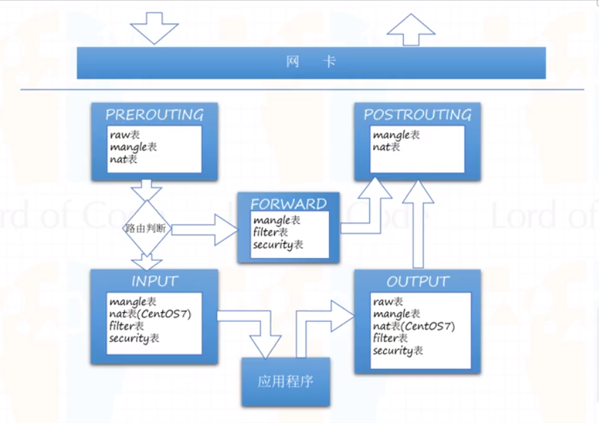

# iptables(防火墙)

## 一．概要

```
视频教程
http://video.tudou.com/v/XMjc2ODI5NTY2OA==.html?f=49837998
https://v.youku.com/v_show/id_XMjc2ODI4NjQ2MA==.html?spm=a2hzp.8244740.0.0&f=49837998

防火墙iptables
https://blog.csdn.net/fuzhongfaya/article/details/82022181
https://www.cnblogs.com/frankb/p/7427944.html

netfilter属于linux内核一个模块
iptables与ubuntu的ufw都属于应用层操作内核配置的程序

五表
	filter		对数据包过滤
	nat			修改数据包的Ip地址,端口号等信息
	mangle		修改数据包头部信息,如TOS,TTL,MARK标记
	raw			决定数据包是否被状态跟踪机制处理(1.2.9+)
	security	强制网络访问的网络,如selinux
	
	表的处理优先级：raw>mangle>nat>filter

五链
	input		接受到防火墙本机地址的数据包(入站)时
	output		防火墙本机向外发送数据包(出站)时
	forward		接收到需要通过防火墙发送给其他地址的数据包(转发)
	prerouting	对数据包作路由选择之前
	postrouting	对数据包作路由选择之后
```



**所有数据都有三种路径:**
```
往本地系统传入数据：[网卡]入站 -> PREROUTING -> INPUT-> [应用程序] 
到另一台主机的数据：[网卡]入站 -> PREROUTING -> FORWARD -> POSTROUTING -> [网卡]出站
本地生成的包数据： [应用程序] -> OUTPUT -> POSTROUTING -> [网卡]出站
```
## 二．常用命令及零基础搭建防火墙

**iptables	table	command	chain	parameter&Xmatch	target**

```
table:	filter,nat...
command:	-A,-D,-L,-F,-P,-I,-R,-n
chain:	INPUT,OUTPUT,FORWARD...
parameter:	-p tcp,-s,-d,--sport,--dport,--dports,-m tcp | state | multiport
target:	-j ACCEPT | DROP | REJECT | DNAT | SNAT
```

**查看iptables语法**
	man iptables

**查看网卡及ip**
	ip a
	ip addr

**查看到达目标ip的完整经过打节点ip**
	tracepath 192.168.5.12

**telnet端口验证**(可以没有80服务)
	telnet 192.168.5.12 80
   可以使用watch iptables -vnxL命令监控数据是否通过规则
   telnet: connet to address ip:Connetion refused 
   如果监控有数据到达表示防火墙没问题(上面问题是操作系统返回的)
	

```
新的firewalld
	systemctl status firewalld	查看防火墙状态
	systemctl start firewalld	开启防火墙
	systemctl stop firewalld	停止防火墙
	systemctl disable firewalld	禁止开机启动防火墙
	systemctl enable firewalld	开机自启动防火墙
老的iptables
	systemctl status iptables	查看防火墙状态
	systemctl start iptables	开启防火墙
	systemctl enable iptables	开机自启动防火墙
	...同上


1.清除所有规则:
iptables -F -t filter
iptables -X -t filter
iptables -Z -t filter
iptables -F -t raw
iptables -X -t raw
iptables -Z -t raw
iptables -F -t mangle
iptables -X -t mangle
iptables -Z -t mangle
iptables -F -t security
iptables -X -t security
iptables -Z -t security
iptables -F -t nat
iptables -X -t nat
iptables -Z -t nat


2.查看所有表配置(默认对filter表进行操作)
iptables -t filter -S
iptables -t raw -S
iptables -t mangle -S
iptables -t security -S
iptables -t nat -S

3.保存/恢复规则
https://www.iteye.com/blog/neo-it-2398275

3.1.自动方式
	centos 7 默认使用了firewalld ，iptables-service 没有安装所以，如果要用iptables，首先要禁用firewalld,同时安装iptables-service 。
	否则不会在开机时去读iptables设置的规则

	停用firewalld并安装iptables-services
	systemctl stop firewalld  		//停止firewalld
	systemctl disable firewalld  		//停止firewalld开机自启动
	yum install iptables-services -y  	//安装iptables-services
	systemctl enable iptables		//设置iptables开机自启动

	保存规则
	/usr/libexec/iptables/iptables.init save    
	##或者  
	iptables-save > /etc/sysconfig/iptables 

3.2.手动方式
	备份
	iptables-save > ipt.txt
	恢复
	iptables-restore < ipt.txt

4.从零自定义防火墙
规则是从上往下匹配的,要注意添加规则的顺序
iptables -I INPUT -m state --state ESTABLISHED -j ACCEPT	//添加在规则前面
iptables -A INPUT -m state --state ESTABLISHED -j ACCEPT	//追加在规则后面
iptables -D INPUT -m state --state ESTABLISHED -j ACCEPT	//删除规则

4.1.放行端口(注意,从零开始前首先放行必要的22端口)
iptables -A INPUT -p tcp --dport 80 -j ACCEPT		//放行80,
iptables -A INPUT -p tcp --dport 443 -j ACCEPT	//放行443
iptables -A INPUT -p tcp --dport 22 -j ACCEPT		//放行22
上面三条语句可以只用一句搞定
iptables -A INPUT -p multiport --dports 22,443,80 -j ACCEPT
-j  后面加动作： 
		（1）ACCEPT  允许包  
		（2）DROP 丢掉包 
		（3）REJECT 拒绝包
4.2.这样设置上面规则是不起效的,再对默认规则设置
	iptables -P INPUT DROP
4.3.现在上面是ping不通上面机器的问题(ping走的是icmp协议)
	iptables -A INPUT -p icmp -j ACCEPT
4.4.查看iptables规则使用情况
	watch iptables -vnxL
4.5.访问本机服务问题(本机telnet 127.0.0.1 22不能通过问题),默认都是针对ens33网卡,不针对回环地址lo,需要执行如下命令.
	watch iptables -vnxL		//查看规则匹配情况
	iptables -I INPUT -i lo -j ACCEPT // 大-I插入到规则最前面,-A是插到最后面,小-i指定网卡
4.6.本机不能上网问题(curl www.baidu.com)
	watch iptables -vnxL		//查看规则匹配情况
	iptables -A INPUT -m state --state ESTABLISHED -j ACCEPT	//要添加到规则最后

		NEW:该包想要开始一个新的连接(重新连接或连接重定向)
		RELATED:该包是属于某个已经建立的连接所建立的新连接,如FTP的数据传输连接和控制连接之间的是RELATED关系
		ESTABLISHED:该包属于某个已经建立的连接
		INVALID:该包不匹配于任何连接,通常这些包被DROP
```

ubuntu保存iptables

	iptables-save > /etc/iptables.rules	//保存
	vi /etc/network/interfaces
	pre-up iptables-restore < /etc/iptables.rules	//最后面添加这行
	这样重启后还会生效
	
	保存问题
	https://blog.csdn.net/sqzhao/article/details/10174955
	http://www.zhimengzhe.com/linux/281990.html


## 三．ftp主动模式和被动模式下iptables的配置(vsftp)

```
1.主动模式
	ftp客户端登录成功后,客户端会分配一个随机的接收数据端口
	pasv_enable=NO
	#pasv_min_port=24500
	#pasv_max_port=24600
	主动模式服务端只要开通21端口

2.被动模式
ftp客户端登录成功后,服务端会分配一个随机的发送数据端口
	pasv_enable=YES
	pasv_min_port=24500
	pasv_max_port=24600
	开放一段的端口
	iptables -A INPUT -p tcp --dport 24500:24600 -j ACCEPT

使用内核模块来限制(把上面的24500,24600去掉)
	lsmod | grep ftp	//查看ftp内核模块是否启动
	modprobe nf_conntrack_ftp	//启动内核ftp模块
	vi /etc/sysconfig/iptables-config
	IPTABLES_MODULES="nf_conntrack_ftp"//去掉注释
	IPTABLES_MODULES=""//默认是空注释掉
	systemctl restart iptables	//重启之前需要备份前面的iptables配置iptables-save > /etc/sysconfig/iptables

	最后重启
	systemctl restart vsftpd

	执行命令
	iptables -A INPUT -m state --state RELATED -j ACCEPT
```

## 四．iptables之SNAT和DNAT设置

```
SNAT:作为网关,使内网机器上网
	DNAT:进行端口映射
	
	把一台机器作为一个网关,让66网段能够访问55网段
	机器A					网关机器
	10.0.55.220/24			10.0.55.221/24
							10.0.66.221/24
							机器B
							10.0.66.222/24
							
	SNAT(机器B能访问机器A)
		(网关机器)
		iptables -t nat -A POSTROUTING -s 10.0.66.222(机器B) -j SNAT --to-source 10.0.55.221(网关55)
		sysctl -a | grep forward	//查看
		sysctl -w net.ipv4.conf.all.forwarding=1
		
		(机器B)
		ip r 	//查看路由
		修改默认路由规则
		ip route change default via 10.0.66.221 dev enp0s3(不同机器网卡名称会不同)
		ping 10.0.55.220	//可以ping通
		traceroute 10.0.55.220	//后面几跳过不去
		
		(机器A)traceroute不到
		iptables -A INPUT -m state --state NEW -j ACCEPT
		
	DNAT在上面基础上(A是访问不了B的)
		在A开通一个ssh端口访问B
		
		(网关机器)
		iptables -t nat -A PREROUTING -p tcp --dport 6222 -j DNAT --to 10.0.66.222:22
		
		登录测试
		ssh -p 6222 user@10.0.55.221
```

## 五．怎么利用iptables来禁止访问淘宝和QQ

？？？

## 六．iptables进行频率控制和并发控制

```
防止网络攻击,进行并发控制
	iptables -A INPUT -p icmp -m limit --limit 5/m --limit-burst 5 -j ACCEPT
	--limit 5/m 一分钟之内只运行走5次
	--limit-burst 5	//有五个的缓冲时间
	注意规则顺序
	
	测试验证
	ping ip 	//每分钟只能访问5次
	
	
	并发控制(并发量控制在100)
	iptables -I INPUT -p tcp --syn --dport 80 -m connlimit --connlimit-above 100 -j REJECT
	没有测试
```
