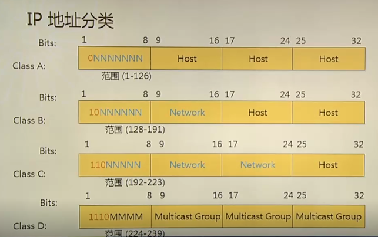
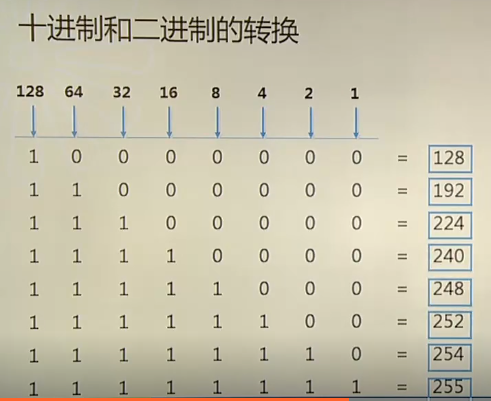
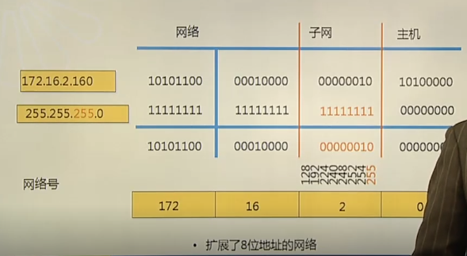
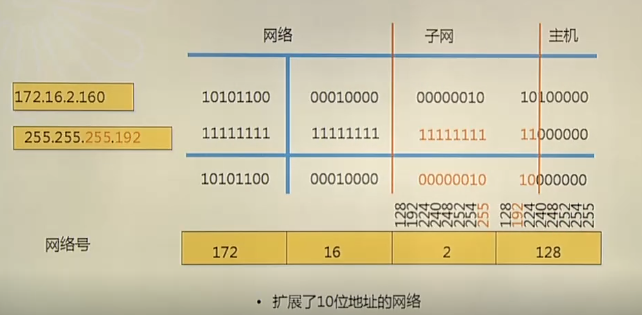
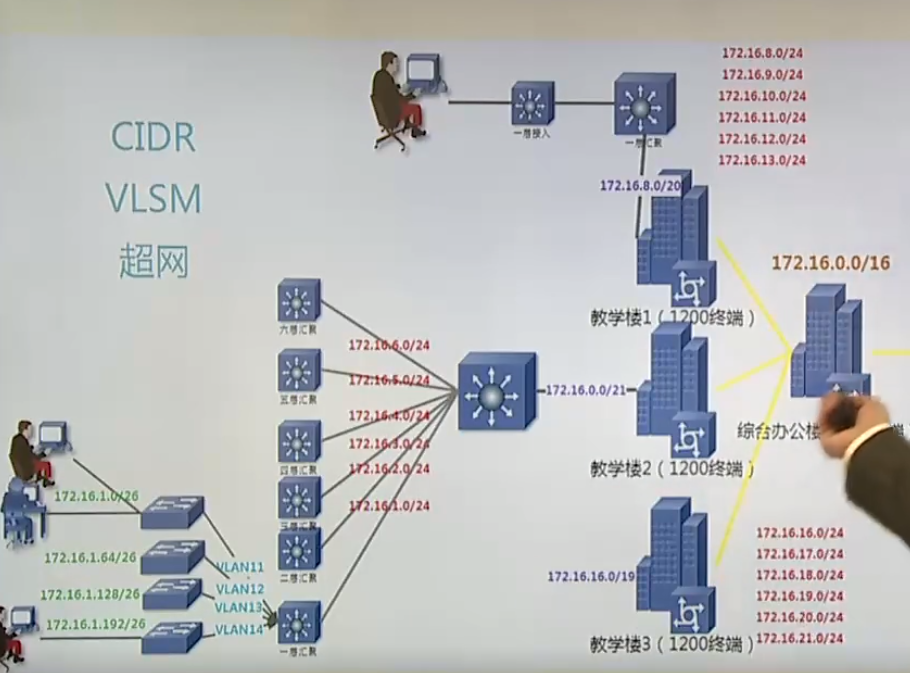

# 1.ipv4寻址与子网划分

见原理图

在线科学计算器:https://www.123cha.com/jsq/

子网号，网络号，广播地址，网络地址是什么:https://www.bilibili.com/video/BV1m5411x7VB

## 一．Ａ，Ｂ，Ｃ类	地址



1-126.x.y.z/8	255.0.0.0		//A类，前８位表示网络位	, 	后24位是主机位	,	能容纳16777214台 

128-191.x.y.z/16		255.255.0.0	//Ｂ类，前16位表示网络位	, 	后16位是主机位	,	能容纳65534台 

192-223.x.y.z/24		255.255.255.0　//C类，前24位表示网络位	, 	后8位是主机位	,	能容纳254台 

224-239.x.y.z	//D类地址,主播地址

### 特殊ip

ipv6中为０的部分可以简写即ping 127.1可以ping通

１．127.0.0.1：本地回环地址

２．255.255.255.255：广播地址

３．0.0.0.0：表示任何网络

4．**私有ip地址(只能在局域内存在的地址,不允许在公网存在的地址)，后面子网划分参照这个来做**：

​		.A类地址中的：10.0.0.0　到　10.255.255.255.255	(局域网10开头的网络位)

​		.Ｂ类地址中的：172.16.0.0　到　172.31.255.255	(172.16到172.31的网络位)

​		.Ｃ类地址中的：192.168.0.0　到　192.168.255.255	(192.168.0到192.168.255的网络位)	

​		企业内部也可以使用非私有地址，内部的地址不会和外部冲突。比如使用了NAT，企业内部地址和外部地址是不影响的，因为企业内部上网出口地址都是一个，这个出口地址才是外部地址，唯一的非私有地址。

```
比如企业内部，经常会出现122.x.x.x或86.x.x.x等等。。。
```
如果是局域网ip,就要按照上面划分的私有IP段规范来(因为凡是Internet上的网络设备均不会接收私有ip网络段)

```
公共IP地址和私有IP地址的划分
https://www.douban.com/note/493151737/
在局域网中的私有IP地址怎么获得
https://www.zhihu.com/question/310458149
为什么构建局域网时私有地址最好是这三类呢？
https://www.pianshen.com/article/6578880348/
```

## 二.子网划分（无类网络）

​		按照上面常规划分，会存在一些问题，广播风暴，为了解决这个问题就需要进行子网划分．

​		**划分方法：借用主机位，制造新的网络**

### 划分子网方法:

**主机位全为0:表示网络号** 

**主机位全为1:表示广播号码**



### **1.B类网络子网划分,借8位主机号**



主机　		172.16.2.160

子网掩码　255.255.**255**.0

网络号		172.16.2.0

在Ｂ类网基础借位主机位８位,可划分254个子网，每个子网254主机

### **2.B类网络子网划分,借10位主机号**



主机　		172.16.2.160

子网掩码　255.255.**255.192**

网络号		172.16.2.128

在Ｂ类网基础借位,可划分1023个子网，每个子网63主机

#### 1)手动推算１(向主机借2位)

172.16.2.x

00 000000		//子网0

01 000000		//子网64

10 000000		//子网128

11 000000		//子网192

##### 得出(1024ip子网)

172.16.**0**.0	/	255.255.255.192	/	172.16.0.63**(广播号)**						**#可用主机号172.16.0.0至172.16.0.62**

172.16.**0**.64	/	255.255.255.192	/	172.16.0.127**(广播号)**					**#可用主机号172.16.0.64至172.16.0.126**

172.16.**0**.128	/	255.255.255.192	/	172.16.0.191**(广播号)**				  **#可用主机号172.16.0.128至172.16.0.192**

172.16.**0**.192	/	255.255.255.192	/	172.16.0.255**(广播号)**					**#可用主机号172.16.0.192至172.16.0.254**


172.16.**1**.0	/	255.255.255.192

172.16.**1**.64	/	255.255.255.192

172.16.**1**.128	/	255.255.255.192

172.16.**1**.192	/	255.255.255.192


172.16.**2**.0	/	255.255.255.192

172.16.**2**.64	/	255.255.255.192

172.16.**2**.128	/	255.255.255.192

172.16.**2**.192	/	255.255.255.192

一只到255.......

#### 2)手动推算２(向主机借3位)

111　00000　255.255.255.224	256 - 224　= 32

172.16.0.0	/	255.255.255.224	/	172.16.0.31(广播号)						**#可用主机号172.16.0.0至172.16.0.30**

172.16.0.32	/	255.255.255.224	/	172.16.0.63(广播号)						**#可用主机号172.16.0.32至172.16.0.62**

172.16.0.64	/	255.255.255.224	/	172.16.0.95(广播号)						**#可用主机号172.16.0.64至172.16.0.94**

172.16.0.96	/	255.255.255.224	/	172.16.0.127(广播号)					  **#可用主机号172.16.0.96至172.16.0.126**

172.16.0.128	/	255.255.255.224	/	172.16.0.159(广播号)

172.16.0.160	/	255.255.255.224	/	172.16.0.191(广播号)

172.16.0.192	/	255.255.255.224	/	172.16.0.223(广播号)

172.16.0.224	/	255.255.255.224	/	172.16.0.255(广播号)

#### 如何确定超网？

将子网列出来，找到相同的部分．

**子网划分(网络位向主机位借位)**

**超网划分(主机位向网络位借位)**，以网络为单位做访问控制列表，方便控制管理访问列表

```
1.你所选择的子网掩码将会产生多少个子网？
	２的x次方（x代表子网掩码位数）

2．每个子网能有多少主机？
	2的y次方-2（y代表主机位数）

3.有效子网是(子网计算方法)
	有效子网号＝256 - 10进制的子网掩码（结果叫做block size 或　base number）
	有效子网号=256 - 192   //以255.255.255.192这个子网掩码来算

4.广播号码
	广播号码　＝　下一个子网号 - 1
```

### 子网划分综合应用



注意：
上面教学楼1，教学楼2，图画错了，应该是：
```
教学楼1（172.16.8.0/21），教学楼2（172.16.16.0/21）
```

## 三.CIDR（无类别遇见路由）与VLSM（可变长子网掩码）

CIDR:支持无类别路由协议（有类指标准的a,b,c类。借用主机位产生的网络，称为无类别网络，由此产生了CIDR协议）

VLSM:　可变长子网掩码

## 四．网络配置

ip地址（必须）192.168.0.25			//网络号192.168.0.0

子网掩码（必须）255.255.255.0

**默认网关 (非必填) 当要连接非我所在网段跨网络时才要填　192.168.0.1** ,(一般指路由，防火墙，网关设备)

```
默认网关是光猫或路由器的地址，一般用192.168.1.1。
```

DNS服务器

### 网络测试工具

​	ping -t www.baidu.com	//不间断发送

​	ping -l 65500 www.baidu.coom  //指定发送数据包大小

### 网络测试工具２

​	　ipconfig