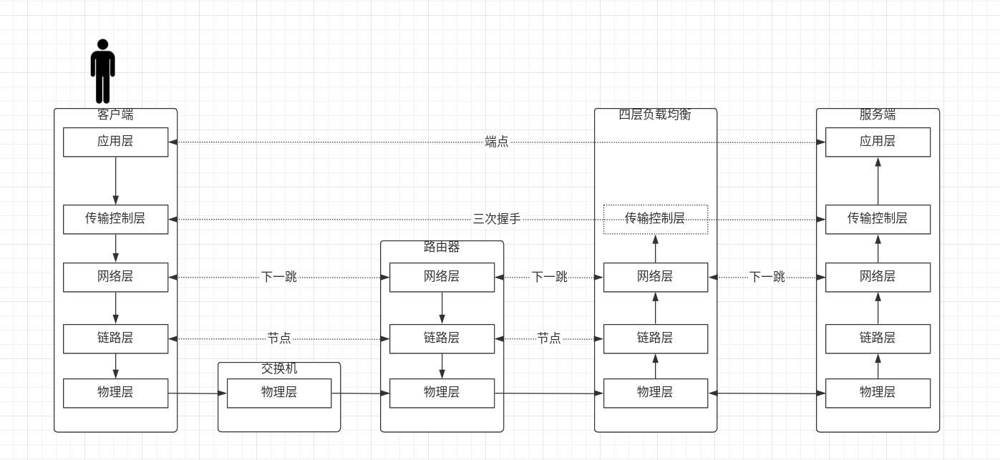
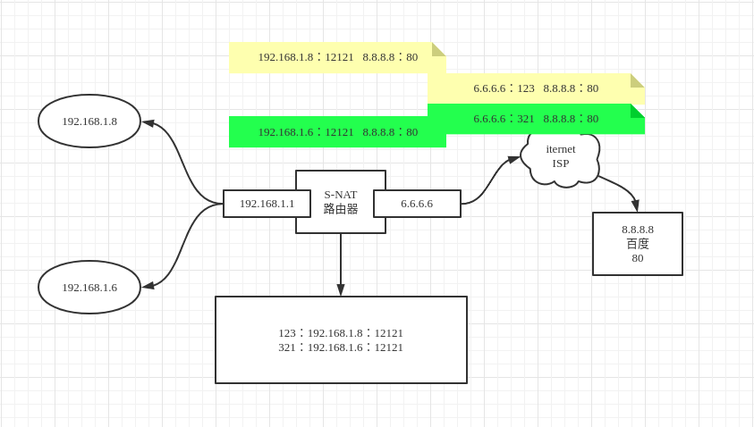
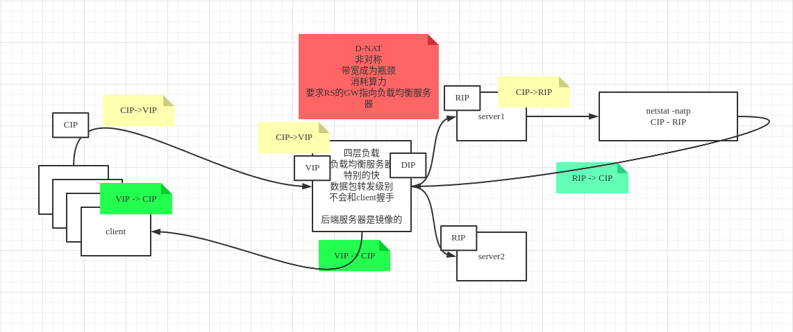
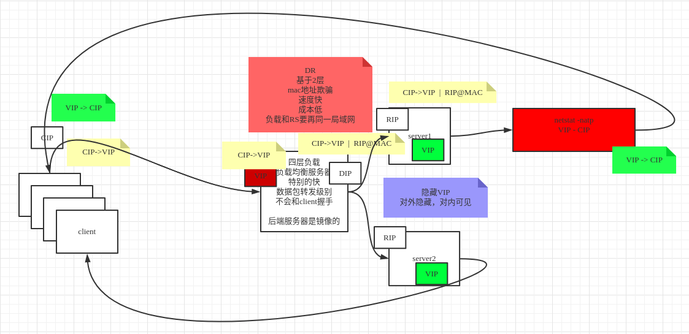

# 4.LVS的DR,TUN,NAT模型推导

## 一．模型流程

### 1.lvs在osi模型层

tomcat,nginx（并发两是5w）是应用层,在通信角度讲效率是比较低的．

lvs模型是在网络中的四层，效率比较高，只要服务器计算能力强，都可以抗住

### 2.S-NAT(共用上网模型)

　　　公网ip是有限的，但是为了解决同一个局域网内多台机器共用一个公网ip上网，在路由器做的一个nat地址转换技术．nat映射信息保持在路由器.

例如

路由器：6.6.6.6	百度：8.8.8.8:80

Ａ源地址6.6.6.6:**123**			目标地址8.8.8.8:80

Ｂ源地址6.6.6.6:**321**			目标地址8.8.8.8:80

上图表示的是s-nat，修改**源地址**信息，也就说还有其他模型nat

## 3.D-NAT(负载模型)

上图表示的是d-nat，修改**目标址**信息，实现负载．

缺点存在非对称问题，带宽存在瓶颈．

因为客户端发送进来数据都是及其小的，但是返回的数据相对会很大．

## 4.LVS-DR模型

基于二层网络，nat基于三层．

修改mac地址(mac地址欺骗),内网机器创建一个虚拟ip(对本机可见，对外隐藏)

上图属于直接路由模型，只能基于本地局域网的分发，不能跨网络

数据中心都是基于此模型

## 5.TUN隧道模型

可以跨网络访问，其实就是vpn协议．

其实就是在目标共有ip上面包了一层真实ip．到达公有主机后进行拆包访问真实的目标地址